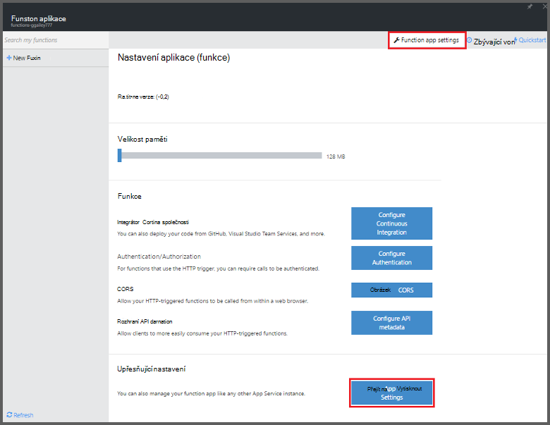
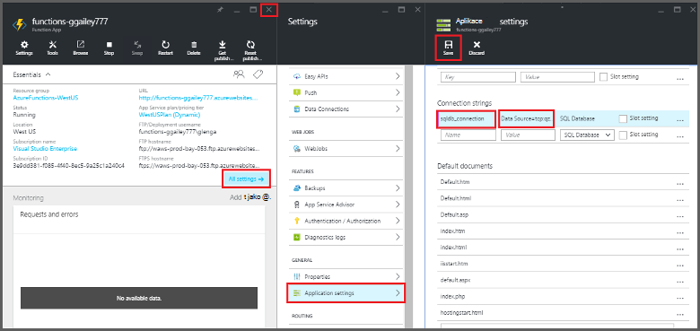
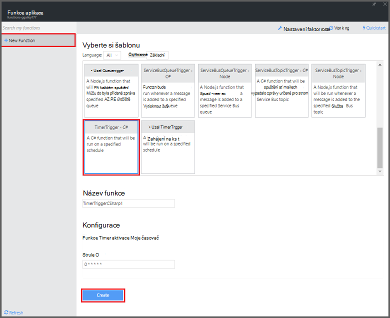

<properties
   pageTitle="Pomocí funkcí Azure provádět naplánovaný úkol čištění | Microsoft Azure"
   description="Použití funkcí pro Azure vytvořte funkci C#, která poběží na základě spínání události."
   services="functions"
   documentationCenter="na"
   authors="ggailey777"
   manager="erikre"
   editor=""
   tags=""
   />

<tags
   ms.service="functions"
   ms.devlang="multiple"
   ms.topic="article"
   ms.tgt_pltfrm="multiple"
   ms.workload="na"
   ms.date="09/26/2016"
   ms.author="glenga"/>
   
# Pomocí funkcí Azure provádět naplánovaný úkol čištění

Toto téma popisuje funkce Azure slouží k vytváření nové funkce v jazyce C#, která poběží na základě spínání události vyčistí řádků v tabulce databáze. Nová funkce je založeno na předdefinované šablony v portálu Azure funkcí. Podporuje tento scénář, musí taky nastavit připojovací řetězec databáze jako aplikaci služby nastavení v aplikaci (funkce). 

## Zjistit předpoklady pro 

Než budete moct vytvářet funkci, musíte mít účet Azure active. Pokud ještě nemáte účet Azure, [bezplatné účty jsou k dispozici](https://azure.microsoft.com/free/).

Toto téma ukazuje příkazu Transact-SQL, který provádí operace čištění hromadné v tabulce s názvem *TodoItems* v databázi SQL. Po dokončení [kurz aplikace Mobile aplikace služby Azure rychlý úvod](../app-service-mobile/app-service-mobile-ios-get-started.md)k vytvoření tento stejné tabulky TodoItems. Můžete také ukázkové databázi pokud se rozhodnete sdělit nám jinou tabulku, budete muset upravit požadovaný příkaz.

Získání připojovacího řetězce používané back-end mobilní aplikace na portálu pro **všechny možnosti nastavení** > **Nastavení aplikace** > **připojovací řetězec** > **Zobrazit hodnoty připojovacího řetězce** > **MS_TableConnectionString**. Můžete taky získat připojovací řetězec přímo z databáze SQL na portálu pro **všechny možnosti nastavení** > **Vlastnosti** > **Zobrazit řetězců připojení k databázi** > **ADO.NET (ověřování serveru SQL)**.

Tento scénář používá hromadné operace v databázi. Pokud chcete, aby vaše funkce proces jednotlivé operace CRUD v tabulce aplikace Mobile, použijete místo toho vazba Mobile tabulky.

## Nastavení připojovací řetězec SQL databáze v aplikaci (funkce)

Funkce aplikace hostuje provádění funkce v Azure. Je nejvhodnější pro ukládání připojovací řetězec a jiných tajemství v nastavení aplikace (funkce). Když funkce kód nakreslenými končí v repo jinam, postupujte nebude náhodné zpřístupnění. 

1. Přejděte na [portál Azure funkcí](https://functions.azure.com/signin) a přihlaste se pomocí účtu Azure.

2. Pokud máte existující funkce aplikace použít, vyberte ji ze **funkce aplikace** klepněte na tlačítko **Otevřít**. Vytvoření nové funkce aplikace, zadejte jedinečný **název** pro novou aplikaci funkce nebo přijmout vygenerovaných tu, vyberte upřednostňovaný **oblasti**a potom klikněte na **vytvořit + Začínáme**. 

3. V aplikaci funkce klikněte na **Nastavení aplikace funkce** > **přejděte na nastavení aplikace služeb**. 

    

4. V aplikaci funkce klikněte na **všechna nastavení**, posuňte se dolů k **Nastavení aplikace**a pak ve skupinovém rámečku Typ **připojovací řetězec** `sqldb_connection` **název**, vložte připojovací řetězec na **hodnotu**, klikněte na tlačítko **Uložit**a potom zavřete zásuvné funkce aplikace se vraťte do portálu funkcí.

    

Teď můžete přidat C# funkce kód, ke kterému je připojen k SQL databázi.

## Vytvoření funkci spouštěný časovače ze šablony

1. V aplikaci funkce klikněte na **+ Nový funkce** > **TimerTrigger - C#** > **vytvořit**. Tím vytvoříte funkci s výchozím názvem, který se spustí u výchozího plánu každou minutu. 

    

2. V podokně **kód** na kartě **vývoje** přidejte následující sestavení odkazy v horní části existující funkce kód:

        #r "System.Configuration"
        #r "System.Data"

3. Přidejte následující `using` příkazy funkce:

        using System.Configuration;
        using System.Data.SqlClient;
        using System.Threading.Tasks; 

4. Nahraďte stávající **Spustit** funkci následující kód:

        public static async Task Run(TimerInfo myTimer, TraceWriter log)
        {
            var str = ConfigurationManager.ConnectionStrings["sqldb_connection"].ConnectionString;
            using (SqlConnection conn = new SqlConnection(str))
            {
                conn.Open();
                var text = "DELETE from dbo.TodoItems WHERE Complete='True'";
                using (SqlCommand cmd = new SqlCommand(text, conn))
                {
                    // Execute the command and log the # rows deleted.
                    var rows = await cmd.ExecuteNonQueryAsync();
                    log.Info($"{rows} rows were deleted");
                }
            }
        }

5. Klikněte na **Uložit**, podívejte se na **protokoly** systému windows pro další zpracování (funkce) a pak si všimněte čísla řádků z tabulky TodoItems odstraněny.

6. (Volitelné) Pomocí [mobilní aplikace rychlý úvod aplikace](../app-service-mobile/app-service-mobile-ios-get-started.md), označí další položky "Dokončit" vraťte se do okna **protokoly** a odstranění kukátko stejný počet řádků pomocí funkce během další zpracování. 

##Další kroky

Další informace o funkcích Azure v těchto tématech.

+ [Referenční informace pro vývojáře Azure funkcí](functions-reference.md)  
Programmer odkaz pro definování aktivačními událostmi a vazby a kódování funkcí.
+ [Testování funkcí Azure](functions-test-a-function.md)  
Popisuje různé nástroje a postupy pro účely testování funkce.
+ [Jak zobrazit Azure funkcí](functions-scale.md)  
Tento článek popisuje služby plány dostupných funkcí Azure včetně plán dynamické služeb a výběr správné plán.  

[AZURE.INCLUDE [Getting Started Note](../../includes/functions-get-help.md)]