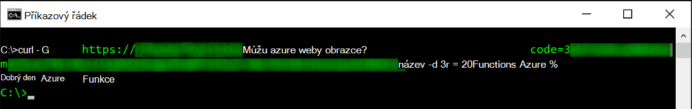
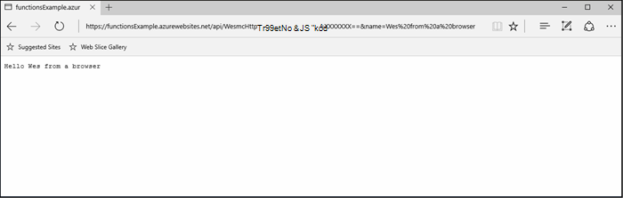
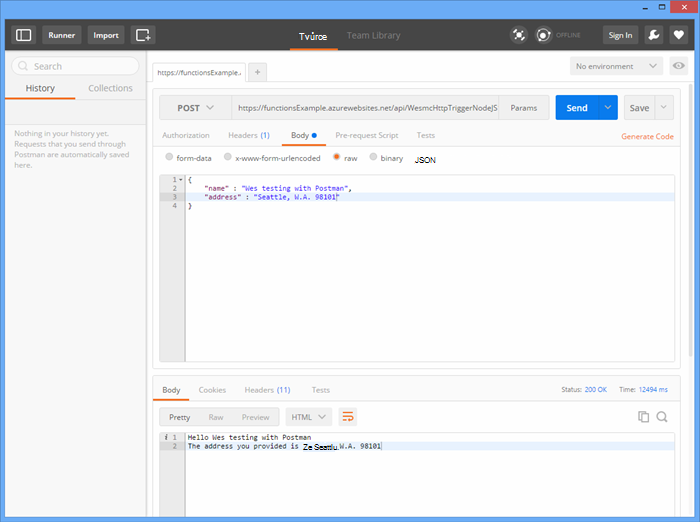
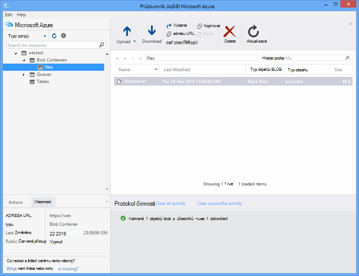

<properties
   pageTitle="Testování funkcí Azure | Microsoft Azure"
   description="Otestujte funkce Azure pomocí pošťák, otočení a Node.js."
   services="functions"
   documentationCenter="na"
   authors="wesmc7777"
   manager="erikre"
   editor=""
   tags=""
   keywords="Azure funkcí, funkce, zpracování události, webhooks, dynamické výpočetním, bez serveru architektura testování"/>

<tags
   ms.service="functions"
   ms.devlang="multiple"
   ms.topic="article"
   ms.tgt_pltfrm="multiple"
   ms.workload="na"
   ms.date="08/19/2016"
   ms.author="wesmc"/>

# Testování funkcí Azure

## Základní informace

V tomto kurzu se projdeme jiné přístupy k testování funkcí. Jsme definuje funkce http aktivační události, která zadávaná prostřednictvím parametru řetězce dotazu nebo požadavku. Podporuje kód výchozí **HttpTrigger Node.js funkce** šablony `name` parametru řetězce dotazu. Také přidáme kód pro podporu tento parametr spolu s `address` informace pro uživatele v hlavním textu žádosti o.

## Vytvoření funkce pro účely testování

Pro většinu tohoto kurzu použijeme mírně změnila verzi šablony **HttpTrigger Nodejs funkci** , která je dostupná při vytváření nové funkce.  Pokud potřebujete pomoc s vytvořením nového funkce můžete zkontrolovat [vytvořit svůj první kurz Azure (funkce)](functions-create-first-azure-function.md) .  Jenom šablonu vyberte v **HttpTrigger Nodejs funkce** při vytváření funkci test na [Portál Azure].

Výchozí šablona funkce je v podstatě funkce světě Ahoj, která se vrátí zpět název z žádost o textu nebo dotazu parametr řetězec, `name=<your name>`.  Budeme aktualizovat kód, který lze také zadat název a jako JSON obsah v hlavním textu žádosti o. Funkce pak bude vypsat tyto zpět k desktopovému klientovi, pokud jsou dostupné.   

Následující kód, který používáme k testování aktualizujte funkci:

    module.exports = function(context, req) {
        context.log("Node.js HTTP trigger function processed a request. RequestUri=%s", req.originalUrl);
        context.log("Request Headers = " + JSON.stringify(req.headers));    
    
        if (req.query.name || (req.body && req.body.name)) {
            if (typeof req.query.name != "undefined") {
                context.log("Name was provided as a query string param..."); 
                ProcessNewUserInformation(context, req.query.name);
            }
            else {
                context.log("Processing user info from request body..."); 
                ProcessNewUserInformation(context, req.body.name, req.body.address);
            }
        }
        else {
            context.res = {
                status: 400,
                body: "Please pass a name on the query string or in the request body"
            };
        }
        context.done();
    };
    
    function ProcessNewUserInformation(context, name, address)
    {    
        context.log("Processing User Information...");            
        context.log("name = " + name);            
        echoString = "Hello " + name;
        
        if (typeof address != "undefined")
        {
            echoString += "\n" + "The address you provided is " + address;
            context.log("address = " + address);            
        }
        
        context.res = {
                // status: 200, /* Defaults to 200 */
                body: echoString
            };
    }

## Otestovat funkce pomocí nástrojů

### Otestujte pomocí otočení

Často při testování software, není nutné zadávat zjistěte některé další než příkazového řádku pomoci při ladění aplikace, to neliší s funkcemi.

Otestovat funkce výše uvedené, zkopírujte adresu **Url (funkce)** z portálu. Bude mít takto: 

    https://<Your Function App>.azurewebsites.net/api/<Your Function Name>?code=<your access code>
    
Toto je adresa Url pro aktivaci funkce, jsme to vyzkoušet pomocí příkazu otočení v příkazového řádku pro změnu získáte (`-G` nebo `--get`) žádost proti naše funkce:

    curl -G https://<Your Function App>.azurewebsites.net/api/<Your Function Name>?code=<your access code>
    
Tento konkrétní příklad nahoře vyžaduje parametr řetězce dotazu, který lze předat jako Data (`-d`) na příkaz otočení:

    curl -G https://<Your Function App>.azurewebsites.net/api/<Your Function Name>?code=<your access code> -d name=<Enter a name here>
    
Stisknutí klávesy enter a zobrazí se výstup funkce na příkazovém řádku.

V okně portálu **protokoly** výstup podobně jako tento zaznamenané při provádění funkce:

    2016-04-05T21:55:09  Welcome, you are now connected to log-streaming service.
    2016-04-05T21:55:30.738 Function started (Id=ae6955da-29db-401a-b706-482fcd1b8f7a)
    2016-04-05T21:55:30.738 Node.js HTTP trigger function processed a request. RequestUri=https://functionsExample.azurewebsites.net/api/HttpTriggerNodeJS1?code=XXXXXXX&name=Azure Functions
    2016-04-05T21:55:30.738 Function completed (Success, Id=ae6955da-29db-401a-b706-482fcd1b8f7a)

### Testovat s prohlížečem

Funkce, které vyžadují parametry, ani stačí parametry řetězce dotazu lze testovat v prohlížeči.

Funkci, která byla definována nad otestovat, zkopírujte adresu **Url funkce** z portálu. Bude mít takto:

    https://<Your Function App>.azurewebsites.net/api/<Your Function Name>?code=<your access code>

Připojit `name` dotazu parametr řetězce následujícím způsobem pomocí skutečný název pro `<Enter a name here>` zástupný symbol.

    https://<Your Function App>.azurewebsites.net/api/<Your Function Name>?code=<your access code>&name=<Enter a name here>

Vložte adresu URL do prohlížeče a odpověď by měla získat podobně jako tento.

V okně portálu **protokoly** výstup podobně jako tento zaznamenané při provádění funkce:

    2016-03-23T07:34:59  Welcome, you are now connected to log-streaming service.
    2016-03-23T07:35:09.195 Function started (Id=61a8c5a9-5e44-4da0-909d-91d293f20445)
    2016-03-23T07:35:10.338 Node.js HTTP trigger function processed a request. RequestUri=https://functionsExample.azurewebsites.net/api/WesmcHttpTriggerNodeJS1?code=XXXXXXXXXX==&name=Wes from a browser
    2016-03-23T07:35:10.338 Request Headers = {"cache-control":"max-age=0","connection":"Keep-Alive","accept":"text/html","accept-encoding":"gzip","accept-language":"en-US"}
    2016-03-23T07:35:10.338 Name was provided as a query string param.
    2016-03-23T07:35:10.338 Processing User Information...
    2016-03-23T07:35:10.369 Function completed (Success, Id=61a8c5a9-5e44-4da0-909d-91d293f20445)

### Otestujte pomocí pošťák

Nástroj doporučené otestovat většinu vašich funkcí je pošťák. Pokud chcete nainstalovat pošťák, najdete v článku [Získat pošťák](https://www.getpostman.com/). Pošťák obsahuje mnoho další atributy žádost HTTP publikum nemůže ovládat.

> [AZURE.TIP] Použití ZBÝVAJÍCÍ klienta, ve které se vám. Tady je pár alternativ k pošťák:  
> 
> * [Fiddler](http://www.telerik.com/fiddler)  
> * [Tlapa](https://luckymarmot.com/paw)  

Chcete-li otestovat funkce textu žádosti o v pošťák: 

1. Spusťte pošťák pod tlačítkem **aplikace** v levém horním rohu okna prohlížeče Chrome.
2. Zkopírujte **Adresu Url (funkce)** a vložte ho do pošťák. Zahrnuje parametru řetězce dotazu přístupový kód.
3. Změňte způsob HTTP na **příspěvek**.
4. Klikněte na **text** > **nezpracovanými** a přidání textu žádosti o JSON podobná této:

        {
            "name" : "Wes testing with Postman",
            "address" : "Seattle, W.A. 98101"
        }

5. Klikněte na **Odeslat**.

Následující obrázek znázorňuje testování funkce příklad jednoduchého ozvěnu v tomto kurzu. 

V okně portálu **protokoly** výstup podobně jako tento zaznamenané při provádění funkce:

    2016-03-23T08:04:51  Welcome, you are now connected to log-streaming service.
    2016-03-23T08:04:57.107 Function started (Id=dc5db8b1-6f1c-4117-b5c4-f6b602d538f7)
    2016-03-23T08:04:57.763 Node.js HTTP trigger function processed a request. RequestUri=https://functions841def78.azurewebsites.net/api/WesmcHttpTriggerNodeJS1?code=XXXXXXXXXX==
    2016-03-23T08:04:57.763 Request Headers = {"cache-control":"no-cache","connection":"Keep-Alive","accept":"*/*","accept-encoding":"gzip","accept-language":"en-US"}
    2016-03-23T08:04:57.763 Processing user info from request body...
    2016-03-23T08:04:57.763 Processing User Information...
    2016-03-23T08:04:57.763 name = Wes testing with Postman
    2016-03-23T08:04:57.763 address = Seattle, W.A. 98101
    2016-03-23T08:04:57.795 Function completed (Success, Id=dc5db8b1-6f1c-4117-b5c4-f6b602d538f7)
    
### Otestujte pomocí Průzkumníka úložiště objektů blob aktivační událost

Můžete otestovat funkce aktivační událost blob pomocí [Průzkumníka úložišť Microsoft Azure](http://storageexplorer.com/).

1. Na [Portálu Azure] funkcí aplikace vytvořte nový C#, F # nebo uzel objektů blob aktivační událost funkci. Nastavte cestu ke sledování na jméno container objektů blob. Příklad:

        files

2. Klikněte **+** s cílem vyberte nebo vytvořte úložiště účtu, který chcete použít. Klikněte na **vytvořit**.

3. Vytvoření textového souboru s tímto a uložit ho:

        A text file for blob trigger function testing.

4. Spusťte [Průzkumníka úložišť Microsoft Azure](http://storageexplorer.com/) a připojte k kontejneru objektů blob účtu úložiště sledován.

5. Klikněte na tlačítko **Nahrát** a nahrajte textový soubor.

    

    Výchozí objektů blob aktivační událost funkce kód ohlásí zpracování objektů blob v protokolech:

        2016-03-24T11:30:10  Welcome, you are now connected to log-streaming service.
        2016-03-24T11:30:34.472 Function started (Id=739ebc07-ff9e-4ec4-a444-e479cec2e460)
        2016-03-24T11:30:34.472 C# Blob trigger function processed: A text file for blob trigger function testing.
        2016-03-24T11:30:34.472 Function completed (Success, Id=739ebc07-ff9e-4ec4-a444-e479cec2e460)

## Otestovat funkce ve funkcích

### Otestujte pomocí portálu funkce tlačítko Spustit

Na portálu obsahuje tlačítko **Spustit** , které vám umožní omezené testování. Můžete zadat požadavek textu pomocí tlačítka Spustit, ale nemůžete zadejte parametry řetězce dotazu nebo aktualizace žádost o záhlaví.

Otestovat funkce HTTP aktivační událost, kterou jsme vytvořili dříve přidáním řetězce JSON podobná v poli **požádat o textu** a pak klikněte na tlačítko **Spustit** .

    {
        "name" : "Wes testing Run button",
        "address" : "USA"
    } 

V okně portálu **protokoly** výstup podobně jako tento zaznamenané při provádění funkce:

    2016-03-23T08:03:12  Welcome, you are now connected to log-streaming service.
    2016-03-23T08:03:17.357 Function started (Id=753a01b0-45a8-4125-a030-3ad543a89409)
    2016-03-23T08:03:18.697 Node.js HTTP trigger function processed a request. RequestUri=https://functions841def78.azurewebsites.net/api/wesmchttptriggernodejs1
    2016-03-23T08:03:18.697 Request Headers = {"connection":"Keep-Alive","accept":"*/*","accept-encoding":"gzip","accept-language":"en-US"}
    2016-03-23T08:03:18.697 Processing user info from request body...
    2016-03-23T08:03:18.697 Processing User Information...
    2016-03-23T08:03:18.697 name = Wes testing Run button
    2016-03-23T08:03:18.697 address = USA
    2016-03-23T08:03:18.744 Function completed (Success, Id=753a01b0-45a8-4125-a030-3ad543a89409)

### Otestujte pomocí aktivační události časovač

Některé funkce, nelze opravdu testovat s nástroji pro jsme zmínili dříve. Například fronty aktivační událost funkci se spustí při přetažení zprávu do [Úložiště fronty Azure](../storage/storage-dotnet-how-to-use-queues.md). Můžete vždy napsat kód přetáhnout zprávu do fronty a pod není uvedený příklad v konzole projektu. Je ale další možností, které můžete použít k testování s funkcemi, které přímo.  

Můžete použít aktivační časovače nakonfigurována fronty Výstupní vazba. Aby časovače aktivační kód pak napsat zkušební zprávy do fronty. V této části provede jednotlivými v příkladu. 

Podrobnější informace o používání vazby s funkcemi Azure najdete v článku [funkce Azure referenční informace pro vývojáře](functions-reference.md). 

#### Vytvoření fronty aktivační události pro účely testování

Abychom si tento přístup, nejdřív vytvoříme funkci fronty aktivační události, která chcete testovat fronty s názvem `queue-newusers`. Tato funkce zpracuje jména a adresy informace pro nové uživatele do úložiště Azure fronty nezobrazí. 

> [AZURE.NOTE] Pokud používáte jiný frontě, zkontrolujte, že název, který používáte odpovídá pravidla [pojmenování fronty a MetaData](https://msdn.microsoft.com/library/dd179349.aspx) .  Jinak, zobrazí se vám HTTP stavový kód 400: Chybná požádat o. 

1. Na [Portálu Azure] funkcí aplikace, klikněte na **Nová funkce** > **QueueTrigger - C#**.
2. Zadejte název fronty sledovat pomocí funkce fronty 

        queue-newusers 

3. Klikněte **+** (Přidat) s cílem vyberte nebo vytvořte úložiště účtu, který chcete použít. Klikněte na **vytvořit**.
4. Nechte toto okno portálu prohlížeče otevřít, můžete sledovat položky protokolu kód šablony výchozí fronty (funkce).

#### Vytvoření aktivační časovače přetáhnout zprávu ve frontě

1. Otevřete [Portál Azure] v novém okně prohlížeče a přejděte do aplikace (funkce).
2. Klikněte na **Nová funkce** > **TimerTrigger - C#**. Zadejte výraz cron nastavit, jak často kód timer provede testování fronty funkce. Klikněte na **vytvořit**. Pokud chcete testovat spustíte každých 30 sekund můžete provádět následující [výraz CRON](https://wikipedia.org/wiki/Cron#CRON_expression):

        */30 * * * * *

2. Klikněte na kartu **Integrace** nové aktivační události timer.
3. Ve skupinovém rámečku **výstup**klikněte na tlačítko **+ Nový výstup** . Klikněte na **fronty** a potom na tlačítko **Vybrat** .
4. Poznámka: název použitý pro **objekt fronty zpráv** můžete používat tento kód funkce timer.

        myQueue

4. Zadejte název fronty místo, kam zpráva se pošle: 

        queue-newusers 

3. Klikněte **+** (Přidat) s cílem vyberte účet úložiště použijete dříve fronty aktivační událost. Klepněte na tlačítko **Uložit**.
4. Klikněte na kartu **vývoje** timer aktivační události.
5. Pro funkce timer C# můžete použít následující kód, která jste použili stejné fronty zprávu název objektu nahoře. Klikněte na tlačítko **Uložit**

        using System;
        
        public static void Run(TimerInfo myTimer, out String myQueue, TraceWriter log)
        {
            String newUser = 
            "{\"name\":\"User testing from C# timer function\",\"address\":\"XYZ\"}";
        
            log.Verbose($"C# Timer trigger function executed at: {DateTime.Now}");   
            log.Verbose($"{newUser}");   
            
            myQueue = newUser;
        }

Funkce timer C# v tomto okamžiku spustí každých 30 sekund, pokud jste použili příklad cron výrazu. Protokoly pro funkci časovače ohlásí každé spuštění:

    2016-03-24T10:27:02  Welcome, you are now connected to log-streaming service.
    2016-03-24T10:27:30.004 Function started (Id=04061790-974f-4043-b851-48bd4ac424d1)
    2016-03-24T10:27:30.004 C# Timer trigger function executed at: 3/24/2016 10:27:30 AM
    2016-03-24T10:27:30.004 {"name":"User testing from C# timer function","address":"XYZ"}
    2016-03-24T10:27:30.004 Function completed (Success, Id=04061790-974f-4043-b851-48bd4ac424d1)

V okně prohlížeče pro funkci fronty zobrazí se každá zpráva zpracovávání:

    2016-03-24T10:27:06  Welcome, you are now connected to log-streaming service.
    2016-03-24T10:27:30.607 Function started (Id=e304450c-ff48-44dc-ba2e-1df7209a9d22)
    2016-03-24T10:27:30.607 C# Queue trigger function processed: {"name":"User testing from C# timer function","address":"XYZ"}
    2016-03-24T10:27:30.607 Function completed (Success, Id=e304450c-ff48-44dc-ba2e-1df7209a9d22)
    
## Otestovat funkce s kódem

### Otestovat funkce aktivační událost protokolu HTTP s kódem: Node.js

Můžete provést žádost http otestovat funkce Azure Node.js kódu. 

Ujistěte se, pokud chcete nastavit:

- `host` v žádosti o možnosti hostitele aplikace (funkce)
- Název funkce v `path`.
- Přístupový kód (`<your code>`) v `path`.

Příklad:

    var http = require("http");
    
    var nameQueryString = "name=Wes%20Query%20String%20Test%20From%20Node.js";
    
    var nameBodyJSON = {
        name : "Wes testing with Node.JS code",
        address : "Dallas, T.X. 75201"
    };
    
    var bodyString = JSON.stringify(nameBodyJSON);
    
    var options = {
      host: "functions841def78.azurewebsites.net",
      //path: "/api/HttpTriggerNodeJS2?code=sc1wt62opn7k9buhrm8jpds4ikxvvj42m5ojdt0p91lz5jnhfr2c74ipoujyq26wab3wk5gkfbt9&" + nameQueryString,
      path: "/api/HttpTriggerNodeJS2?code=sc1wt62opn7k9buhrm8jpds4ikxvvj42m5ojdt0p91lz5jnhfr2c74ipoujyq26wab3wk5gkfbt9",
      method: "POST",
      headers : {
          "Content-Type":"application/json",
          "Content-Length": Buffer.byteLength(bodyString)
        }    
    };
    
    callback = function(response) {
      var str = ""
      response.on("data", function (chunk) {
        str += chunk;
      });
    
      response.on("end", function () {
        console.log(str);
      });
    }
    
    var req = http.request(options, callback);
    console.log("*** Sending name and address in body ***");
    console.log(bodyString);
    req.end(bodyString);

Výstup:

    C:\Users\Wesley\testing\Node.js>node testHttpTriggerExample.js
    *** Sending name and address in body ***
    {"name" : "Wes testing with Node.JS code","address" : "Dallas, T.X. 75201"}
    Hello Wes testing with Node.JS code
    The address you provided is Dallas, T.X. 75201
        
V okně portálu **protokoly** výstup podobně jako tento zaznamenané při provádění funkce:

    2016-03-23T08:08:55  Welcome, you are now connected to log-streaming service.
    2016-03-23T08:08:59.736 Function started (Id=607b891c-08a1-427f-910c-af64ae4f7f9c)
    2016-03-23T08:09:01.153 Node.js HTTP trigger function processed a request. RequestUri=http://functionsExample.azurewebsites.net/api/WesmcHttpTriggerNodeJS1/?code=XXXXXXXXXX==
    2016-03-23T08:09:01.153 Request Headers = {"connection":"Keep-Alive","host":"functionsExample.azurewebsites.net"}
    2016-03-23T08:09:01.153 Name not provided as query string param. Checking body...
    2016-03-23T08:09:01.153 Request Body Type = object
    2016-03-23T08:09:01.153 Request Body = [object Object]
    2016-03-23T08:09:01.153 Processing User Information...
    2016-03-23T08:09:01.215 Function completed (Success, Id=607b891c-08a1-427f-910c-af64ae4f7f9c)
    

### Otestovat funkce aktivační událost fronty s kódem: C# #

Jsme se zmínili dříve, může testujete aktivační fronty pomocí kódu, a přetáhněte zprávu ve frontě. Následující příklad je založená na C# kód prezentovány v kurzu [Začínáme s úložištěm fronty Azure](../storage/storage-dotnet-how-to-use-queues.md) . Kód pro další jazyky je také k dispozici z tohoto odkazu.

Chcete-li otestovat tento kód v konzole aplikaci, kterou musíte:

- [Konfigurace vašeho úložiště připojovací řetězec do konfiguračního souboru](../storage/storage-dotnet-how-to-use-queues.md#setup-a-storage-connection-string).
- Tento kód je možné zadat jména a adresy pro nové uživatele jako argumenty příkazového řádku za běhu. Předání `name` a `address` jako parametry v aplikaci. Například`C:\myQueueConsoleApp\test.exe "Wes testing queues" "in a console app"`

Příklad C# kód:

    static void Main(string[] args)
    {
        string name = null;
        string address = null;
        string queueName = "queue-newusers";
        string JSON = null;

        if (args.Length > 0)
        {
            name = args[0];
        }
        if (args.Length > 1)
        {
            address = args[1];
        }

        // Retrieve storage account from connection string
        CloudStorageAccount storageAccount = CloudStorageAccount.Parse(ConfigurationManager.AppSettings["StorageConnectionString"]);

        // Create the queue client
        CloudQueueClient queueClient = storageAccount.CreateCloudQueueClient();

        // Retrieve a reference to a queue
        CloudQueue queue = queueClient.GetQueueReference(queueName);

        // Create the queue if it doesn't already exist
        queue.CreateIfNotExists();

        // Create a message and add it to the queue.
        if (name != null)
        {
            if (address != null)
                JSON = String.Format("{{\"name\":\"{0}\",\"address\":\"{1}\"}}", name, address);
            else
                JSON = String.Format("{{\"name\":\"{0}\"}}", name);
        }

        Console.WriteLine("Adding message to " + queueName + "...");
        Console.WriteLine(JSON);

        CloudQueueMessage message = new CloudQueueMessage(JSON);
        queue.AddMessage(message);
    }

V okně prohlížeče pro funkci fronty zobrazí se každá zpráva zpracovávání:

    2016-03-24T10:27:06  Welcome, you are now connected to log-streaming service.
    2016-03-24T10:27:30.607 Function started (Id=e304450c-ff48-44dc-ba2e-1df7209a9d22)
    2016-03-24T10:27:30.607 C# Queue trigger function processed: {"name":"Wes testing queues","address":"in a console app"}
    2016-03-24T10:27:30.607 Function completed (Success, Id=e304450c-ff48-44dc-ba2e-1df7209a9d22)

<!-- URLs. -->

[Azure portálu]: https://portal.azure.com
