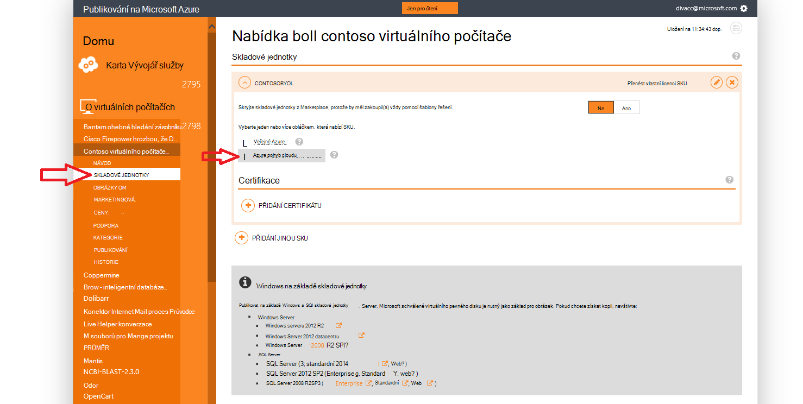
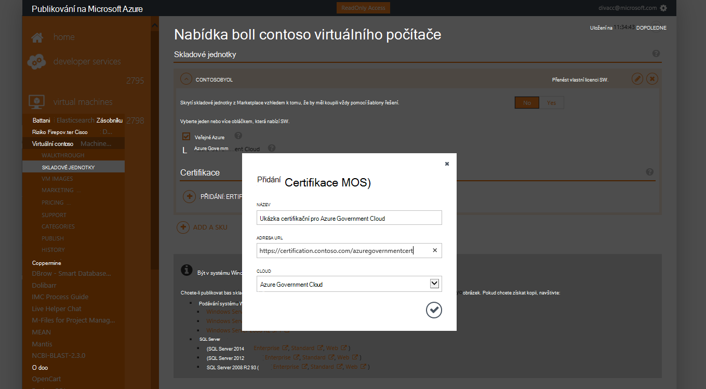
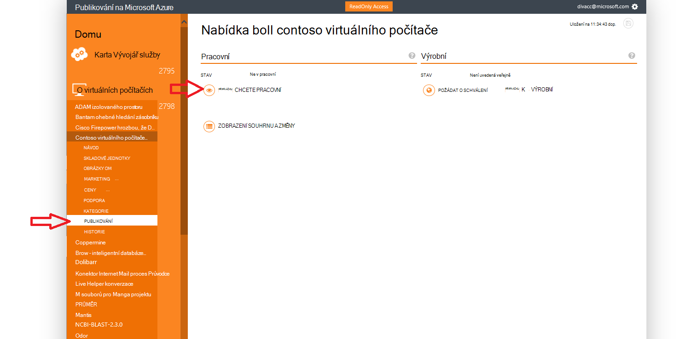
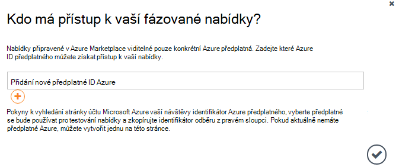
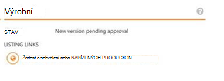

<properties
            pageTitle="Azure přečtěte následující dokumentaci pro státní správu | Microsoft Azure"
            description="To poskytuje porovnání funkcí a pokyny pro na vývoj aplikací pro státní správu Azure."
            services="Azure-Government"
            cloud="gov"
            documentationCenter=""
            authors="tsingh"
            manager="asimm"
            editor=""/>
 
<tags    ms.service="multiple"
            ms.devlang="na"
            ms.topic="article"
            ms.tgt_pltfrm="na"
            ms.workload="azure-government"
            ms.date="10/20/2016"
            ms.author="zakramer;tsingh;divacc"/> 

# Vláda Azure Marketplace
Pro partnery zájem o publikování vaše nabídka z Azure Marketplace pro státní správu najděte podrobnosti dole.

## Publikování
>[AZURE.NOTE] Pokud si nejste existující Azure Marketplace certifikované partnera, postupujte podle pokynů [v tomto poli](../marketplace-publishing/marketplace-publishing-getting-started.md) pokračovat.

### Krok 1  
Přihlaste se k [https://publish.windowsazure.com](https://publish.windowsazure.com)

### Krok 2
Klikněte na nabídku, kterou chcete publikovat

### Krok 3
Klikněte na **skladové jednotky** a klikněte na pole Azure Government Cloud

>[AZURE.NOTE] Jsou podporované jenom skladové jednotky přenést svůj vlastní licence (BYOL).  Tato možnost není k dispozici pro skladové jednotky přislíbený (srážek daně ze mzdy).

### Krok 4
Klikněte + certifikační přidat odkaz na přidání odkazů na všechny certifikace pro vaši nabídku.

### Krok 5
Žádost o zkušební účet v cloudu společnosti Microsoft Azure Government umožňující zkušební svůj obrázek v portál publikování: [https://azuregov.microsoft.com/trial/azuregovtrial](https://azuregov.microsoft.com/trial/azuregovtrial)

Ověření vaší oprávněnosti jako partnera, který slouží americké federal, stavu, místní nebo tribal entity a potvrzení se dozvíte prostřednictvím e-mailu.  Svůj zkušební účet bude k dispozici v rámci je 3 až 5 pracovních dní.

### Krok 6
Klikněte na publikovat a klikněte na tlačítko připínáčku pracovní. 

Zobrazí se výzva k zadání povolené předplatné, které mají přístup k fázované nabízejí. Zadejte ID předplatného z účtu zkušební nově získaná Azure Government.

### Krok 7
Jakmile úspěšné přípravě nabídky můžete otestovat obrázek po přihlášení k [https://portal.azure.us](https://portal.azure.us) pomocí svého účtu zkušební verzi Azure pro státní správu.

### Krok 8
Po ověření obrázek používáte zkušební předplatné můžete zpřístupnit nabídky služby live klepnutím na publikovat či požadování schválení přejdete na výroby. 

## Další kroky

Doplňující informace a aktualizace se přihlásit k odběru [Microsoft Azure Government blogu](https://blogs.msdn.microsoft.com/azuregov/).
