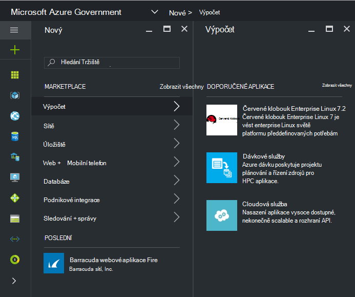
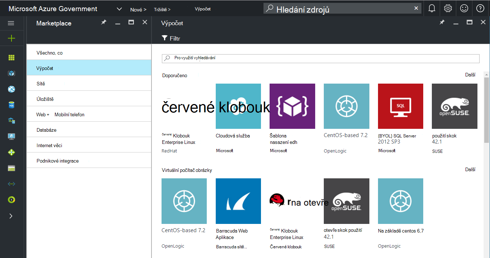
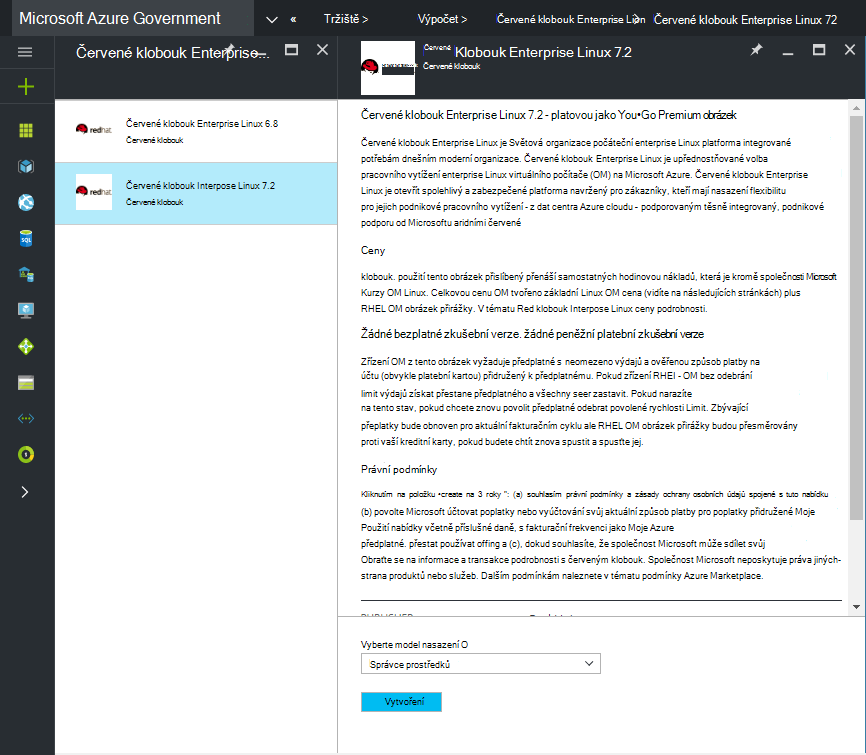
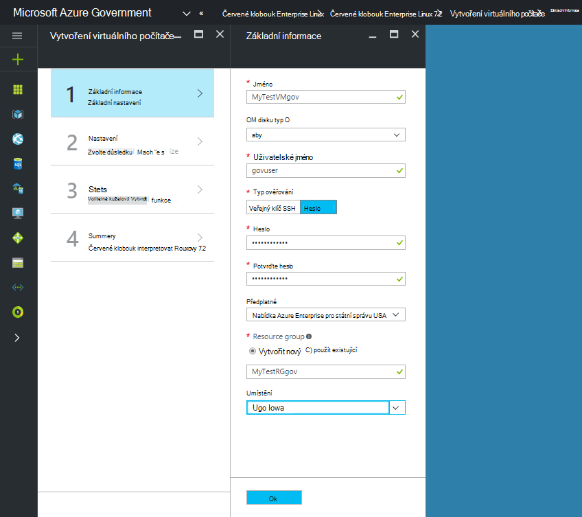
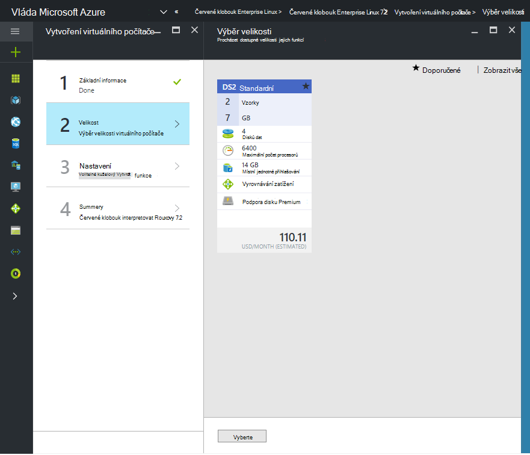

 <properties
    pageTitle="Azure přečtěte následující dokumentaci pro státní správu | Microsoft Azure"
    description="To poskytuje porovnání funkcí a pokyny pro na vývoj aplikací pro státní správu Azure."
    services="Azure-Government"
    cloud="gov"
    documentationCenter=""
    authors="VybavaRamadoss"
    manager="asimm"
    editor=""/>

<tags   ms.service="multiple"
    ms.devlang="na"
    ms.topic="article"
    ms.tgt_pltfrm="na"
    ms.workload="azure-government"
    ms.date="10/20/2016"
    ms.author="zakramer;vybavar"/>

# Azure Marketplace pro vládní organizace
Azure Marketplace je k dispozici pro státní správu Azure s aktualizovaný seznam obrázků z našich vydavatelé marketplace. 

## Varianty
Tady je několik tipů při použití Azure Marketplace pro vládní organizace:

- Pouze přenést svůj vlastní licence (BYOL) obrázcích jsou k dispozici. Nemáte přístup ke žádné obrázky, které vyžadují nákupní transakce prostřednictvím webu Azure Marketplace
- Ve srovnání s veřejný web marketplace momentálně neexistuje jen podmnožinu obrázky. Seznam dostupných obrázků najdete [tady](../azure-government-image-gallery.md) 
- Než zřizování obrázek, musíte povolit podnikový správce nákup předplatného Azure Marketplace
  - Přihlaste se k portálu jako správce organizace
  - Přejděte na *Správa*
  - V části *Podrobnosti zápisu* klepněte na ikonu tužky vedle položky řádku *Z Azure Marketplace*
  - Zapíná a vypíná *Povolit nebo zakázat* podle potřeby
  - Klikněte na tlačítko *Uložit*

>[AZURE.NOTE] Pokud vás zajímají provádění k dispozici v Azure Government obrázků najdete [pokyny rychlého připojení partnera](documentation-government-manage-marketplace-partners.md) Další informace.

### Krok 1
Spuštění Tržiště

  

### Krok 2
Projděte si různé produkty najít ten správný.

Tržiště publisher obsahuje seznam certifikace jako součást popis produktu pro vám pomůže zajistit volbou. 

### Krok 3
Zvolte product\image

### Krok 4
Spusťte tok vytvořit a zadejte požadované parametry pro nasazení

>[AZURE.NOTE] V rozevíracím seznamu umístění jsou viditelné jenom Azure Government umístění

### Krok 5
Sledujte ceny

### Krok 6
Provedení všech kroků a kliknutím na Ok spusťte proces vytváření

## Další kroky

Doplňující informace a aktualizace se přihlásit k odběru [Microsoft Azure Government blogu](https://blogs.msdn.microsoft.com/azuregov/).
