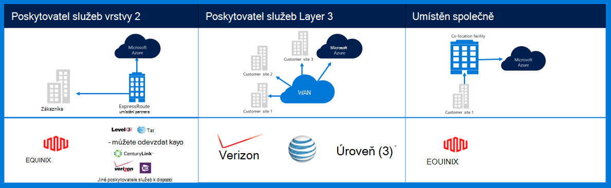
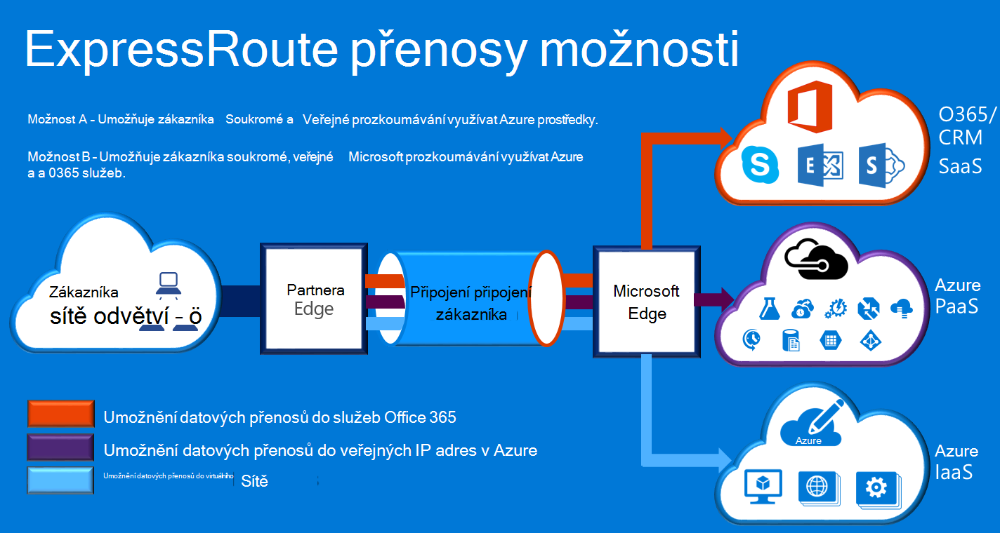

<properties
    pageTitle="Následující dokumentaci pro Azure Governmenmt | Microsoft Azure"
    description="To poskytuje srovnání funkcí a pokyny pro soukromé připojení k e Government"
    services="Azure-Government"
    cloud="gov" 
    documentationCenter=""
    authors="ryansoc"
    manager="zakramer"
    editor=""/>

<tags
    ms.service="multiple"
    ms.devlang="na"
    ms.topic="article"
    ms.tgt_pltfrm="na"
    ms.workload="azure-government"
    ms.date="09/28/2016"
    ms.author="ryansoc"/>

#  Azure Government sítě

##  ExpressRoute (soukromé Connectivity)

ExpressRoute je všeobecně dostupná v Azure pro státní správu. Podrobnosti (včetně partnery a prozkoumávání umístění) najdete v <a href="https://azure.microsoft.com/en-us/documentation/services/expressroute/">dokumentaci veřejné ExpressRoute </a>.

###  Varianty

ExpressRoute je všeobecně dostupná (GA) v Azure Government. 

- Pro státní správu zákazníků připojení k fyzicky izolace kapacita přes vyhrazené připojení (Gov) pro státní správu Azure ExpressRoute (ER)

- Azure Gov poskytuje Increased dostupnost a životnosti využitím víc dvojic oblast nachází aspoň 500 mil od sebe 

- Ve výchozím nastavení všechna připojení Azure Gov ER je nakonfigurované aktivní nadbytečné s podporou roztržení a poskytuje až 10 G okruh kapacita (nejmenší je 50MB)

- Azure umístění Gov ER poskytují optimalizované cest (nejkratší směrování zhoršeným latence, vysoký výkon, atd.) pro zákazníky a geo nadbytečné oblastí Azure Gov

- Privátní připojení Azure Gov ER nevyužívá, procházet nebo závisí na Internetu

- Azure Gov fyzické a logické infrastruktury fyzicky snaží a oddělené a přístup je omezený osobám USA

- Microsoft vlastní a funguje všechny optické infrastrukturu mezi Azure Gov oblastí a Azure Gov ER zahájit-mi umístění

- Azure Gov ER poskytuje připojení ke cloudovým službám společnosti Microsoft Azure, O365 a CRM

### Co byste měli zvážit

Existují dvě základní služby, které jsou zdrojem soukromé síťové připojení do Azure Government: virtuální privátní sítě (Web Server typické organizace) a ExpressRoute.

Azure ExpressRoute slouží k vytváření soukromé připojení mezi datacentrech Azure Government a místních infrastrukturu nebo v prostředí sdruženém. ExpressRoute připojení nepřekročí veřejné Internetu – nabízejí více spolehlivost rychlejší rychlosti a čekacích dob nižší než typický připojení k Internetu. V některých případech pomocí připojení ExpressRoute pro přenos dat mezi na místní systémy a Azure výnosů významné nákladů výhod.   

S ExpressRoute vytvoříte připojení k Azure ExpressRoute místě (například poskytovatele zařízení Exchange), nebo můžete přímo připojit Azure z existující sítě WAN (jako je možnosti popisku přepínání VPN (MPLS) poskytnutých poskytovatele služeb sítě).

    

Pro síť služby pro podporu aplikace zákazníka Azure pro státní správu a řešení doporučujeme, že je připojení k Azure Government implementovaná ExpressRoute (soukromé připojení). Použijete-li připojení VPN, následující považovat za:

- Zákazníci měli kontaktovat jejich pověření úředník/orgány a určit, zda je požadován soukromé připojení nebo jiných mechanismus zabezpečené připojení k identifikaci dodatečnými omezeními vzít v úvahu.

- Zákazníci měli rozhodnutí o pověřit VPN na webu je směrovány zónu soukromé připojení.

- Zákazníci měli získat MPLS okruh nebo VPN s zprostředkovatel přístupu licencovaného soukromé připojení.

Všem zákazníkům, kteří využít architekturu soukromé připojení třeba ověřit, že příslušný implementaci zřídit a udržovat pro zákazníka připojení k brány síť a Internet (GN / můžu) okraj směrovači vymezení bod pro státní správu Azure. Podobně organizaci musí vytvořit připojení k síti mezi místním prostředím a brány sítě/zákazníka (GN/C) okraj směrovači vymezení bodem pro státní správu Azure.

## Další kroky

Pro doplňující informace a aktualizace Předplaťte si <a href="https://blogs.msdn.microsoft.com/azuregov/">Microsoft Azure Government blogu.</a>
