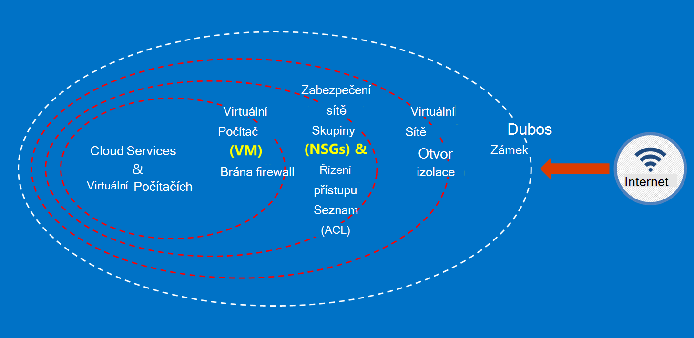

<properties
    pageTitle="Azure přečtěte následující dokumentaci pro státní správu | Microsoft Azure"
    description="To poskytuje srovnání funkcí a pokyny pro na vývoj aplikací pro státní správu Azure"
    services="Azure-Government"
    cloud="gov" 
    documentationCenter=""
    authors="ryansoc"
    manager="zakramer"
    editor=""/>

<tags
    ms.service="multiple"
    ms.devlang="na"
    ms.topic="article"
    ms.tgt_pltfrm="na"
    ms.workload="azure-government"
    ms.date="08/25/2016"
    ms.author="ryansoc"/>

#  Přehled si přečtěte následující dokumentaci Azure Government

##  Úvod k si přečtěte následující dokumentaci Azure Government

Tento web popisuje funkce služby [Microsoft Azure pro státní správu](https://azure.microsoft.com/features/gov/) a obsahuje obecné pokyny k dispozici všem zákazníkům. Před včetně konkrétně regulovaném dat ve vašem předplatném Azure Government, měli byste seznámit s funkcemi Azure Government a vyhledejte týmu účet, pokud máte nějaké dotazy.

Můžete vztahovat na [Microsoft Azure důvěřovat Centrum pro dodržování předpisů stránky](http://www.microsoft.com/en-us/TrustCenter/Compliance/default.aspx) aktuální informace o služby Azure Government zahrnuté v části konkrétní akreditace a právní. Další služby Microsoft může být také k dispozici, ale nejsou v rámci služby Azure Government nichž se uplatní a nejsou uvedeny v tomto dokumentu. Azure veřejných služeb může taky povolit použití spoustu dalších zdrojů, aplikací nebo služeb, které jsou k dispozici třetími stranami – nebo společnost Microsoft ve skupinovém rámečku samostatných podmínky zásady použití a ochrany osobních údajů, které nejsou součástí rozsah tohoto dokumentu. Zodpovídáte za revizí podmínky všechny tyto nabídky "doplněk", například nabídky Marketplace, aby splňovaly vašim potřebám týkající se dodržování předpisů.

Azure Government neexistuje osobám, které zpracovávají data, která jsou vyměřené poplatky za určitých předpisech government a požadavků (například 800.171 NIST DIB, ITAR, finančního úřadu 1075, DoD L4 a CJIS), kde se vyžaduje použití Azure Government dodržovat předpisy. Azure Government zákazníci se vztahují ověření nároku.

Entity s dotazy týkajícími oprávněnost pro státní správu Azure obraťte jejich účet týmu.

##  Zásady zabezpečení Data o zákaznících v Azure Government

Azure Government obsahuje velké množství funkce a služby, které můžete použít k vytvoření cloudové řešení vlastním potřebám upraveno/řízená data. Je kompatibilní se standardem zákazníka řešení nic jiného než efektivní provádění funkce Azure Government mimo pole, spolu s plnou dat z hlediska zabezpečení.
Když hostitelem řešení v Azure Government zpracovává Microsoft spoustu tyto požadavky na úrovni infrastruktury cloudu.

Na následujícím obrázku vidíte Azure obrana v název hloubkové modelu. Microsoft poskytuje například základní cloudové infrastruktury DENIAL, spolu s zákazníka funkce, například zabezpečení zařízení zákaznické aplikace, které potřebuje DENIAL.

Tato stránka popisuje základní zásady zabezpečení vašich služeb a aplikací poskytující pokyny a osvědčené postupy v tom, jak použít tyto zásady; jinými slovy jak zákazníci měli využívat inteligentní Azure Government splňovala závazky a povinnosti, které jsou potřeba pro řešení, které zpracovává informace ITAR.

Obecné zásady zabezpečení data o zákaznících jsou:
* Ochrana dat pomocí šifrování
* Správa tajemství
* Izolace omezit přístup k datům

##  Ochrana dat zákazníků pomocí šifrování

Zmírnění rizik a žádosti o schůzku zákonné povinnosti jsou řízení rostoucí fokus a důležitost šifrování. Použití implementaci efektivní šifrování k vylepšení aktuální síť a aplikace bezpečnostních opatřeních – a snížit celkového rizika prostředí cloudu.

### Šifrování na ostatní
Šifrování data na ostatních platí pro ochranu obsahu zákazníka v místa na disku. K tomu může dojít několika způsoby:

### Šifrování úložiště služby

Azure úložiště služby je povoleno šifrování na úrovni účtu úložiště výsledkem objektů BLOB bloku a automaticky šifrovány zápisu Azure úložiště objektů BLOB stránky. Při načtení dat z Azure úložiště ho bude dešifrovat tak, že služba úložiště před vrácením. Slouží k zabezpečení dat, aniž by bylo nutné upravit nebo přidat kód pro všechny aplikace.

### Šifrování Azure disku
Šifrování Azure disku šifrování s operačním systémem od disků dat používaných tak, že Azure virtuálního počítače. Integrace se službou Azure klíč trezoru umožňuje řízení a pomáhá spravovat disku šifrovacího klíče.

### Šifrování na straně klienta
Šifrování na straně klienta je integrovaná v Java a .NET úložiště klienta knihovny, které můžete využít Azure klíč trezoru rozhraní API to provádění jednoduchých provádět. Umožňuje získat přístup k tajemství trezoru klíč Azure pomocí služby Azure Active Directory určitým uživatelům Azure klíč trezoru.

### Šifrování při přenosu šifrovaná

Základní šifrování k dispozici pro připojení k Azure Government podporuje protokol úroveň zabezpečení TLS (Transport) 1.2 a certifikáty X.509. Federální informace standardní FIPS (Processing) algoritmy šifrování úrovně 1 140-2 se také používá ke infrastruktury síťových připojení mezi datacentrech Azure Government.  Windows Server 2012 R2 a Windows 8-plus VMs a Azure sdílené složky můžete použít SMB 3.0 šifrování mezi OM a sdílení souborů. Šifrování data před převádí se na úložiště v klientské aplikaci a data dešifrovat za ni se převede z úložiště pomocí šifrování na straně klienta.

### Doporučené postupy pro šifrování

* IaaS VMs: Použití Azure disku šifrování. Zapnutí úložiště služby šifrování šifrování virtuální pevný disk soubory, které se používají k obecnějším údajům těchto discích v úložišti Azure, ale tento pouze šifruje nově ručně psaných data. To znamená, že když vytvoříte virtuálního počítače a potom povolit úložiště služby šifrování na úložiště, který obsahuje soubor virtuálního pevného disku, pouze změny budou šifrovány, nikoli původní soubor virtuální pevný disk.
* Šifrování na straně klienta: Toto je nejbezpečnější způsob pro šifrování dat, protože šifruje před dopravní a jsou šifrovány data na ostatních. Vyžaduje však přidání kódu pro vaše aplikace pomocí úložiště, která nemusí chcete udělat. V těchto případech můžete HTTPs pro vaše data při přenosu šifrovaná a úložiště služby šifrování šifrování data na ostatních. Šifrování na straně klienta zahrnuje také další zatížení v klientském počítači – je nutné počítat v škálovatelnost plánů, zejména pokud jsou šifrování a přenosu velké množství dat.

Další informace o možnostech šifrování v Azure najdete v článku [Průvodce zabezpečením úložiště](/storage-security-guide).

##  Ochrana dat zákazníků pomocí správy tajemství

Zabezpečené správy klíčů je důležité pro ochranu dat v cloudu. Zákazníci měli snažte se navázat zjednodušení správy klíčů udržujete zkratek používaných v cloudu aplikací a služeb šifrování data.

### Doporučené postupy pro správu tajemství

* Pomocí klávesy trezoru minimalizace rizika tajemství vystavením prostřednictvím pevně konfigurační soubory, skripty, nebo ve zdrojovém kódu. Azure trezoru klíč šifruje klávesy (například šifrování klíčů pro šifrování disku Azure) a tajemství (například hesla), ukládání do FIPS 140-2 úrovně 2 ověřuje hardwarové zabezpečení moduly (moduly hardwarového zabezpečení). Přidané assurance importovat nebo vygenerování klíčů v těchto moduly hardwarového zabezpečení.
* Kód aplikace a šablon by měl obsahovat pouze URI odkazy tajemství (což znamená, že skutečné tajemství nejsou v kódu, konfigurace nebo zdrojového kódu úložištích). Tím útoky typu phishing klíčové na interní a externí repo, například sklizně roboti v GitHub.
* Využití silné RBAC prvkům klíč trezoru. Pokud důvěryhodných operátor ponechá společnosti nebo převody do nové skupiny v rámci podniku, budou by mělo být zabráněno nebudete mít přístup k tajemství.  

Další informace najdete v článku [Trezoru klíč pro státní správu Azure](/azure-government/azure-government-tech-keyvault)

##  Izolace omezit přístup k datům

Izolace je všechny informace o použití omezení, segmentace a kontejnery omezit přístup k datům jenom uživatelé, services a aplikace. Například oddělení mezi klienty je mechanismus základní zabezpečení pro víceklientské cloudu platformy, třeba Microsoft Azure. Logické izolace zabraňuje jednoho klienta konflikt s operacemi jiném klientovi.

### Prostředí izolace
Prostředí Azure Government je fyzický instanci, která je nezávislý před stavebním blokem sítě společnosti Microsoft. Dosahuje prostřednictvím řadu fyzické a logické ovládacích prvků, které patří: zabezpečení fyzické překážky pomocí Biometrická zařízení a kamery.  Použití konkrétní přihlašovací údaje a vícefaktorové ověřování zaměstnanců společnosti Microsoft vyžadují logické přístup k provozním prostředí.  Všechny infrastruktury služby pro státní správu Azure je umístěný ve Spojených státech.

#### Izolace jednoho zákazníka
Řízení přístupu k síti Azure implementuje a oddělení prostřednictvím VLAN izolace ACL, načíst vyrovnávání a filtry IP

Zákazníci další různých předplatných, skupiny zdrojů, virtuálních sítí a podsítí izolovat jejich zdroje.

Další informace o izolace v Microsoft Azure najdete v [části izolace zabezpečení Azure](/azure-security-getting-started/#isolation).

Pro doplňující informace a aktualizace Předplaťte si <a href="https://blogs.msdn.microsoft.com/azuregov/">Microsoft Azure Government blogu.</a>
