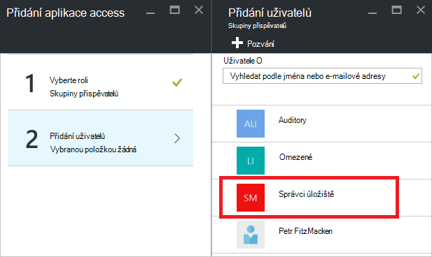

<properties
   pageTitle="Access Azure portálu řídicího panelu | Microsoft Azure"
   description="Tento článek vysvětluje, jak sdílet přístup do řídicího panelu na portálu Azure."
   services="azure-portal"
   documentationCenter=""
   authors="tfitzmac"
   manager="timlt"
   editor="tysonn"/>

<tags
   ms.service="multiple"
   ms.devlang="NA"
   ms.topic="article"
   ms.tgt_pltfrm="NA"
   ms.workload="na"
   ms.date="08/01/2016"
   ms.author="tomfitz"/>

# Sdílení Azure řídicích panelů

Po konfiguraci řídicího panelu, můžete publikovat a sdílejte ho s ostatními uživateli ve vaší organizaci. Povolení ostatním uživatelům přístup k řídicího panelu pomocí Azure [Řízení přístupu na základě rolí](../active-directory/role-based-access-control-configure.md). Přiřaďte uživatele nebo skupiny uživatelů k roli a určitou roli Určuje, jestli tyto uživatele můžete zobrazit nebo upravit publikované řídicí panel. 

Všechny publikované řídicí panely jsou implementovaná jako Azure zdroje, což znamená, existují jako spravovatelnosti položky v rámci předplatného a jsou součástí skupiny zdrojů.  Z pohledu ovládací prvek aplikace access se už liší od dalších zdrojů, jako je virtuální počítač nebo účtu úložiště řídicí panely.

> [AZURE.TIP] Jednotlivé dlaždice na řídicím panelu vynutit vlastní ovládací prvek požadavky přístup podle prostředky, které zobrazují.  Proto můžete navrhovat řídicího panelu, který je sdílen obecně při pořád ochrana dat na jednotlivé dlaždice.

## Principy řízení přístupu pro řídicí panely

Řízení přístupu na základě rolí můžete přiřadit uživatele k rolím ve tři různé úrovně obor:

- předplatné
- pole Skupina zdroje
- zdroje

Přiřazené oprávnění se dědí od předplatné dolů na zdroje. Publikované řídicí panel je zdroj. Proto kterou už můžete mít uživatelé přiřazená k rolím pro předplatné, které fungovat i pro publikované řídicí panel. 

Tady je příklad.  Řekněme, že máte předplatné Azure a různých členům vašeho týmu byly přiřazeny role **vlastníka**, **Přispěvatel**nebo **čtečka** u předplatného. Uživatelé, kteří jsou vlastníky nebo přispěvatelů můžou seznam, zobrazení, vytvoření, úprava nebo odstranění řídicích panelů v rámci předplatného.  Uživatelům, kteří jsou čteček můžou seznam a zobrazení řídicí panely, ale nelze upravit nebo odstranit.  Uživatelé s přístupem Čtenář můžou proveďte místní úpravy publikované řídicí panel (například při odstraňování potíží s problém), ale nebudou moct publikování tyto změny na server.  Budou mít možnost kopii soukromé řídicí panel pro sebe

Však můžete taky přiřadit oprávnění ke skupině zdroje, které obsahuje několik řídicí panely nebo jednotlivé řídicího panelu. Například můžete se rozhodnout, že skupinu uživatelů, by měl mít omezenými oprávněními přes předplatné ale vyšší úroveň přístupu k určité řídicího panelu. Tito uživatelé přiřadit roli pro tento řídicí panel. 

## Publikování řídicího panelu

Předpokládejme, že po dokončení konfigurace řídicího panelu, který chcete nasdílet skupinu uživatelů ve vašem předplatném. Postupem znázornění vlastní skupinu nazvanou Manažeři úložiště, ale můžete název skupiny něco jiného, co budete chtít. Informace o vytváření skupiny služby Active Directory a přidání uživatelů do skupiny najdete v článku [Správa skupin služby Azure Active Directory](../active-directory/active-directory-accessmanagement-manage-groups.md).

1. Na řídicím panelu vyberte **sdílet**.

     

2. Před přiřazením přístup, je nutné publikovat na řídicím panelu. Ve výchozím nastavení bude publikován na řídicím panelu skupina zdroje s názvem **řídicí panely**. Vyberte **Publikovat**.

     

Teď je publikován řídicího panelu. Pokud oprávnění dědí od předplatné jsou vhodné, není muset udělat něco víc. Ostatní uživatelé ve vaší organizaci budou moct přístupu a změnám řídicího panelu na základě jejich úrovně role předplatného. Však pro účely tohoto návodu Pojďme přiřadit skupinu uživatelů, role pro tento řídicí panel.

## Přiřadit přístup do řídicího panelu

1. Po publikování na řídicím panelu, vyberte **Správa uživatelů**.

     

2. Zobrazí se seznam stávajícím uživatelům, které již byly přiřazeny role pro tento řídicí panel. Seznam stávajícím uživatelům budou jiné než na následujícím obrázku. Největší pravděpodobností přiřazení se dědí od předplatné. Pokud chcete přidat nového uživatele nebo skupiny, vyberte **Přidat**.

     

3. Vyberte roli, která představuje oprávnění, která chcete udělit. V tomto příkladu vyberte **přispěvatele**.

     

4. Vyberte uživatele nebo skupinu, kterou chcete přiřadit roli. Pokud se nezobrazí uživatele nebo skupinu, kterou jste hledali v seznamu, pomocí vyhledávacího pole. Seznam dostupných skupin závisí na skupiny, kterou jste vytvořili ve službě Active Directory.

      

5. Jakmile dokončíte přidávání uživatelů a skupin, klikněte na **OK**. 

6. Přiřazení nové se přidá do seznamu uživatelů. Všimněte si, **Access** je uvedeno **přiřazené** spíše než **dědí**.

     

## Další kroky

- Seznam role najdete v tématu [RBAC: předdefinované role](../active-directory/role-based-access-built-in-roles.md).
- Další informace o správě materiály, najdete v článku [Správa Azure zdrojů prostřednictvím portálu](resource-group-portal.md).