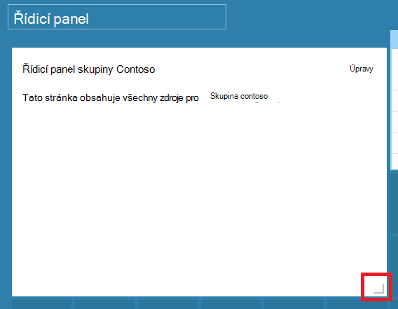

<properties
   pageTitle="Azure portálu řídicí panely | Microsoft Azure"
   description="Tento článek vysvětluje, jak vytvářet a upravovat řídicí panely na portálu Azure."
   services="azure-portal"
   documentationCenter=""
   authors="sewatson"
   manager="timlt"
   editor="tysonn"/>

<tags
   ms.service="multiple"
   ms.devlang="NA"
   ms.topic="article"
   ms.tgt_pltfrm="NA"
   ms.workload="na"
   ms.date="09/06/2016"
   ms.author="sewatson"/>

# Vytváření a sdílení řídicí panely na portálu Azure

Můžete vytvořit více řídicí panely a sdílet je s dalšími lidmi, kteří mají přístup k předplatné Azure.  Tento příspěvek prochází základní informace o vytváření a úpravách, publikování a správa přístupu k řídicím panelům.

## Přizpůsobení řídicí panely a listy

Od spuštění řídicí panely několik měsíci, byla stabilní pokles zásuvné přizpůsobení a rychlé zvýšení přizpůsobení řídicího panelu. Tento vývoj silných použití zobrazuje raději přizpůsobení řídicí panely na listy. K podpoře trendem, jsme odebrat možnost přizpůsobit listy a přidělit naše úsilí k vylepšení funkce řídicího panelu. Pokud jste přizpůsobili zásuvné, vaše přizpůsobení brzy odeberou. Zachovat této přizpůsobení připnete vlastní dlaždice do řídicího panelu. Jednoduše klikněte pravým tlačítkem myši na dlaždici a vyberte **Připnout na řídicí panel** , jak je znázorněno na následujícím obrázku.

## Vytvoření řídicího panelu

Vytvoření řídicího panelu, klikněte na tlačítko **nový řídicí panel** vedle názvu aktuálního řídicího panelu.  

Tato akce vytvoří nové, prázdné, soukromé řídicích panelů a umístí do režimu úprav můžete název řídicího panelu a zadání nebo změna uspořádání dlaždic.  V tomto režimu galerii sbalitelný dlaždice převezme levou navigační nabídku.  Galerie dlaždice vám umožňuje najít dlaždice zdroje aplikace Azure různými způsoby: můžete procházet pomocí [pole Skupina zdroje](../azure-resource-manager/resource-group-overview.md#resource-groups), podle typu zdroje, podle [značky](../resource-group-using-tags.md)nebo hledáním pro zdroj podle názvu.  

Přidání dlaždic tak, že je prostě přetáhnete na plochu řídicího panelu místo, kam chcete.

Je nová kategorie s názvem **Obecné** pro dlaždice, které nejsou přidružené ke konkrétnímu prostředku.  V tomto příkladu jsme připnout dlaždici Markdown.  Pomocí této dlaždici přidat vlastní obsah do řídicího panelu.  Na dlaždici podporuje ve formátu prostého textu, [Markdown syntaxe](https://daringfireball.net/projects/markdown/syntax)a omezeného HTML.  (Pro zabezpečení, nemůžete takové věci, jako vloží `<script>` značky nebo použít určitý styl prvek CSS mohou nepříznivě pomocí portálu.) 

## Úprava řídicího panelu

Po vytvoření řídicího panelu, můžete připnout dlaždice z Galerie dlaždice nebo dlaždice vyjádření listy. Pojďme připnout znázornění naše pole Skupina zdroje. Můžete buď PIN kód při procházení položky nebo z zásuvné skupina zdroje. Oba přístupy za následek Připnutí dlaždice znázornění skupina zdroje.

Po Připnutí položky, objeví se na řídicím panelu.

Teď, když máme Markdown dlaždici a skupina zdroje připnuté na řídicí panel, jsme změnou velikosti a změna uspořádání dlaždic do vhodné rozložení.

Umístíte ukazatel myši a výběrem trojtečkou (...) nebo pravým tlačítkem myši na dlaždici se zobrazí všechny kontextové příkazy pro tuto dlaždici. Ve výchozím nastavení jsou dvě položky:

1. **Odepnout z řídicího panelu** – dlaždice odebere z řídicího panelu
2.  Slouží k vložení **Přizpůsobit** – vlastní nastavení režimu

Výběrem přizpůsobit, můžete změnou velikosti a změna pořadí dlaždic. Změnit velikost na dlaždici, vyberte nový velikost z místní nabídky, jak je znázorněno na následujícím obrázku.

Nebo pokud dlaždici podporuje libovolnou velikost, můžete přesouvat pravém dolním požadovanou velikost.

Po změně velikosti dlaždice, podívejte se na řídicím panelu.

Jakmile jste hotovi přizpůsobení řídicího panelu, jednoduše vyberte **Hotovo, přizpůsobení** ukončíte přizpůsobení režimu nebo klikněte pravým tlačítkem myši a v místní nabídce vyberte **Hotovo přizpůsobení** .

## Publikovat řídicího panelu a spravovat řízení přístupu

Při vytváření řídicího panelu je soukromá ve výchozím nastavení, což znamená, že jste jediným uživatelem, kdo může zobrazit.  Být viditelné pro ostatní uživatele, použijte tlačítko **sdílet** , která se zobrazí vedle řídicího panelu příkazů.

Zobrazí se výzva vyberte předplatné a pole Skupina zdroje pro řídicí panel publikování. Bezproblémová integrace řídicí panely do ekosystému, jsme implementovali sdílené řídicí panely jako Azure zdroje (tak nemůžete sdílet tak, že zadáte e-mailová adresa).  [Řízení přístupu na základě rolí Azure](../active-directory/role-based-access-control-configure.md )upravuje přístupu k informacím zobrazit většinou dlaždice na portálu. Z pohledu ovládací prvek aplikace access se už liší od virtuálního počítače nebo účtu úložiště sdílené řídicí panely.  

Řekněme, že máte předplatné Azure a členy týmu byly přiřazeny role **vlastníka**, **Přispěvatel**nebo **čtečka** předplatné.  Uživatelé, kteří jsou vlastníky nebo přispěvatelů můžou seznam, zobrazení, vytvoření, úprava nebo odstranění řídicí panely, které předplatného.  Uživatelům, kteří jsou čteček můžou seznam a zobrazení řídicí panely, ale nelze upravit nebo odstranit.  Uživatelé, kteří mají přístup čtenáře budou moct proveďte místní úpravy sdílených řídicích panelů, ale nemůžou publikování tyto změny na server.  Ale aby se vám soukromou kopii řídicí panel pro vlastní potřebu.  Co vždy jednotlivé dlaždice na řídicím panelu vynutit vlastní pravidla pro řízení přístupu na základě na prostředky, které odpovídají.  

Pro usnadnění na portálu publikování prostředí provede vás směrem vzorek umístit řídicí panely ve skupině zdroje s názvem **řídicí panely**.  

Můžete taky publikovat řídicí panel pro určité skupiny prostředků.  Řízení přístupu k této řídicího panelu odpovídá řízení přístupu pro skupiny zdrojů.  Uživatelé, kteří mohou přidávání a používání zdrojů v dané skupině zdroje mít taky přístup k řídicí panely.

Po publikování řídicího panelu Ovládací prvek podokna **sdílení + přístup** aktualizace a zobrazit informace o publikovaných řídicích panelů, včetně odkaz určený ke správě přístupu uživatelů do řídicího panelu.  Tento odkaz spustí standardní řízení přístupu na základě rolí zásuvné sloužící ke správě přístup Azure zdroje.  Můžete kdykoli vrátit zpět k tomuto zobrazení tak, že vyberete **sdílet**.

## Další kroky

- Přidávání a používání zdrojů, najdete v článku [Správa Azure zdrojů prostřednictvím portálu](resource-group-portal.md).
- Abyste mohli nasadit zdrojů, tématech [nasazení se šablonami správce prostředků a Azure portálu](../resource-group-template-deploy-portal.md).