<properties 
    pageTitle="Použít Azure portálu pro správu Azure prostředků | Microsoft Azure" 
    description="Ke správě svých prostředcích použijte Azure portálem a spravovat zdroje Azure. Ukazuje, jak pracovat s odkazem řídicí panely sledování zdroje." 
    services="azure-resource-manager,azure-portal" 
    documentationCenter="" 
    authors="tfitzmac" 
    manager="timlt" 
    editor="tysonn"/>

<tags 
    ms.service="azure-resource-manager" 
    ms.workload="multiple" 
    ms.tgt_pltfrm="na" 
    ms.devlang="na" 
    ms.topic="article" 
    ms.date="09/12/2016" 
    ms.author="tomfitz"/>

# Přidávání a používání zdrojů Azure pomocí portálu

> [AZURE.SELECTOR]
- [Azure Powershellu](../powershell-azure-resource-manager.md)
- [Azure rozhraní příkazového řádku](../xplat-cli-azure-resource-manager.md)
- [Portál](resource-group-portal.md) 
- [ROZHRANÍ REST API](../resource-manager-rest-api.md)

Toto téma ukazuje, jak pomocí služby [Azure portálu](https://portal.azure.com) [Správce prostředků Azure](../azure-resource-manager/resource-group-overview.md) ke správě Azure zdroje. Další informace o nasazení prostředků prostřednictvím portálu najdete v tématu [nasazení zdroje se šablonami správce prostředků a Azure portálu](../resource-group-template-deploy-portal.md).

V současné době podporuje některé služba portálu nebo správce prostředků. U těchto služeb budete muset pomocí [klasické portálu](https://manage.windowsazure.com). Stav každé služby najdete v článku [Azure portálu dostupnost grafu](https://azure.microsoft.com/features/azure-portal/availability/).

## Správa skupiny zdrojů

1. Pokud chcete zobrazit všechny skupiny prostředků ve vašem předplatném, vyberte **skupiny zdrojů**.

    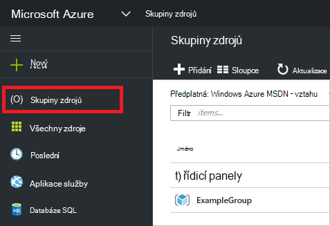

1. Pokud chcete vytvořit skupinu prázdných zdroje, vyberte **Přidat**.

    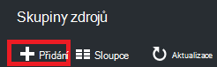

1. Zadejte název a umístění pro nové skupiny prostředků. Vyberte možnost **vytvořit**.

    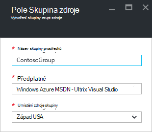

1. Budete muset vyberte **Aktualizovat** aby se zobrazila skupina nedávno vytvořené zdroje.

    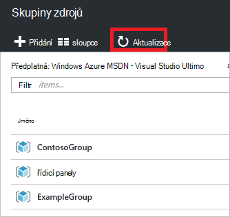

1. Přizpůsobit informace zobrazené pro zdroje skupiny, vyberte **sloupce**.

    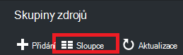

1. Vyberte sloupce, které chcete přidat a pak vyberte **Aktualizovat**.

    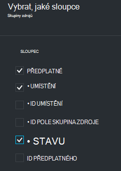

1. Další informace o nasazení prostředků do nové skupiny prostředků, tématech [nasazení se šablonami správce prostředků a Azure portálu](../resource-group-template-deploy-portal.md).

1. Pro rychlý přístup ke skupině zdroje můžete připnout zásuvné do řídicího panelu.

    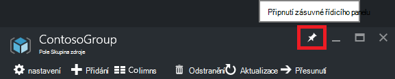

1. Řídicí panel zobrazí skupina zdroje a jeho zdroje. Můžete vybrat buď skupiny zdrojů nebo některou její zdrojů přejděte na položku.

    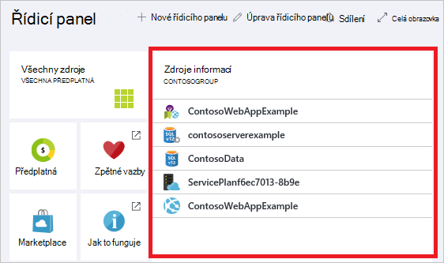

## Značka zdroje

Značky můžete použít ke skupinám zdroje a zdrojům logicky uspořádání svém majetku. Informace o práci s klíčovými slovy najdete v článku [použití značek k uspořádání Azure zdroje](../resource-group-using-tags.md).

[AZURE.INCLUDE [resource-manager-tag-resource](../../includes/resource-manager-tag-resources.md)]

## Sledování zdroje

Po výběru zdroj zásuvné zdroje představuje výchozí grafy a tabulky pro sledování tento typ zdroje.

1. Vyberte zdroj a Všimněte si v části **Sledování** . Obsahuje grafy, které jsou důležité pro typ zdroje. Následující obrázek znázorňuje výchozí monitorování dat účtu úložiště.

    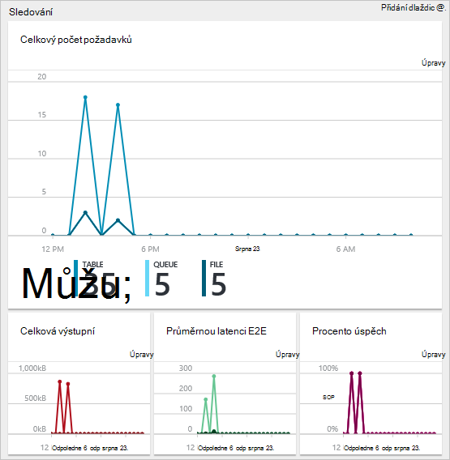

1. Část zásuvné můžete připnout na řídicí panel kliknutím tlačítko se třemi tečkami (...) nad oddíl. Můžete taky přizpůsobit velikost v části v zásuvné nebo úplně odebrat. Následující obrázek ukazuje, jak můžete připnout, upravit nebo odebrat části procesoru a paměti.

    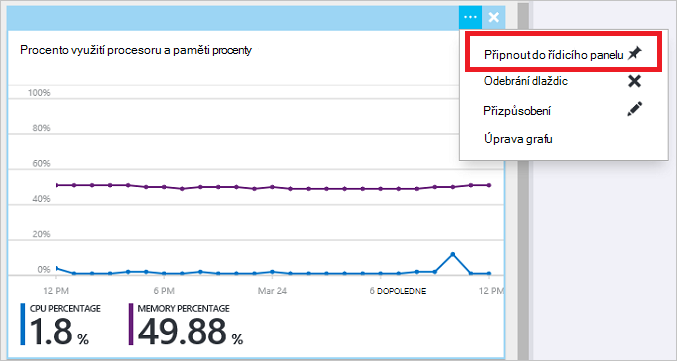

1. Po Připnutí části na řídicí panel, zobrazí se souhrn na řídicím panelu. A výběru okamžitě přejdete na další informace o datech.

    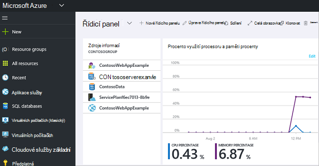

1. Můžete přizpůsobit zcela data, která můžete sledovat pomocí portálu, přejděte na řídicí panel Výchozí a vyberte **nový řídicí panel**.

    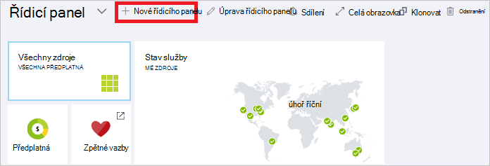

1. Zadejte název nového řídicího panelu a přetáhněte dlaždice na řídicím panelu. Dlaždice budou filtrovány podle různé možnosti.

    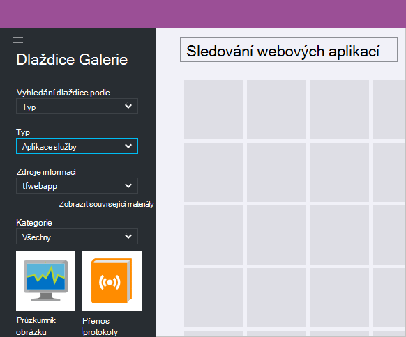

     Další informace o práci s řídicích panelech najdete v tématu [Vytvoření a sdílení řídicí panely na portálu Azure](azure-portal-dashboards.md).

## Přidávání a používání zdrojů

V zásuvné zdroje se zobrazí možnosti pro správu zdroje. Na portálu nabídne vám možnosti správy pro tento typ je daný zdroj. Příkazy pro správu se zobrazí v horní části zásuvné zdroje a na levé straně.

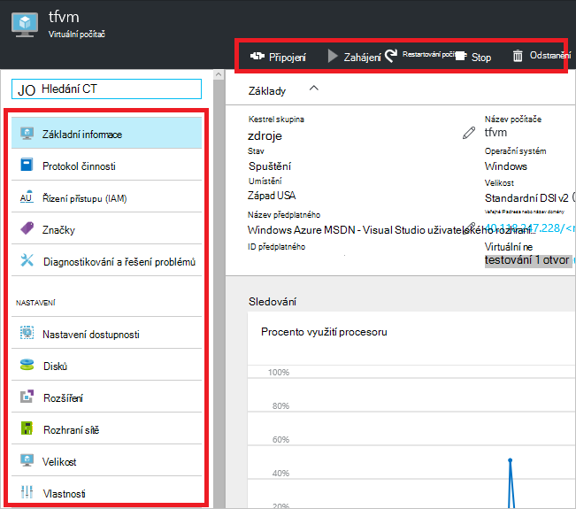

Z těchto možností, které můžete provádět operací, jako je zahájení a ukončení virtuálního počítače nebo změna konfigurace vlastnosti virtuálního počítače.

## Přesunutí zdroje

Pokud potřebujete přesuňte prostředky do jiné skupiny prostředků nebo jiné předplatné, najdete v článku [přesunutí zdrojů do nové skupiny prostředků nebo předplatného](../resource-group-move-resources.md).

## Uzamčení zdroje

Je možné uzamknout předplatného, skupina zdroje nebo zdroje zabránit ostatním uživatelům ve vaší organizaci mohli omylem odstranit nebo úprava důležitých prostředků. Další informace najdete v tématu [Lock zdroje pomocí Správce prostředků Azure](../resource-group-lock-resources.md).

[AZURE.INCLUDE [resource-manager-lock-resources](../../includes/resource-manager-lock-resources.md)]

## Zobrazit svoje předplatné a náklady

Zobrazí se informace o předplatného a úrovní nákladů pro všechny zdroje. Vyberte **předplatné** a předplatné, které chcete zobrazit. Máte jenom jedno předplatné vyberte.

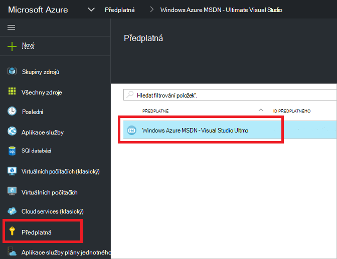

V rámci předplatného zásuvné uvidíte sazbu ztmavit.

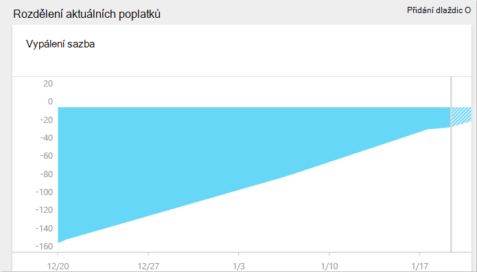

A rozdělení nákladů podle typu zdroje.

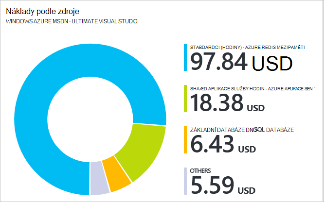

## Export šablony

Po nastavení skupina zdroje, si přejete zobrazit šabloně správce prostředků pro skupiny zdrojů. Export šablony nabízí dva výhody:

1. Můžete jednoduše automatizovat budoucí nasazení řešení vzhledem k tomu šablona obsahuje dokončení infrastruktury.

2. Můžete seznámit se s syntaxe šablony hledáním v JavaScript Object Notation (JSON), který představuje řešení.

Podrobné pokyny najdete v článku [Export správce prostředků Azure šablony z existujících zdrojů](../resource-manager-export-template.md).

## Odstranění pole Skupina zdroje nebo zdrojů

Odstranění skupiny zdrojů odstraní všechny zdroje obsažené v něm obsažené. Můžete taky odstranit jednotlivé zdroje v rámci skupiny zdrojů. Chcete-li opatrní, protože může být zdroje jiné skupiny zdrojů, které jsou propojené s jeho odstraněním skupina zdroje. Správce prostředků neodstraní propojených zdrojů, ale nemusí správně fungovat bez očekávané prostředky.

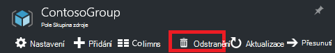

## Další kroky

- Zobrazení protokolů auditování, najdete v článku [auditování operace s správce prostředků](../resource-group-audit.md).
- Poradce při potížích nasazení, najdete v článku [nasazení skupina zdroje Poradce při potížích s Azure portálu](../resource-manager-troubleshoot-deployments-portal.md).
- Abyste mohli nasadit zdrojů prostřednictvím portálu, tématech [nasazení se šablonami správce prostředků a Azure portálu](../resource-group-template-deploy-portal.md).
- Správa přístupu k prostředkům, najdete v článku [použití přiřazování rolí Správa přístupu k prostředkům Azure předplatného](../active-directory/role-based-access-control-configure.md).

