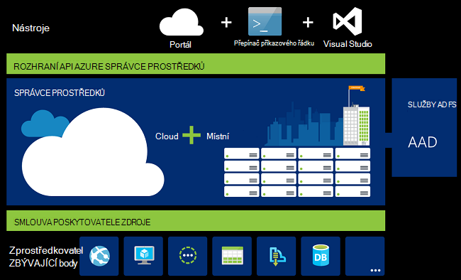
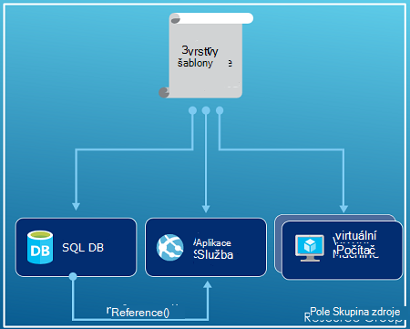
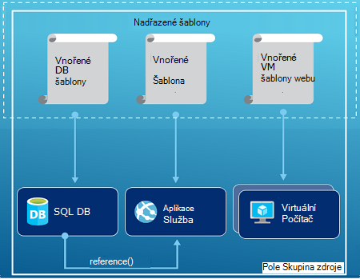
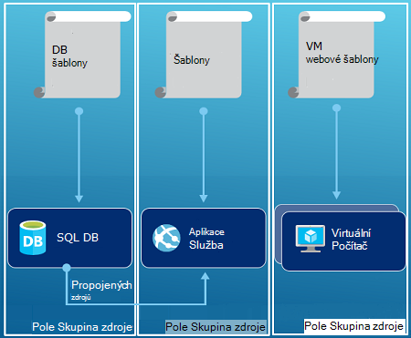

<properties
   pageTitle="Azure Přehled Správce prostředků | Microsoft Azure"
   description="Popisuje, jak pomocí Správce prostředků Azure nasazení, Správa a řízení zdrojů na Azure přístupu."
   services="azure-resource-manager"
   documentationCenter="na"
   authors="tfitzmac"
   manager="timlt"
   editor="tysonn"/>

<tags
   ms.service="azure-resource-manager"
   ms.devlang="na"
   ms.topic="get-started-article"
   ms.tgt_pltfrm="na"
   ms.workload="na"
   ms.date="10/21/2016"
   ms.author="tomfitz"/>

# Azure Přehled Správce zdrojů

Infrastruktura aplikace obvykle tvoří součástí mnoho – možná virtuálního počítače účtu úložiště a virtuální síť nebo do webových aplikací, databáze, databázovým serverem a 3 stran služeb. Jako samostatný entity nevidíte komponentami, místo toho zobrazí je jako související a vzájemně závislých částí jedné entity. Chcete nasadit, Správa a sledování je jako skupinu. Azure správce prostředků umožňuje práce se zdroji ve vašem řešení jako skupinu. Můžete nasadit, aktualizace nebo odstranění všech zdrojů řešení v operaci jediné, koordinovaný pro. Použití šablony pro nasazení a této šablony můžete pracovat na jiném prostředí třeba testování pracovní a výroby. Správce prostředků poskytuje zabezpečení, auditování a označování funkcí, které vám pomůžou se správou zdroje po nasazení. 

## Terminologie

Pokud začínáte správci zdrojů Azure, je potřeba udělat některé termíny, kdy se seznámíte s.

- **zdroje** - spravovatelnosti položky, která je k dispozici prostřednictvím Azure. Některé běžné zdrojů jsou virtuálního počítače, účtu úložiště, webové aplikace, databáze a virtuální sítě, ale existuje spousta dalšího.
- **pole Skupina zdroje** - kontejner obsahující související materiály pro Azure řešení. Skupina zdroje můžete zahrnout všechny zdroje řešení nebo pouze zdroje, které chcete spravovat jako skupinu. Můžete rozhodnout, jak chcete agregovat skupinám zdroje založené na co je nejsmysluplnější pro vaši organizaci. Zobrazit [skupiny zdrojů](#resource-groups).
- **zprostředkovatele prostředků** : služba, která poskytuje zdroje můžete nasazovat a spravovat pomocí Správce prostředků. Každý poskytovatel zdrojů nabízí operace pro práci s prostředky, které používají. Některé běžné zdrojů poskytovatelů jsou Microsoft.Compute, který poskytuje prostředek virtuální počítač, Microsoft.Storage, poskytující zdroje účtu úložiště a Microsoft.Web, který poskytuje prostředky vztahující se k webové aplikace. Najdete v článku [poskytovatelé zdroje](#resource-providers).
- **Správce prostředků šablony** – A JavaScript Object Notation (JSON) soubor, který definuje jeden nebo více zdrojů nasadit skupina zdroje. Definuje také závislosti mezi nasazeném zdroje. Šablona mohou sloužit k nasazení zdroje konzistentní a opakovaně. V tématu [nasazení šablony](#template-deployment).
- **deklarativní syntaxe** – syntaxi, která umožňuje uveďte "Tady je co můžu, aby byla k vytvoření" bez nutnosti napsat posloupnost programování příkazy k jeho vytvoření. Správce prostředků šablony je znázorněn příklad deklarativní syntaxe. V souboru definujete vlastností infrastruktury nasadit Azure. 

## Výhody používání správce prostředků

Správce prostředků nabízí několik výhod:

- Můžete nasadit, Správa a sledovat všechny zdroje řešení pro jako skupinu, spíše než zpracování tyto materiály jednotlivě.
- Lze opakovaně nasazení řešení v celém životního cyklu vývoje a spolehlivosti zavedení zdrojů v konzistentního stavu.
- Můžete spravovat infrastruktury pomocí deklarativní šablony spíše než skriptů.
- Můžete definovat závislosti mezi zdroje tak jejich nasazením ve správném pořadí.
- Řízení přístupu ke všem službám můžete použít v skupina zdroje protože řízení přístupu na základě rolí (RBAC) je nativně integrovaný platformu správy.
- Značky můžete vyrovnat zdroje logicky uspořádání všech zdrojů v předplatného.
- Fakturace vaší organizace můžete vysvětlit, zobrazením nákladů na skupinu zdrojů sdílení stejnou značku.  

Správce prostředků umožňuje nové nasazením a správou řešení. Pokud používají starší nasazení modelu a chcete se dozvědět o změnách, najdete v článku [Principy správce prostředků nasazení a klasické nasazení](../resource-manager-deployment-model.md).

## Konzistentní správy vrstvy

Správce prostředků obsahuje vrstvě konzistentní správy pro úkoly, které provedete pomocí prostředí PowerShell Azure, Azure rozhraní příkazového řádku, Azure portál, rozhraní REST API a vývojového nástroje. Všechny nástroje použít jednu sadu operací. Pomocí nástrojů, které nejlépe a použít je jako synonyma přehledné. 

Následující obrázek znázorňuje způsob všech nástrojů interakci se stejným rozhraním API Azure správce prostředků. Rozhraní API předá žádosti o službu správce prostředků, která ověří a povolí žádosti. Správce prostředků pro příslušný zdroj poskytovatele přesměruje žádosti.

## Pokyny pro

Následující návrhy pomoci můžete využít úplný správce prostředků při práci s řešení.

1. Definování a nasazení infrastrukturu prostřednictvím deklarativní syntaxe správce prostředků šablony a ne prostřednictvím naléhavé příkazy.
2. Definování všech kroků nasazení a konfiguraci v šabloně. Měli byste mít žádný ruční postup pro nastavení vašeho řešení.
3. Spusťte naléhavé příkazy ke správě zdrojů, jako je třeba k zahájení nebo ukončení aplikace nebo počítač.
4. Uspořádání zdroje s stejné životního cyklu součástí skupiny prostředků. Pomocí značek pro všechny ostatní uspořádání zdrojů.

Další doporučení najdete v článku [Doporučené postupy pro vytváření šablon správce prostředků Azure](../resource-manager-template-best-practices.md).

## Skupiny zdrojů

Existují některé důležité faktory vzít v úvahu při definování skupina zdroje:

1. Všechny zdroje ve vaší skupině měli sdílet stejnou životního cyklu. Nasazení, aktualizovat a odstraňovat je společně. Pokud jeden zdroj, například databázovým serverem, musí být v různých nasazení obrázku by měl být na jiné pole Skupina zdroje.
2. Jednotlivé zdroje můžete existovat pouze v jedné skupině zdrojů.
3. Můžete přidat nebo odebrat zdroj skupina zdroje kdykoli.
4. Zdroj z jednoho pole Skupina zdroje můžete přesunout do jiné skupiny. Další informace najdete v tématu [přesunutí zdrojů do nové skupiny prostředků nebo předplatného](../resource-group-move-resources.md).
4. Skupina zdroje mohou obsahovat prostředky, které se nacházejí v různých oblastech.
5. Skupina zdroje mohou sloužit k rozsah řízení přístupu k akci správy.
6. Zdroje můžete komunikovat se zdroji na jiné skupiny zdrojů. Interakci není společné, když dva zdroje se týkají Nesdílet stejné životního cyklu (například webových aplikací pro připojení k databázi).

Při vytváření skupiny zdrojů, budete muset zadat umístění pro danou skupinu prostředků. Budete možná vás zajímá, "Proč skupina zdroje potřebuje umístění? A pokud zdroje můžete mít různá místa než skupina zdroje, proč umístění zdroje skupiny záleží vůbec?" Skupina zdroje ukládá metadata o zdroji. Proto při zadejte umístění skupina zdroje zadáváte kde je uložena že metadata. Dodržování předpisů důvodů může být nutné ověřit, že vaše data se ukládají v určité oblasti.

## Poskytovatelé zdroje

Každý poskytovatel zdrojů nabízí sadu zdrojů a operace pro práci s služby Azure. Například pokud chcete uložit klíče a tajemství, pracujete s zprostředkovatele **Microsoft.KeyVault** prostředků. Tento poskytovatel zdrojů nabízí typ zdroje s názvem **trezorů** pro vytváření klíčové trezoru a typ zdroje s názvem **trezorů/tajemství** pro vytváření tajná klíčové trezoru. 

Než začnete s nasazením zdrojů, by měla získat pochopení zprostředkovatelé dostupné zdroje. Znalost názvy zdrojů poskytovatelů a zdroje umožňuje definovat prostředky, které chcete nasadit Azure.

Načtení všech poskytovatelů zdroje s následující rutinu Powershellu:

    Get-AzureRmResourceProvider -ListAvailable

Nebo se Azure rozhraní příkazového řádku, načtete všechny zdroje zprostředkovatelé pomocí následujícího příkazu:

    azure provider list

Můžete vyhledávat vrácené seznamu poskytovatelů zdroje, které je potřeba použít.

Podrobnosti o zprostředkovatele zdrojů získáte obor názvů zprostředkovatele příkaz přidáte do svého. Příkaz vrátí typů podporovaných zdrojů zprostředkovatele prostředků podporované umístění a rozhraní API verze pro každý typ zdroje. Následující rutinu Powershellu získá podrobnosti o Microsoft.Compute:

    (Get-AzureRmResourceProvider -ProviderNamespace Microsoft.Compute).ResourceTypes

Nebo se Azure rozhraní příkazového řádku, načtení typů podporovaných zdrojů, umístění a rozhraní API verze pro Microsoft.Compute, pomocí následujícího příkazu:

    azure provider show Microsoft.Compute --json > c:\Azure\compute.json

Další informace najdete v tématu [Správce prostředků poskytovatelů, oblastí, verze rozhraní API a schémat](../resource-manager-supported-services.md).

## Nasazení šablony

Pomocí Správce prostředků můžete vytvořit šablonu (ve formátu JSON), který definuje infrastrukturu a konfiguraci vašeho Azure řešení. Pomocí šablony můžete opakovaně nasazení řešení během svého životního cyklu a máte důvěru zavedení zdrojů v konzistentního stavu. Při vytváření řešení z portálu řešení automaticky obsahuje šablony nasazení. Nemáte vytvořit šablonu od začátku, protože začnete s šablonou řešení pro a přizpůsobit tak, aby vyhovovala specifických potřeb. Načtení šablony pro existující skupiny zdrojů exportu aktuální stav skupina zdroje, nebo zobrazení Šablona použitá pro konkrétní nasazení. Zobrazení [exportovány šablony](../resource-manager-export-template.md) je užitečný způsob, jak získat informace o syntaxi šablony.

Další informace o formátu šablony a jak vytvářet, najdete v článku [Vytváření šablon správce prostředků Azure](../resource-group-authoring-templates.md) a [Návody šablony správce prostředků](../resource-manager-template-walkthrough.md).

Správce prostředků zpracuje šablonu třeba pro každou žádost (viz obrázek vrstvy [konzistentní správy](#consistent-management-layer)). Analyzuje šablony a převede syntaxi operace rozhraní REST API pro příslušný zdroj poskytovatele. Třeba když správce prostředků obdrží šablony s definici následující zdroje:

    "resources": [
      {
        "apiVersion": "2016-01-01",
        "type": "Microsoft.Storage/storageAccounts",
        "name": "mystorageaccount",
        "location": "westus",
        "sku": {
          "name": "Standard_LRS"
        },
        "kind": "Storage",
        "properties": {
        }
      }
      ]

Převede definici na následující operace rozhraní REST API, která se pošle zprostředkovatele prostředků Microsoft.Storage:

    PUT
    https://management.azure.com/subscriptions/{subscriptionId}/resourceGroups/{resourceGroupName}/providers/Microsoft.Storage/storageAccounts/mystorageaccount?api-version=2016-01-01
    REQUEST BODY
    {
      "location": "westus",
      "properties": {
      }
      "sku": {
        "name": "Standard_LRS"
      },   
      "kind": "Storage"
    }

Jak definovat šablon a zdrojů skupin je úplně a jak si chcete spravovat řešení. Například nasazením aplikace tři úrovně pomocí jednoho šablony se skupinou jeden zdroj.

Ale nemáte definovat celou infrastrukturu do jedné šablony. Často dává smysl dělit vašim požadavkům nasazení do sadu šablon pro cílových, konkrétní účel. Můžete snadno znovu použít tyto šablony pro jiné řešení. Abyste mohli nasadit konkrétního řešení, vytvořit šablonu předlohy, která odkazy na všechny požadované šablony. Následující obrázek ukazuje, jak nasazení řešení tři úrovně prostřednictvím nadřazené šablonu, která zahrnuje tři vnořené šablony.

Pokud výsledcích vašeho úrovní s samostatné cykly nástroje můžete nasazovat tři úrovně k oddělení skupiny zdrojů. Všimněte si, že zdroje pořád jde propojit ke zdrojům v jiné skupiny zdrojů.

Další návrhy navrhování šablon najdete v článku [vzorků pro navrhování správce prostředků Azure šablony](../best-practices-resource-manager-design-templates.md). Informace o vnořených šablon najdete v tématu [použití propojené šablony pomocí Správce prostředků Azure](../resource-group-linked-templates.md).

Azure správce prostředků analyzuje závislosti zajistit zdrojů se vytvářejí ve správném pořadí. Pokud jeden zdroj závisí na hodnotu z jiného zdroje (třeba počítač virtuální nutností účet úložiště disků), můžete nastavit závislost. Další informace najdete v tématu [definiční závislostí v správce prostředků Azure šablony](../resource-group-define-dependencies.md).

Taky můžete šablonu aktualizace infrastrukturu. Můžete třeba přidání zdroje do vašeho řešení a přidání konfigurace pravidel pro zdroje, které jsou nasadili jste. Pokud šablona určuje vytváření zdroje, ale že zdroje už existuje, provede správce prostředků Azure aktualizaci místo abyste vytvářeli nové materiálů. Azure správce prostředků aktualizuje existující materiálů na stejné stav jako jako nová.  

Pokud potřebujete další operace, například instalaci konkrétní software, který není součástí nastavení správce prostředků poskytuje rozšíření scénářích. Pokud už používáte konfigurace správy služby, jako je třeba DSC, Chef nebo Puppet, můžete pracovat s službu pomocí rozšíření. Informace o rozšíření virtuálního počítače najdete v tématu [o rozšíření virtuálního počítače a funkce](../virtual-machines/virtual-machines-windows-extensions-features.md). 

Nakonec šablona bude součástí zdrojového kódu aplikace. Můžete se změnami na úložiště zdrojového kódu a aktualizovat ho jako vývoj aplikace. Můžete upravit šablonu pomocí aplikace Visual Studio.

Po definování šablony, jste připraveni nasazení zdroje Azure. Příkazy pro nasazení zdrojů v následujících tématech:

- [Nasazení zdroje se šablonami správce prostředků a Azure PowerShell](../resource-group-template-deploy.md)
- [Nasazení zdroje se šablonami správce prostředků a rozhraní příkazového řádku Azure](../resource-group-template-deploy-cli.md)
- [Nasazení zdroje se šablonami správce prostředků a Azure portálu](../resource-group-template-deploy-portal.md)
- [Nasazení zdroje se šablonami správce a správce prostředků REST API](../resource-group-template-deploy-rest.md)

## Značky

Správce prostředků obsahuje značek funkci, která umožňuje zařadit do kategorií zdroje podle vašim požadavkům pro řízení a fakturace. Pomocí značek, když máte složité kolekce skupiny zdrojů a zdroje informací a muset vizualizace aktiva způsobem, který je pro vás nejsmysluplnější. Můžete například označení prostředky, které slouží podobné role ve vaší organizaci nebo patří stejné oddělení. Bez značky uživatelé ve vaší organizaci můžete vytvořit více zdrojů, které může být obtížné později identifikovat a spravovat. Chcete například odstranit všechny zdroje pro určitý projekt. Pokud tyto materiály nejsou označeny projektu, budete muset ručně je najít. Označování může být důležité výzvu snížit nepotřebných náklady do vašeho předplatného. 

Zdroje nemusí být umístěny ve stejné skupině zdroje sdílení značku. Můžete vytvořit vlastní značky taxonomie zajistit, že všichni uživatelé ve vaší organizaci používat běžné značky spíše než uživatelům použili jste nechtěně mírně odlišné značky (například "oddělení" místo "oddělení").

Následující příklad ukazuje značka virtuálního počítače.

    "resources": [    
      {
        "type": "Microsoft.Compute/virtualMachines",
        "apiVersion": "2015-06-15",
        "name": "SimpleWindowsVM",
        "location": "[resourceGroup().location]",
        "tags": {
            "costCenter": "Finance"
        },
        ...
      }
    ]

K načtení všechny zdroje s hodnotou značku, použijte následující rutinu Powershellu:

    Find-AzureRmResource -TagName costCenter -TagValue Finance

Nebo příkaz Azure rozhraní příkazového řádku:

    azure resource list -t costCenter=Finance --json

Můžete taky zobrazit příznakem zdroje přes Azure portál.

[Sestava využití](../billing/billing-understand-your-bill.md) pro vaše předplatné zahrnuje názvy značek a hodnoty, která umožňuje rozdělit nákladů podle klíčových slov. Další informace o značky najdete v článku [použití značek k uspořádání Azure zdroje](../resource-group-using-tags.md).

## Řízení přístupu

Správce prostředků umožňuje určit, kdo má přístup k nějaké konkrétní akce pro vaši organizaci. Nativně integruje řízení přístupu na základě rolí (RBAC) do platformu správy a slouží k použití tohoto řízení přístupu ke všem službám ve skupině prostředků. 

Existují dva hlavní koncepty pochopit při práci s řízení přístupu na základě rolí:

- Definice rolí - popisy sadu oprávnění a lze použít v mnoha přiřazených úkolech.
- Přiřazení rolí - přidružení definici k identitě (uživatele nebo skupinu) pro určitý obor (předplatné pole Skupina zdroje a zdroje). Přiřazení přechází nižší obory.

Přidání uživatelů do předdefinovaných platformy a rolí specifických pro zdroje. Například můžete využít předdefinovaných role s názvem Reader, který umožňuje uživatelům zobrazit zdroje, ale ne je měnit. Přidání uživatelů ve vaší organizaci, třeba tento typ přístupu k roli Čtenář a jeho aplikování roli předplatné, skupina zdroje nebo zdroje.

Azure poskytuje následující čtyři platformy role:

1.  Vlastník – můžete spravovat všechno, co, včetně aplikace access
2.  Přispěvatel – můžete spravovat všechno kromě přístup
3.  Čtečky – můžete zobrazit vše, ale nelze měnit
4.  Správce přístup uživatelů – můžete spravovat přístup uživatelů k Azure zdroje

Azure obsahuje také několik rolí specifické pro zdroje. Některé běžné z nich jsou:

1.  Virtuální počítač přispěvatelů – můžete spravovat virtuálních počítačích, ale není udělit přístup k nim a nejde spravovat virtuální sítě nebo úložiště účet, ke kterému jsou připojené
2.  Přispěvatel sítě – můžete spravovat všechny zdroje síť, ale není udělit přístup k nim
3.  Přispěvatelů účtu úložiště – Správa účtů úložiště, ale ne udělit přístup k nim
4. SQL Server přispěvatelů – můžete spravovat servery SQL a databází, ale ne jejich zásady zabezpečení
5. Web přispěvatelů – můžete spravovat weby, ale ne plány web ke kterým jsou připojeny

Úplný seznam rolí a povolené akce, najdete v článku [RBAC: integrované role](../active-directory/role-based-access-built-in-roles.md). Další informace o řízení přístupu na základě rolí v tématu [Řízení přístupu na základě rolí Azure](../active-directory/role-based-access-control-configure.md). 

V některých případech který chcete spustit kód nebo skript, který má přístup k zdroje, ale nechcete spouštět v části přihlašovací údaje uživatele. Místo toho chcete vytvořit identitu s názvem služby základní pro aplikace a přiřadit roli příslušné služby základní. Správce prostředků umožňuje vytvářet přihlašovacích údajů pro aplikaci a programově ověřování aplikace. Další informace o vytváření objektů služby, najdete v jednom z těchto tématech:

- [Vytvoření služby jistinu při přístupu k prostředkům pomocí prostředí PowerShell Azure](../resource-group-authenticate-service-principal.md)
- [Umožňuje vytvořit hlavní název služby přístupu k prostředkům rozhraní příkazového řádku Azure](../resource-group-authenticate-service-principal-cli.md)
- [Umožňuje vytvořit aplikaci služby Active Directory a jistinu služeb, které mají přístup k prostředkům portálu](../resource-group-create-service-principal-portal.md)

Můžete také explicitně uzamknout důležitých prostředků nechcete, aby uživatelé mohli odstranit nebo jejich úprav. Další informace najdete v tématu [Zámek zdroje pomocí Správce prostředků Azure](../resource-group-lock-resources.md).

## Protokoly aktivity

Správce prostředků protokoly všechny operace, které vytvoření, úprava nebo odstranění zdroje. Protokoly aktivity můžete použít k vyhledání chybu při řešení potíží nebo sledovat, jak uživatel ve vaší organizaci upravit zdroj. Pokud chcete zobrazit protokoly, vyberte **Protokoly aktivity** v zásuvné **Nastavení** pro skupinu prostředků. Protokoly můžete filtrovat podle mnoha různých hodnot včetně, které uživatel spustil operaci. Informace o práci s protokoly aktivity najdete v tématu [auditování operace s správce prostředků](../resource-group-audit.md).

## Vlastní zásady

Správce prostředků umožňuje vytvářet vlastní zásady správy zdrojů. Typy zásad, které vytvoříte, můžete zahrnout různorodého scénáře. Vynutit pojmenování na zdroje, omezení, které typy a instance zdrojů můžete nasazení nebo limit oblasti, které můžete hostovat typ zdroje. Můžete vyžadovalo hodnotu značky na zdroje uspořádání fakturace oddělení. Vytvořte zásady snížit náklady a udržovat konzistenci vašeho předplatného usnadní. 

Definování zásad s JSON a pak použijte tyto zásady přes předplatného nebo v rámci skupiny zdrojů. Zásady se liší od řízení přístupu na základě rolí, protože jsou použita pro typy prostředků.

Následující příklad ukazuje zásadu, která zajišťuje značku konzistenci a určit, že všechny zdroje vložit značku costCenter.

    {
      "if": {
        "not" : {
          "field" : "tags",
          "containsKey" : "costCenter"
        }
      },
      "then" : {
        "effect" : "deny"
      }
    }

Existují další druhy zásad, které můžete vytvořit. Další informace najdete v tématu [Použití zásady pro přidávání a používání zdrojů a řízení přístupu](../resource-manager-policy.md).

## SDK

Azure SDK jsou k dispozici pro více jazyků a platformách.
Každý z těchto jazyka implementace je k dispozici prostřednictvím Správce balíčků ekosystému a GitHub.

Kód v žádném z těchto SDK generováno z Azure rozhraní API RESTful specifikace.
Tyto údaje jsou otevřít zdroj a na základě specifikace Swagger 2.0.
Kód SDK generováno prostřednictvím open-source projekt s názvem AutoRest.
AutoRest transformací tyto specifikace rozhraní API RESTful do knihoven klienta ve víc jazycích.
Pokud chcete zlepšit všechny aspekty generované kódem v SDK, celý nástroje pro vytváření SDK jsou otevřít volně dostupné a podle formátu široce přijatých specifikace rozhraní API.

Tady je naše úložištích otevřít SDK zdroje. Vítejte zpětnou vazbu, problémy jsme vyžádat žádosti o.

[.NET](https://github.com/Azure/azure-sdk-for-net) | [Java](https://github.com/Azure/azure-sdk-for-java) | [Node.js](https://github.com/Azure/azure-sdk-for-node) | [PHP](https://github.com/Azure/azure-sdk-for-php) | [Python](https://github.com/Azure/azure-sdk-for-python) | [skutečné](https://github.com/Azure/azure-sdk-ruby)

> [AZURE.NOTE]Pokud v SDK nenabízí možnost požadované funkce, můžete také volat [Azure REST API](https://msdn.microsoft.com/library/azure/dn790568.aspx) přímo.

## Vzorky

### .NET

- [Správa Azure materiály a zdroje skupin](https://azure.microsoft.com/documentation/samples/resource-manager-dotnet-resources-and-groups/)
- [Nasazení SSH povolené OM šablony](https://azure.microsoft.com/documentation/samples/resource-manager-dotnet-template-deployment/)

### Java

- [Přidávání a používání zdrojů Azure](https://azure.microsoft.com/documentation/samples/resources-java-manage-resource/)
- [Správa skupin Azure zdroje](https://azure.microsoft.com/documentation/samples/resources-java-manage-resource-group/)
- [Nasazení SSH povolené OM šablony](https://azure.microsoft.com/documentation/samples/resources-java-deploy-using-arm-template/)

### Node.js

- [Správa Azure materiály a zdroje skupin](https://azure.microsoft.com/documentation/samples/resource-manager-node-resources-and-groups/)
- [Nasazení SSH povolené OM šablony](https://azure.microsoft.com/documentation/samples/resource-manager-node-template-deployment/)

### Python

- [Správa Azure materiály a zdroje skupin](https://azure.microsoft.com/documentation/samples/resource-manager-python-resources-and-groups/)
- [Nasazení SSH povolené OM šablony](https://azure.microsoft.com/documentation/samples/resource-manager-python-template-deployment/)

### Skutečné

- [Správa Azure materiály a zdroje skupin](https://azure.microsoft.com/documentation/samples/resource-manager-ruby-resources-and-groups/)
- [Nasazení SSH povolené OM šablony](https://azure.microsoft.com/documentation/samples/resource-manager-ruby-template-deployment/)

Kromě těchto výběry můžete prohledat ukázky galerie.

[.NET](https://azure.microsoft.com/documentation/samples/?service=azure-resource-manager&platform=dotnet) | [Java](https://azure.microsoft.com/documentation/samples/?service=azure-resource-manager&platform=java) | [Node.js](https://azure.microsoft.com/documentation/samples/?service=azure-resource-manager&platform=nodejs) | [Python](https://azure.microsoft.com/documentation/samples/?service=azure-resource-manager&platform=python) | [skutečné](https://azure.microsoft.com/documentation/samples/?service=azure-resource-manager&platform=ruby)

## Další kroky

- Jednoduchý úvod k práci se šablonami najdete v článku [Export správce prostředků Azure šablony z existujícího zdroje](../resource-manager-export-template.md).
- Podrobnější informace o vytvoření šablony [Kroků](../resource-manager-template-walkthrough.md)najdete v článku správce prostředků šablony.
- Funkce, které můžete použít v šabloně, najdete v tématu [funkce šablony](../resource-group-template-functions.md)
- Informace o používání aplikace Visual Studio pomocí Správce prostředků najdete v tématu [Vytvoření a nasazení Azure zdroje skupiny pomocí aplikace Visual Studio](../vs-azure-tools-resource-groups-deployment-projects-create-deploy.md).
- Informace o používání a kód pomocí Správce prostředků najdete v článku [práce s Azure správce prostředků šablon ve Visual Studiu kódu](../resource-manager-vs-code.md).

Tady je video ukázku přehled:

[AZURE.VIDEO azure-resource-manager-overview]

[powershellref]: https://msdn.microsoft.com/library/azure/dn757692(v=azure.200).aspx
