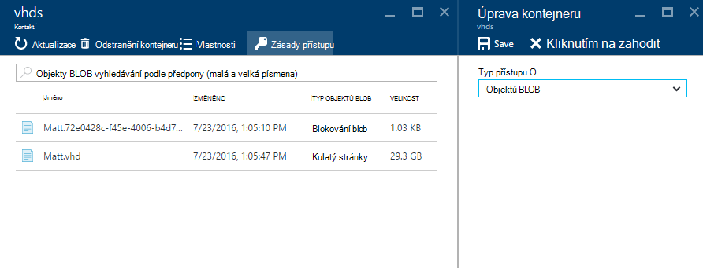

<properties
    pageTitle="Přidání obrázku OM do zásobníku Azure | Microsoft Azure"
    description="Přidání vaší organizace vlastní Windows nebo Linux OM obrázku pro klienty používat"
    services="azure-stack"
    documentationCenter=""
    authors="mattmcg"
    manager="darmour"
    editor=""/>

<tags
    ms.service="azure-stack"
    ms.workload="na"
    ms.tgt_pltfrm="na"
    ms.devlang="na"
    ms.topic="get-started-article"
    ms.date="09/26/2016"
    ms.author="mattmcg"/>

# <a name="make-a-custom-virtual-machine-image-available-in-azure-stack"></a>Zpřístupnění vlastních virtuálního počítače obrázek ve vrstvě Azure


Azure zásobníku umožňuje správcům zpřístupnit OM obrázky, například vlastní souboru jejich organizace svoje klienty. Obrázky můžete odkazováno správce prostředků Azure šablon nebo přidat k rozhraní Azure Marketplace s vystavením Marketplace položky. Obrázek Windows serveru 2012 R2 je standardně součástí Technical Preview Azure vrstvě.

> [AZURE.NOTE] Klepnutím na **Nový** v uživatelském rozhraní a výběrem kategorie **virtuálních počítačích** můžete nasadit OM obrázky s položkami Marketplace. Obrázek položky OM jsou uvedeny.


## <a name="add-a-vm-image-to-marketplace-with-powershell"></a>Přidání obrázku OM Marketplace pomocí prostředí PowerShell

Pokud obrázek OM virtuálního pevného disku je k dispozici místně na konzole OM (nebo jiné zařízení vnější spojení), použijte následující kroky:

1. Příprava Windows nebo Linux operační systém virtuální pevný disk obrázku ve formátu virtuálního pevného disku (ne VHDX).
    -   Pro obrázky s Windows v článku [Nahrát bitové OM Windows Azure správce prostředků nasazení](virtual-machines-windows-upload-image.md) pokyny obrázek Příprava v části **připravit virtuální pevný disk nahrávání** .
    -   Linux obrázky postupujte podle pokynů připravit obrázek nebo způsobem popsaným v článku [nasazení Linux virtuálních počítačích Azure zásobníku](azure-stack-linux.md)můžete použít existující obrázek Azure zásobníku Linux.

2. Klonovat [úložiště Azure zásobníku nástroje](https://aka.ms/azurestackaddvmimage)a pak je naimportujte modulu **ComputeAdmin**

    ```powershell
    Import-Module .\ComputeAdmin\AzureStack.ComputeAdmin.psm1
    ```

3. Přidejte obrázek OM vyvoláním rutinu VMImage přidat.
    -  Zahrnout Publisheru, nabídky, SKU a verze obrázku OM. Správce prostředků Azure šablony, které odkazují na obrázek OM používají tyto parametry.
    -  Zadejte osType jako Windows nebo Linux.
    -  Zahrnout svoje ID klienta služby Azure Active Directory ve formuláři * &lt;myaadtenant&gt;*. onmicrosoft.com.
    - Následuje příklad vyvolání skriptu:

    ```powershell
       Add-VMImage -publisher "Canonical" -offer "UbuntuServer" -sku "14.04.3-LTS" -version "1.0.0" -osType Linux -osDiskLocalPath 'C:\Users\AzureStackAdmin\Desktop\UbuntuServer.vhd' -tenantID <myaadtenant>.onmicrosoft.com
    ```

    > [AZURE.NOTE] Rutiny vyžaduje přihlašovací údaje pro přidání OM obrázek. Pověření správce služby Azure Active Directory, jako například serviceadmin@ * &lt;myaadtenant&gt;*. onmicrosoft.com do příkazového řádku.  

Příkaz dělá toto:
- Ověří prostředí Azure zásobníku
- Ukládání virtuální místní pevný disk na účet nově vytvořený dočasné úložiště
- Přidá OM obrázek do úložiště obrázek OM
- Vytvoří položku Marketplace

Potvrďte úspěšně spuštění příkazu Přejít na web Marketplace na portálu a ověřte, že je k dispozici v kategorii **virtuálních počítačích** OM obrázek.

> 

Následuje popis parametrů příkazu.


| Parametr | Popis |
|----------| ------------ |
|**tenantID** | Vaše ID klienta služby Azure Active Directory ve formuláři * &lt;AADTenantID*. onmicrosoft.com&gt;. |
|**aplikace Publisher** | V Publisheru název v segmentu OM obrázek, který klientů použít při nasazení obrázku. Příklad je "Microsoft". V tomto poli neobsahují mezery nebo jiné speciální znaky.|
|**nabídka** | Segmentu nabídka název OM obrázku, který klientů použít při nasazení OM obrázek. Příklad je "WindowsServer". V tomto poli neobsahují mezery nebo jiné speciální znaky. |
| **SKU** | Název segmentu SKU OM obrázku, který klientů použít při nasazení OM obrázek. Příklad je "Datacenter2016". V tomto poli neobsahují mezery nebo jiné speciální znaky. |
|**verze** | Verze OM obrázek, který klientů použít při nasazení OM obrázek. Tato verze není ve formátu * \#.\#. \#*. Příklad je "1.0.0". V tomto poli neobsahují mezery nebo jiné speciální znaky.|
| **osType** | OsType obrázek musí být "Windows" nebo "Linux". |
|**osDiskLocalPath** | Místní cestu s operačním systémem disk virtuálního pevného disku, který se odesílá jako obrázek OM do zásobníku Azure. |
|**dataDiskLocalPaths**| Volitelné matice místní cest disků dat, které je možné uložit jako součást OM obrázek.|
|**CreateGalleryItem**| Příznak typu Boolean, která určuje, zda chcete vytvořit položky ve Marketplace. Výchozí hodnota je nastavena na hodnotu true.|
|**Název**| Zobrazovaný název položky Marketplace. Výchozí hodnota je nastavená Publisheru – nabídka-Sku OM obrázku.|
|**Popis**| Označení položky Marketplace. |
|**osDiskBlobURI**| V případě potřeby tento skript také je možné zadat úložiště objektů Blob URI pro osDisk.|
|**dataDiskBlobURIs**| Tento skript volitelně zpracuje také maticových úložiště objektů Blob URI pro přidání dat disků na obrázek.|


## <a name="add-a-vm-image-through-the-portal"></a>Přidání obrázku OM prostřednictvím portálu

> [AZURE.NOTE] Tento postup vyžaduje vytváření Marketplace položky odděleně.

Jedním z požadavků obrázků je, že se mohou být tvořeny úložiště objektů Blob URI. Příprava Windows nebo Linux operační systém virtuální pevný disk obrázku ve formátu virtuálního pevného disku (ne VHDX) a pak nahrajte obrázek k účtu úložiště v Azure nebo ve vrstvě Azure. Pokud obrázek je už nahráli k úložišti objektů Blob Azure nebo zásobníku Azure, můžete tento krok přeskočit.

Postupujte podle pokynů v článku [Nahrát bitové OM Windows Azure správce prostředků nasazení](https://azure.microsoft.com/documentation/articles/virtual-machines-windows-upload-image/) kroky **Nahrát obrázek OM ke svému účtu úložiště**. Mějte na paměti toto:

-   Obrázek Linux postupujte podle pokynů k přípravě obrázek nebo způsobem popsaným v článku [nasazení Linux virtuálních počítačích Azure zásobníku](azure-stack-linux.md)můžete použít existující obrázek Azure zásobníku Linux.

- Je efektivnější nahrát obrázek k úložišti objektů Blob Azure zásobníku než k úložišti objektů Blob Azure, protože ho zkracuje posunout obrázek OM do zásobníku Azure obrázek úložiště. Při postupujte podle pokynů nahrát, zkontrolujte nahrazovat [Ověření prostředí PowerShell s Microsoft Azure zásobníku](azure-stack-deploy-template-powershell.md) krok v kroku "Přihlášení k Azure".

- Poznamenejte si úložiště objektů Blob URI kde nahrát obrázek. Je v tomto formátu: * &lt;storageAccount&gt;/&lt;blobContainer&gt;/&lt;targetVHDName&gt;*VHD

2.  Zpřístupnění objektů blob anonymně, přejděte do kontejneru úložiště objektů blob účtu místo, kam bylo nahrát obrázek OM virtuální pevný disk **objektů Blob** a potom vyberte **Zásady přístupu**. Pokud chcete, můžete místo toho generovat podpis sdílený přístup pro kontejner a vložit jako součást objektů blob URI.




1.  Přihlaste se k vrstvě Azure jako správce. Přejděte do **oblasti správy**. V části **RPs**, vyberte **Výpočet zprostředkovatele prostředků** > **OM obrázky** > **Přidat.**

    

2.  Na následující zásuvné zadejte Publisheru, nabídky, SKU a verzi OM obrázek. Výseče název v nápovědě k obrázku OM v správce prostředků Azure šablony. Ujistěte se, chcete-li vybrat **osType** správně. **OsDiskBlobURI**zadejte identifikátor URI místo, kam bylo nahrané obrázku v kroku 1. Klikněte na **vytvořit** začít vytvářet OM obrázek.

    

3.  Stav OM obrázek se změní na "Byl úspěšný" po úspěšném přidání obrázku.

4.  Klienti nástroje můžete nasazovat OM obrázek zadáním Publisheru, nabídky, SKU a verze obrázku OM v šabloně aplikace Správce prostředků Azure. Zpřístupnění obrázek OM snadněji pro klienta spotřebu v uživatelském rozhraní, je vhodné [vytvořit položku Marketplace](azure-stack-create-and-publish-marketplace-item.md).
