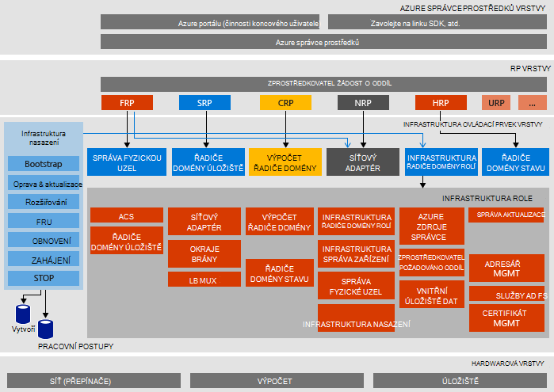

<properties
    pageTitle="Architektura Microsoft Azure zásobníku doklad o koncept (Koncepce) | Microsoft Azure"
    description="Zobrazení Microsoft Azure zásobníku Koncepce architektury."
    services="azure-stack"
    documentationCenter=""
    authors="heathl17"
    manager="byronr"
    editor=""/>

<tags
    ms.service="azure-stack"
    ms.workload="na"
    ms.tgt_pltfrm="na"
    ms.devlang="na"
    ms.topic="article"
    ms.date="10/25/2016"
    ms.author="helaw"/>

# Microsoft Azure zásobníku Koncepce architektura

Koncepce zásobníku Azure je jedna uzel nasazení 2 Technical Preview Azure vrstvě. Všechny komponenty nainstalovaných na virtuálních počítačích spuštěné v počítači jednoho hostitele. 

## Diagram logické architektury
Následující obrázek znázorňuje logické architektura Koncepce zásobníku Azure a jejich součástí.

## Role virtuálního počítače
Koncepce zásobníku Azure nabízí služby pomocí následující VMs na hostiteli Koncepce:

 - **MAS ACS01** Virtuální počítač hostitelské služby Azure zásobníku úložiště.

 - **MAS ADFS01** Virtuální počítač hostingu Active Directory Federation Services.  Tento virtuální počítač nepoužívá Technical Preview 2.  

 - **MAS ASQL01**  Virtuální počítač poskytovat interní data obsahují pro role infrastruktury Azure vrstvě.  

 - **MAS BGPNAT01** Virtuální počítač budou sloužit jako směrovači okraje a poskytuje možnosti překladu síťových adres a VPN pro Azure vrstvě.

 - **MAS CA01** Virtuální počítač poskytující certifikační autorita služba služby Azure zásobníku role.

 - **MAS CON01** Virtuální počítač dostupné pro vývojáře pro instalaci Powershellu, Visual Studiu a další nástroje.

 - **MAS DC01** Virtuální počítač hostitelské služby Active Directory, DNS a DHCP pro Microsoft Azure vrstvě.

 - **MAS GWY01** Virtuální počítač poskytující okraj brány služeb, jako je na webu pomocí sítě VPN sítích klienta.

 - **MAS NC01**  Virtuální počítač hostingu síťový adaptér, která spravuje síťové služby Azure vrstvě.  

 - **MAS SLB01**  Virtuální počítač obsahuje Vyrovnávání zatížení služby Azure zásobníku pro klienty a infrastruktury služby Azure vrstvě.  

 - **MAS SUS01**  Virtuální strojních hostitelské služby aktualizace Windows Server a poskytuje aktualizace k jiné vrstvě Azure virtuálních počítačích.

 - **MAS WAS01**  Virtuální počítač hostingu portálem a služby Azure správce prostředků.

 - **MAS XRP01** Virtuální počítače hostujícího poskytovatelů zdroje core Microsoft Azure zásobníku, včetně zdroje poskytovatelů výpočetním, sítě a úložiště.

## Služba úložiště
Úložiště služby v operačním systému fyzické hostitelem patří:

 - **Kulatý ACS služby** Azure konzistentní úložiště objektů Blob služba, která poskytuje služby úložiště objektů blob a tabulky.

 - **SoFS** Škálování souborový Server.

 - **Odkazy CSV** Pružné soubor systému sdílených hlasitost.

 - **Virtuální Disk** **Prostor úložiště**a **Úložiště mezery přímé** jsou odpovídajících úložiště technologii v systému Windows Server povolit zprostředkovatele Microsoft Azure zásobníku základní úložiště prostředků.

## Další kroky

[Nasazení Azure zásobníku](azure-stack-deploy.md)

[První scénářů k akci](azure-stack-first-scenarios.md)

