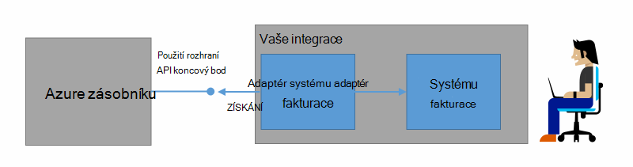

<properties
    pageTitle="Fakturace zákazníka a zpětné v Azure zásobníku | Microsoft Azure"
    description="Zjistěte, jak získat informace o použití zdroji z Azure zásobníku."
    services="azure-stack"
    documentationCenter=""
    authors="AlfredoPizzirani"
    manager="byronr"
    editor=""/>

<tags
    ms.service="azure-stack"
    ms.workload="na"
    ms.tgt_pltfrm="na"
    ms.devlang="na"
    ms.topic="article"
    ms.date="10/18/2016"
    ms.author="alfredop"/>

# Fakturace se zákazníky a zpětné ve vrstvě Azure

Teď, když používáte zásobníku Azure, je vhodné přemýšlet o tom, jak sledovat použití. Poskytovatelé závisí na informace o použití k fakturování zákazníkům a pochopit náklady poskytování služby.
Podniky příliš, obvykle sledovat použití oddělení.

Azure zásobníku není fakturační systému. Neúčtuje klienti pro prostředky, které používají. Ale, Azure zásobníku infrastruktury můžete shromažďovat a agregovat použití zásad správy informací pro každého jednoho zdroje poskytovatele. Můžete přístupu k těmto datům a export fakturační systému pomocí fakturační adaptér nebo exportovat do nástroje business intelligence, jako je Microsoft Power BI.

## Jaké informace o použití můžete najít a jak?

Azure poskytovatelů zdroje zásobníku generovat použití záznamů v hodinách intervalech. Záznamy zobrazuje množství jednotlivé zdroje, který byl spotřebované množství a spotřebované množství které předplatné zdroje. Tato data uložena. Přístup k datům prostřednictvím rozhraní REST API.

Správce služby můžete získat data použití u všech předplatných klienta. Jednotlivé klienti načítat své vlastní informace.

Použití záznamy obsahují informace o ukládání, sítě a použití výpočetních. Seznam metry najdete v tématu [tohoto článku](azure-stack-usage-related-faq.md).

## Získat informace o použití

Pro vytvoření záznamů, je důležité mít zdroje spuštěná a aktivně v systému. Pokud si nejste jistí, jestli máte zdroje spuštění, v Azure Marketplace zásobníku nasazení a potom spusťte virtuálního počítače (OM). Pohled na OM sledování zásuvné k Ujistěte se, zda je spuštěný.

Doporučujeme spouštět rutiny prostředí Windows PowerShell zobrazíte použití zásad správy informací.
Prostředí PowerShell hovorů rozhraní API používání zdrojů.

1.  [Instalace a konfigurace prostředí PowerShell Azure](https://azure.microsoft.com/en-us/documentation/articles/powershell-install-configure/).

2.  Přihlaste se na správce prostředků Azure, pomocí rutiny prostředí PowerShell **AzureRmAccount přihlášení**.

3.  Vyberte předplatné, které jste použili k vytvoření materiály, zadejte **Get-AzureRmSubscription – SubscriptionName "sub" | Vyberte AzureRmSubscription**.

4.  K načtení dat, získáte pomocí rutiny Powershellu [**Get-UsageAggregates**](https://msdn.microsoft.com/en-us/library/mt619285.aspx).
    Pokud použití zásad správy informací k dispozici, bude vrácena v prostředí PowerShell, jako v následujícím příkladu. Prostředí PowerShell vrátí 1 000 řádků využití za volání.
    Argument *pokračování* slouží k načtení sady řádků za první 1 000. Další informace o použití zásad správy informací najdete v článku [Přehled zdrojů použití rozhraní API aplikace](azure-stack-provider-resource-api.md).

    

## Další kroky

[Používání zdrojů poskytovatelem rozhraní API](azure-stack-provider-resource-api.md)

[Klient využití prostředků rozhraní API](azure-stack-tenant-resource-usage-api.md)

[Nejčastější dotazy týkající se použití](azure-stack-usage-related-faq.md)
