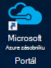
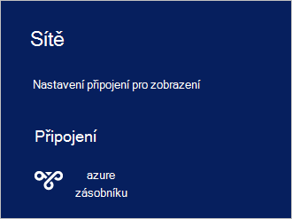

<properties
    pageTitle="Připojení k Azure zásobníku | Microsoft Azure"
    description="Zjistěte, jak připojit Azure zásobníku"
    services="azure-stack"
    documentationCenter=""
    authors="ErikjeMS"
    manager="byronr"
    editor=""/>

<tags
    ms.service="azure-stack"
    ms.workload="na"
    ms.tgt_pltfrm="na"
    ms.devlang="na"
    ms.topic="get-started-article"
    ms.date="10/18/2016"
    ms.author="erikje"/>

# <a name="connect-to-azure-stack"></a>Připojení k Azure zásobníku
Ke správě zdrojů, musí připojit k počítači Koncepce zásobníku Azure. Můžete použít jednu z následujících možností připojení:

 - Vzdálená plocha: umožňuje jednoho uživatele souběžné rychle připojení z počítače Koncepce.
 - Virtuální privátní sítě (VPN): umožňuje více souběžné připojení klientů mimo infrastruktury Azure zásobníku (vyžaduje konfiguraci).

## <a name="connect-with-remote-desktop"></a>Připojit se ke vzdálené ploše
Připojení ke vzdálené ploše jednoho uživatele souběžné pracovat pomocí portálu pro přidávání a používání zdrojů. Můžete taky pomocí nástrojů v počítači virtuální MAS CON01.

1.  Přihlaste se k počítači fyzické Koncepce zásobníku Azure.

2.  Otevřete připojení ke vzdálené ploše a připojte k MAS CON01. Zadejte **AzureStack\AzureStackAdmin** uživatelské jméno a heslo pro správu, které jste použili při instalaci Azure vrstvě.  

3.  Na ploše MAS CON01 otevřete poklepáním na **Microsoft Azure zásobníku Portal** ikonu (https://portal.azurestack.local/) na [portálu](azure-stack-key-features.md#portal).

    

4.  Přihlaste se pomocí služby Azure Active Directory přihlašovací údaje zadané při instalaci.

## <a name="connect-with-vpn"></a>Připojení pomocí virtuální privátní sítě
Připojení k virtuální privátní síť, aby několik uživatelů souběžné připojení klientů mimo infrastruktury Azure vrstvě. Pomocí portálu pro správu resoures. Nástroje, například Visual Studia a Powershellu, můžete taky na místního klienta.

1.  Instalace modulu AzureRM pomocí tento příkaz:
   
    ```PowerShell
    Install-Module -Name AzureRm -RequiredVersion 1.2.6 -Scope CurrentUser
    ```   
   
2. Stáhněte si nástroje zásobníku Azure skriptů.  Podporu souborů se dají stáhnout buď procházení do [úložiště GitHub](https://github.com/Azure/AzureStack-Tools)nebo spuštěním následujícího skriptu prostředí Windows PowerShell jako správce:
    
    >[AZURE.NOTE]  Následující postup vyžaduje 5.0 Powershellu.  Zkontrolujte verzi, spusťte $PSVersionTable.PSVersion a porovnání "Hlavní" verze.  

    ```PowerShell
       
       #Download the tools archive
       invoke-webrequest https://github.com/Azure/AzureStack-Tools/archive/master.zip -OutFile master.zip

       #Expand the downloaded files. 
       expand-archive master.zip -DestinationPath . -Force

       #Change to the tools directory
       cd AzureStack-Tools-master
    ````

3.  Ve stejné relaci Powershellu přejděte do složky, **připojení** a import modulu AzureStack.Connect.psm1:

    ```PowerShell
    cd Connect
    import-module .\AzureStack.Connect.psm1
    ```

4.  Pokud chcete vytvořit připojení VPN zásobníku Azure, spusťte následující prostředí Windows PowerShell. Před spuštěním, naplnění heslo správce a pole adresy hostitele Azure vrstvě. 
    
    ```PowerShell
    #Change the IP Address below to match your Azure Stack host
    $hostIP = "<HostIP>"

    # Change password below to reference the password provided for administrator during Azure Stack installation
    $Password = ConvertTo-SecureString "<Admin Password>" -AsPlainText -Force

    # Add Azure Stack One Node host & CA to the trusted hosts on your client computer
    Set-Item wsman:\localhost\Client\TrustedHosts -Value $hostIP -Concatenate
    Set-Item wsman:\localhost\Client\TrustedHosts -Value mas-ca01.azurestack.local -Concatenate  

    # Update Azure Stack host address to be the IP Address of the Azure Stack POC Host
    $natIp = Get-AzureStackNatServerAddress -HostComputer $hostIP -Password $Password

    # Create VPN connection entry for the current user
    Add-AzureStackVpnConnection -ServerAddress $natIp -Password $Password

    # Connect to the Azure Stack instance. This command (or the GUI steps in step 5) can be used to reconnect
    Connect-AzureStackVpn -Password $Password 
    ```

5. Po zobrazení výzvy zabezpečení hostiteli Azure vrstvě.

6. Po zobrazení výzvy, nainstalujte certifikát (řádku se zobrazí okno relace Powershellu).

7. Testování portálu připojení v prohlížeči Internet, přejděte na *https://portal.azurestack.local*.

8. Kontrola a Správa připojení k vrstvě Azure, můžete **sítí** v klientovi:

    

>[AZURE.NOTE] Toto připojení VPN neposkytuje připojení k VMs nebo jiných zdrojů. Další informace o připojení k materiály najdete v článku [Jedno připojení VPN uzel](azure-stack-create-vpn-connection-one-node-tp2.md)


## <a name="next-steps"></a>Další kroky
[První kroky](azure-stack-first-scenarios.md)

[Instalace a připojit pomocí prostředí PowerShell](azure-stack-connect-powershell.md)

[Instalace a spojit se s rozhraní příkazového řádku](azure-stack-connect-cli.md)


