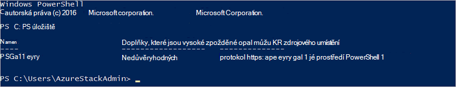

<properties
    pageTitle="Připojení k Azure zásobníku pomocí prostředí PowerShell | Microsoft Azure"
    description="Naučte se spravovat zásobníku Azure pomocí prostředí PowerShell"
    services="azure-stack"
    documentationCenter=""
    authors="HeathL17"
    manager="byronr"
    editor=""/>

<tags
    ms.service="azure-stack"
    ms.workload="na"
    ms.tgt_pltfrm="na"
    ms.devlang="na"
    ms.topic="article"
    ms.date="10/19/2016"
    ms.author="helaw"/>

# Instalace prostředí PowerShell a připojit k vrstvě Azure
V této příručce projdeme kroky pro připojení k vrstvě Azure pomocí prostředí PowerShell. Po dokončení těchto kroků můžete také vám usnadní správu a nasazení zdroje.

## Instalace rutin prostředí PowerShell zásobníku Azure

1.  AzureRM rutin nainstalovaných v galerii Powershellu. Chcete-li začít, spusťte konzolu prostředí PowerShell na MAS CON01 a spusťte tento příkaz vrátí seznam prostředí PowerShell úložištích k dispozici:

        Get-PSRepository

      

2.  Spusťte tento příkaz nainstalovat modul AzureRM:

        Install-Module -Name AzureRM -RequiredVersion 1.2.6 -Scope CurrentUser

    >[AZURE.NOTE] *-Obor CurrentUser* je nepovinný krok. Pokud chcete mít přístup k moduly více než aktuálního uživatele, pomocí příkazovém řádku a vynechat parametr *obor* .

3.  Potvrďte instalaci modulů AzureRM proveďte následující příkazy:

        Get-Command -Module AzureRM.AzureStackAdmin

## Připojení k Azure zásobníku
Modul je k dispozici ke stažení, která zajišťuje konfigurace prostředí PowerShell připojení k vrstvě Azure za vás.  Navštivte [Azure zásobníku nástroje](http://aka.ms/ConnectToAzureStackPS) pro modul a další kroky. 

## Načtení seznamu předplatných
V této části ověřte, jestli jsou spuštěné rutiny prostředí PowerShell proti Azure zásobníku načítání a výběrem předplatné pro použití.

Spusťte tento příkaz načtěte seznam předplatných Azure zásobníku přidruženého k vašemu účtu:

    Get-AzureRmSubscription

## Další kroky
[Nasazení šablony pomocí prostředí PowerShell](azure-stack-deploy-template-powershell.md)

[Spojení s Azure rozhraní příkazového řádku](azure-stack-connect-cli.md)

[Nasazení šablon aplikace Visual Studio](azure-stack-deploy-template-visual-studio.md)

