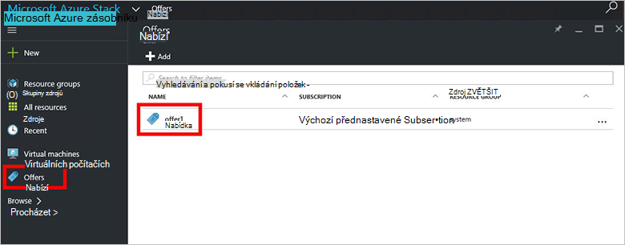

<properties
    pageTitle="Vytvoření nabídky v Azure zásobníku | Microsoft Azure"
    description="Jako správce služby Naučte se vytvářet nabídky pro klienty ve vrstvě Azure."
    services="azure-stack"
    documentationCenter=""
    authors="ErikjeMS"
    manager="byronr"
    editor=""/>

<tags
    ms.service="azure-stack"
    ms.workload="na"
    ms.tgt_pltfrm="na"
    ms.devlang="na"
    ms.topic="get-started-article"
    ms.date="09/26/2016"
    ms.author="erikje"/>

# Vytvoření nabídky ve vrstvě Azure

[Nabízí](azure-stack-key-features.md#services-plans-offers-and-subscriptions) jsou skupiny jeden nebo více plánů, které vedou k poskytovatelů k tenantům k nákupu nebo přihlášení k odběru. V tomto dokumentu se dozvíte, jak vytvořit nabídky, která obsahuje požadovaný [plán, který jste vytvořili](azure-stack-create-plan.md) v posledním kroku. Tuto nabídku umožňuje účastníkům zřízení virtuálních počítačích.

1.  [Přihlaste se](azure-stack-connect-azure-stack.md#log-in-as-a-service-administrator) k portálu jako správce služby a potom klikněte na **Nový** > **klienta nabízí + plány** > **nabízejí**.
    

2.  V zásuvné **Nové nabízejí** zadejte **Zobrazované jméno** a **Název zdroje**a vyberte nové nebo existující **Pole Skupina zdroje**. Zobrazované jméno je nabídky popisný název. Název zdroje můžete zobrazit jenom správce. Je název, který správce použít pro práci s nabídkou jako zdroj správce prostředků Azure.

    

3.  Klikněte na **základní plány jednotného zasílání zpráv** , v zásuvné **plán** vyberte plán, který chcete zahrnout do nabídky a pak klikněte na **Výběr**. Kliknutím na **vytvořit** vytvoříte nabídky.

    
    
4. Klikněte na **nabízí** a potom klikněte na nabídku, který jste právě vytvořili.

    

5.  Klepněte na tlačítko **Změnit stav**a potom klikněte na **veřejné**.
  
    

Nabídky třeba zveřejnit pro klienty získat úplné zobrazení při přihlášení k odběru. Může být nabídky:

- **Veřejné**: viditelné k tenantům.

- **Soukromé**: viditelné pouze pro správce služby. Užitečné při navrhování plánu nebo nabídky, nebo pokud správce služby chce schválit každého předplatného.

- **Vyřazeno z provozu**: uzavřen do nových zákazníků. Můžete použít Správce služby odebraným zabránit další předplatná, ale nechat Aktuální předplatitelé beze změny.

Změny nabídky se okamžitě viditelné klienta. Pokud chcete zobrazit změny, budete muset odhlásit a přihlaste se k najdete v článku nové předplatné v okně "předplatné pro výběr" při vytváření zdroje/skupiny zdrojů.

## Další kroky

[Přihlášení k odběru nabídky a pak zřízení virtuálního počítače](azure-stack-subscribe-plan-provision-vm.md)
