<properties
    pageTitle="Vytvoření plánu ve vrstvě Azure | Microsoft Azure"
    description="Jako správce služby vytvořte plán, který umožňuje účastníkům poskytování virtuálních počítačích."
    services="azure-stack"
    documentationCenter=""
    authors="ErikjeMS"
    manager="byronr"
    editor=""/>

<tags
    ms.service="azure-stack"
    ms.workload="na"
    ms.tgt_pltfrm="na"
    ms.devlang="na"
    ms.topic="get-started-article"
    ms.date="09/26/2016"
    ms.author="erikje"/>

# Vytvoření plánu ve vrstvě Azure

[Plány jednotného zasílání zpráv](azure-stack-key-features.md#services-plans-offers-and-subscriptions) jsou seskupení jedné nebo víc služeb. Jako poskytovatele služby můžete vytvořit plán nabízet k vaší tenantům. Zároveň vaší klienti se přihlásit k odběru nabídky používat plánech a službách, které obsahují. Tento příklad ukazuje, jak vytvořit plán, který obsahuje výpočetním, sítě a úložiště zdroje poskytovatelů. Tento plán umožňuje účastníkům zřízení virtuálních počítačích.

1.  V prohlížeči internet přejděte na https://portal.azurestack.local.

2.  [Přihlaste se](azure-stack-connect-azure-stack.md#log-in-as-a-service-administrator) k portálu Azure zásobníku jako správce služby a zadejte přihlašovací údaje Správce služby (účet, který jste vytvořili v kroku 5 části [Spustit skript Powershellu](azure-stack-run-powershell-script.md) ) a potom klikněte na **přihlásit**.

    Správci služeb můžete vytvořit nabídky a plány a Správa uživatelů.

3.  Pokud chcete vytvořit plán a nabídku, která klientů můžete se přihlásit k odběru, klikněte na **Nový** > **klienta nabízí + plány** > **plán**.

    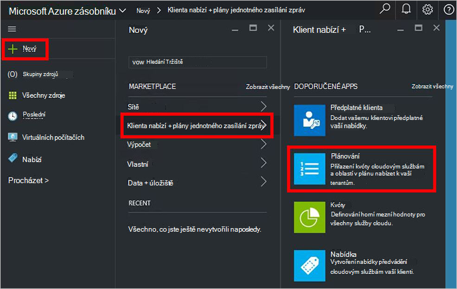

4.  V zásuvné **Nový plán** zadejte **Zobrazované jméno** a **Název zdroje**. Zobrazované jméno je plánu popisný název, který najdete v článku klienti. Název zdroje můžete zobrazit jenom správce. Je název, který správce použít pro práci s plánem jako zdroj správce prostředků Azure.

    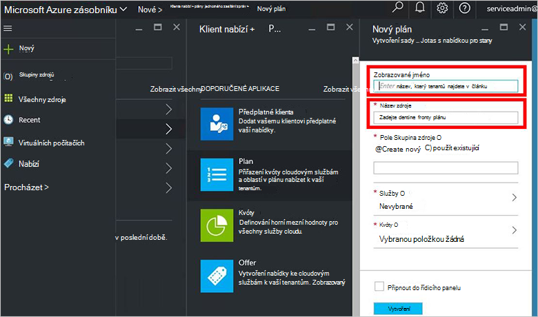

5.  Vytvoření nové **Skupiny prostředků**nebo vyberte stávající jako kontejner pro plánování (například "OffersAndPlans")

    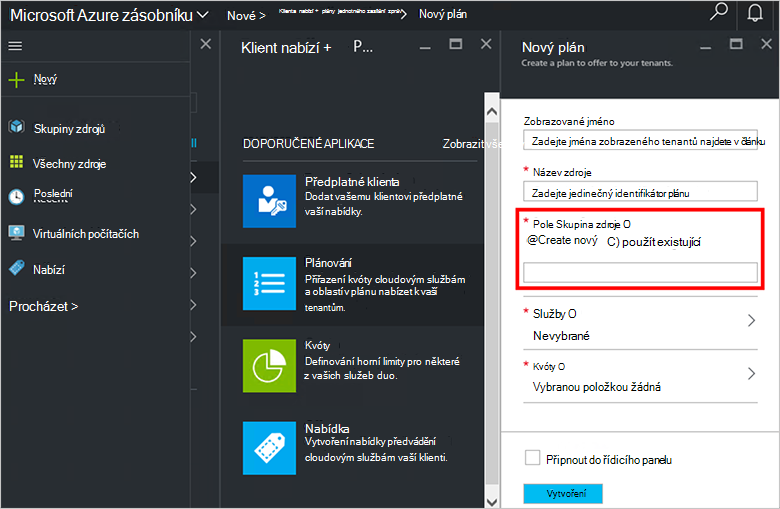

6.  Klikněte na **služby**, vyberte **Microsoft.Compute**, **Microsoft.Network**a **Microsoft.Storage**a potom klikněte na **Výběr**.

    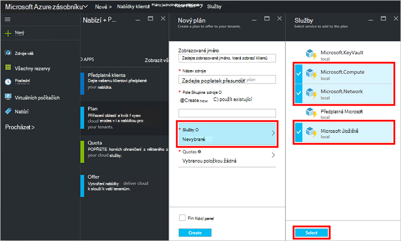

7.  Klikněte na **kvóty**, **Microsoft.Storage (místní)**, klikněte na a potom vyberte výchozí kvóta nebo klikněte na **vytvořit novou kvótu** přizpůsobení kvóty.

    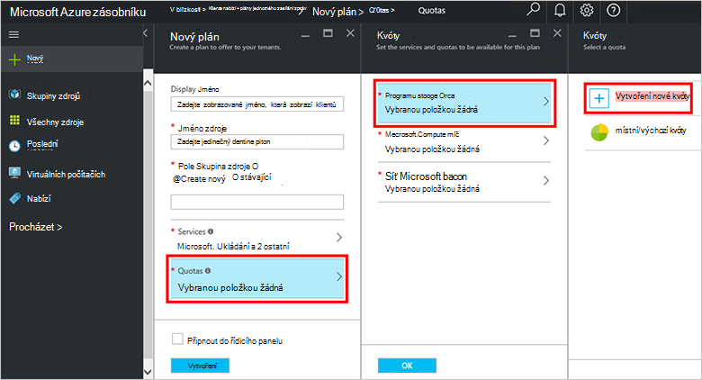

8.  Zadejte název kvóty, klikněte na **Nastavení kvóty**, nastavit kvótu hodnoty a klikněte na tlačítko **OK**a pak klikněte na **vytvořit**.

    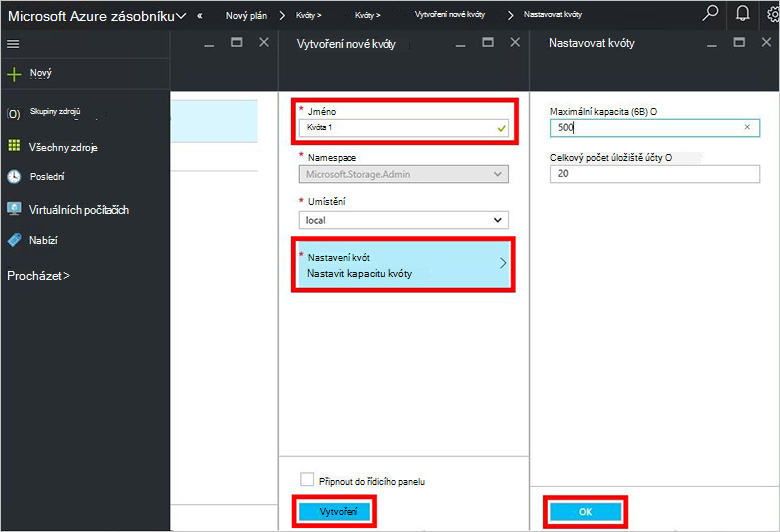

9. Klikněte na **Microsoft.Network (místní)**a potom vyberte výchozí kvóta nebo klikněte na **vytvořit novou kvótu** přizpůsobení kvóty.

    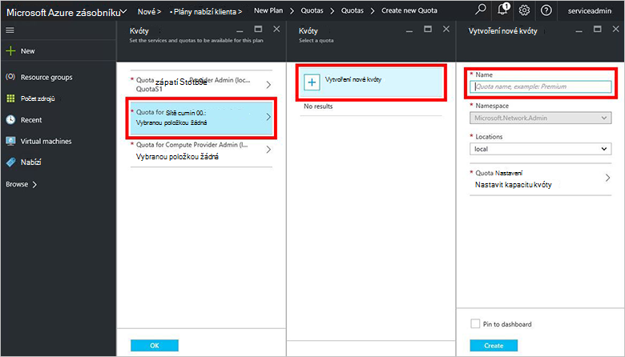

10. Zadejte název kvóty, klikněte na **Nastavení kvóty**, nastavit kvótu hodnoty a klikněte na tlačítko **OK**a pak klikněte na **vytvořit**.

    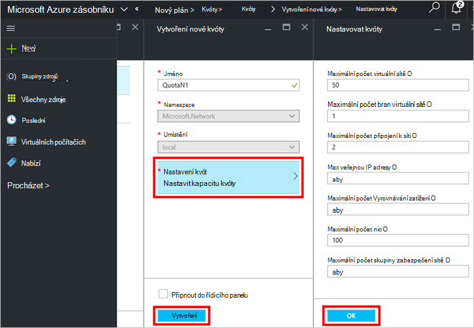

11. Klikněte na **Microsoft.Compute (místní)**a potom vyberte výchozí kvóta nebo klikněte na **vytvořit novou kvótu** přizpůsobení kvóty.

    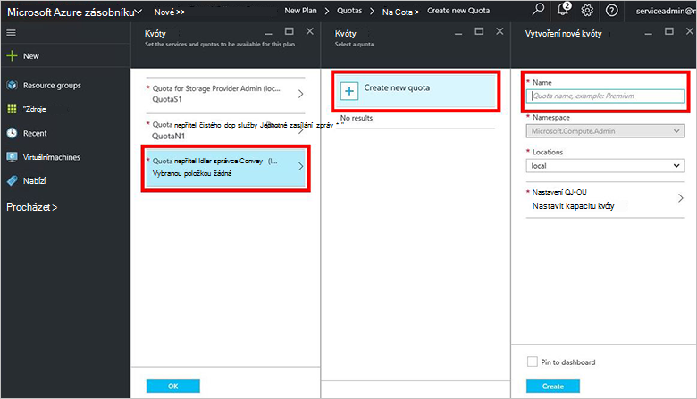

12.  Zadejte název kvóty, klikněte na **Nastavení kvóty**, nastavit kvótu hodnoty a klikněte na tlačítko **OK**a pak klikněte na **vytvořit**.

    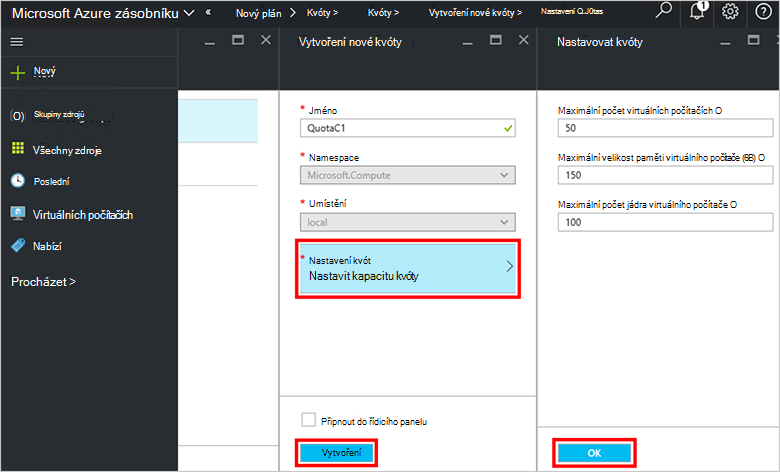

13. V zásuvné **kvóty** klikněte na tlačítko **OK**a na **Nový plán** zásuvné kliknutím na **vytvořit** vytvoříte plánu.

    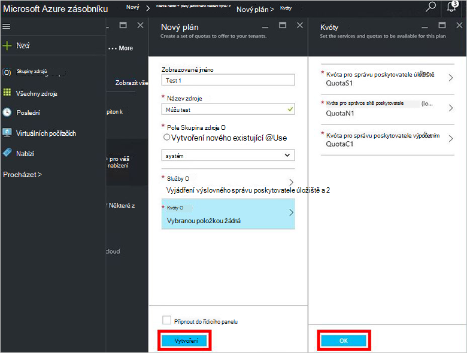

14. Pokud chcete zobrazit svůj nový plán, klikněte na **všechny zdroje**a pak hledat plán a klikněte na jeho název.

    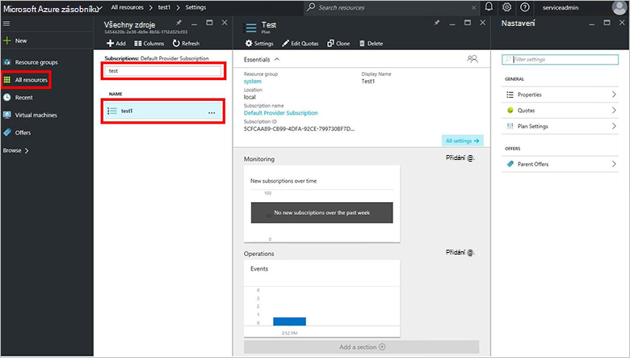

## Další kroky

[Vytvoření nabídky](azure-stack-create-offer.md)
