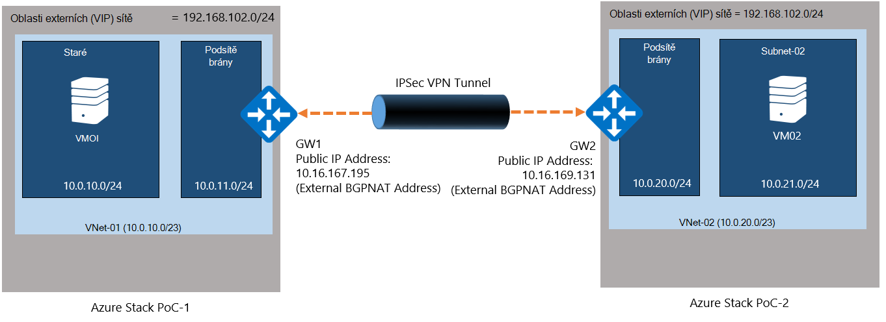
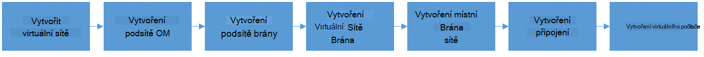
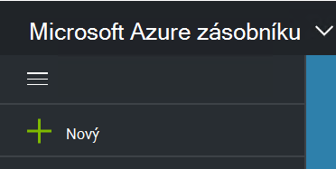
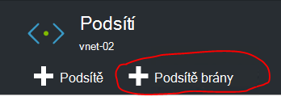
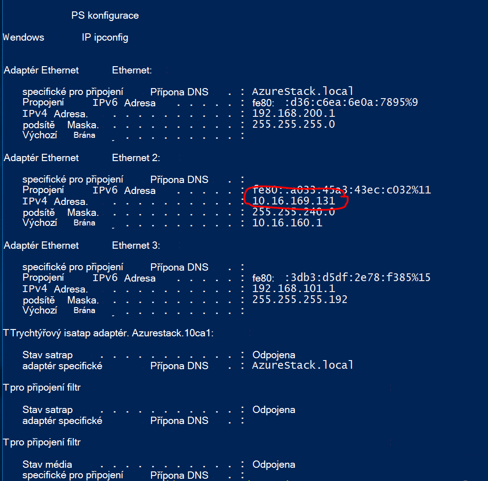
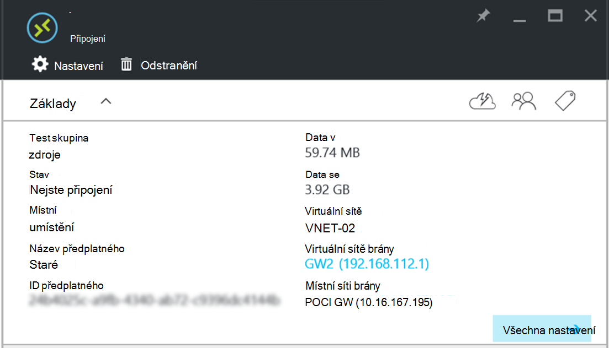

<properties
    pageTitle="Vytvoření připojení k webu VPN mezi dvěma virtuální sítěmi v různých prostředích koncepce zásobníku Azure | Microsoft Azure"
    description="Podrobný postup, který vám umožní správce cloudu vytvořit připojení VPN k webu mezi dvěma prostředími Koncepce jeden uzel v TP2."
    services="azure-stack"
    documentationCenter=""
    authors="ScottNapolitan"
    manager="darmour"
    editor=""/>

<tags
    ms.service="azure-stack"
    ms.workload="na"
    ms.tgt_pltfrm="na"
    ms.devlang="na"
    ms.topic="get-started-article"
    ms.date="09/26/2016"
    ms.author="scottnap"/>

# Vytvoření připojení k webu VPN mezi dvěma virtuální sítěmi v různých prostředích koncepce zásobníku Azure

## Základní informace

Tento článek vás provede kroky k vytvoření připojení VPN k webu mezi dvěma virtuální sítěmi v každém z obou samostatných Azure zásobníku doklad koncepce (Koncepce) prostředí. Má to účel usnadnit lidmi, kteří jsou vyhodnocení webu webu bran pochopit, jak nastavit připojení VPN mezi virtuálních sítí ve dvou různých nasazení Azure vrstvě.  Při tom získá pochopení fungování sítě VPN bran ve vrstvě Azure.

>[AZURE.NOTE] V tomto dokumentu se týká konkrétně Koncepce TP2 Azure vrstvě.

### Diagram připojení

Toto je diagram zobrazující naše konfigurace by měl vypadat takto při jsme hotovi.

### Než začnete

Konfigurace, je potřeba k provedení následujících položek, ujistěte se, že máte tyto věci než začnete.

-   Dva servery splňující požadavky na hardware Azure zásobníku Koncepce definované [Azure zásobníku nasazení požadavky](azure-stack-deploy.md)a další požadavky definované tak, že tento dokument.

-   Balíček pro nasazení Technical Preview 2 Azure vrstvě.

## Nasazení Koncepce prostředí

Budete nasazovat každém z obou Azure zásobníku Koncepce prostředí pro dokončení této konfiguraci.

-   Pro každý Koncepce, které nasadit můžete jednoduše postupujte podle pokynů nasazení uvedených v článku [Nasazení Koncepce Azure vrstvě](azure-stack-run-powershell-script.md).
    Jsme bude odkazovat každé Koncepce prostředí v tomto dokumentu obecně i POC1 POC2.

## Konfigurace kvóty pro využití, sítě a úložiště

Potřebujete ke konfiguraci kvóty pro využití, sítě a úložiště tak, aby tyto služby mohou být přidružené k plánu a potom nabídky, která klientů můžete se přihlásit k odběru.

>[AZURE.NOTE] Musíte udělat tyto kroky pro každé Azure zásobníku Koncepce prostředí.

Možnosti vytvořit kvóty pro služby změnil z TP1. Postup pro vytvoření kvóty v TP2 najdete na <http://aka.ms/mas-create-quotas>. Můžete chvíli přijmout výchozí hodnoty pro všechna nastavení kvóty pro toto cvičení.

## Vytvoření plánu a nabídky

[Plány jednotného zasílání zpráv](azure-stack-key-features.md) jsou seskupení jedné nebo víc služeb. Jako poskytovatele služby můžete vytvořit plán nabízet k vaší tenantům. Zároveň vaší klienti se přihlásit k odběru nabídky používat plánech a službách, které obsahují.

>[AZURE.NOTE] Musíte se k provedení těchto kroků pro každé Azure zásobníku Koncepce prostředí.

1.  Nejdřív vytvořte plán. K tomuto účelu můžete postupujte podle pokynů v článku online [Vytvořit plán](azure-stack-create-plan.md) .

2.  Vytvoření nabídky kroků popsaných v tématu [Vytvoření nabídky v Azure vrstvě](azure-stack-create-offer.md).

3.  Přihlaste se k portálu jako správce klienta a [přihlášení k odběru nabídky jste vytvořili] (azure zásobníku-přihlášení k odběru – plán poskytování vm.md.

## Vytvoření zdrojů sítě v Koncepce 1

Teď bude ve skutečnosti vytvořit prostředky, které potřebujeme nastavovaná naše konfiguraci. Následující kroky popisují, co jsme budete způsobem. Tyto pokyny vám s ukázkou vytvoření zdrojů prostřednictvím portálu, ale totéž lze provést pomocí prostředí PowerShell.

### Přihlaste se jako klienta

Správce služby můžou přihlásit jako klienta otestovat, plány, nabídky a předplatných, která může používat jejich klienti. Pokud ještě nemáte jeden [Vytvoření účtu klienta](azure-stack-add-new-user-aad.md) než přihlášení.

### Vytvořit virtuální sítě & podsítě OM

1.  Přihlaste se pomocí účtu klienta.

2.  Na portálu Azure klikněte na ikonu **Nový** .

     
3.  Vyberte nabídku Marketplace **sítě** .

4.  Klikněte na položku **virtuální sítě** v nabídce.

5.  Klikněte na tlačítko **vytvořit** v dolní části zásuvné popis zdroje. Zadejte následující hodnoty do příslušných polí podle předpisů rozhraní v této tabulce.

  	| **Pole**             | **Hodnota** |
  	|----------------------- | ------ |
  	| Jméno                  |vnet 01 |
  	| Adresní prostor         | 10.0.10.0/23 |
  	| Podsítě název           | podsítě 01 |
  	| Rozsah adres podsítí  | 10.0.10.0/24 |

6.  Měli byste vidět předplatné jste vytvořili dříve zadané v poli **předplatného** .

7.  Pole Skupina zdroje vytvoření nové skupiny prostředků nebo pokud ještě nemáte, vyberte možnost použít existující.

8.  Zkontrolujte výchozí umístění.

9.  Klikněte na tlačítko **vytvořit** .

### Vytvoření podsítě brány

1.  Otevřete zdroj sítě virtuální jste právě vytvořili (Vnet 01) na řídicím panelu.

2.  Na zásuvné nastavení vyberte podsítí

3.  Klikněte na tlačítko **Brány podsítě** brány podsítě přidáte virtuální sítě.

     
4.  Název podsítě nastavenou **GatewaySubnet** ve výchozím nastavení.
    Brána podsítí jsou jinak a musí být tento konkrétní název, abychom fungovat správně.

5.  Do pole **adresa oblast** zadejte **10.0.11.0/24**.

6.  Klikněte na tlačítko **vytvořit** vytvořte bránu podsítě.

### Vytvoření brány virtuální sítě

1.  Na portálu Azure klikněte na ikonu **Nový** .

    

2.  Vyberte nabídku Marketplace **sítě** .

3.  **Virtuální sítě bránu** vyberte ze seznamu síťových prostředků.

4.  Zkontrolujte popis a klikněte na **vytvořit**.

5.  Do pole **název** zadejte **GW1**.

6.  Klikněte na položku **virtuální sítě** pro výběr virtuální sítě.
    Vyberte **Vnet 01** ze seznamu.

7.  Klikněte na položku **veřejnou IP adresu** . Až se otevře zásuvné zvolit veřejnou IP adresa klikněte na tlačítko Vytvořit nový.

8.  Do pole **název** zadejte **GW1 PiP** a klikněte na **Ok.**

9.  **Typ brány** by měla být **VPN** vybrané ve výchozím nastavení. Nechte toto nastavení.

10. **Typ VPN** by měla být **na základě směrování** vybrané ve výchozím nastavení.
    Nechte toto nastavení.

11. Ověřte správnost **předplatné** a **umístění** . Pokud chcete můžete připnout zdroje na řídicí panel. Klikněte na **vytvořit**.

### Vytvoření brány pro místní síti

Jak je v našem případě trochu neznáte je zdroj místní brána sítě.
Stejný zdroj, které můžete najít v Azure, což je však v Azure má obvykle mysleli představující fyzickou místním zařízením použijete připojení k bráně virtuální sítě v Azure. V našem příkladu jsou obou koncích připojení skutečně virtuální sítě bran!

Způsob, jak myslete to více obecně je vždy je zdroj místní brána sítě mysleli označíte vzdálené brány na druhou stranu připojení. Z důvodu způsobu navržený Koncepce skutečně potřebujeme zadání adresy externí síťový adaptér na OM překladu síťových adres ostatních Koncepce jako veřejnou IP adresu místní brána sítě. Potom vytvoříme překladu síťových adres mapování na OM překladu síťových adres, abyste měli jistotu, že obou koncích připojeni správně.

### Získání IP adresu externí adaptér OM překladu síťových adres

1.  Přihlaste se k počítači fyzické Azure zásobníku pro POC2.

2.  [Klávesy Windows] + R otevřete nabídku **Spustit** a zadejte **mstsc** a stiskněte enter.

3.  V poli **počítač** zadejte název **MAS BGPNAT01** a klikněte na tlačítko **Připojit** .

4.  Klepněte na tlačítko Start a klikněte pravým tlačítkem myši na prostředí PowerShell a vyberte **Spustit jako správce**.

5.  Typ **IPConfig/všechny**.

6.  Najděte adaptér Ethernet, který je připojen k síti na pracovišti a poznamenejte si adresu IPv4 vázaný na tento adaptér. V mém prostředí se **10.16.167.195** ale vám bude něco jiného.

7.  Záznam tuto adresu. Toto je co použijeme jako veřejnou IP adresu zdroje místní síti brány, který jsme vytvořili v POC1.

### Vytvoření zdroje brány místní síti

1.  Přihlaste se k počítači fyzickou Azure zásobníku pro POC1.

2.  V poli **počítač** zadejte název **MAS CON01** a klikněte na tlačítko **Připojit** .

3.  Na portálu Azure klikněte na ikonu **Nový** .

    

4.  Vyberte nabídku Marketplace **sítě** .

5.  Vyberte **místní síti brány** na seznam zdrojů.

6.  Do pole **název** zadejte **POC2 GW**.

7.  Není víme IP adresu naše brány dosud, ale je dobře proto, že nám můžete vrátit a změnit později. Nyní zadejte do **pole IP adresa** **10.16.167.195** .

8.  V poli **Adresní prostor** zadejte adresní prostor Vnet, který jsme bude vytvářet v POC2. To bude **10.0.20.0/23** takže zadejte daná hodnota.

9.  Zkontrolujte, že vaše **předplatné**, **Skupina zdroje** a **umístění** všechny správné klikněte na **vytvořit**.

### Vytvoření připojení

1.  Na portálu Azure klikněte na ikonu **Nový** .

     

2.  Vyberte nabídku Marketplace **sítě** .

3.  **Připojení** vyberte ze seznamu zdrojů.

4.  V **základní** zásuvné nastavení jako **Typ připojení**zvolte **Web (IPSec)** .

5.  Vyberte **předplatné**, **Skupina zdroje** a **umístění** a klikněte na **Ok**.

6.  V **Nastavení** zásuvné zvolte **Virtuální sítě brány** (**GW1**) jste dříve vytvořili.

7.  Klikněte **místní** **Síti brány** (**POC2 GW**) jste dříve vytvořili.

8.  Do pole **Název připojení** zadejte **POC1 POC2**.

9.  V poli **Sdílené klíč (PSK)** zadejte **12345**. Klikněte na **Ok**.

### Vytvoření virtuálního počítače

Chcete-li ověření dat cestování přes připojení VPN, musíte VMs odesílat a přijímat dat v každé Koncepce. Vytvořme virtuálního počítače v POC1 teď a umístění na naše OM podsítě v naší virtuální sítě.

1. Na portálu Azure klikněte na ikonu  **Nový** .

     

2.  V nabídce Marketplace vyberte **virtuálních počítačích** .

3.  V seznamu virtuálního počítače obrázků vyberte obrázek **Windows serveru 2012 R2 Datacentra** .

4.  Na zásuvné **Základy** do pole **název** zadejte hodnotu **VM01**.

5.  Zadejte platný uživatelské jméno a heslo. Použijete tento účet pro přihlášení k OM po jeho vytvoření.

6.  Zadejte **předplatného**, **Skupina zdroje** a **umístění** a potom klikněte na **Ok**.

7.  Na zásuvné **velikost** zvolte velikost OM pro tuto instanci a potom na tlačítko **Vybrat**.

8.  Na zásuvné nastavení přijměte výchozí nastavení, můžete jenom zkontrolujte, že virtuální sítě vybrané je **VNET 01** a podsítě je nastavený na **10.0.10.0/24**. Klikněte na **Ok**.

9.  Zkontrolujte nastavení na zásuvné **souhrnné informace** a klikněte na **Ok**.

## Vytvoření zdrojů sítě v Koncepce 2

### Přihlaste se jako klienta

Správce služby můžou přihlásit jako klienta otestovat, plány, nabídky a předplatných, která může používat jejich klienti. Pokud ještě nemáte jeden [Vytvoření účtu klienta](azure-stack-add-new-user-aad.md) než přihlášení.

### Vytvořit virtuální sítě & podsítě OM

1. Přihlaste se pomocí účtu klienta.

2. Na portálu Azure klikněte na ikonu  **Nový** .

     

3.  Vyberte nabídku Marketplace **sítě** .

4.  Klikněte na položku **virtuální sítě** v nabídce.

5.  Klikněte na tlačítko **vytvořit** v dolní části zásuvné popis zdroje. Zadejte následující hodnoty u odpovídajících polí uvedené v následující tabulce.

  	|**Pole**              |**Hodnota** |
  	| ----------------------|----------|
  	| Jméno                  | vnet 02 |
  	| Adresní prostor         | 10.0.20.0/23 |
  	| Podsítě název           | podsítě 02 |
  	| Rozsah adres podsítí  | 10.0.20.0/24 |

6.  Měli byste vidět předplatné jste vytvořili dříve zadané v poli **předplatného** .

7.  Pole Skupina zdroje vytvoření nové skupiny prostředků nebo pokud ještě nemáte, vyberte možnost použít existující.

8.  Zkontrolujte výchozí **umístění**. Pokud chcete, můžete připnout virtuální sítě pro řídicí panel pro usnadnění přístupu.

9.  Klikněte na tlačítko **vytvořit** .

### Vytvoření podsítě brány

1.  Otevřete prostředku sítě virtuální vytvořeného (**Vnet 02**) na řídicím panelu.

2.  Na zásuvné **Nastavení** vyberte **podsítí.**

3.  Klikněte na tlačítko **Brány podsítě** brány podsítě přidáte virtuální sítě.

     

4.  Název podsítě nastavenou **GatewaySubnet** ve výchozím nastavení.
    Brána podsítí jsou jinak a musí být tento konkrétní název, abychom fungovat správně.

5.  Do pole **adresa oblast** zadejte **10.0.20.0/24**.

6.  Klikněte na tlačítko **vytvořit** vytvořte bránu podsítě.

### Vytvoření brány virtuální sítě

1. Na portálu Azure klikněte na ikonu  **Nový** .

     

2.  Vyberte nabídku Marketplace **sítě** .

3.  **Virtuální sítě bránu** vyberte ze seznamu síťových prostředků.

4.  Zkontrolujte popis a klikněte na **vytvořit**.

5.  Do pole **název** zadejte **GW2**.

6.  Klikněte na položku **virtuální sítě** pro výběr virtuální sítě.
    Vyberte **Vnet 02** ze seznamu.

7.  Klikněte na položku **veřejnou IP adresu** . Až se otevře zásuvné zvolit veřejnou IP adresa klikněte na tlačítko Vytvořit nový.

8.  Do pole **název** zadejte **GW2 PiP** a klikněte na **Ok.**

9.  **Typ brány** by měla být **VPN** vybrané ve výchozím nastavení. Nechte toto nastavení.

10. **Typ VPN** by měla být **na základě směrování** vybrané ve výchozím nastavení.
    Nechte toto nastavení.

11. Ověřte správnost **předplatné** a **umístění** . Pokud chcete můžete připnout zdroje na řídicí panel. Klikněte na **vytvořit**.

### Vytvoření brány pro místní síti

#### Získání IP adresu externí adaptér OM překladu síťových adres

1.  Přihlaste se k počítači fyzickou Azure zásobníku pro POC1.

2.  Stiskněte a podržte [klávesa Windows] + R otevřete nabídku **Spustit** a zadejte **mstsc** a stiskněte enter.

3.  V poli **počítač** zadejte název **MAS BGPNAT01** a klikněte na tlačítko **Připojit** .

4.  Klikněte v nabídce Start klikněte pravým tlačítkem myši na prostředí PowerShell a vyberte **Spustit jako správce**.

5.  Typ **IPConfig/všechny**.

6.  Najděte adaptér Ethernet, který je připojen k síti na pracovišti a poznamenejte si adresu IPv4 vázaný na tento adaptér. V mém prostředí se **10.16.169.131** ale vám bude něco jiného.

7.  Záznam tuto adresu. Toto je co později použijeme jako veřejnou IP adresu zdroje místní síti brány, který jsme vytvořili v POC1.

#### Vytvoření zdroje brány místní síti

1.  Přihlaste se k počítači fyzický Azure zásobníku pro POC2.

2.  V poli **počítač** zadejte název **MAS CON01** a klikněte na tlačítko **Připojit** .

3. Na portálu Azure klikněte na ikonu **Nový** .

     

4.  Vyberte nabídku Marketplace **sítě** .

5.  Vyberte **místní síti brány** na seznam zdrojů.

6.  Do pole **název** zadejte **POC1 GW**.

7.  Teď potřebujeme veřejnou IP adresu jsme zaznamenané brány sítě virtuální v POC1. Do **pole IP adresa**zadejte **10.16.169.131** .

8.  V poli **Adresní prostor** zadejte adresní prostor **Vnet 01** z POC1 - **10.0.0.0/16**.

9.  Zkontrolujte, že vaše **předplatné**, **Skupina zdroje** a **umístění** všechny správné klikněte na **vytvořit**.

## Vytvoření připojení

1. Na portálu Azure klikněte na ikonu  **Nový** .

     

2.  Vyberte nabídku Marketplace **sítě** .

3.  **Připojení** vyberte ze seznamu zdrojů.

4.  V **základní** zásuvné nastavení jako **Typ připojení**zvolte **Web (IPSec)** .

5.  Vyberte **předplatné**, **Skupina zdroje** a **umístění** a klikněte na **Ok**.

6.  V **Nastavení** zásuvné zvolte **Virtuální sítě brány** (**GW1**) jste dříve vytvořili.

7.  Klikněte **místní** **Síti brány** (**POC1 GW**) jste dříve vytvořili.

8.  Do pole **Název připojení** zadejte **POC2 POC1**.

9.  V poli **Sdílené klíč (PSK)** zadejte **12345**. Pokud vyberete jinou hodnotu, mějte na paměti, že se musí shodovat hodnotu pro sdílený klíč přiřazený v POC1. Klikněte na **Ok**.

## Vytvoření virtuálního počítače

Vytvoření virtuálního počítače v POC1 teď a umístí jej na naše OM podsítě v naší síti virtuální.

1.  Na portálu Azure klikněte na ikonu **Nový** .

     

2.  V nabídce Marketplace vyberte **virtuálních počítačích** .

3.  V seznamu virtuálního počítače obrázků vyberte obrázek **Windows serveru 2012 R2 Datacentra** .

4.  Na zásuvné **Základy** do pole **název** zadejte hodnotu **VM02**.

5.  Zadejte platný uživatelské jméno a heslo. Použijete tento účet pro přihlášení k OM po jeho vytvoření.

6.  Zadejte **předplatného**, **Skupina zdroje** a **umístění** a potom klikněte na **Ok**.

7.  Na zásuvné **velikost** zvolte velikost OM pro tuto instanci a potom na tlačítko **Vybrat**.

8.  Na zásuvné nastavení přijměte výchozí nastavení, můžete jenom zkontrolujte, že virtuální sítě vybrané je **VNET 02** a podsítě je nastavený na **20.0.0.0/24**. Klikněte na **Ok**.

9.  Zkontrolujte nastavení na zásuvné **souhrnné informace** a klikněte na **Ok**.

## Konfigurace OM překladu síťových adres v jednotlivých Koncepce pro přecházení brány

Vzhledem k tomu Koncepce byl samostatné a ze sítě dnem hostiteli fyzické nasazené izolovaný, "Externí" VIP sítě, ke které brány připojeni k není ve skutečnosti externí, ale místo toho skryté za směrovačem způsobem překládání adres (NAT). Je skutečně systému Windows Server virtuálního počítače (**MAS BGPNAT01**) aplikaci infrastruktury Koncepce roli směrování a vzdálený přístup služby (). Potřebujeme pro konfiguraci překladu síťových adres OM MAS BGPNAT01 povolit připojení VPN k webu pro připojení na obou koncích.

>[AZURE.NOTE] Toto nastavení je potřebný pro Koncepce prostředích.

### Konfigurace překladu síťových adres

Budete muset tyto kroky v každém z obou Koncepce prostředí.

1.  Přihlaste se k počítači fyzickou Azure zásobníku pro POC1.

2.  Stiskněte a podržte [klávesa Windows] + R otevřete nabídku **Spustit** a zadejte **mstsc** a stiskněte enter.

3.  V poli **počítač** zadejte název **MAS BGPNAT01** a klikněte na tlačítko **Připojit** .

4.  Klikněte v nabídce Start klikněte pravým tlačítkem myši na prostředí PowerShell a vyberte **Spustit jako správce**.

5.  Typ **IPConfig/všechny**.

6.  Najděte adaptér Ethernet, který je připojen k síti na pracovišti a poznamenejte si adresu IPv4 vázaný na tento adaptér. V mém prostředí je **10.16.169.131** (kruhu červeně níže), ale váš bude něco jiného.

     

7.  Zadejte tento příkaz prostředí PowerShell jmenovat externí adresy překladu síťových adres pro porty IKE ověřování. Upozorňujeme, že přejdete na IP adresu ten, který odpovídá prostředí.

        Add-NetNatExternalAddress -NatName BGPNAT -IPAddress 10.16.169.131 PortStart 499 -PortEnd 501

8. Dále vytvoříme statické mapování překladu síťových adres namapujte externí adresy na veřejnou IP adresu brány mapovat ISAKMP port 500 pro FÁZI 1 tunelem IPSEC.

        Add-NetNatStaticMapping -NatName BGPNAT -Protocol UDP -ExternalIPAddress 10.16.169.131 -InternalIPAddress 192.168.102.1 -ExternalPort 500 -InternalPort 500

9.  Nakonec jsme potřeba udělat přecházení překladu síťových adres, který používá port 4500 úspěšně vytvořit dokončení tunelem IPEC přes překladu síťových adres zařízení.

         Add-NetNatStaticMapping -NatName BGPNAT -Protocol UDP -ExternalIPAddress 10.16.169.131 -InternalIPAddress 192.168.102.1 -ExternalPort 4500 -InternalPort 4500

10.  Opakujte kroky 1 – 9 POC2.

## Test připojení

Teď vytvořeno připojení k webu, že abychom měli ověřit, zda bude provoz v přes něj. Tento úkol je jednoduchý jako právě zahrnuje přihlášení do jedné ze VMs jsme vytvořili v prostředí Koncepce a použití příkazu ping OM jsme vytvořili v jiném prostředí. Abyste měli jistotu, že jsme jsou uvedení přenos přes připojení k webu, chceme, abyste měli jistotu, jsme ping adresu přímé IP (DIP) OM vzdálené podsítě není VIP. K tomuto účelu bude potřeba zjistit adresu na druhou stranu naše připojení.

### Přihlaste se k tenantovi OM v POC1

1.  Přihlášení k počítači fyzické Azure zásobníku pro POC1 a přihlaste se na portál pomocí účtu klienta.

3.  Klikněte na **virtuálních počítačích** ikonu v levém navigačním panelu.

4.  Najděte **VM01** , který jste vytvořili dříve v seznamu VMs a klikněte na ni.

5. Na zásuvné virtuálního počítače klikněte na **Připojit**.

     

6.  Otevřete okno příkazového řádku z do OM a začnete psát **IPConfig/všechny**.

7.  Zjištění **Adresy IPv4** do výstupu a poznamenejte si ho. Toto je adresa, kterou budou ping z POC2. V tomto prostředí **10.0.10.4**je adresa, ale ve vašem prostředí může být různé. Ale musí spadat pod podsítě **10.0.10.0/24** , která byla dříve vytvořena.

### Přihlaste se k tenantovi OM v POC2

1.  Přihlášení k počítači fyzické Azure zásobníku pro POC2 a přihlášení na portál pomocí účtu klienta.

3.  Klikněte na **virtuálních počítačích** ikonu v levém navigačním panelu.

4.  Najděte **VM02** , který jste vytvořili dříve v seznamu VMs a klikněte na ni.

5.  Na zásuvné virtuálního počítače klikněte na **Připojit**.

     

6.  Otevřete okno příkazového řádku z do OM a začnete psát **IPConfig/všechny**.

7.  Adresy IPv4, která spadají do 10.0.20.0/24 byste měli vidět. V mém laboratorní 10.0.20.4 je adresa, ale váš se můžou lišit.

8.  Teď z OM v POC2 chceme ping OM v POC1, tunelem. Můžete to udělat jsme příkazu ping DIP, který jsme zaznamenali z VM01
    V mém laboratoři jedná 10.0.10.4, ale nezapomeňte otestujte příkazem ping adresu, kterou jste našli ve vaší laboratoři. Měli byste vidět výsledek, který bude vypadat takto.

     

9.  Odpovědi ze vzdáleného OM označuje úspěšné test! Můžete zavřít okno OM připojení nebo, pokud chcete, zkuste některé další přenosy dat na test připojení (jako kopii souboru).

### Statistiky pomocí připojení brány přenosu zobrazení dat

Pokud budete chtít zjistit množství zpracovávaných dat je procházející připojení k webu, tyto informace jsou k dispozici v zásuvné připojení. Tento test, je taky jiné spolehlivých způsobů, jak ověřit, že ping, kterou jste odeslali skutečně prošla připojení VPN.

1.  Přihlaste se stále na **ClientVM** POC2, přihlaste se k **Portálu Microsoft Azure zásobníku Koncepce** pomocí svého účtu klienta.

2.  Klikněte na položku **Procházet** a vyberte **připojení**.

3.  Klikněte na požadované připojení **POC2 POC1** v seznamu.

4.  Na zásuvné připojení můžete zobrazit statistiku Data a Data se. Na následujícím obrázku vidíte že by některá čísla větší než jenom ping počítat. Je proto, že jsme udělali My i některé přenos souborů. Měli byste vidět některé nenulového hodnot.

     
