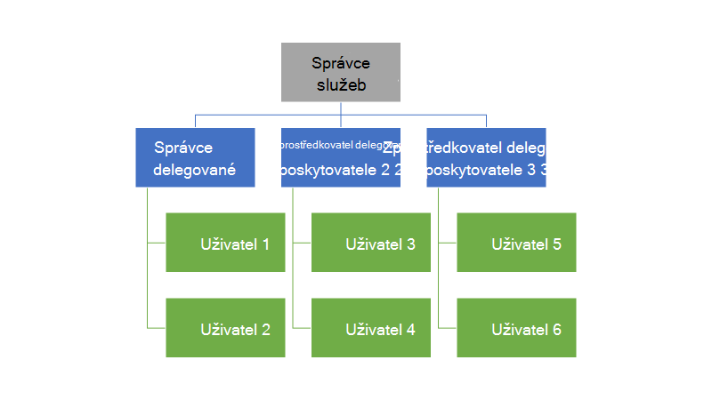
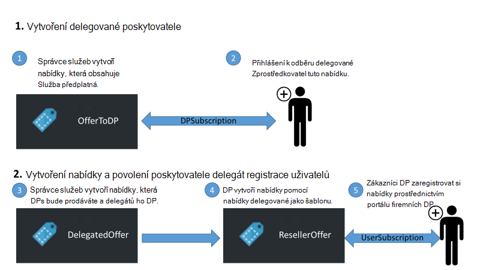
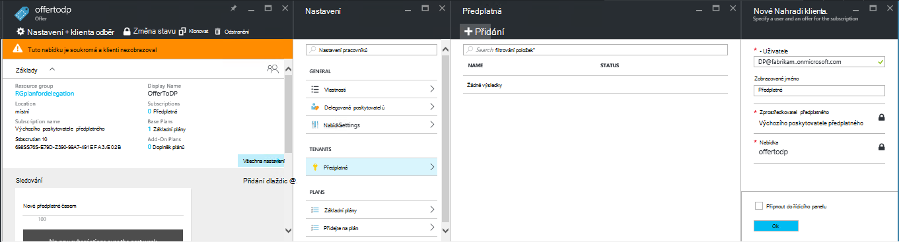
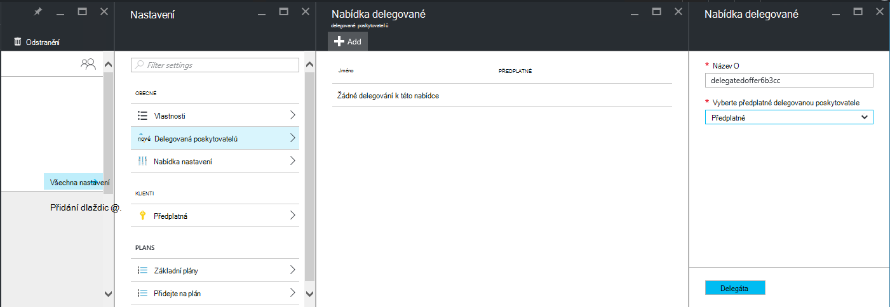
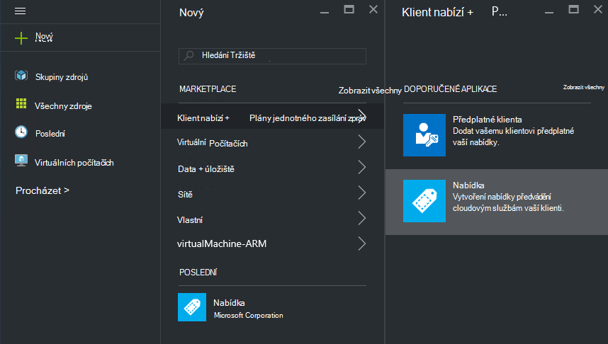
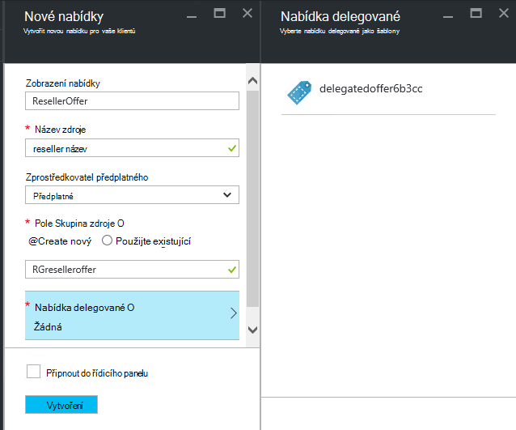
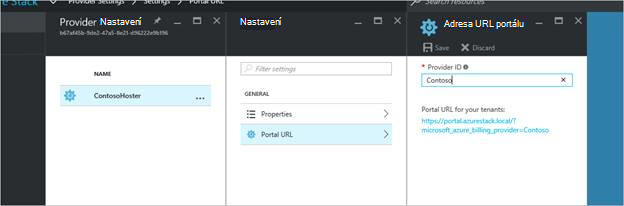
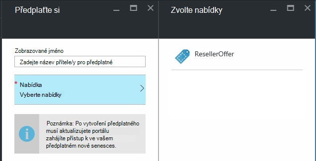

<properties
    pageTitle="Právo k delegačnímu nabízí ve vrstvě Azure | Microsoft Azure"
    description="Zjistěte, jak chcete dát ostatním zodpovědní za vytvoření nabídek a přihlašování uživatelů za vás."
    services="azure-stack"
    documentationCenter=""
    authors="AlfredoPizzirani"
    manager="byronr"
    editor=""/>

<tags
    ms.service="azure-stack"
    ms.workload="na"
    ms.tgt_pltfrm="na"
    ms.devlang="na"
    ms.topic="article"
    ms.date="10/07/2016"
    ms.author="alfredop"/>

#Právo k delegačnímu nabízí ve vrstvě Azure

Jako správce služby často chcete umístit ostatní zodpovědní za vytvoření nabídek a přihlašování uživatelů za vás. Například to může dojít, pokud je u poskytovatele a chcete prodejců zaregistrovat zákazníky a spravovat vaším jménem. Může se taky stát v podniku pokud jsou součástí centrální skupinou IT a chcete divize nebo pobočky zaregistrovat uživatelé bez zásahu uživatele.

Delegování pomáhá tyto úkoly, pomůže vám s dosáhla a spravovat více uživatelů, než byste mohli dělat přímo. Následující obrázek znázorňuje jednu úroveň delegování, ale Azure zásobníku podporuje několik úrovní. Delegovaná zprostředkovatelé můžete delegovat zase na jiných poskytovatelů, až pět úrovní.

Správci můžete udělit oprávnění vytvářet nabídky a klienti přiřazovat dalším uživatelům pomocí funkce delegování.

##Role a kroků v tématu delegování

Abyste pochopili delegování, mějte na paměti, která existují tři role souvisejících:

-   **Správce služby** spravuje infrastruktury zásobníku Azure, vytvoří šablonu nabídky a ostatní nabízet svým uživatelům delegátů.

-   Delegovaná uživatelů se označují jako **delegované poskytovatelů**. Můžete patří k jiným organizacím (například jiné Azure Active Directory klienti).

-   **Uživatelé** si zaregistrovali pro nabídky a jejich použití pro správu jejich pracovního vytížení, vytváření VMs, uchovávání dat, atd.

Jak je znázorněno na následujícím obrázku, existují dva kroky při nastavování delegování.

1.  Určení delegovanou poskytovatelů. Postup je se přihlásíte k odběru nabídky podle plánu, který obsahuje pouze službu předplatná.
    Uživatelé, kteří si pořídí předplatné tuto nabídku získat některé funkce má správce služby, včetně možnost rozšíření nabídky a přihlášení uživatele k používání je.

2.  Delegujte nabídky na delegovanou poskytovatele. Tuto nabídku funguje jako šablonu pro co můžou nabízet delegovanou poskytovatele. Delegovaná poskytovatele je teď možné provést nabídky, zvolte pro něj název (ale ne je měnit jeho služba a kvóty) a nabídkou pro zákazníky.

Sloužit jako delegované poskytovatelů, uživatelé potřebují Vytvořme relaci s hlavním poskytovatele; jinými slovy budou muset vytvořit předplatné. V tomto scénáři identifikuje toto předplatné delegovanou poskytovatelů jako právo prezentovat nabídky jménem hlavního poskytovatele.

Jakmile je vytvořeno této relaci, správce systému delegovat nabídky na delegovanou poskytovatele. Delegovaná poskytovatele je teď možné provést nabídky, ji přejmenovat (ale ne je měnit její obsah) a nabízejí svým zákazníkům.

Stanovit zprostředkovatele delegovanou delegáta nabídky a ověřte, zda uživatelé můžou zaregistrovat si ho, plnit pokyny v následujících částech.

##Nastavení role

Pokud chcete zobrazit delegované poskytovatele v práci, musíte další účty služby Azure Active Directory kromě svého účtu správce služby. Pokud je nemáte, vytvořte dva účty. Účty můžete patří do libovolné AAD klienta. K nim jsme se označují jako delegované poskytovatele (DP) a uživatele.

| **Role** | **Organizační práv** |
| -------------------- | ----------------------- |
|  Delegovaná poskytovatele | Uživatel |
| Uživatel | Uživatel |

##Určení delegované poskytovatelů

1.  Přihlaste se jako správce služby.

2.  Vytvoření nabídky, která vám umožní klienti osvobozením od delegované poskytovatelů. Při této akci musí vytvořit plán a nabídky podle:

    na.  [Vytvořit plán](azure-stack-create-plan.md).
        Tento plán by měl obsahovat pouze službu předplatná. V tomto článku používáme plán s názvem PlanForDelegation.

    b.  [Vytvoření nabídky](azure-stack-create-offer.md) 
     podle tohoto plánu. V tomto článku používáme nabídky s názvem OfferToDP.

    c.  Po dokončení vytvoření nabídky přidáte ID uživatele delegované poskytovatele jako ke klientovi pro tuto nabídku kliknutím     **předplatná** &gt; **Přidat** &gt; **Nové předplatné klienta**.

  

> [AZURE.NOTE]Všechny Azure zásobníku nabídky, máte možnost nabídky uživatelé veřejné a nechat zaregistrovat, nebo uchovávání soukromé a Správce služby Správa přihlašování. Delegovaná poskytovatelů jsou obvykle malou skupinou a chcete určit, kdo je nedostanou povolení připojit, takže uchovávání tuto nabídku soukromé bude dávat smysl ve většině případů.

##Vytvoří nabídky delegované Správce služeb

Teď jste vytvořili poskytovatele delegované. Dalším krokem je vytvoření plánu a nabídky, která se chystáte delegáta, a které vaši zákazníci budou používat. Měli byste tuto nabídku přesně podle vašich představ zákazníků, kteří mají vidět, protože delegovanou poskytovatel nebude možné změnit kvóty, který obsahuje i plány.

1.  Jako správce služby [Vytvořit plán](azure-stack-create-plan.md) a [nabídky](azure-stack-create-offer.md) založené na něj. V tomto článku používáme nabídky s názvem DelegatedOffer.
> [AZURE.NOTE]Tuto nabídku nemusí být nastavená jako veřejná. To může být nastavená jako veřejná Pokud se rozhodnete, ale, ve většině případů chcete jenom delegované poskytovatelů mít taky přístup k němu. Jakmile nabídky k soukromé delegáta, jak je uvedeno v následujících krocích, delegované poskytovatele bude mít přístup k němu.

2.  Delegování nabídky. Přejděte na DelegatedOffer a v podokně nastavení, klikněte na **Delegované zprostředkovatelé** &gt; **Přidat**.

3.  Vyberte předplatné delegovanou poskytovatele z rozevíracího seznamu a klikněte na **delegáta**.

> 

##Delegovaná poskytovatele upravila nabídky

Přihlaste se jako delegovanou poskytovatele a vytvořte novou nabídku pomocí nabídky delegované jako šablonu.

1.  Klikněte na **Nový** &gt; **klienta nabízí + plány jednotného zasílání zpráv** &gt; **nabízejí**.

    

2.  Přiřazení názvu nabídky. Tady doporučujeme zvolit ResellerOffer. Vyberte nabídku delegované založit na a potom klikněte na **vytvořit**.
    
    

    >[AZURE.NOTE] Poznámka: rozdíl v porovnání s nabízejí vytvoření jako zkušených správcem služeb. Delegovaná poskytovatele není vytvářet nabídky z základní a doplněk plány; Anna si jenom vybrat ze nabídek, které mají oprávnění k ní a nebude měnit je.

3. Zveřejnění nabídka po kliknutí na **Procházet** &gt; **nabízí**, výběrem nabídky a kliknutím na **Změnu stavu**.

4. Delegovanou zprostředkovatel poskytuje tyto nabídky prostřednictvím portálu svůj vlastní adresu URL. Všimněte si, že jsou viditelné jenom přes tento delegované portál. Vyhledejte a změňte tato adresa URL:

    na.  Klikněte na tlačítko **Procházet** &gt; **nastavení poskytovatele** &gt; **URL portálu**.

    b.  Pokud budete chtít změňte ID zprostředkovatele.

    c.  Zkopírujte portálu adresu URL do samostatných umístění, například programu Poznámkový blok.

    
<!-- -->
Teď jste dokončili vytvoření nabídky k delegované jako poskytovatele služby delegované. Odhlásit se jako delegované poskytovatele. Zavřete kartu prohlížeče, které jste pracovali.

##Registrace k nabídky

1.  V novém okně prohlížeče, přejděte na portál delegované URL jste si uložili v předchozím kroku. Přihlaste se k portálu jako uživatele. Poznámka: pro tento krok musíte používat portál delegované. Nabídku delegované nezobrazí jinak.

2.  Na řídicím panelu klikněte na **získat předplatné**. Uvidíte, že jenom delegovanou nabídky vytvořeného delegovaného poskytovatele jsou poskytovány pro uživatele:

> 

Tímto dokončíte proces delegování nabídky. Uživatele můžete nyní zaregistrovat k této nabídce získáním předplatné pro něj.

##Delegování více vrstvy

Delegování více osy umožňuje delegovanou poskytovatele delegovat nabídky na jiné entity. Díky tomu, například vystavením hlubší reseller kanály, ve kterých poskytovatele správy Azure zásobníku delegátů nabídky na distributor, kdo zase delegátů prodejce.
Azure zásobníku podporuje až na pět kroků delegování.

Pokud chcete vytvořit více úrovní delegování nabídky, delegované poskytovatele zase deleguje nabídky další poskytovatele. Proces je stejný pro delegovanou poskytovatele bylo pro správce služby (viz [vytvoří nabídky delegované Správce služeb](#service-admin-creates-the-delegated-offer)).

##Další kroky
[Zřízení virtuálního počítače](azure-stack-provision-vm.md)
