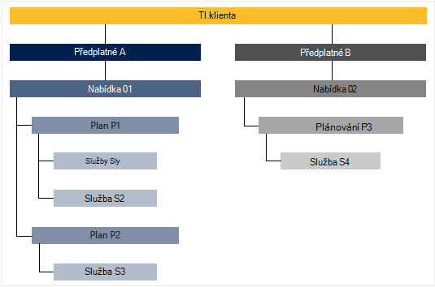

<properties
    pageTitle="Klíčové funkce a koncepty ve vrstvě Azure | Microsoft Azure"
    description="Informace o klíčové funkce a koncepty ve vrstvě Azure."
    services="azure-stack"
    documentationCenter=""
    authors="Heathl17"
    manager="byronr"
    editor=""/>

<tags
    ms.service="azure-stack"
    ms.workload="na"
    ms.tgt_pltfrm="na"
    ms.devlang="na"
    ms.topic="article"
    ms.date="10/25/2016"
    ms.author="helaw"/>

# Klíčové funkce a pojmy ve vrstvě Azure

Pokud jste ještě moc nedělali Microsoft Azure zásobníku tyto podmínky a popisy funkcí může být užitečné.

## Osoby

Existuje dvou variantách uživatele pro Microsoft Azure zásobníku, Správce služeb a klientovi (zákazník).

-  **Správce služby** můžete konfigurovat a spravovat zdroje poskytovatelů, nabízí klienta, plány, služby, kvót a ceny.
-  Ke **klientovi** získá (nebo nákupy) služby, které má správce služby nabízí. Klienti můžete zřízení, sledování a správa služeb, které jsou k odběru služeb, jako jsou webové aplikace, úložiště a virtuálních počítačích.

## Portál

Primární metody interakce s Microsoft Azure zásobníku je portál a Powershellu.

Portál Microsoft Azure zásobníku je instancí portálu Azure na serverech. Je web, který nabízí samoobslužné setkat i v případě pro správce služby a klienti řízení přístupu na základě rolí (RBAC) do cloudu kapacita umožňuje snadné aplikace a vývoj služby a nasazení a materiály.

## Oblasti služby, plány, nabídky a předplatného

Ve vrstvě Azure služby doručované k tenantům pomocí oblastí, předplatná, nabídky a plány. Klienti může přihlásit k více nabídkách. Nabídky můžete mít minimálně jednu plány a plány můžete mít jednu nebo více služeb.

Příklad hierarchie ke klientovi předplatných nabídek, oba objekty mají různé plány jednotného zasílání zpráv a služeb.

### Oblasti
Azure zásobníku regionech jsou základní prvek měřítko a řízení.  Organizace může mít více oblastí ke zdrojům dostupná v jednotlivých oblastech.  Oblasti můžou mít taky nabízené různé služby k dispozici.

### Služby

Microsoft Azure zásobníku umožňuje zprostředkovatelé předvádění širokou škálu služeb a aplikací, jako je virtuálních počítačích, SQL Server databáze, Sharepointu, Exchange a další.

### Plány jednotného zasílání zpráv

Plány jsou seskupení jedné nebo víc služeb. Jako poskytovatele služby vytvoříte plány nabízet k vaší tenantům. Zároveň vaší klienti se přihlásit k odběru nabídky používat plánech a službách, které obsahují.

Každou službu přidali do plánu je možné konfigurovat s kvóty nastavení, aby vám pomůžou se správou kapacita cloudu. Kvóty mohou obsahovat omezení například OM, RAM a procesoru a použijí na jedno předplatné uživatele. Kvóty může lišit podle umístění. Například plán obsahuje výpočetním služby z oblasti A může mít kvóty dvou virtuálních počítačích, 4GB paměti RAM a 10 jádra procesoru.

Při psaní nabídky, můžete zahrnout má správce služby **základní plány**. Tyto základní plány jsou zahrnuty ve výchozím nastavení, pokud se ke klientovi přihlásí k této nabídky. Hned, jak uživatel přihlásí (a vytvoření odběru), má uživatel přístup k všech poskytovatelů zdroje podle těchto základních plány (odpovídající kvóty).

Správce služby mohou také obsahovat **doplněk plánů** v nabídce. Doplněk plánů nejsou standardně součástí předplatného. Doplněk tarify jsou další plány (kvóty) k dispozici v nabídce, která vlastník předplatného můžete přidat do jejich předplatná.

### Nabízí

Nabídky jsou skupiny jeden nebo více plánů, které vedou k poskytovatelů k tenantům koupit (přihlášení k odběru). Například nabízejí alfa může obsahovat plán A (od 1 oblast obsahující sada výpočetním služeb) a plánování B (z oblasti 2 obsahující sadu úložiště a síť služby).

Nabídka je součástí sady základní plány a Správce služby můžete vytvořit doplněk plánů, které klientů můžete přidat k jejich odběru.

### Předplatná

Předplatné se, jak klienti koupit vlastní nabídky. Předplatné je tvořen kombinací klienta nabídkou. Klienta, kterého můžou obsahovat předplatná pro více nabídkách. Každého předplatného se týká jenom jednu nabídku. Předplatná ke klientovi zjistit plány nebo služby, které se můžou dostat k.

Předplatná pomáhají poskytovatelů uspořádání přístup a používání cloudové zdroje a služeb.

## Azure správce prostředků

Pomocí Správce prostředků Azure můžete pracovat s infrastruktury zdrojů v modelu založený na šabloně, declaritive.   Poskytuje jediné rozhraní využívající nasadit, Správa a sledování komponenty řešení, například virtuálních počítačích, úložiště účty, webových aplikací web apps a databází. Úplné informace a pokyny najdete v tématu [Přehled Správce prostředků Azure](../azure-resource-manager/resource-group-overview.md).

### Skupiny zdrojů

Skupiny prostředků jsou kolekce zdrojů, services a aplikace – a má každý zdroj typu, jako jsou virtuálních počítačích virtuální sítě, veřejnou IP adresy, úložiště účty a weby. Jednotlivé zdroje musí být ve skupině zdroje a aby skupiny zdrojů k logicky uspořádání zdrojů, jako je třeba pracovní zátěž nebo umístění.

Tady je několik důležitých věcí k zamyšlení při definování skupina zdroje:

-   Jednotlivé zdroje můžete existovat pouze v jedné skupině zdrojů.

-   Bude nasazení, aktualizovat a odstraňovat položky ve skupině zdroje společně. Pokud jeden zdroj, například databázovým serverem, musí být v různých nasazení obrázku, musí být v jiné skupině zdroje.

-   Můžete přidat nebo odebrat zdroj skupina zdroje kdykoli.

-   Zdroj z jednoho pole Skupina zdroje můžete přesunout do jiné skupiny.

-   Skupina zdroje mohou obsahovat prostředky, které se nacházejí v různých oblastech.

-   Skupina zdroje mohou sloužit k rozsah řízení přístupu k akci správy.

-   Zdroje můžou být propojené s zdroj v jiné skupině zdroje když musí vzájemně spolupracovat dva zdroje, ale Nesdílet stejné životního cyklu. Například více aplikací musí připojení k databázi, ale tuto databázi nesmí být aktualizace nebo odstranění tempem stejný jako aplikace.

-   V aplikaci Microsoft Azure zásobníku jsou zdroje, jako jsou plány a nabízí taky spravovaný v skupiny zdrojů.

-   Můžete nasadit skupina zdroje.  To je užitečné pro účely testování nebo vývoje.  

### Azure správce prostředků šablony

S Azure správce prostředků, můžete vytvořit jednoduchý šablony (ve formátu JSON), který definuje nasazení a konfiguraci aplikace. Tato šablona jmenoval Azure správce prostředků šablony a poskytuje deklarativně definovat nasazení. Pomocí šablony můžete opakovaně nasazení aplikace v celém životním cyklu aplikace a máte důvěru zavedení zdrojů v souladu stavu.

## Poskytovatelé zdroje (RPs) – RP RP sítě, výpočet RP úložiště

Poskytovatelé zdroje jsou webové služby, které tvoří základ pro všechny založené na Azure IaaS a PaaS služby. Azure správce prostředků závisí na různých RPs k poskytnutí přístupu ke službám hostitele.

Existují tři hlavní RPs: sítě, ukládání a výpočetním. Každý z těchto RPs usnadní konfigurace a řídit svých zdrojů. Správci služeb můžete taky přidat nové vlastní zdroje poskytovatelů.

### Výpočet RP

Výpočet zdroje poskytovatele (plán.KAPACIT) umožňuje klienti Azure zásobníku k vytvoření vlastní virtuálních počítačích. Také poskytuje funkce pro správce služby pro nastavení a konfiguraci zprostředkovatele prostředků pro klienty. Plán.kapacit umožňuje vytváření virtuálních počítačích, jakož i rozšíření virtuálního počítače. Rozšíření služby virtuálního počítače zajišťuje IaaS funkcí pro virtuálních počítačích Windows a Linux.

### Síť RP

Zprostředkovatel zdroje síti (NRP) poskytuje řadu Software definované Networking (SDN) a sítě funkce virtualizace (NFV) funkcí pro soukromé cloudu. Tyto funkce jsou konzistentní s Azure veřejné cloudu tak, aby šablony aplikace můžete napsali jednou a používaný v Azure veřejné cloudu nebo místní Microsoft Azure zásobníku i. RP sítě poskytuje přesnější kontrolu sítě, značky metadata, rychlejší konfigurace, přizpůsobení rychlé a opakující a více ovládacího prvku rozhraní (včetně prostředí PowerShell .NET SDK, Node.JS SDK, rozhraní REST API). NRP slouží k vytváření softwaru zatížení vyrovnávání veřejnou IP adresy sítě skupin zabezpečení, virtuální sítích, mimo jiné.

### Úložiště RP

Úložiště RP nabízí čtyři Azure konzistentní úložiště služby: objektů blob, tabulky, fronty a Správa účtu. Nabízí taky správy službě cloudového úložiště usnadnit správu poskytovatele služby Azure konzistentní úložiště služby. Azure úložiště poskytuje flexibilitu při ukládání a načítání velkých objemů Nestrukturovaná data, třeba dokumenty a multimediální soubory s objekty BLOB Azure a strukturovaných NoSQL na základě dat v tabulkách Azure. Další informace o úložišti Azure najdete v článku [Úvod k úložišti tabulek Microsoft Azure](../storage/storage-introduction.md).

#### Úložiště objektů BLOB

Úložiště objektů BLOB ukládá všechny uvedenou množinu dat. Objekt blob může být jakýkoli typ text nebo binárními daty, jako je dokument, soubor media nebo instalační program aplikace. Tabulky jsou uloženy strukturovaných datové sady. Úložiště tabulek je NoSQL úložiště klíč atribut dat, který umožňuje rychlý vývoj a rychlý přístup k velké objemy dat. Úložiště fronty poskytuje spolehlivé zpráv pro zpracování pracovního postupu a komunikaci mezi součástmi cloudovým službám.

Každý objektů blob zařazeno kontejner. Kontejnery taky poskytují užitečný způsob, jak přiřadit zásady zabezpečení skupiny objektů. Účet úložiště může obsahovat libovolný počet kontejnery a kontejneru může obsahovat libovolný počet objektů BLOB maximálně 500 TB kapacitu úložiště účtu. Kulatý úložiště nabízí tři typy objektů BLOB, zablokovat objektů BLOB, přidávací dotaz objektů BLOB a objekty BLOB stránky (disků). Objekty BLOB blok optimalizovaná pro přenos a ukládání cloudu objektů a jsou vhodné pro ukládání dokumentů, mediální soubory, zálohování atd. Připojení objektů BLOB podobají objektů BLOB blokování, ale jsou optimalizovaná pro operace připojení. Přidat blob aktualizovat lze pouze přidáním nového bloku do konce Přidání objektů BLOB jsou Dobrá volba, pokud scénáře například protokolování, kde je potřeba zapsat pouze na konci objektů blob nová data. Objekty BLOB stránky jsou optimalizované pro představující IaaS disků a podporu náhodné zapíše a může být až 1 TB velikost. Síť Azure virtuální počítač připojen IaaS disk je virtuální pevný disk uložených jako objektů blob stránky.

#### Úložiště tabulek

Úložiště tabulek je úložiště klíč/atribut NoSQL společnosti Microsoft – má návrh bez schémata díky liší od tradiční relační databáze. Protože data ukládá schémata chybí, není těžké si přizpůsobení dat jako potřeb evolve aplikace. Úložiště tabulek je snadno se použije, aby vývojáři můžete rychle vytvořit aplikací. Úložiště tabulek je klíč atribut úložiště, což znamená uložení všechny hodnoty v tabulce s názvem zadaný vlastnost. Název vlastnosti mohou sloužit k filtrování a zadáním kritérií výběru. Kolekci vlastnosti a jejich hodnot tvoří entity. Od schémata nedostatku úložiště tabulek dvě entity ve stejné tabulce může obsahovat různé kolekce vlastnosti a tyto vlastnosti mohou být různých typů. Úložiště tabulek můžete použít k ukládání flexibilní datové sady, například uživatelská data pro webové aplikace, adresáře, informace o zařízení a jiný typ metadata, která vyžaduje službu. V tabulce mohou být uloženy libovolné číslo entity a účet úložiště může obsahovat libovolný počet tabulek, až limit kapacitu úložiště klienta.

#### Úložiště fronty
Azure úložiště fronty obsahuje cloudu zasílání zpráv mezi součástí aplikace. Při návrhu aplikace pro měřítko, součástí aplikace jsou často oddělené, takže lze přizpůsobit nezávisle na sobě. Úložiště fronty poskytuje asynchronní zasílání zpráv pro komunikaci mezi součástí aplikace, zda jsou spuštěné v cloudu, na stolním počítači, na místního serveru nebo na mobilním zařízení. Úložiště fronty také podporují správu asynchronní úkoly a vytváření pracovních postupů práce.

## Řízení přístupu (RBAC) na základě rolí

Můžete RBAC Pokud chcete udělit přístup k systému uživatelé, skupiny a služby přiřazením role na úrovni konkrétního zdroje, skupina zdroje nebo předplatného. Každá role určuje úroveň přístupu, které obsahuje uživatele, skupinu nebo služby prostřednictvím Microsoft Azure zásobníku zdroje.

Azure RBAC má tři základní role, které platí pro všechny typy zdrojů: vlastníka, Přispěvatel a Readeru. Vlastník má plný přístup ke všem materiálů, včetně doprava a přístup delegáta, aby ostatní. Přispěvatel můžete vytvořit a spravovat všechny typy Azure zdrojů, ale nemůže udělit přístup pro ostatní uživatele. Čtečky můžete zobrazit jen existující Azure zdroje. Zbytek RBAC role v Azure povolit správu konkrétních Azure zdrojů. Například role přispěvatele virtuálního počítače umožňuje vytváření a správu virtuálních počítačích, ale neumožňuje vedení virtuální sítě nebo podsítě, která virtuální počítač se připojí k.

## Použití zásad správy informací

Microsoft Azure zásobníku shromažďuje a sloučí použití zásad správy informací mezi všech poskytovatelů zdroje k poskytování stručné sestavy za uživatele. Co nejjednodušší počet spotřebované zdrojů nebo i složité jednotlivých čítačů výkon a měřítka lze data. Data jsou k dispozici prostřednictvím rozhraní REST API. Tam je Azure konzistentní rozhraní API klienta i poskytovatele a delegované rozhraní API poskytovatele získat použití zásad správy informací u všech předplatných klienta. Tato data lze integrovat s externím nástroji nebo službu fakturace nebo zpětné.

## Další kroky

[Nasazení Azure zásobníku Technical Preview 2 (Koncepce)](azure-stack-deploy.md)
