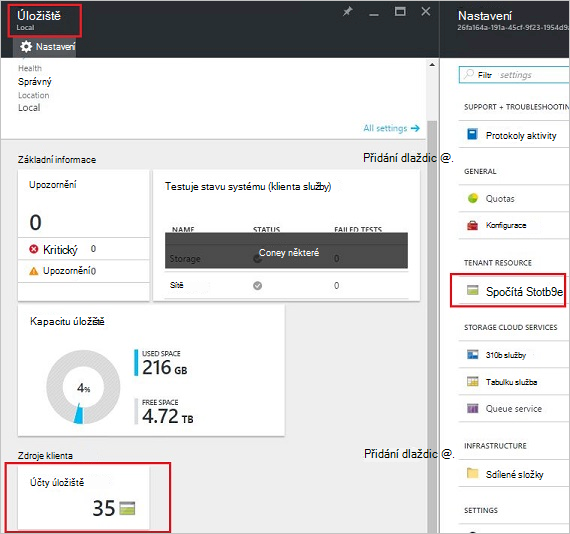
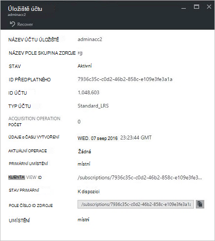

<properties
    pageTitle="Správa účtů úložiště Azure zásobníku | Microsoft Azure"
    description="Zjistěte, jak najít, spravovat, obnovit a uvolnit Azure zásobníku úložiště účty"
    services="azure-stack"
    documentationCenter=""
    authors="AniAnirudh"
    manager="darmour"
    editor=""/>

<tags
    ms.service="azure-stack"
    ms.workload="na"
    ms.tgt_pltfrm="na"
    ms.devlang="na"
    ms.topic="get-started-article"
    ms.date="09/26/2016"
    ms.author="anirudha"/>

# <a name="manage-storage-accounts-in-azure-stack"></a>Správa úložiště účtů v Azure zásobníku

Naučte se spravovat úložiště účty ve vrstvě Azure najít, a uvolnit kapacitu úložiště podle potřeb podniku.

## <a name="find-a-storage-account"></a>Vyhledání účtu úložiště

Seznam účtů úložiště v oblasti můžete zobrazit v Azure seřadit podle:

1.  V prohlížeči internet přejděte na [https://portal.azurestack.local](https://portal.azurestack.local/).

2.  Přihlaste se k portálu Azure zásobníku jako správce (pomocí přihlašovacích údajů, které jste zadali při nasazení)

3.  Na řídicím panelu Výchozí – najděte seznam **správy oblastí** a klikněte na požadovanou oblast chcete prozkoumat – například **(místní**).

    

4.  Vyberte **úložiště** ze seznamu **Poskytovatelů zdroje** .

    

5.  Teď na zásuvné zdroje poskytovatele Správce úložiště – přejděte dolů na kartě "Úložiště účty" a klikněte na ni.

    
    
    Výsledné stránky je seznam účtů úložiště v dané oblasti.

    

Ve výchozím nastavení jsou zobrazeny na prvních 10 účty. Je možné získat další kliknutím na odkaz "načíst více" v dolní části seznamu <br>
NEBO <br>
Pokud vás zajímají určité úložiště účet – můžete **filtrovat a načíst příslušné účty** pouze.<br>

Pokud chcete filtrovat pro účty:

1. Klikněte na tlačítko Filtr v horní části zásuvné.

2. Na zásuvné filtr umožňuje zadat **název účtu**,  **ID předplatného** nebo **Stav** k úpravě seznamu úložiště účtů zobrazovat. Podle potřeby můžete použijte je.

3. Klikněte na aktualizovat. V seznamu by měla aktualizace příslušným způsobem.

    

4. K resetování filtr – klikněte na tlačítko filtr, vymažte na výběr a aktualizovat.

Textového pole Hledat v horní zásuvné seznam účtů úložiště, můžete zvýraznit vybraný text v seznamu účtů. Při je to opravdu užitečný v případě celé jméno nebo id není snadno dostupná.<br>
Můžete sem volné usnadňuje vyhledání účet, který vás zajímá.


## <a name="look-at-account-details"></a>Podívejte se na Podrobnosti účtu

Vyhledaný účty, že máte zájem zobrazení kliknete na konkrétní účet, který chcete zobrazit určité informace. Otevře se nové zásuvné s podrobnostmi účtu jako typ účtu, údaje o času vytvoření a umístění atd.




## <a name="recover-a-deleted-account"></a>Obnovení odstraněného účtu

Můžete v případě, že místo, kam chcete obnovit odstraněné účtu.<br>
V AzureStack je velmi jednoduché způsob, jak to udělat.

1.  Přechod, přejděte na seznam účtů úložiště. [V tématu vyhledání účtu úložiště](#find-a-storage-account)

2.  V seznamu vyhledejte konkrétního účtu. Budete muset filtrovat.

3.  Zaškrtněte políčko "Stavu" účtu. Vhodné zadat "odstranili".

4.  Klepněte na účet, který se otevře zásuvné podrobnosti o účtu.

5.  Horní části tohoto zásuvné – vyhledejte "obnovit" tlačítko a klikněte na ni.

6.  Potvrďte stisknutím klávesy "Ano"

    

7.  Obnovení je teď v procesu... čekat na označení, že byl úspěšný.
    Můžete také kliknout na ikonu "zvonu" v horní části portálu zobrazíte označení průběhu.

    

  Jakmile obnoveného účet je úspěšně synchronizovaný, jednu můžete přejděte zpět do s ním pracovat.

### <a name="some-gotchas"></a>Některé problematická místa

- Odstraněné účet zobrazí stav jako "mimo uchovávání informací".

  To znamená, že odstraněného účtu bylo překročeno období uchování a nemusí být už možné obnovit.

- Odstraněné účtu nezobrazuje v seznamu účty.

  Může to znamenat odstraněného účtu již uvolnění shromažďované. V tomto případě jej nebude možné obnovit už. Níže najdete v článku "uvolnit kapacita".

## <a name="set-retention-period"></a>Nastavení doba uchovávání informací

Nastavení období uchování umožňuje správce můžete určit časové období ve dnech (0 až 9999 dní), ve kterých můžete potenciálně obnovit odstraněné účtu. Doba uchovávání informací výchozí nastavenou 15 dní. Nastavení hodnotu "0" znamená, že odstraněného účtu budou okamžitě mimo uchovávání informací a označen pro pravidelných uvolnění paměti.

Chcete-li změnit období uchování –

1.  V prohlížeči internet přejděte na [https://portal.azurestack.local](https://portal.azurestack.local/).

2.  Přihlaste se k portálu Azure zásobníku jako správce (pomocí přihlašovacích údajů, které jste zadali při nasazení)

3.  Na řídicím panelu Výchozí – najděte seznam **správy oblastí** a klikněte na požadovanou oblast chcete prozkoumat – například **(místní**).

4.  Vyberte **úložiště** ze seznamu **Poskytovatelů zdroje** .

5.  Klikněte na ikonu nastavení v horní části otevřete zásuvné nastavení.

6.  Klikněte na konfigurační - doba uchovávání informací.

7.  Můžete upravit hodnotu a uložte jej.

 Tato hodnota bude okamžitě efektivní a odrážet napříč celou oblast.


## <a name="reclaim-capacity"></a>Uvolnit kapacity

Jednou z straně projevů s doba uchovávání informací je, že účet odstraněné zůstanou v používání kapacita až přijde mimo období uchování. Teď jako správce, který může být nutné způsob, jak uvolnit to odstranit účty místo Ačkoli období uchování nevypršela. Nyní můžete cmdline explicitně přepsat doba uchovávání informací a okamžitě uvolnit kapacity. K tomu nevyzve –

1.  Za předpokladu, že jste již Azure Powershellu nainstalovali a nakonfigurovali. V opačném případě postupujte podle pokynů v tomto poli: A nainstalujte nejnovější verzi Azure PowerShell přidružit Azure předplatné, přečtěte si, [Jak nainstalovat a nakonfigurovat Azure Powershellu](http://azure.microsoft.com/documentation/articles/powershell-install-configure/).
    Další informace o rutinách správce prostředků Azure najdete v článku [přes Azure pomocí Správce prostředků Azure](http://go.microsoft.com/fwlink/?LinkId=394767)

2.  Spusťte tuto rutinu:

    ```
    PS C:\\>; Clear-ACSStorageAccount -ResourceGroupName system
    -FarmName <your farmname>
    ```

> Další informace naleznete v [dokumentaci AzureStack prostředí powershell](https://msdn.microsoft.com/library/mt637964.aspx)

> [AZURE.NOTE] Tato rutina spuštěná trvale odstraníte účet a její obsah. Se již nebude možné obnovit. Použijte opatrně.

