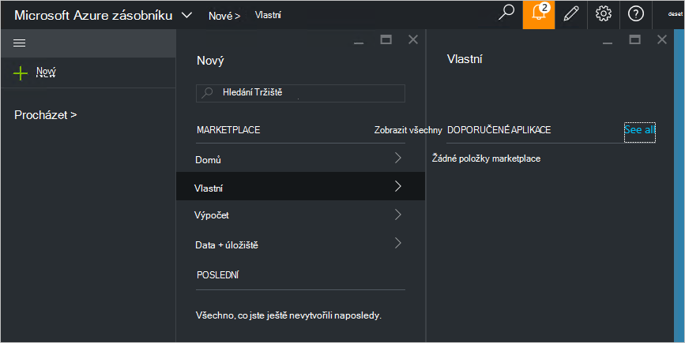

<properties
    pageTitle="Publikovat na položku vlastní marketplace ve vrstvě Azure (Správce služby) | Microsoft Azure"
    description="Jako správce služby přečtěte si, jak publikovat na položku vlastní marketplace ve vrstvě Azure."
    services="azure-stack"
    documentationCenter=""
    authors="rupisure"
    manager="byronr"
    editor=""/>

<tags
    ms.service="azure-stack"
    ms.workload="na"
    ms.tgt_pltfrm="na"
    ms.devlang="na"
    ms.topic="article"
    ms.date="09/26/2016"
    ms.author="rupisure"/>

# Zásobníku Azure Marketplace

Tržiště je sada položky přizpůsobený zásobníku Azure, například služby, aplikací a materiálů. Je místo, odkud pocházejí tenantů k vytvoření nového zdroje a nasazovat nové aplikace. Správci služeb můžete přidat vlastní položky Marketplace a klienti se okamžitě zobrazí.

Chcete-li otevřít web Marketplace, klikněte na **Nový**.

Tržiště se aktualizuje každých pět minut.

## Tržiště položek

Jednotlivé položky Marketplace obsahuje:

-   Správce prostředků Azure šablony pro vytváření zdroje

-   Metadata, jako jsou řetězce, ikony a jiné marketingové nástroje

-   Informace o formátování pro zobrazení na položku na portálu

Jednotlivé položky publikovaných na Tržiště používá formátu balíček Galerie Azure (azpkg). Nasazení nebo runtime zdrojů (například kód, zip soubory s software nebo obrázky virtuální počítač) má být přidán Azure zásobníku samostatně, ne jako součást položku Marketplace. 

## Další kroky

[Vytvářet a publikovat položky marketplace](azure-stack-create-and-publish-marketplace-item.md)
