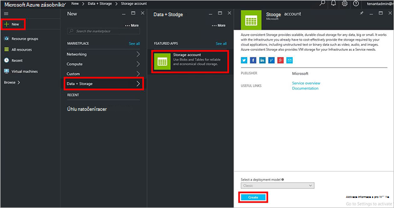
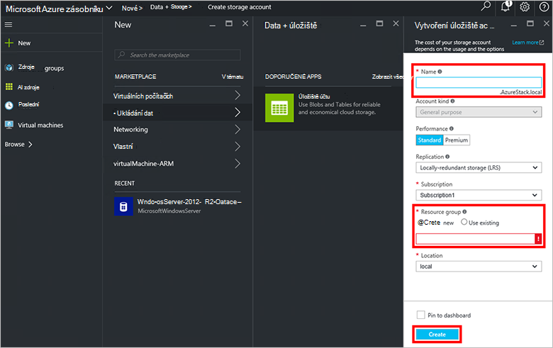
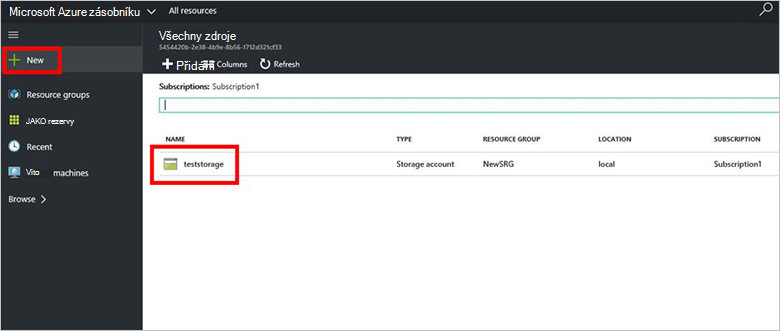

<properties
    pageTitle="Účty úložiště ve vrstvě Azure | Microsoft Azure"
    description="Naučte se vytvořit účet úložiště Azure vrstvě."
    services="azure-stack"
    documentationCenter=""
    authors="ErikjeMS"
    manager="byronr"
    editor=""/>

<tags
    ms.service="azure-stack"
    ms.workload="na"
    ms.tgt_pltfrm="na"
    ms.devlang="na"
    ms.topic="get-started-article"
    ms.date="09/26/2016"
    ms.author="erikje"/>

# Účty úložiště ve vrstvě Azure

Účty úložiště zahrnout objektů Blob a tabulku služba a jedinečných názvů pro datové objekty úložiště. Ve výchozím nastavení je dostupná jenom pro vás vlastník účtu úložiště dat ve vašem účtu.

1.  Na počítači Koncepce zásobníku Azure, přihlaste se k `https://portal.azurestack.local` jako [Správce](azure-stack-connect-azure-stack.md#log-in-as-a-service-administrator)a potom klikněte na **Nový** > **dat + úložiště** > **účtu úložiště**.

    

2.  V zásuvné **vytvořit úložiště účtu** zadejte název účtu úložiště. Vytvoření nové **Skupiny prostředků**, nebo vyberte stávající a potom klikněte na **vytvořit** vytvořte účet úložiště.

    

3. Pokud chcete zobrazit vašemu novému účtu úložiště, klikněte na **všechny zdroje**a pak hledání účtu úložiště a klikněte na jeho název.

    
    
## Další kroky

[Použití šablon správce prostředků Azure](azure-stack-arm-templates.md)

[Další informace o účtech Azure úložiště](../storage/storage-create-storage-account.md)

[Stáhnout průvodce Azure zásobníku Azure konzistentní úložiště ověření](http://aka.ms/azurestacktp1doc)
