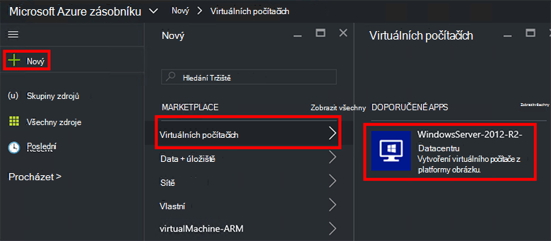
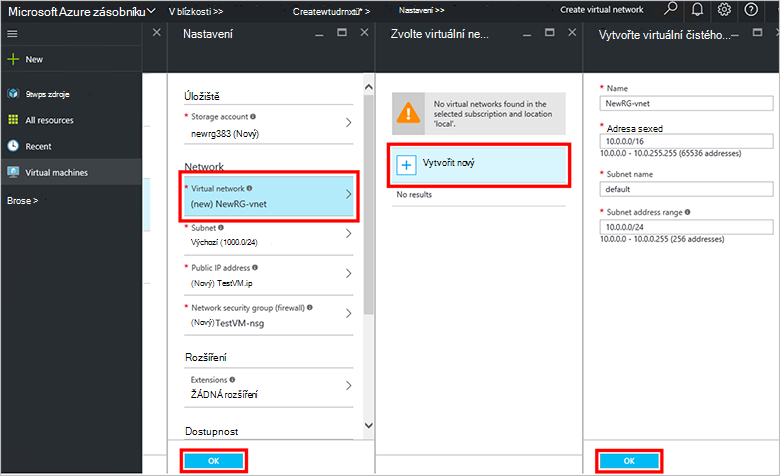
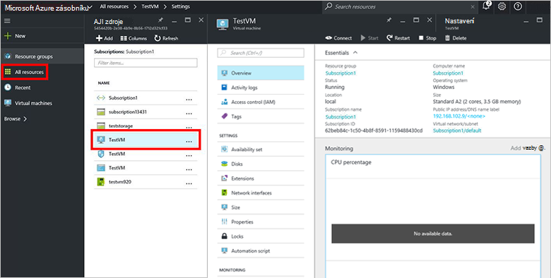

<properties
    pageTitle="Zřízení OM ve vrstvě Azure (klient) | Microsoft Azure"
    description="Jako klienta Naučte se vytvořit OM ve vrstvě Azure."
    services="azure-stack"
    documentationCenter=""
    authors="ErikjeMS"
    manager="byronr"
    editor=""/>

<tags
    ms.service="azure-stack"
    ms.workload="na"
    ms.tgt_pltfrm="na"
    ms.devlang="na"
    ms.topic="get-started-article"
    ms.date="10/12/2016"
    ms.author="erikje"/>

# Zřízení virtuálního počítače

Jako správce můžete vytvořit virtuálních počítačích vyhodnotit zdroje před nabízející v plánech.

## Zřízení virtuálního počítače

1.  Na počítači Koncepce zásobníku Azure, přihlaste se k `https://portal.azurestack.local` jako [Správce](azure-stack-connect-azure-stack.md#log-in-as-a-service-administrator)a potom klikněte na **Nový** > **virtuálních počítačích** > **WindowsServer 2012 R2 Datacentra**.  

    

2.  Do zásuvné **Základy** zadejte **jméno**, **uživatelské jméno**a **heslo**. **Typ disku OM**zvolte **pevný disk**. Zvolte **předplatné**. Vytvoření **pole Skupina zdroje**, nebo vyberte stávající a klepněte na tlačítko **OK**.  

3.  V zásuvné **Zvolte velikost** klikněte na **Základní A1**a potom na tlačítko **Vybrat**.  

4.  V **Nastavení** zásuvné klikněte na **virtuální sítě**. V zásuvné **Zvolit virtuální sítě** klikněte na **vytvořit nový**. V zásuvné **vytvořit virtuální síť** přijmout všechny výchozí hodnoty a klikněte na **OK**. V **Nastavení** zásuvné klikněte na **OK**.

    

5.  V zásuvné **Souhrn** klikněte na **OK** vytvořte virtuální počítač.  

6. Nový virtuální počítač zobrazíte klikněte na **všechny zdroje**, a pak hledat virtuálního počítače a klikněte na jeho název.

    

## Další kroky

[Účty úložiště](azure-stack-provision-storage-account.md)
