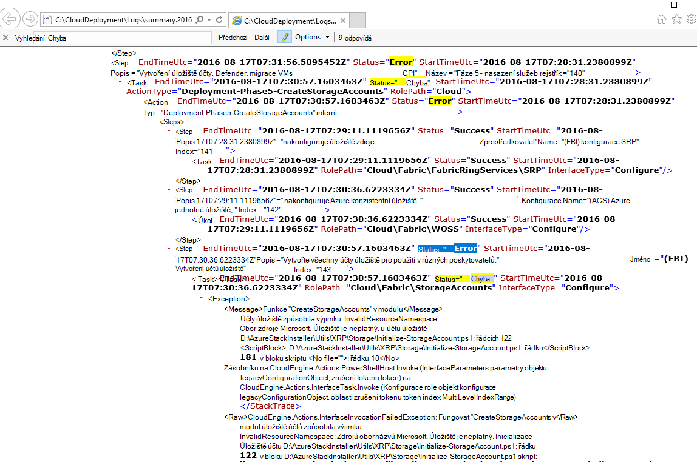
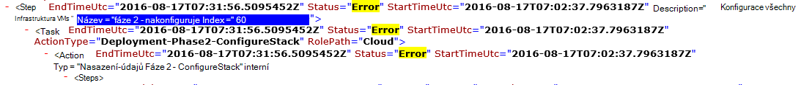

<properties
    pageTitle="Spusťte nasazení z selhalo kroku | Microsoft Azure"
    description="Pokud dojde k chybě při nasazení, je možné odeslání následujících kroků můžete znovu nasazení ze kdy se nezdařila."
    services="azure-stack"
    documentationCenter=""
    authors="ErikjeMS"
    manager="byronr"
    editor=""/>

<tags
    ms.service="azure-stack"
    ms.workload="na"
    ms.tgt_pltfrm="na"
    ms.devlang="na"
    ms.topic="get-started-article"
    ms.date="09/26/2016"
    ms.author="erikje"/>
    
# Spusťte nasazení od kroku nezdařeném uložení
  
Pokud dojde k chybě při nasazení, je možné odeslání následujících kroků můžete znovu nasazení ze kdy se nezdařila.

## Najít chybu

Poznamenejte si nepovede, konkrétně část, která volá na který krok vyvolání se nezdařila. Například

**2016-08-17 00:30:57 chyby 1 > 1 > akce: vyvolání kroku 60.140.143 se nezdařila. Zastavení vyvolání akčního plánu.**

Jedná se o krok nasazení, kde bude začínat znovu spustit nasazení.

## Najít podrobnější na chyby

Pokud budete potřebovat další informace o chybě, najděte přidružené **Souhrn. RRRR MM DD.tt.N.log.xml** v **C:\CloudDeployment\Logs\* * složky.
Řetězec "Chyba" vyhledat a postupujte podle ho dolů až výstup se zobrazila velké množství jiné než XML formátovaný text obsahující chybová zpráva (v této části často shoduje s poslední instanci řetězec "Chyba"). Příklad:

Taky můžete tyto informace sledovat znovu spustit krok, zpracovat "Index" čísla z této poslední chyba. Na obrázku nahoře, zobrazí se (od ze spodního okraje): 143, 140 a potom když posunutí nahoru po najdete v tématu 60:

Vložíte tím všechny společné (nyní shora dolů), dostanete 60.140.143, stejně jako v výstup konzoly PS selhání (jak je vidět v předchozí části "Najít chyba").

## Spusťte nasazení na konkrétní kroku

Teď, když máte krok, který se nezdařila nasazení, je možné odeslání-znovu spustit nasazení z tohoto kroku.

> [AZURE.IMPORTANT] Následující příkazy spuštěním správné uživatelem v souvislosti s chybou výskytu. Pokud před HOSTITELI byl připojený k doméně došlo k chybě, spusťte tento postup jako místního účtu správce. Pokud došlo k chybě po HOSTITELI byl připojený k doméně, spusťte jako správce domény (azurestack\azurestackadmin) takto.

### Provedení příkazu vyvolat EceAction

1. V konzole zvýšenými PS importu následující moduly:

        Import-Module C:\CloudDeployment\CloudDeployment.psd1 -Force
        Import-Module C:\CloudDeployment\ECEngine\EnterpriseCloudEngine.psd1 -Force 

2. Potom spusťte následující příkaz (třeba z horní použité tady):

        Invoke-EceAction -RolePath Cloud -ActionType Deployment -Start 60.140.143 -Verbose

3.  To zahájí nasazení od kroku identifikovat parametrem – spuštění příkazu vyvolat EceAction

### Výsledky-znovu spustit /-zahájení

Bez ohledu na požadovanou možnost jste si vybrali, nasazení začne znovu na zadaný – začněte parametr.

1.  Při obnovitelné selhání nasazení zůstanou proces zpracování.

2.  Pokud nasazení napoprvé znovu...
    
    - na stejném místě: selhání je pravděpodobně a další vyšetřování je nutný.

    - nové místo po kde ale bezúspěšně tentokrát: je možné odeslání stejný postup, spusťte ho znovu přejít.

    - nové místo před kde ale bezúspěšně tentokrát: ještě něco se nepovedlo se idempotent volání, které vyžaduje další vyšetřování.

## Další kroky

[Připojení k Azure zásobníku](azure-stack-connect-azure-stack.md)

