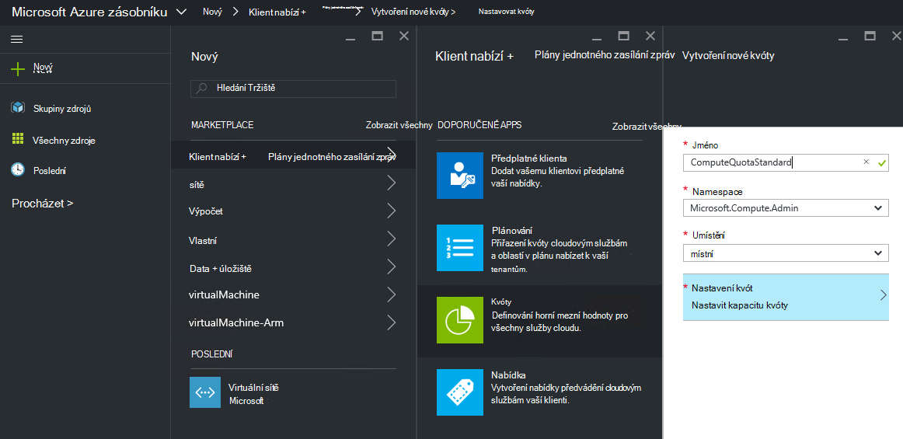
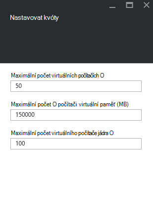
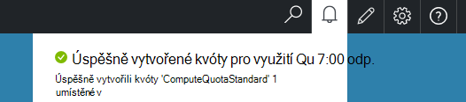

<properties
    pageTitle="Kvóty v Azure zásobníku | Microsoft Azure"
    description="Správci nastavit kvóty omezení maximální počet zdrojů, které klienti mají přístup k."
    services="azure-stack"
    documentationCenter=""
    authors="mattmcg"
    manager="byronr"
    editor=""/>

<tags
    ms.service="azure-stack"
    ms.workload="na"
    ms.tgt_pltfrm="na"
    ms.devlang="na"
    ms.topic="get-started-article"
    ms.date="09/26/2016"
    ms.author="mattmcg"/>

# Nastavovat kvóty ve vrstvě Azure

Kvót definovat mezní hodnoty, které předplatné klienta zřízení nebo Používání zdrojů. Kvóta například by mohly umožnit posílání klienta, kterého chcete vytvořit až na pět VMs. Pokud chcete přidat do služby na plán, musí správce konfigurovat nastavení kvóty pro službu.

Kvóty jsou, která dokáže nahradit za služby a umístění umožňuje správcům poskytovat podrobného publikum nemůže ovládat využití prostředků. Správci můžete vytvořit jeden nebo více kvóty prostředků a přidružit plány, což znamená, že poskytují odlišné nabídky pro své služby. Správa zásuvné **Zprostředkovatele prostředků** pro službu může vytvořit kvóty pro dané služby.

Ke klientovi, která se přihlásí k nabídky, která obsahuje více plány můžete použít všechny zdroje, které jsou k dispozici v jednotlivých plánu.

## K vytvoření IaaS kvóty

1.  V prohlížeči přejděte na [https://portal.azurestack.local](https://portal.azurestack.local/).

    Přihlaste se k portálu Azure zásobníku jako správce (pomocí přihlašovacích údajů, které jste zadali při nasazení).

2.  Vyberte **Nový**a pak vyberte **kvóty**.

3.  Vyberte první službu, u kterého chcete vytvořit kvóty. Kvóta IaaS tyto kroky pro výpočetním, sítě a úložiště služby.
V tomto příkladu vytvoříme nejdřív kvóty pro službu výpočetním. V seznamu **Namespace** vyberte obor názvů **Microsoft.Compute.Admin** .

    > 

4.  Vyberte místo, kde je definována kvóty (například "místní").

5.  Na položku **Nastavení kvót** s textem **Nastavení kapacitu kvóty**. Klikněte na tuto položku ke konfiguraci nastavení kvóty.

6.  Na zásuvné **Nastavit kvót** zobrazit všechny zdroje výpočetním u kterých můžete nastavit omezení. Každý typ má výchozí hodnotu, kterou máte přidruženou s ním. Můžete změnit tyto hodnoty nebo můžete kliknutím na tlačítko **Ok** v dolní části zásuvné přijměte výchozí nastavení.

    > 

7.  Již nakonfigurovány hodnoty a kliknutí na **Ok**, zobrazuje se jako **nakonfigurováno**na položku **Nastavení kvót** . Klikněte na tlačítko **Ok** k vytvoření **kvóty** prostředků.

    Měli byste vidět oznámení, že se vytváří kvóty prostředků.

8.   Po úspěšném vytvoření sady kvóty zobrazí upozornění druhé. Služby kvóty pro využití je nyní připravena k být přidružené k plánu. Opakujte tento postup se službami sítě a úložiště a jste připraveni k vytvoření plánu IaaS!

    >   

## Výpočet typů kvót

|**Typ**                    |**Výchozí hodnota**| **Popis**|
|--------------------------- | ------------------------------------|------------------------------------------------------------------|
|Maximální počet virtuálních počítačích   |50|Maximální počet virtuálních počítačích, které předplatné můžete vytvořit v tomto umístění. |
|Maximální počet jádra virtuálního počítače              |100|Maximální počet jádra vytvořené předplatné v tomto umístění (například OM A3 obsahuje čtyři jádra).|
|Maximální velikost paměti virtuálního počítače (GB)         |150|Maximální velikost paměti RAM, který můžete zřízení v megabajtech (například A1 OM spotřebovává 1,75 GB paměti RAM).|

> [AZURE.NOTE] Výpočet, že kvóty nejsou nevynucují v tomto technical preview.

## Typy kvóta úložiště

|**Položky**                           |**Výchozí hodnota**   |**Popis**|
|---------------------------------- |------------------- |-----------------------------------------------------------|
|Maximální kapacitu (GB)              |500                 |Součet kapacita určené předplatné v tomto umístění.|
|Celkový počet úložiště účty   |20                  |Maximální počet úložiště účty, které předplatné můžete vytvořit v tomto umístění.|

## Typy kvóty sítě

|**Položky**                                                   |**Výchozí hodnota**   |**Popis**|
|----------------------------------------------------------| ------------------- |--------------------------------------------------------------------------------------------------------------------------------------------------------------------|
| Veřejné IP adresy Max                         |50                  |Maximální počet veřejnou IP adresy, který předplatného můžete vytvořit v tomto umístění. |
| Virtuální sítě Max                   |50                  |Maximální počet virtuální sítě, které předplatné můžete vytvořit v tomto umístění. |
| Maximální počet bran virtuální sítě           |1                   |Maximální počet bran virtuální sítě (VPN brány), které předplatné můžete vytvořit v tomto umístění. |
| Připojení k síti Max                |2                   |Maximální počet připojení (bod k nebo na webu), které předplatné může přes všechny brány virtuální sítě v tomto umístění. |
| Vyrovnávání zatížení Max                     |50                  |Maximální počet Vyrovnávání zatížení, které předplatné můžete vytvořit v tomto umístění. |
| Max nic                               |100                 |Maximální počet rozhraní sítě, která předplatného můžete vytvořit v tomto umístění. |
| Skupiny zabezpečení sítě Max            |50                  |Maximální počet skupiny zabezpečení sítě, které předplatné můžete vytvořit v tomto umístění. |
