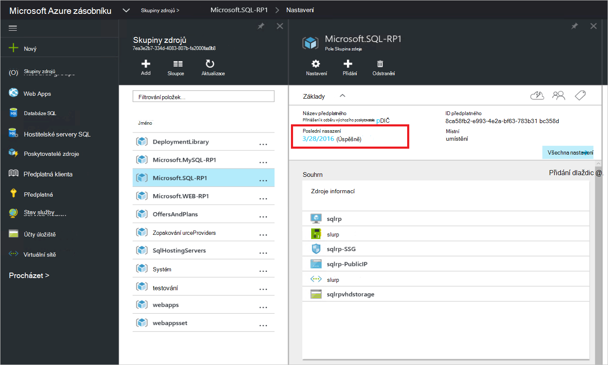
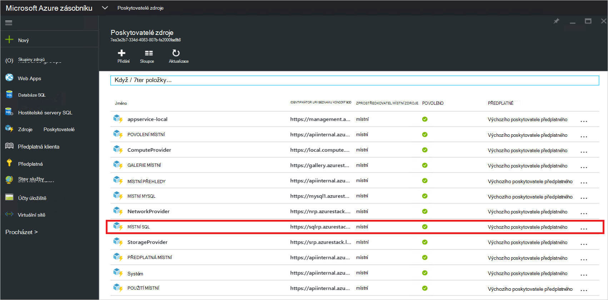
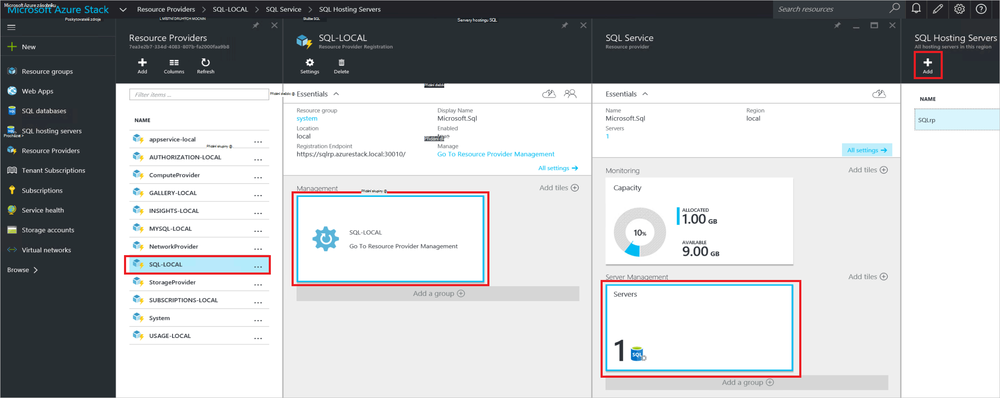
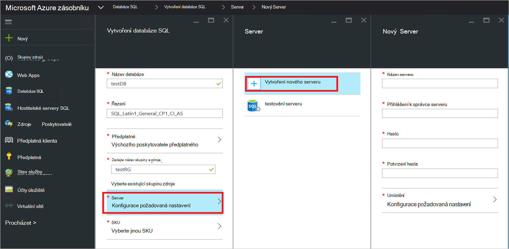

<properties
    pageTitle="Nasazení zprostředkovatele prostředků serveru SQL Server Azure zásobníku | Microsoft Azure"
    description="Podrobný postup pro nasazení adaptér SQL Server zdroje poskytovatele Azure zásobníku."
    services="azure-stack"
    documentationCenter=""
    authors="Dumagar"
    manager="byronr"
    editor=""/>

<tags
    ms.service="multiple"
    ms.workload="na"
    ms.tgt_pltfrm="na"
    ms.devlang="na"
    ms.topic="article"
    ms.date="09/26/2016"
    ms.author="dumagar"/>

# Nasazení adaptér poskytovatele zdroje Server SQL Azure zásobníku

> [AZURE.NOTE] Tyto informace platí jenom pro nasazení TP1 zásobníku Azure.

Podrobný postup pro nastavení adaptér poskytovatele zdroje Server SQL Azure zásobníku doklad o koncepce pomocí tohoto článku. V tématu [použití databáze SQL Azure zásobníku](azure-stack-sql-rp-deploy-short.md) k pochopení funkcí poskytovatele zdroje a architekturu.

## Postup nastavení před nasazením

Před nasazením zprostředkovatele prostředků, musíte:

- Máte výchozí obrázek systému Windows Server s .NET 3.5
- Vypnutí rozšířené zabezpečení aplikace Internet Explorer (IE)
- Nainstalujte nejnovější verzi Azure PowerShell

### Vytvořit obrázek systému Windows Server, včetně .NET 3.5

Když jste si stáhli bitů Azure zásobníku po 2/23/2016 Jelikož výchozí obrázek základní Windows serveru 2012 R2 .NET 3.5 framework v tomto ke stažení a v novějších verzích můžete tento krok přeskočit.

Pokud jste si stáhli před 2/23/2016, je potřeba vytvořit Windows serveru 2012 R2 Datacentra virtuální pevný disk s obrázkem po posunutí .NET 3.5 a je nastavení jako výchozího obrázku v úložišti platformu obrázek.

### Vypnout IE rozšířené zabezpečení a povolit soubory cookie

Abyste mohli nasadit zprostředkovatele prostředků, prostředí integrovaném skriptování prostředí PowerShell (ISE) spustit jako správce, proto je potřeba povolit soubory cookie a JavaScript v Internet Exploreru profil, který používáte pro přihlášení k Azure Active Directory pro správce a uživatele přihlášení.

**Pokud chcete vypnout IE rozšířené zabezpečení:**

1. Přihlaste se k počítači (koncepce) ověření koncepce Azure zásobníku jako AzureStack/správce a potom spusťte Správce serveru.

2. Vypněte **Rozšířeného zabezpečení aplikace Internet Explorer** pro správce a uživatele.

3. Přihlaste se k **ClientVM.AzureStack.local** virtuálního počítače jako správce a potom spusťte Správce serveru.

4. Vypněte **Rozšířeného zabezpečení aplikace Internet Explorer** pro správce a uživatele.

**Povolení souborů cookie:**

1. Na obrazovce Start systému Windows klikněte na **všechny aplikace**, klikněte na **Příslušenství systému Windows**, klikněte pravým tlačítkem **Internet Exploreru**, přejděte na **Další**a potom klikněte na **Spustit jako správce**.

2. Pokud se zobrazí výzva, zkontrolujte **použití doporučené zabezpečení**a klikněte na tlačítko **OK**.

3. V Internet Exploreru klikněte na **Nástroje (ozubené) ikonu** &gt; **Možnosti Internetu** &gt; kartu **Ochrana osobních údajů** .

4. Klikněte na **Upřesnit**, ujistěte se, že nejsou vybrány obě tlačítka **přijmout** , klepněte na tlačítko **OK**a klikněte na tlačítko **OK** .

5. Ukončete aplikaci Internet Explorer a restartujte ISE PowerShell jako správce.

### Instalace Azure zásobníku kompatibilní verzi Azure PowerShell

1. Odinstalujte všechny existující prostředí PowerShell Azure z klienta OM.

2. Přihlaste se k počítači Azure zásobníku Koncepce jako AzureStack/správce.

3. Pomocí vzdálené plochy, přihlaste se k **ClientVM.AzureStack.local** virtuálního počítače jako správce.

4. Otevřete ovládací panely, klikněte na **odinstalovat program** &gt; klikněte na **Azure PowerShell** &gt; klikněte na **odinstalovat**.

5. [Stáhněte si nejnovější Azure PowerShell, který podporuje Azure zásobníku](http://aka.ms/azstackpsh) a nainstalujte ji.

    Po instalaci prostředí PowerShell můžete spustit toto ověření skript Powershellu abyste měli jistotu, že můžete připojit k instanci aplikace Azure zásobníku (objevit na webovou stránku přihlášení).

## Zavádění nasazení poskytovatele zdroje prostředí PowerShell

1. Připojení k clientVm.AzureStack.Local vzdálené plochy Azure zásobníku Koncepce a přihlaste se jako azurestack\\azurestackuser.

2. [Stáhnout SQLRP binární](http://aka.ms/massqlrprfrsh) soubor. Budete muset odstranit blokování zabezpečení stažení Internet kliknutím pravým tlačítkem myši na soubor, vyberte možnost **Vlastnosti** a na kartě **Obecné** , popisky **Odblokovat**, **OK**. To nebrání "Nelze načíst soubor nebo sestavení" výjimky související s DeploymentTelemetry.dll a následné výjimky sledování nasazení.

3. Extrahujte soubory do D:\\SQLRP.

4. Spuštění D:\\SQLRP\\Bootstrap.cmd soubor jako správce (azurestack\\správce).

    Otevře se soubor Bootstrap.ps1 v prostředí PowerShell ISE.

5. Dokončení okně PowerShell ISE načítání, klikněte na tlačítko Přehrát nebo stiskněte klávesu F5.

    

    Dvě hlavní karty načte, každý obsahuje všechny skripty a soubory budete muset nasazení zprostředkovatele prostředků.

## Příprava požadavky

Kliknutím na kartu **Příprava požadavky** :

- Vytvoření požadovaných certifikátů
- Nahrání artefakty k účtu úložiště Azure zásobníku
- Publikování položek galerie

### Vytvoření požadovaných certifikátů
Tento skript **Nový SslCert.ps1** přidá \_. Certifikát AzureStack.local.pfx SSL D:\\SQLRP\\požadavky\\BlobStorage\\složek kontejneru. Certifikát zabezpečení komunikace mezi zprostředkovatele prostředků a místní instanci správce Azure prostředků.

1. Na kartě Hlavní **Příprava požadavky** klikněte na kartu **Nový SslCert.ps1** a ho spusťte.

2. Na příkazovém řádku, která se zobrazí zadejte heslo PFX chrání privátním klíčem a **poznamenejte si toto heslo**. Je potřeba ho později.

### Nahrání všech artefakty k účtu úložiště Azure zásobníku

1. Klikněte na kartu **Odesílání Microsoft.Sql RP.ps1** a ho spusťte.

2. V dialogovém okně žádost o přihlašovacích údajů Windows PowerShell zadejte přihlašovací údaje Správce služby Azure vrstvě.

3. Po zobrazení výzvy ID klienta Azure Active Directory, zadejte svůj Azure Active Directory klienta plně kvalifikovaný název domény: například microsoftazurestack.onmicrosoft.com.

    Automaticky otevírané okno požádá o přihlašovacích údajů.

    

    > [AZURE.TIP] Pokud místní nabídce nezobrazí, které buď nevypnuli IE lepší zabezpečení a Povolit JavaScript v tomto počítači a uživatele nebo nepřijal souborů cookie v aplikaci Internet Explorer. V tématu [Nastavení kroky před nasazením](#set-up-steps-before-you-deploy).

4. Zadejte svoje přihlašovací údaje Správce služeb zásobníku Azure a potom klikněte na **Sign In**.

### Publikovat položky galerie pro pozdější vytvoření prostředku

Vyberte kartu **Publikovat GalleryPackages.ps1** a ho spusťte. Tento skript přidá dvě položky marketplace portálu Koncepce zásobníku Azure marketplace, využívající nasazení zdroje databáze jako položky marketplace.

## Nasazení zprostředkovatele prostředků serveru SQL OM

Teď jsou připraveni koncepce zásobníku Azure s potřebné certifikáty a marketplace položky nástroje můžete nasazovat zprostředkovatele SQL Server zdroje. Kliknutím na kartu **poskytovatele nasazení SQL** :

   - Zadejte hodnoty v JSON soubor, který odkazuje na procesu nasazení
   - Nasazení zprostředkovatele prostředků
   - Aktualizace místní DNS
   - Registrace adaptér poskytovatele prostředků serveru SQL

### Zadejte hodnoty v souboru JSON

Klikněte na tlačítko **Microsoft.Sqlprovider.Parameters.JSON**. Tento soubor obsahuje parametrů, které správce prostředků Azure šablony je potřeba správně nasadit do zásobníku Azure.

1. Vyplňte **prázdné** parametrů v souboru JSON:

    - Zkontrolujte, jestli že neposkytnete **adminusername** a **adminpassword** OM poskytovatele zdroje SQL:

        

    - Zkontrolujte, jestli že je zadat heslo pro parametr **SetupPfxPassword** , která vyrobila poznamenat v kroku [prequisites připravit](#prepare-prerequisites) :

    

2. Klepněte na tlačítko **Uložit** uložte soubor parametrů.

### Nasazení zprostředkovatele prostředků

1. Klikněte na kartu **nasazení Microsoft.sql provider.PS1** a následujícím způsobem.
2. Do Azure Active Directory po zobrazení výzvy zadejte své jméno klienta.
3. Automaticky otevírané okno odešlete přihlašovacích údajů správce služby Azure vrstvě.

Úplné nasazení může trvat mezi 25 a 55 minut na některé vysoce utilized zásobníku POCs Azure. Nejdelší kroky budou koncovku žádoucí konfigurace stavu (DSC) a spuštění prostředí PowerShell, který je posledním kroku. Každý může trvat 10 25.

### Aktualizace místní DNS

1. Klikněte na kartu **Register Microsoft.SQL fqdn.ps1** a následujícím způsobem.
2. Po zobrazení výzvy Azure Active Directory klienta ID pro zadávání vašeho Azure Active Directory klienta plně kvalifikovaný název domény: například **microsoftazurestack.onmicrosoft.com**.

### Registrace zprostředkovatele prostředků SQL RP##

1. Klikněte na kartu **Register Microsoft.SQL provider.ps1** a následujícím způsobem.

2. Po zobrazení výzvy k zadání přihlašovacích údajů, použijte následující hodnoty pro uživatelské jméno a heslo:

   - **sqlRpUsername**
   - **sqlRpPassw0rd**

   > [AZURE.IMPORTANT] Toto jsou *literál typu* hodnoty, které budete muset po zobrazení výzvy k zadání přihlašovacích údajů. Toto není zástupné symboly. * *Proveďte *není* typ ** username\password jste si uložili v souboru parametrů před nasazením OM.

## Ověření nasazení na portálu zásobníku Azure

1. Odhlaste se z ClientVM a znovu se přihlaste jako **AzureStack\AzureStackUser**.

2. Na ploše klikněte na **Portál Koncepce zásobníku Azure** a přihlaste se k portálu jako správce služby.

3. Ověřte, že bylo úspěšné zavedení. Klikněte na tlačítko **Procházet** &gt; **Skupiny zdrojů** &gt; klikněte na skupina zdroje se používá (výchozí hodnota je **SQLRP**) a zkontrolujte essentials část zásuvné (horní polovina) přečte **nasazení proběhla úspěšně**.

      

4. Ověřte, že registrace úspěšně. Klikněte na tlačítko **Procházet** &gt; **poskytovatelů zdroje**a potom vyhledejte **Místní SQL**:

      

## Poskytují kapacitu zdroje poskytovatele SQL připojením k hostingu SQL serveru

1. Přihlaste se k portálu Azure zásobníku Koncepce jako správce služeb

2. Klikněte na **zdroje poskytovatelů** &gt; **SQL místní** &gt; **přejděte na Správa zprostředkovatelů zdroje** &gt; **servery** &gt; **Přidat**.

    Zásuvné **Servery hostingu SQL** je, kde můžete připojit zprostředkovatele prostředků serveru SQL na aktuální instance serveru SQL Server, sloužící jako zdroj poskytovatele back-end.

    

3. Vyplňte formulář Podrobnosti o připojení instance serveru SQL Server. Ve výchozím nastavení předkonfigurované SQL Server s názvem "SQLRP" s "Severní" uživatelské jméno správce a heslo, které vyznačenými v parametru "adminpassword" v parametrech spuštěné v OM JSON.

## Vytvoření první databáze SQL otestovat nasazení

1. Přihlaste se k portálu Azure zásobníku Koncepce jako správce služby.

2. Klikněte na tlačítko **Procházet** &gt; **SQL databáze** &gt; **Přidat**
  

3. Vyplnění formuláře s podrobnostmi databáze, včetně **Název serveru**, **Přihlášení správce serveru**a **heslo** pro nové *virtuálního serveru* na zásuvné **Nový Server** .

    

    Virtuální server je umělé konstrukce. Není mapování na samotný SQL Server, ale místo toho manifesty pomocí uživatelského jména v připojovacím řetězci zprostředkovatele prostředků vygeneruje na konci tohoto procesu. **Poznámka: heslo, které vkládáte zvlášť pro virtuálního serveru**. Na portálu Nikdy nezobrazovat heslo.

4. Se zobrazí dotaz, jestli vyberte ceny osy databáze.

    

    Nejsou v této verzi implementovaná úrovní, ale jejich spotřebu je sledováno správcem zdrojů Azure tak, aby ukázal rozlišení, které můžete vytvářet v vynucení kvót atd.

5. Odeslání formuláře a počkejte nasazení dokončete.

6. Ve výsledném zásuvné Všimněte si pole "Připojovací řetězec". Tento řetězec v libovolné aplikaci, která vyžadují připojení k serveru SQL Server (například do webových aplikací) můžete použít ve vrstvě Azure.

    

## Další kroky

Vyzkoušejte další [PaaS služby](azure-stack-tools-paas-services.md) , jako třeba [MySQL Server zdroje poskytovatele](azure-stack-mysql-rp-deploy-short.md) a [poskytovatele zdroje Web Apps](azure-stack-webapps-deploy.md).
