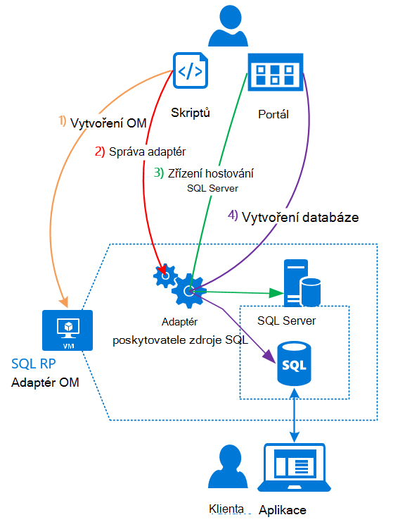

<properties
    pageTitle="Použití databáze SQL Azure zásobníku | Microsoft Azure"
    description="Zjistěte, jak můžete nasadit SQL databáze jako služba ve vrstvě Azure a rychlé kroky nasazení adaptér poskytovatele prostředků serveru SQL Server."
    services="azure-stack"
    documentationCenter=""
    authors="Dumagar"
    manager="byronr"
    editor=""/>

<tags
    ms.service="multiple"
    ms.workload="na"
    ms.tgt_pltfrm="na"
    ms.devlang="na"
    ms.topic="article"
    ms.date="09/26/2016"
    ms.author="dumagar"/>

# Použití databáze SQL Azure zásobníku

> [AZURE.NOTE] Tyto informace platí jenom pro nasazení TP1 zásobníku Azure.

Umožňuje vystavit SQL databáze jako služby Azure zásobníku adaptér poskytovatele prostředků serveru SQL Server. Po instalaci poskytovatele zdroje vy a vaši uživatelé můžete vytvořit pro cloudu nativní aplikace webu, které jsou založené na SQL a zatížení, aniž byste museli zřízení virtuálního počítače (OM) založené na SQL databáze, která hostuje SQL Server pokaždé, když.

Protože poskytovatele zdrojů nemá všechny možnosti databáze SQL Azure během doklad koncepce, začíná v tomto článku základní informace o Architektura zprostředkovatele zdroje. Pak můžete získat rychlý přehled návodu pro nastavení poskytovatele zdroje s odkazy na další podrobný postup [nasazení adaptér poskytovatele zdroje databáze SQL Azure zásobníku Koncepce](azure-stack-sql-rp-deploy-long.md).

## Architektura adaptér zprostředkovatele prostředků serveru SQL Server
Poskytovatel zdroje nenabízí všechny databáze možnosti správy databáze SQL Azure. Například fondů pružná databáze a možnost vytočit výkon databáze nahoru a dolů rychlé úpravy nejsou dostupné. Zprostředkovatele prostředků však podporuje stejné vytvoření, čtení, aktualizace a operace odstranění (CRUD) k dispozici v databázi SQL Azure.

Zprostředkovatele prostředků se skládá ze tří součástí:

- **SQL zdroje poskytovatele adaptér OM**, zahrnující procesu poskytovatele zdroje a servery, které hostují SQL serveru.
- **Samotného poskytovatele zdroje**, který zpracuje zřizovací požadavky a poskytuje databáze zdroje.
- **Servery, které hostovat SQL Server**, které umožňují kapacita pro databáze.

Následující konceptuální diagram zobrazuje tyto komponenty a kroky, které prochází při nasazení poskytovatele zdroje, nastavení serveru, která hostuje SQL serveru a pak vytvoření databáze.

## Rychlé kroky pro nasazení zprostředkovatele prostředků
Pokud jste už znáte zásobníku Azure, postupujte následujícím způsobem: Pokud budete potřebovat víc informací, přecházet na odkazy v každého oddílu nebo přejděte rovnou na [Deploy adaptér poskytovatele zdroje databáze SQL Azure zásobníku Koncepce](azure-stack-sql-rp-deploy-long.md).

1.  Zkontrolujte, jestli že dokončení všech [postup před nasazením nastavení](azure-stack-sql-rp-deploy-long.md#set-up-steps-before-you-deploy) poskytovatele zdroje:

  - .NET 3.5 framework už nastavenou na základní systému Windows Server obrázku. (Pokud jste stáhli bitů Azure zásobníku po 23 únor 2016, můžete přeskočit tento krok.)
  - [Je nainstalovaná verzi Azure PowerShell, který je kompatibilní se službou Azure vrstvě](http://aka.ms/azStackPsh).
  - V nastavení zabezpečení Internet Explorer na ClientVM [jsou povoleny Internet Explorer zvýšené zabezpečení je normálně vypnuté a soubory cookie](azure-stack-sql-rp-deploy-long.md#Turn-off-IE-enhanced-security-and-enable-cookies).

2. [SQL Server RP binární soubor stáhnout](http://aka.ms/massqlrprfrsh) a extrahujte do ClientVM ve vaší Koncepce zásobníku Azure.

3. [Spuštění bootstrap.cmd a skriptů](azure-stack-sql-rp-deploy-long.md#Bootstrap-the-resource-provider-deployment-PowerShell-and-Prepare-for-deployment).

    Sada skripty seskupena podle dvě hlavní karty otevřít v prostředí integrovaném skriptování prostředí PowerShell (ISE). Spuštění všech načtené skriptů postupně zleva doprava na jednotlivých kartách.

    1. Zleva doprava spouštěly skripty na kartě **připravit** :

        - Vytvořte certifikát se zástupnými znaky k zabezpečení komunikace mezi zprostředkovatele prostředků a správce prostředků Azure.
        - Nahrajte certifikáty a všechny ostatní artefaktů k účtu úložiště pro Azure vrstvě.
        - Publikování balíčků Galerie tak, aby nástroje můžete nasazovat SQL a zdroje v galerii.

        > [AZURE.IMPORTANT] Pokud některý z skripty se zablokuje pro není zřejmé, proč po odeslání vašeho klienta služby Azure Active Directory, nastavení zabezpečení, může blokuje DLL potřebného pro nasazení na spustit. Tento problém můžete vyřešit, vyhledejte Microsoft.AzureStack.Deployment.Telemetry.Dll ve složce poskytovatele zdroje pravým tlačítkem myši, klikněte na **Vlastnosti**a potom na kartě **Obecné** zaškrtněte **Odblokovat** .

    1. Zleva doprava spouštěly skripty na kartě **nasazení** :

        - [Nasazení virtuálního počítače](azure-stack-sql-rp-deploy-long.md#Deploy-the-SQL-Server-Resource-Provider-VM) , který hostuje poštovní zprostředkovatele prostředků a SQL Server. Tento skript odkazuje soubor parametr JSON, který byste potřebovali aktualizovat s některé hodnoty před spuštěním skriptu.
        - [Zaregistrujte místní záznam DNS](azure-stack-sql-rp-deploy-long.md#Update-the-local-DNS) , který odpovídá poskytovatele zdroje OM.
        - [Registrace poskytovatele zdroje](azure-stack-sql-rp-deploy-long.md#Register-the-SQL-RP-Resource-Provider) s místní zdroje správce Azure.

        > [AZURE.IMPORTANT] Všechny skripty se předpokládá, že obrázek základní operační systém splňuje požadavky (.NET 3.5 nainstalovali, JavaScript a soubory cookie zapnuta ClientVM i kompatibilní verzi Azure PowerShell nainstalovaný). Pokud se zobrazí chyby při spuštění skripty, zkontrolujte splněny požadavky.

6. [Připojit zprostředkovatele prostředků serveru, který je hostitelem serveru SQL Server](#Provide-capacity-to-your-SQL-Resource-Provider-by-connecting-it-to-a-hosting-SQL-server) Azure zásobníku portálu. Klikněte na tlačítko **Procházet** &gt; **zdroje poskytovatelů** &gt; **SQLRP** &gt; **přejděte na Správa zprostředkovatelů zdroje** &gt; **servery** &gt; **Přidat**.

    Použití "Severní" pro uživatelské jméno a heslo, které jste použili při jste nainstalovali zprostředkovatele prostředků OM.

7. [Test nové zprostředkovatele prostředků serveru SQL Server](/azure-stack-sql-rp-deploy-long.md#create-your-first-sql-database-to-test-your-deployment)nasazení databázi SQL Azure zásobníku portálu. Klikněte na **vytvořit** &gt; **vlastní** &gt; **databáze systému SQL Server**.

To by měla získat svého poskytovatele zdroje SQL serveru a spuštěné v asi 45 minut (v závislosti na hardware).
