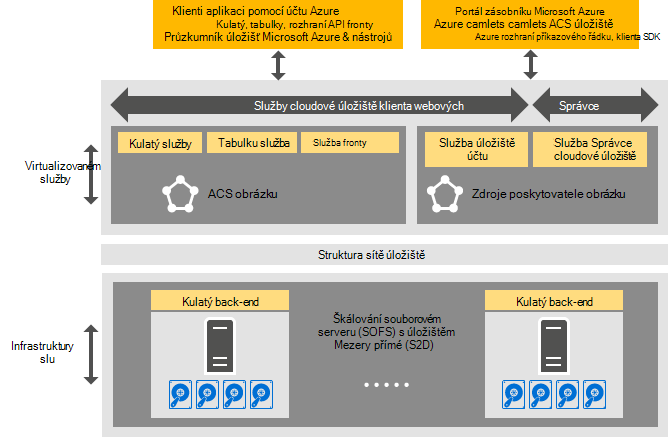

<properties
    pageTitle="Úvod k základnímu úložišti Azure konzistentní | Microsoft Azure"
    description="Další informace o Azure konzistentní úložiště"
    services="azure-stack"
    documentationCenter=""
    authors="AniAnirudh"
    manager="darmour"
    editor=""/>

<tags
    ms.service="azure-stack"
    ms.workload="na"
    ms.tgt_pltfrm="na"
    ms.devlang="na"
    ms.topic="get-started-article"
    ms.date="09/26/2016"
    ms.author="anirudha"/>

# Úvod k základnímu úložišti konzistentní Azure
Azure konzistentní úložiště je sada služby cloudové úložiště v aplikaci Microsoft Azure vrstvě. Azure konzistentní úložiště poskytuje objektů blob, tabulky, fronty a funkce správy účtu s Azure konzistentní sémantiku. Také poskytuje funkce do cloudu správce spravovat úložiště služby. Tento článek uvádí Azure konzistentní úložiště a popisuje, jak úložiště cloudovým službám ve vrstvě Azure dobře doplnit spoustu [funkce definované uživatelem softwaru úložiště v systému Windows Server 2016](https://blogs.technet.microsoft.com/windowsserver/2016/04/14/ten-reasons-youll-love-windows-server-2016-5-software-defined-storage/).

Azure konzistentní úložiště poskytuje následující kategorií funkcí:

- **Objekty BLOB**: stránka objektů BLOB blokovat objektů BLOB a připojit objektů BLOB s   [objektů blob Azure konzistentní](https://msdn.microsoft.com/library/azure/dd179355.aspx#Anchor_1) 
   chování

- **Tabulky**: entity, oddíly a jiné vlastnosti tabulky s   [Azure konzistentní tabulky](https://msdn.microsoft.com/library/azure/dd179355.aspx#Anchor_3) 
   chování

- **Fronty**: spolehlivý a jestli ho trvalý zprávy a fronty s   [Azure konzistentní fronty](https://msdn.microsoft.com/library/azure/dd179355.aspx#Anchor_2) 
   chování

- **Účty**: řízení zdrojů úložiště účet   [Azure konzistentní](https://azure.microsoft.com/documentation/articles/storage-create-storage-account/) účtem
   chování u účtů univerzální úložiště zřízení prostřednictvím [Správce prostředků Azure nasazení modelu](https://azure.microsoft.com/documentation/articles/resource-manager-deployment-model/)

- **Správa**: Správa služeb interní úložiště klienta webových a konzistentní Azure úložiště (popisované v dalších článků)

## Architektura Azure konzistentní úložiště

Obrázek 1. Azure konzistentní úložiště: zobrazení řešení

## Azure konzistentní úložiště virtualizované služeb a clusterů

V Azure konzistentní architektura úložiště jsou virtualizované všechny klienta nebo přístupné pro správce úložiště služby. To znamená spouštějí služby poskytovatele Správa přístupových práv, která je velmi dostupná VMs založené na funkcích [Hyper-V](https://technet.microsoft.com/library/dn765471.aspx) systému [Windows Server 2016](http://www.microsoft.com/server-cloud/products/windows-server-2016/).
Sice VMs vysoce dostupné založené na technologii [Clusterů selhání systému Windows Server](https://technet.microsoft.com/library/dn765474.aspx) , Azure konzistentní služby úložiště virtualizované sami se skupinový hosta vysoce dostupné služeb založené na [technologii struktury služby Azure](http://azure.microsoft.com/campaigns/service-fabric/).

Azure konzistentní úložiště využívá dva clusterů struktury služby Azure zásobníku nasazení.
Zprostředkovatele prostředků úložiště služby nasazené na clusteru služby struktury ("RP clusteru"), který se sdílejí také jiné poskytovatele služby základní zdroje. Zbytek ukládání virtualizované služby cestu dat – včetně objektů Blob, tabulky a fronty služby – jsou hostované na druhý cluster služby struktury ("obrázku s Azure konzistentní úložiště").

## Služba objektů BLOB a definované uživatelem softwaru úložiště

Kulatý služby zpět ukončíte na druhé straně spustí přímo na [Souborovém serveru škálování](https://technet.microsoft.com/library/hh831349.aspx) uzlů. V architektury řešení Azure zásobníku škálování souborovém serveru se podle [Úložiště mezery přímé](https://technet.microsoft.com/library/mt126109.aspx)-podle, sdílené není nic překlopení obrázku. Obrázek 1 popisuje hlavní služby Azure konzistentní součástí úložiště a jejich distribuované nasazení modelu. Jak vidíte v diagramu, Azure konzistentní úložiště dovetails s existujících funkcí definovaných software úložiště ve Windows serveru 2016. Žádné speciální hardware je potřebný pro Azure konzistentní úložiště za tyto požadavky platformu systému Windows Server.

## Úložiště farmy

Úložiště farma je v kolekci infrastruktura úložiště, zdroje a back-end služeb, které společně poskytovat přístupným tenanta a správce přístupným Azure konzistentní úložiště služby Azure zásobníku nasazení. Konkrétně úložiště farmy patří:

- Hardwarová úložiště (například uzly škálování souborovém serveru, disků)

- Úložiště struktury zdrojů (například sdílené položky SMB)

- Úložiště služby struktury služeb (například objektů Blob koncového bodu služby vypnout Azure konzistentní úložiště obrázku)

- V záležitostech úložiště služby spuštěné v operačním systému uzly škálování souborovém serveru (například služba objektů Blob)

## IaaS a PaaS scénáře využití úložiště

Objekty BLOB stránky Azure konzistentní úložiště, jako Azure, zadejte virtuálních disků ve všech infrastruktury jako využití služeb (IaaS) scénáře:

- Vytvoření virtuálního počítače pomocí vlastní disku OS v objektů blob stránky

- Vytvoření virtuálního počítače pomocí vlastního obrázku s operačním systémem v objektů blob stránky

- Vytvoření virtuálního počítače pomocí obrázek z webu Azure Marketplace v nových objektů blob stránky

- Vytvoření virtuálního počítače pomocí prázdný disk v nových objektů blob stránky

Podobně platformy jako scénáře služby (PaaS), Azure konzistentní objektů BLOB úložiště bloku přidat objektů BLOB fronty, a tabulek práce jako v Azure.

## Role uživatelů

Azure konzistentní úložiště je užitečný pro dva role uživatelů:

- Vlastníci aplikace, včetně vývojáři a enterprise IT. Už mají zachovat nebo nasadit dvě verze aplikace a skripty, které provádět stejnou úlohu různých veřejné cloudu a hostované soukromá/cloudu v datacentra. Azure konzistentní úložiště poskytuje úložiště služby prostřednictvím rozhraní REST API, SDK, rutina a portál Azure vrstvě.

- Poskytovatelé, včetně enterprise IT, kteří nasazením a správou založené na Microsoft Azure zásobníku, víceklientské úložiště cloudovým službám.

## Další kroky

- [Azure konzistentní úložiště: rozdíly a co byste měli zvážit] (azure zásobníku acs rozdíly tp2.md)
