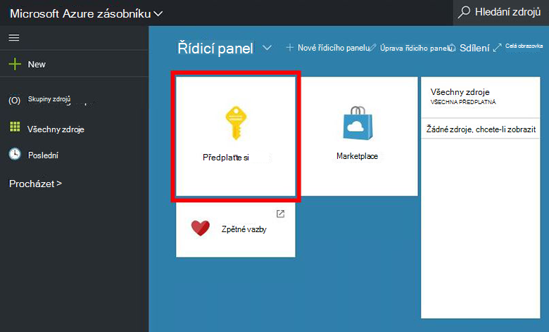
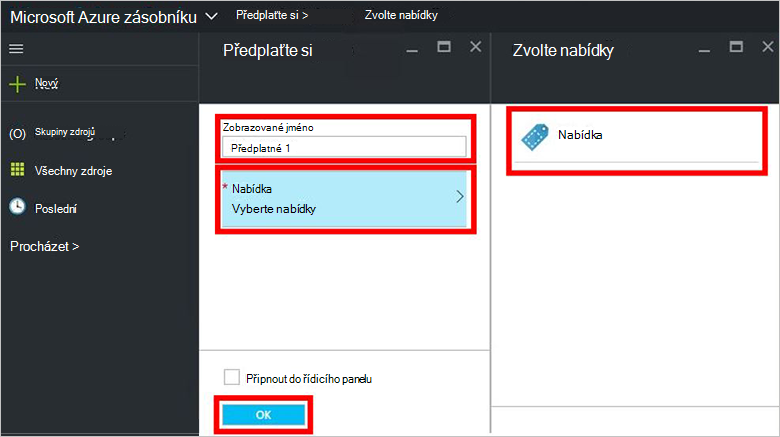
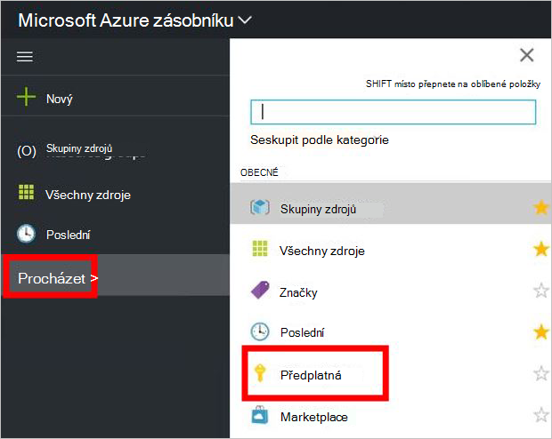

<properties
    pageTitle="Přihlášení k odběru nabídky a pak zřízení OM ve vrstvě Azure (klient) | Microsoft Azure"
    description="Jako ke klientovi informace o přihlášení k odběru nabídky a zřízení OM ve vrstvě Azure."
    services="azure-stack"
    documentationCenter=""
    authors="ErikjeMS"
    manager="byronr"
    editor=""/>

<tags
    ms.service="azure-stack"
    ms.workload="na"
    ms.tgt_pltfrm="na"
    ms.devlang="na"
    ms.topic="get-started-article"
    ms.date="09/26/2016"
    ms.author="erikje"/>

# Přihlášení k odběru nabídky

Teď, když jste [vytvořili nabídky](azure-stack-create-offer.md)otestujte, aby vaše klientů můžete vytvořit předplatné.

1.  Na počítači Koncepce zásobníku Azure, přihlaste se k `https://portal.azurestack.local` jako [klienta](azure-stack-connect-azure-stack.md#log-in-as-a-tenant) a klikněte na tlačítko **získat předplatné**.

    

2.  Do pole **Zobrazovaný název** zadejte název vašeho předplatného klikněte na tlačítko **Nabídka**, klepněte na jednu z nabídek na zásuvné **zvolit nabídky** a pak klikněte na **vytvořit**.

    

4.  Zobrazení předplatné, které jste vytvořili, klikněte na tlačítko **Procházet**, klikněte na **předplatná**a pak klikněte na nové předplatné.  

    

Jakmile se přihlásíte k odběru nabídky, aktualizujte portálu zobrazíte služby, které jsou součástí nové předplatné.

## Další kroky

[Zřízení virtuálního počítače](azure-stack-provision-vm.md)
