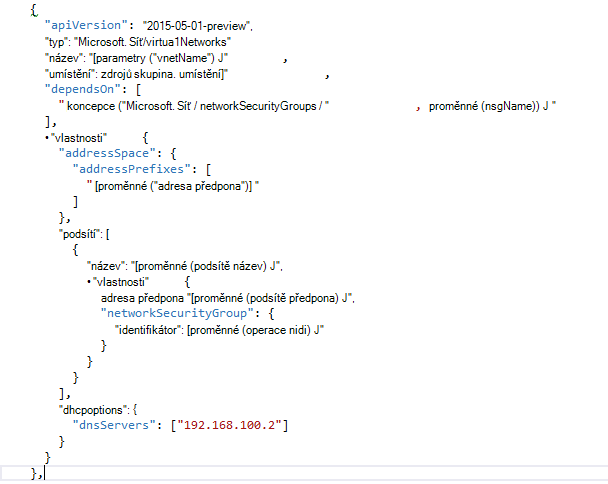

<properties
    pageTitle="Principy DNS v Azure zásobníku TP2 | Microsoft Azure"
    description="Principy novými funkcemi DNS a funkcí v Azure zásobníku TP2"
    services="azure-stack"
    documentationCenter=""
    authors="ScottNapolitan"
    manager="darmour"
    editor=""/>

<tags
    ms.service="azure-stack"
    ms.workload="na"
    ms.tgt_pltfrm="na"
    ms.devlang="na"
    ms.topic="get-started-article"
    ms.date="09/26/2016"
    ms.author="scottnap"/>

# Úvodní informace o iDNS Azure zásobníku
================================

iDNS je nová funkce v náhledu 2 technologie pro zásobníku Azure, která umožňuje Kontrola jmen externí DNS (například http://www.bing.com).
Také umožňuje registrovat názvy interní virtuální sítě. Tímto způsobem můžete vyřešit VMs ve stejné síti virtuální název spíše než IP adresu, aniž by bylo nutné zadat vlastní položky serveru DNS.

Je něco, co byl vždy tam v Azure, ale teď je k dispozici ve Windows serveru 2016 a Azure zásobníku příliš.

Co dělá iDNS?
------------------

Se iDNS ve vrstvě Azure získáte následující funkce, aniž by bylo nutné zadat vlastní položky serveru DNS.

-   Sdílené služby rozlišení názvů DNS pro klienta úloh.

-   Autoritativní služby DNS pro překlad a registrace DNS v rámci virtuální sítě klienta.

-   Služba DNS rekurzivní pro překlad jmen Internet z klienta VMs. Klienti už musí zadat vlastní záznamy DNS Kontrola jmen Internetu (například www.bing.com).

Pořád můžete přenést vlastní DNS a vlastní servery DNS Pokud chcete použít. Ale teď, pokud jste právě chcete vyřešit Internet DNS jména a se připojit k jiné virtuálních počítačích ve stejné síti virtuální, nemusíte nic zadat a jenom budou fungovat.

Co iDNS nedělá?
---------------------

Jaké iDNS nelze provést je vytvoření záznamu DNS pro název, který může být přeložena z mimo virtuální sítě.

V Azure máte možnost určit popisek název DNS, který jde přidružit veřejnou IP adresu. Klikněte na popisek (předpona), ale Azure zvolí příponu, který je založený na oblast, ve kterém můžete vytvořit veřejnou IP adresu.

Na obrázku nahoře vytvoří Azure "Na" záznam DNS název popisku DNS určené ve skupinovém rámečku zóny **westus.cloudapp.azure.com**. Předpona a přípona společně tvoří plně kvalifikovaný název domény (FQDN), můžete vyřešit kdekoli na veřejné Internetu.

TP2 Azure zásobníku pouze podporuje iDNS pro registraci interního názvu tak nemůžete postupujte takto.

-   Vytvoření DNS záznamu, klikněte v části existující hostovanou zóny DNS (například azurestack.local).

-   Vytvoření DNS zone (třeba Contoso.com).

-   Vytvoření záznamu v části vlastní vlastní zóny DNS.

-   Podpora nákupní názvy domén.

Změny v DNS z Azure zásobníku TP1
-----------------------------------

Ve verzi technologie náhled 1 (TP1) Azure zásobníku bylo nutné zadat vlastní servery DNS, pokud jste chtěli vyřešit hosts název neinstaluje z IP adresu. To znamená, že pokud jste vytvořili virtuální sítě nebo virtuálního počítače, bylo nutné zadat aspoň jeden záznam DNS server. Prostředí TP1 Koncepce to mysleli zadávání IP Koncepce struktury DNS server, a to 192.168.200.2.

Pokud jste vytvořili OM prostřednictvím portálu, bylo nutné v virtuální síť nebo ethernet adaptér nastavení vyberte **Vlastní DNS** .

V TP2 můžete vybrat Azure DNS a není nutné zadávat vlastní položky serveru DNS.

Pokud jste vytvořili vlastní obrázek OM pomocí šablony, bylo nutné přidat vlastnost **DHCPOptions** a DNS server, abyste mohli získávat DNS překládání práce. Na následujícím obrázku vidíte, jak to vypadalo.

V TP2 už nepotřebujete tyto změny provedete k šablonám OM umožňuje VMs jmen Internet. Jenom budou pracovat.