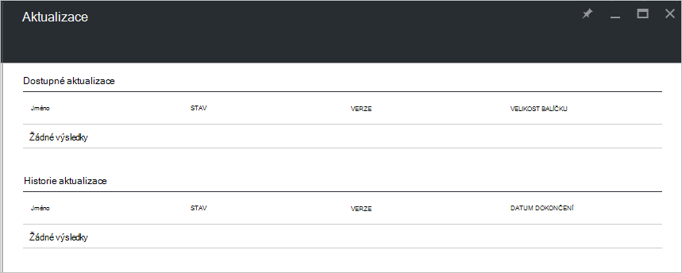

<properties
    pageTitle="Aktualizace v Azure zásobníku | Microsoft Azure"
    description="Další informace o aktualizacích ve vrstvě Azure"
    services="azure-stack"
    documentationCenter=""
    authors="HeathL17"
    manager="byronr"
    editor=""/>

<tags
    ms.service="azure-stack"
    ms.workload="na"
    ms.tgt_pltfrm="na"
    ms.devlang="na"
    ms.topic="article"
    ms.date="09/26/2016"
    ms.author="Helaw"/>

# Správa aktualizací ve vrstvě Azure
Technical Preview 2 uvádí Náhled prostředí pro správu aktualizací Azure vrstvě.  V tomto tématu se přejděte na uzel aktualizace.  

## Aktualizace zásuvné
1.  Dostupnost zásuvné aktualizace, klikněte na **Procházet** a pak klikněte na **aktualizace**.

2.  Klikněte na **místní** umístění.

3.  Bude vidět obrazovku seznam dostupných aktualizací a historie aktualizací.  V části Technical Preview 2 bude k dispozici pro instalaci bez aktualizace.  

    

## Další kroky
- [Princip Azure zásobníku Koncepce architektura](azure-stack-architecture.md)      
- [Princip zjistit předpoklady pro nasazení](azure-stack-deploy.md)
- [Nasazení Azure zásobníku](azure-stack-run-powershell-script.md)
 
    
  

  

