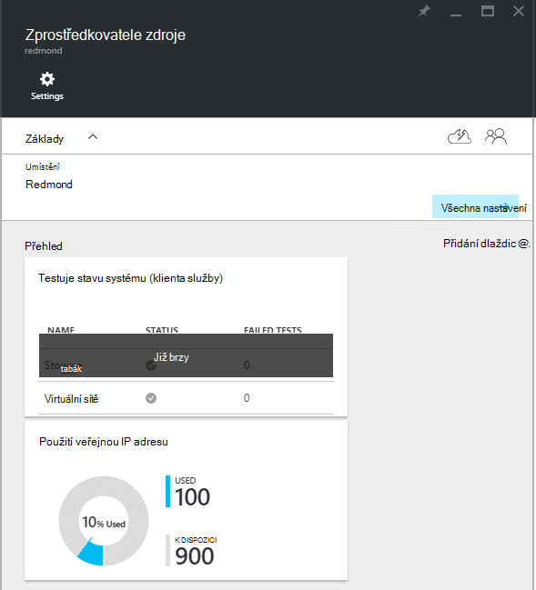
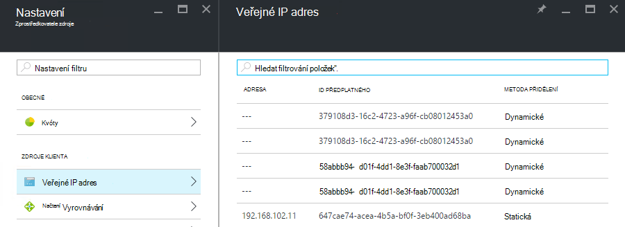

<properties
    pageTitle="Zobrazení veřejné spotřebu IP adres v TP2 | Microsoft Azure"
    description="Správci mohou zobrazit spotřebu veřejných IP adres v oblasti:"
    services="azure-stack"
    documentationCenter=""
    authors="ScottNapolitan"
    manager="darmour"
    editor=""/>

<tags
    ms.service="azure-stack"
    ms.workload="na"
    ms.tgt_pltfrm="na"
    ms.devlang="na"
    ms.topic="get-started-article"
    ms.date="09/26/2016"
    ms.author="scottnap"/>

# Zobrazení veřejnou IP adresu spotřebu v Azure zásobníku TP2

Jako správce služby můžete zobrazit počet veřejnou IP adresy, které jste dostali přidělené k tenantům číslo veřejné IP adresy, které jsou pořád dostupné pro přidělení a procento veřejnou IP adresy, které jste dostali přidělené v uvedeném umístění.

Na **Veřejnou IP adresu použití** dlaždici zobrazuje celkový počet veřejné IP adresy, které spotřebované přes všechny veřejnou IP adresu fondy v topologii, zda byly použity pro klienta instancí IaaS OM, struktury infrastruktury služby nebo veřejných zdrojů IP adresy, které se výslovně vytvářely klienti.

Této dlaždici účel správcům Azure zásobníku představu o celkový počet veřejné IP adresy, které spotřebované v tomto umístění. To umožňuje správcům určit, zda jsou na málo tohoto zdroje.

Položka nabídky **Veřejnou IP adres** ve skupinovém rámečku **klienta zdroje** na zásuvné **Nastavení** seznamy pouze veřejné IP adresy, které byly *explicitně vytvořil klienti*. Počet **použité** dlaždice veřejný IP adresy na **Veřejnou IP adresu použití** je jako takové vždy liší od (větší než) čísla na dlaždici **Veřejný IP adres** ve skupinovém rámečku **klienta zdroje**.

## Zobrazit informace o veřejnou IP adresu použití

Chcete-li zobrazit celkový počet veřejnou IP adresy, které spotřebované v oblasti:

1.  Na portálu zásobníku Azure klikněte na tlačítko **Procházet**a vyberte **Zdroj poskytovatelů**.

2.  Ze seznamu poskytovatelů **Zdroje**vyberte **Poskytovatele správce sítě zdroje**.

3.  Případně můžete kliknout na **Procházet | Umístění** a vyberte umístění, které si přejete zobrazit ze seznamu. Na dlaždici **Poskytovatelů zdroje** vyberte **Poskytovatele správce sítě zdroje**.

4.  Zásuvné cílová **Zprostředkovatele zdroje** se zobrazí na **Veřejnou IP adresu použití** dlaždici v části **Přehled** .

Mějte na paměti, že **použité** číslo představuje počet veřejnou IP adresy ze všech veřejnou IP adresu fondů v uvedeném umístění, které jsou přiřazené. **K dispozici** číslo představuje počet veřejnou IP adresy ze všech veřejnou IP adresu skupin, které nebyly přiřazeny a jsou pořád dostupné. **% Použité** číslo představující počet použitých nebo přiřazené adresy jako procento celkového počtu veřejnou IP adresy ve všech veřejnou IP adresu fondů v uvedeném umístění.

## Zobrazení veřejné IP adresy, které se vytvářely předplatná klienta

Zobrazíte seznam veřejných IP adres, které se výslovně vytvářely klienta předplatná v určité oblasti přejděte na zásuvné **Nastavení** **Poskytovatele správce sítě zdroje**a klikněte na **Veřejnou IP adres**.

Může se stát, že některé IP adresy, které jste dostali přidělené dynamicky se zobrazí v seznamu, ale nemáte adresu je ještě přidruženou. Je to proto prostředek adresy vytvořeného v zprostředkovatele zdroje, ale ne v síťový adaptér ještě.

Síťový adaptér nepřiřazuje adresu si tyto materiály, dokud je skutečně vázaný na nějakého rozhraní, síťová karta (NIC), Vyrovnávání zatížení nebo brány virtuální sítě. Při veřejnou IP adresu je vázaný na nějakého rozhraní, síťový adaptér přidělí IP adresu k němu a zobrazí se v poli **adresa** .

## Zobrazení veřejnou IP adresu informace souhrnné tabulce

Existuje několik různých případů ve kterých jsou přiřazené veřejnou IP adresy, které zjistit, zda adresa se zobrazí v jednom seznamu nebo jiného.

| **Veřejnou IP adresu přiřazení případu** | **Zobrazí se v souhrn využití** | **Zobrazí se v klientovi veřejné seznam adres IP** |
| ------------------------------------- | ----------------------------| ---------------------------------------------- |
| Dynamické veřejnou IP adresu dosud nepřiřazených NIC nebo k načtení vyrovnávání (dočasné) | Ne | Ano |
| Dynamické veřejnou IP adresu přiřazená NIC nebo k načtení vyrovnávání. | Ano | Ano |
| Statických veřejnou IP adresu přiřazené k tenantovi NIC nebo k načtení vyrovnávání. | Ano | Ano |
| Statický veřejnou IP adresu přiřazená koncový bod struktury infrastruktury služby. | Ano | Ne |
| Veřejnou IP adresu implicitně vytvořena pro IaaS OM instance a použít k odchozí překladu síťových adres virtuální síti se systémem. Toto jsou na pozadí kdykoli vytvořen klienta, kterého vytvoříte instanci OM, VMs odesílat informace k Internetu. | Ano | Ne |
