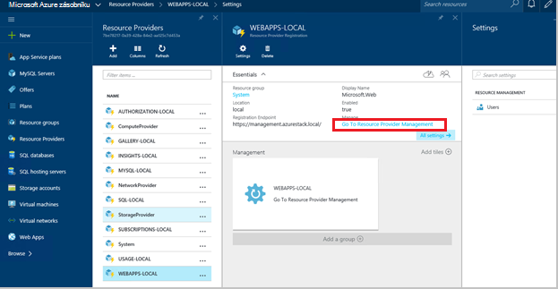

<properties
    pageTitle="Přidání více webových aplikací Web Apps webové pracovní role | Microsoft Azure"
    description="Podrobné pokyny pro změnu velikosti Azure zásobníku Web Appu"
    services="azure-stack"
    documentationCenter=""
    authors="kathm"
    manager="slinehan"
    editor=""/>

<tags
    ms.service="azure-stack"
    ms.workload="app-service"
    ms.tgt_pltfrm="na"
    ms.devlang="na"
    ms.topic="article"
    ms.date="09/26/2016"
    ms.author="kathm"/>

#   <a name="web-apps-adding-more-web-worker-roles"></a>Webové aplikace: Přidání další role pracovní web

> [AZURE.NOTE] Tyto informace platí jenom pro nasazení TP1 zásobníku Azure.

Tento dokument obsahuje pokyny, jak zobrazit webových aplikací web pracovního role. Obsahuje postup pro vytvoření další webové pracovní role pro podporu webové aplikace nabídky libovolné velikosti.

Azure zásobníku podporuje nasazení zdarma a sdílené webové aplikace. Přidání dalších typů, musíte přidat další role pracovní web.

Pokud si nejste jistí, co nasazené k instalaci výchozí Web Apps, můžete zobrazit další informace [v tomto poli](azure-stack-webapps-overview.md).

Role pracovní webových měřítko podporují následující kroky:

1.  [Vytvoření nového virtuálního počítače](#step-1-create-a-new-vm-to-support-the-new-instance-size)

2.  [Konfigurace virtuálního počítače](#step-2-configure-the-virtual-machine)

3.  [Konfigurace roli pracovní web na portálu Azure zásobníku](#step-3-configure-the-web-worker-role-in-the-azure-stack-portal)

4.  [Nakonfigurovat aplikaci služby plány](#step-4-configure-app-service-plans)

##<a name="step-1-create-a-new-vm-to-support-the-new-instance-size"></a>Krok 1: Vytvoření nového OM pro podporu nové instance velikosti

Vytvoření virtuálního počítače způsobem popsaným v [tomto článku](azure-stack-provision-vm.md), zajistit, že jsou určené následujících možností:

 - Uživatelské jméno a heslo: Zadejte stejné uživatelské jméno a heslo, které při instalaci aplikací Web Apps.

 - Předplatné: Pomocí výchozího poskytovatele předplatného.

 - Pole Skupina zdroje: Zvolte **AppService místní**.

> [AZURE.NOTE]Obsahují virtuálních počítačích pro pracovní role ve stejné skupině zdroje jako nasazení aplikace na Web Apps. (Doporučuje se v této verzi.)

##<a name="step-2-configure-the-virtual-machine"></a>Krok 2: Nakonfigurujte virtuální počítač

Po dokončení nasazení je následující konfigurace potřebný kvůli podpoře roli pracovní web:

1.  Otevřete správce serveru na hostitelském počítači a klikněte na **Nástroje** &gt; **Technologií HyperV správce**.

2.  Připojení pomocí vzdálené plochy RDP (Protocol) do nového virtuální počítač, který jste vytvořili v kroku 1. Název serveru se nachází v podokně Souhrn, je-li vybrán každý OM.

3.  Otevřete PowerShell po kliknutí na tlačítko **Start** a vypsáním Powershellu. Klikněte pravým tlačítkem myši **PowerShell.exe**a vyberte **Spustit jako správce** otevřete Powershellu v režimu správce.

4.  Kopírování a vkládání každé z následujících příkazů (postupně) do okna prostředí PowerShell a stiskněte klávesu enter:

    ```netsh advfirewall firewall set rule group="File and Printer Sharing" new enable=Yes```
    ```netsh advfirewall firewall set rule group="Windows Management Instrumentation (WMI)" new enable=yes```
    ```reg add HKLM\\SOFTWARE\\Microsoft\\Windows\\CurrentVersion\\Policies\\system /v LocalAccountTokenFilterPolicy /t REG\_DWORD /d 1 /f```

5.  Restartujte virtuální počítač.

> [AZURE.NOTE]Poznámka: Toto jsou minimální požadavky na Web Apps. Jsou výchozí nastavení aplikace Windows 2012 R2 obrázek zahrnutý v sadě Azure vrstvě. Pokynů jste obdrželi pro pozdější potřeby a uživatelům, pomocí jiným obrázkem.

##<a name="step-3-configure-the-web-worker-role-in-the-azure-stack-portal"></a>Krok 3: Konfigurace roli pracovní web na portálu Azure zásobníku

1.  Otevřete portál jako správce služby na **ClientVM**.

2.  Přejděte na **zdroje poskytovatelů** &gt; **WEBAPPS místní**.

    
 
3.  Klikněte na **Přejít na poskytovatele řízení zdrojů**.

4.  Klikněte na položku **role**.

    
 
5.  Klikněte na **Přidat instanci rolí**.

6.  Klikněte na tlačítko **vrstvy** chcete nasadit nové instance (malá, střední, velká nebo sdílený).

    
 
7.  Nakonfigurujte tyto možnosti:
 - Webu název serveru: Zadejte IP adresu serveru, na který jste vytvořili dříve (v části 1).
 - Typ role: Pracovní Web
 - Pracovníka osy: Shody úroveň velikost vybrané.

8. Klikněte na **OK.**

9. Přihlaste se k CN0 OM a otevřete **MMC Management cloudu Web**.

10. Přejděte na **Web cloudu** &gt; **spravovaných servery**.

11. Klikněte na název serveru, který jste právě nainstalovali. Prohlédněte si sloupec Stav a počkejte, dokud stav je "Připraveno" přejděte k dalšímu kroku.

    

##<a name="step-4-configure-app-service-plans"></a>Krok 4: Konfigurace aplikace služby plány

> [AZURE.NOTE]V dané verzi webové aplikace musí být aplikace služby plány uloženy v samostatné skupiny prostředků. Vytvoření skupiny prostředků pro každou velikost v prohlížeči a dejte plány aplikace ve svých skupinách příslušné zdroje.

1.  Přihlaste se k portálu na ClientVM.

2.  Přejděte na **Nový** &gt; **Web a Mobile**.

3.  Vyberte webovou aplikaci, kterou chcete nasadit.

4.  Zadejte informace pro web app a potom vyberte **AppService plán / umístění**.

-   Klikněte na **vytvořit nový**.

-   Vytvoření nového plánu výběrem odpovídajících cenových osy plánu.

> [AZURE.NOTE]Můžete vytvořit více plány na tomto zásuvné. Před nasazením, ale zkontrolujte, zda že jste vybrali odpovídající plán.

Na následujícím obrázku je příklad k dispozici více plánů:    

##<a name="final-web-app-service-vm-configuration"></a>Konfigurace konečný OM služby v prohlížeči

Na následujícím obrázku nabízí zobrazení prostředí po mít diagramů s měřítky role pracovní web. Zelené položky představují novou roli doplňky.
    
