<properties
     pageTitle="Jak vytvořit žádost o konverzaci Azure podpory | Microsoft Azure"
     description="Jak vytvořit žádost o konverzaci Azure podpory."
     services="Azure Supportability"
     documentationCenter=""
     authors="ganganarayanan"
     manager="scotthit"
     editor=""/>

<tags
     ms.service="azure-supportability"
     ms.workload="na"
     ms.tgt_pltfrm="na"
     ms.devlang="na"
     ms.topic="article"
     ms.date="10/25/2016"
     ms.author="gangan"/>

# Jak vytvořit žádost o konverzaci Azure podpory

## Souhrn
Azure Zákazníci můžete vytvářet a spravovat požadavky podpory na portálu Azure [https://portal.azure.com](https://portal.azure.com).
>[AZURE.NOTE] Azure portálu pro Německo je [https://portal.microsoftazure.de](https://portal.microsoftazure.de) a pro státní správu Azure portál [https://portal.azure.us](https://portal.azure.us).

Na základě reakcí zákazníků jsme aktualizovali jste prostředí žádost o podporu se zaměřit na tři hlavní cíle:

- **Streamlined**: zmenšení myší a listy zjednodušuje provádění proces odešlete žádost o podporu.
- **Integrované**: Pokud máte problém s Azure zdroje Poradce při potížích s, by měl být snadno otevřete žádost o podporu pro daný zdroj bez přepnutí kontextu.
- **Efektivní**: shromáždění informací o klíči pracovníka podpory muset efektivní problém vyřešit.

## Začínáme
Žádost o podporu můžete vytvořit z nabídky horním navigačním panelu nebo přímo z zásuvné zdroje.

**Na horním navigačním panelu**

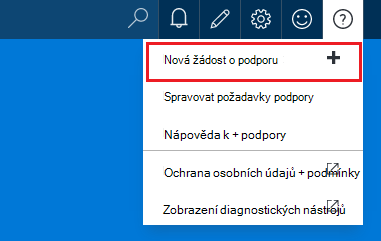

**Z zásuvné zdroje**

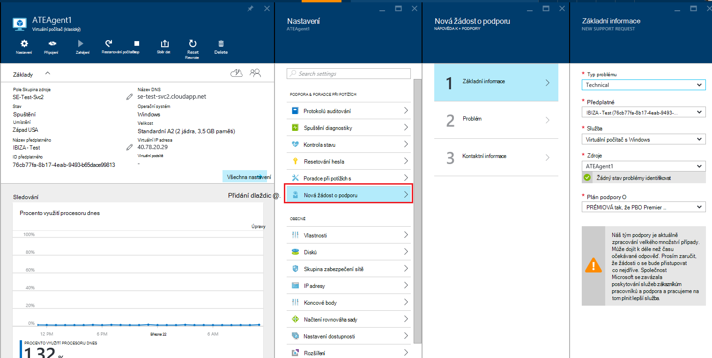

## Základní informace
Cílem prvního kroku procesu žádost o podporu shromažďuje základní informace o problém a plán podpory.

Podívejme se příklad: máte protilehlé technické potíže s virtuálního počítače a podezření síťového připojení.
Výběr služby ("virtuální počítač s Windows") a zdroje (jméno virtuálního počítače) v prvním kroku průvodce se spustí proces získání nápovědy pro tento problém.

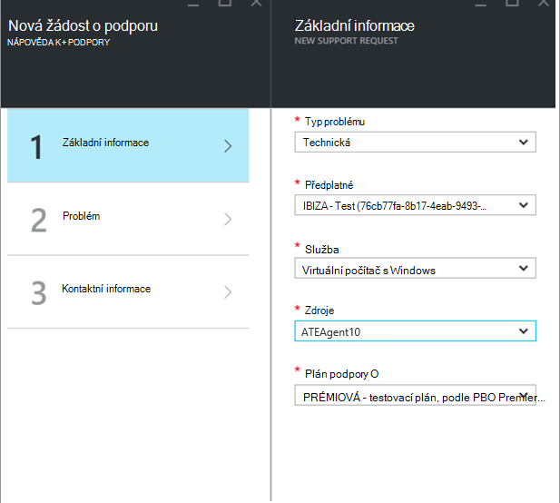

>[AZURE.NOTE] Azure podporuje neomezenou pro správu předplatného (například fakturace, kvóty úprav a přenosy účet). Technická podpora budete potřebovat plán podpory. [Další informace o různých plánech podpory](https://azure.microsoft.com/support/plans).

## Problém
Druhý krok průvodce shromažďuje další podrobnosti o tomto problému. Přesné informací v tomto kroku umožňuje nám chcete směrovat nejlepší pracovníka podpory pro tento problém váš případ a začněte Diagnostika tento problém co nejdříve.

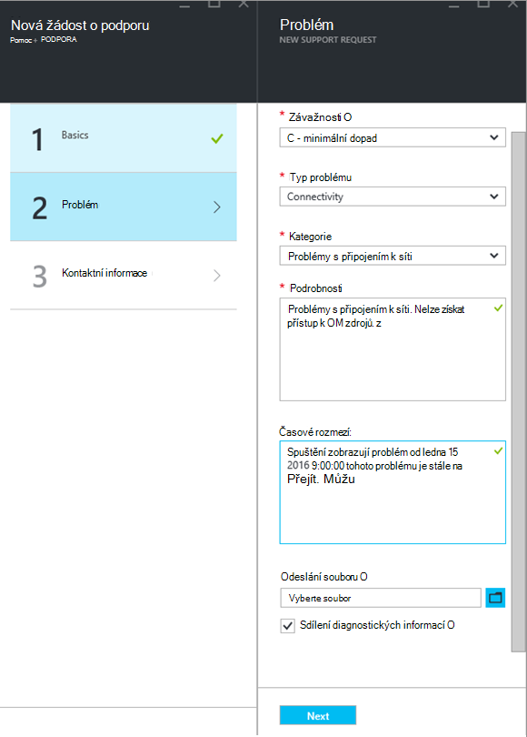

Pokračováním z výše uvedeném příkladu připojení virtuálního počítače k vyplnění tento formulář vyznačení síťového připojení a umožní další podrobnosti o problému s maximálním přibližnou čas, kdy došlo problému.

## Související Nápověda
U některých problémů nabízíme odkazy související Nápověda k řešení problému. Pokud se vám navrhovaných dokumentů, můžete dál procesem vytvořit žádost o podporu.
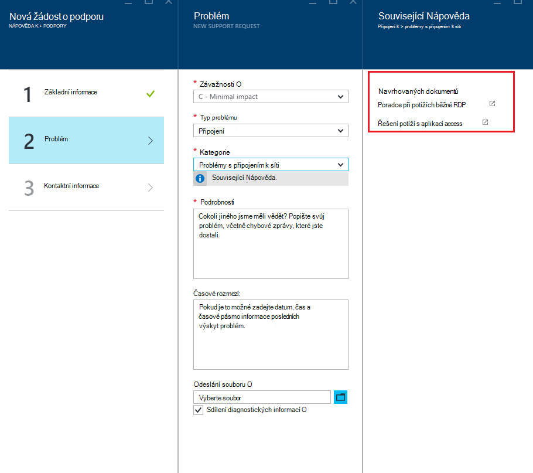

## Kontaktní informace
Posledním kroku průvodce potvrdí kontaktních informací tak nám vědět, jak můžete kontaktovat.
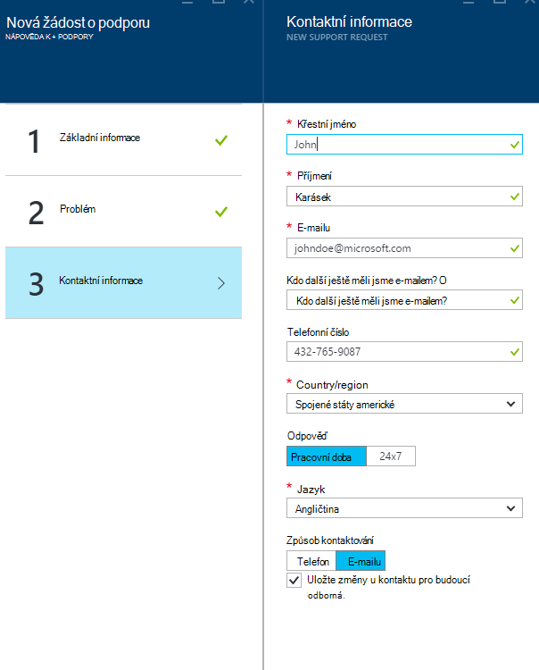

V závislosti na závažnosti problém můžete být požádáni o označuje, zda chcete vás kontaktovat během pracovní doby nebo pokud chcete raději odpověď 24 denně, 7, což znamená, že vás můžeme kontaktovat kdykoli.
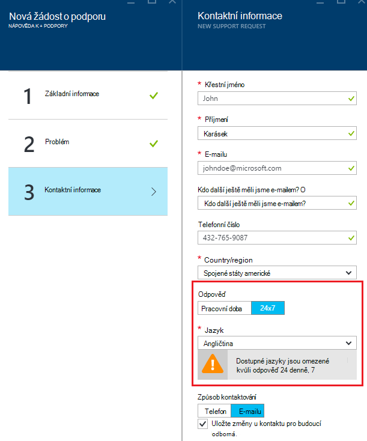

## Spravovat požadavky podpory
Po vytvoření žádost o podporu můžete zobrazit údaje na stránce **Spravovat požadavky podpory** .

**Na horním navigačním panelu**

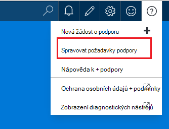

Na stránce **Spravovat požadavky podpory** můžete zobrazit všechny žádosti o podporu a jejich stav.
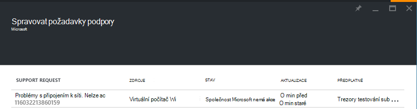

Vyberte žádost o podporu a zobrazit podrobnosti, včetně závažnosti a očekávané čas, kdy bude trvat pro pracovníka podpory reagovat.
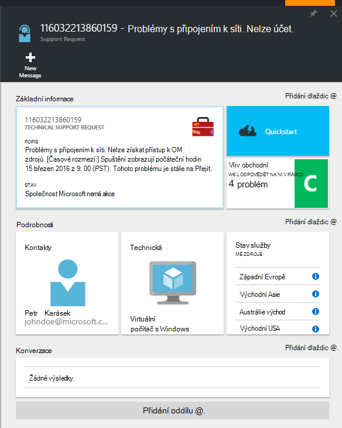

Pokud chcete změnit závažnosti žádost, klikněte na dlaždici **obchodních výsledků** . V příkladu před žádost je nastaven závažnosti c.

Kliknutí na dlaždici zobrazuje seznam severities přiřazené na žádost otevřít podpory.

>[AZURE.NOTE] Úroveň maximální závažnosti závisí na plán podpory. [Další informace o různých plánech podpory](https://azure.microsoft.com/support/plans).

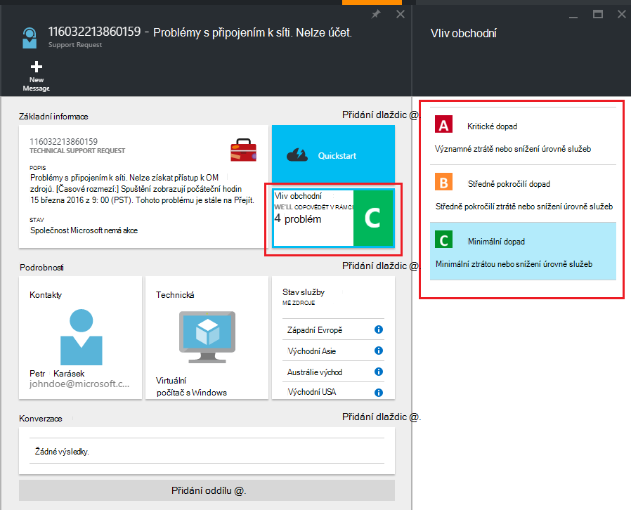

## Zpětné vazby
Jsme vždy otevřít pro názory a návrhy! Pošlete nám prosím [návrhů](https://feedback.azure.com/forums/266794-support-feedback). Můžete navíc zapojit s abychom prostřednictvím [Twitter](https://twitter.com/azuresupport) nebo na [fóra MSDN](https://social.msdn.microsoft.com/Forums/azure).

## Víc se uč
[Nejčastější dotazy týkající se Azure podpory](https://azure.microsoft.com/support/faq)
