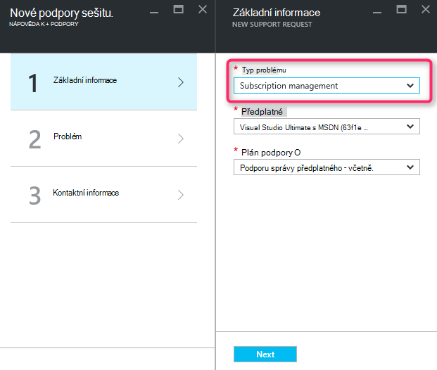
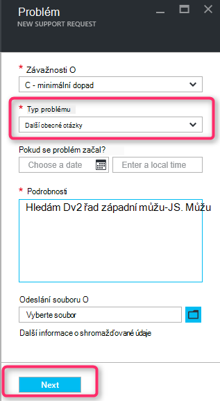
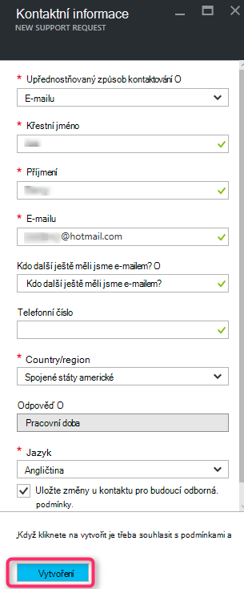

<properties
     pageTitle="Není k dispozici řadu SKU | Microsoft Azure"
     description="Některé SKU řady jsou k dispozici u vybraného předplatného pro tuto oblast."
     services="Azure Supportability"
     documentationCenter=""
     authors="ganganarayanan"
     manager="scotthit"
     editor=""/>

<tags
     ms.service="azure-supportability"
     ms.workload="na"
     ms.tgt_pltfrm="na"
     ms.devlang="na"
     ms.topic="article"
     ms.date="08/12/2016"
     ms.author="gangan"/>

# Není k dispozici řadu SKU

V některých oblastech nejsou určitých skladové jednotky automaticky k dispozici na nové předplatné.  K tomu může dojít při [výkonnější skladové jednotky jsou uvedeny v oblasti](https://azure.microsoft.com/updates/announcing-new-dv2-series-virtual-machine-size/) a oblíbenosti zastaralých SKU odmítne.
Při vytváření žádost o podporu zvýšit kvóty pro využití základní, zobrazí se zpráva "*některé SKU řady nejsou k dispozici u vybraného předplatného pro tuto oblast*".

Možná bude kontrola dostupnosti SKU na stránce [služby Azure podle oblasti](https://azure.microsoft.com/regions/#services) . 

Vyžádání přístupu ke SKU omezenými ze svého předplatného, vytvořte žádost o podporu "Pro správu předplatného".

- Na stránce základní informace o vyberte typ problému jako "Pro správu předplatného" a "Pak" klepněte.

- Na stránce problém vyberte typ problému jako "Další obecné otázky" a zadejte přesnou oblast a SKU nezobrazují.
Díky urychlení procesu technické podpory.

- Na stránce kontaktní informace zadejte podrobnosti o kontaktu a klikněte na "Vytvořit".

## Zpětné vazby
Jsme vždy otevřít pro názory a návrhy! Pošlete nám [návrhů](https://feedback.azure.com/forums/266794-support-feedback). Můžete navíc zapojit s abychom prostřednictvím [Twitter](https://twitter.com/azuresupport) nebo na [fóra MSDN](https://social.msdn.microsoft.com/Forums/azure).

## Víc se uč
[Nejčastější dotazy týkající se Azure podpory](https://azure.microsoft.com/support/faq)
