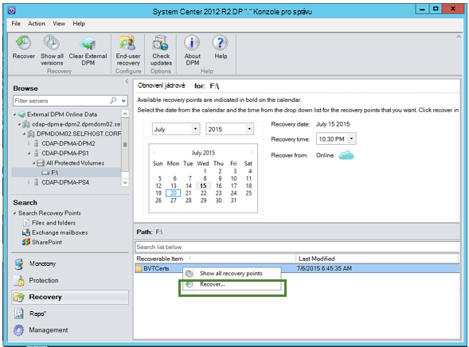

<properties
    pageTitle="Obnovení dat z jiného serveru DPM záložní trezoru | Microsoft Azure"
    description="Obnovení dat, které jste chráněné do trezoru Azure zálohování z jakéhokoli DPM serveru registrované do této trezoru."
    services="backup"
    documentationCenter=""
    authors="nkolli1"
    manager="shreeshd"
    editor=""/>

<tags
    ms.service="backup"
    ms.workload="storage-backup-recovery"
    ms.tgt_pltfrm="na"
    ms.devlang="na"
    ms.topic="article"
    ms.date="08/08/2016"
    ms.author="giridham;jimpark;trinadhk;markgal"/>

# Obnovení dat z jiného serveru DPM záložní trezoru
Nyní je možné obnovit data, která jste chráněné do trezoru Azure zálohování z jakéhokoli DPM serveru registrované do této trezoru. Proces provedete tak je plně integrovaný v konzole Správa DPM a je podobná jiných obnovení pracovních postupů.

Obnovení dat z jiného serveru DPM záložní trezoru musíte mít [nejnovější Azure záložní agent](http://aka.ms/azurebackup_agent)a [System Center správce ochranu dat UR7](https://support.microsoft.com/en-us/kb/3065246) .

## Obnovení dat z jiného DPM serveru
Obnovení dat z jiného DPM serveru:

1. Na kartě **zotavení** konzolu Správa DPM klikněte na **Přidat externí DPM** (v levém horním rohu obrazovky).

    

2. Stažení nové **přihlašovací údaje trezoru** z trezoru přidružených k **serveru DPM** kde obnovit data, zvolte DPM server ze seznamu DPM servery registrovaný u záložní trezoru a zadejte **heslo šifrování** přidružených k serveru DPM obnovit jejichž data.

    

    >[AZURE.NOTE] Pouze DPM servery přidružené stejné trezoru registrace můžete obnovit data dalších uživatelů.

    Po úspěšném přidání externí DPM serveru můžete procházet data externího serveru DPM a místního serveru DPM z karty **obnovení** .

3. Projděte si seznam dostupných provozní servery chráněné pomocí externího serveru DPM a vyberte zdroj výsledků příslušná data.

    

4. Vyberte **měsíc a rok** od **obnovení body** rozevírací seznam, vyberte požadované **obnovení datum** vytvoření obnovení čárky a vyberte **časového využití**.

    Seznam souborů a složek se zobrazí v dolním podokně, které se dají prohlížet a obnovit na libovolné místo.

    

5. Klikněte pravým tlačítkem myši příslušnou položku a klikněte na **Obnovit**.

    

6. Prohlédněte si **Obnovit výběr**. Ověřte data a času záložní kopie obnovována, stejně jako zdroje, ze kterého jste vytvořili záložní kopie. Pokud výběr je nesprávné, klepněte na tlačítko **Zrušit** přejděte zpátky na kartu zotavení vyberte odpovídající obnovení bod. Pokud je vybraný správný, klikněte na tlačítko **Další**.

    

7. Vyberte **Obnovit do jiného umístění**. **Přejděte** na správné místo pro obnovení.

    

8. Vyberte možnost související s **vytvořit kopii** **Přeskočit**a **Přepsat**.
    - **Vytvoření kopie** vytvoří kopii souboru v případě, že je konflikt názvů.
    - **Přeskočit** přeskočí obnovení soubor v případě, že je konflikt názvů.
    - **Přepsat** dojde k přepsání existující kopírování v oblasti zadané v případě konflikt názvů.

    Vyberte příslušnou možnost Obnovit **zabezpečení**. Můžete použít nastavení zabezpečení cíl počítače, na kterém obnovit data nebo nastavení zabezpečení, které jsou k dispozici produktu v době, kdy byla vytvořená bod obnovení.

    Zjistěte, jestli **oznámení** odešle po úspěšném dokončení obnovení.

    

9. Na obrazovce **Souhrn** jsou uvedeny možnosti zatím zvolili. Po kliknutí na **"obnovit**data obnovit až příslušný místního pracoviště.

    

    >[AZURE.NOTE] Obnovení projektu můžete sledovat na kartě **monitorovací** DPM server.

    

10. **Vymazat externí DPM** můžete kliknout na kartě **obnovení** serveru DPM odebrat zobrazení na externí server DPM.

    

## Poradce při potížích s chybovými zprávami
|Ne. |  Chybová zpráva | Návody na řešení potíží |
| :-------------: |:-------------| :-----|
|1.|        Tento server není registrovaný do trezoru nastavil pověření trezoru.|  **Příčina:** Tato chyba se zobrazí, když vybraný soubor pověření trezoru nepatří do přiřazené DPM serveru, na kterém je pokus o obnovení záložní trezoru.   **Rozlišení:** Trezoru pověření moct soubor stáhněte z záložní trezoru, ke kterému je registrovaná DPM serveru.|
|2.|        Obnovitelné dat není k dispozici nebo ve vybraném serveru není DPM serveru.|   **Příčina:** Nejsou žádné další DPM servery s DPM 2012 R2 UR7 registrován záložní trezoru nebo DPM servery s DPM 2012 R2 UR7 nebyly dosud nahráli metadata nebo ve vybraném serveru není DPM serveru (označovaná taky jako Windows Server nebo Windows klienta).   **Rozlišení:** Pokud jsou jiné servery DPM registrované záložní trezoru, zkontrolujte SCDPM 2012 R2 UR7 a nejnovější Azure záložní agent jsou nainstalovány.  Pokud jsou jiné servery DPM registrované záložní trezoru s DPM 2012 R2 UR7, počkejte den po instalaci UR7 spustíte proces obnovení. Noční úlohy nahraje metadat pro všechny dříve chráněné zálohování do cloudu. Data budou k dispozici pro obnovení.|
|3.|        Žádný DPM server je registrovaná na trezoru.|   **Příčina:** Jsou žádné další DPM servery se DPM 2012 R2 UR7 nebo vyšší verzí, které jsou registrované do trezoru, ze kterého je Probíhá pokus o obnovení. **Rozlišení:** Pokud jsou jiné servery DPM registrované záložní trezoru, zkontrolujte SCDPM 2012 R2 UR7 a nejnovější Azure záložní agent jsou nainstalovány. Pokud jsou jiné servery DPM registrované záložní trezoru s DPM 2012 R2 UR7, počkejte den po instalaci UR7 spustíte proces obnovení. Noční úlohy nahraje metadat pro všechny dříve chráněné zálohování do cloudu. Data budou k dispozici pro obnovení.|
|4.|        Šifrování heslo k dispozici neshoduje s přístupové heslo přidružené následující server:**<server name>**|  **Příčina:** Šifrování heslo používá v procesu šifrování data z dat DPM serveru, který obnovuje neodpovídá šifrování heslo k dispozici. Agent se nemůže dešifrovat data. Proto vymáhání nezdaří. **Rozlišení:** Zadejte přesně stejné heslo šifrování přidružených k serveru DPM obnovit jejichž data.|

## Nejčastější dotazy:
1. **Proč se nedají přidat externí server DPM z jiného serveru DPM po instalaci UR7 a nejnovější agent zálohování Azure?**

    A) pro stávající servery DPM se zdroji dat, které jsou chráněny do cloudu (s použitím kumulativní aktualizace starší než 7 kumulativní aktualizace) projevit až po instalaci UR7 a nejnovější Azure Backup agent pro spuštění *Přidat externí DPM serveru*aspoň jeden den. Je potřeba nahrát metadat ochranu skupiny DPM Azure. K tomu dojde při prvním prostřednictvím noční úlohy.

2. **Co je minimální verze Azure Backup agent potřeba?**

    A) Azure zálohování agent minimální verze pro tuto funkci povolit je 2.0.8719.0.  Azure verze agent zálohování lze ověřit tak, že přejdete do ovládacích panelů **>** všech ovládacích panelů **>** programy a funkce **>** agentem služeb Microsoft Azure obnovení. Pokud verze je menší než 2.0.8719.0, stáhněte si [nejnovější agent Azure zálohování](https://go.microsoft.com/fwLink/?LinkID=288905) a nainstalujte.

    

## Další kroky:
• [Azure záložní časté otázky](backup-azure-backup-faq.md)
