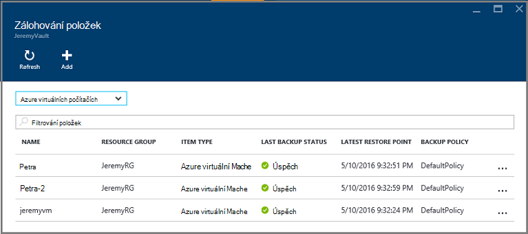
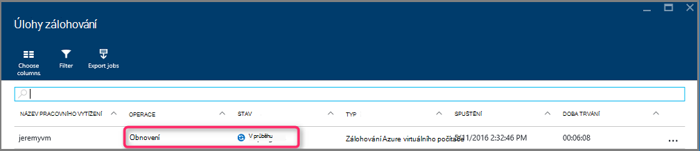

<properties
    pageTitle="Obnovení ze zálohy Azure portálu virtuálních počítačích | Microsoft Azure"
    description="Obnovení Azure virtuálního počítače z bodu obnovení Azure portálu"
    services="backup"
    documentationCenter=""
    authors="markgalioto"
    manager="cfreeman"
    editor=""
    keywords="obnovení záložní kopie; obnovení; obnovení čárky;"/>

<tags
    ms.service="backup"
    ms.workload="storage-backup-recovery"
    ms.tgt_pltfrm="na"
    ms.devlang="na"
    ms.topic="article"
    ms.date="08/10/2016"
    ms.author="trinadhk; jimpark;"/>

# Obnovení virtuálních počítačích pomocí Azure portálu

> [AZURE.SELECTOR]
- [Obnovení VMs klasické portálu](backup-azure-restore-vms.md)
- [Obnovení VMs Azure portálu](backup-azure-arm-restore-vms.md)

Ochrana dat – stačí snímky dat definovaný intervalech. Tyto snímky se označují jako obnovení bodů a jsou uloženy v trezorů služby obnovení. Pokud nebo pokud je nutné opravit nebo opětovné sestavení virtuálního počítače, můžete obnovit OM z kteréhokoli místa uložené obnovení. Při obnově bod obnovení vrátí nebo vrátit OM do stavu, při obnovení čárky pořízení. Tento článek vysvětluje, jak obnovit virtuálního počítače.

> [AZURE.NOTE] Azure obsahuje dva modely nasazení pro vytváření grafů a práci s prostředky: [Správce zdrojů a klasický](../resource-manager-deployment-model.md). Tento článek obsahuje informace a postupy pro obnovení VMs nasazených pomocí modelu správce prostředků.

## Obnovení bod obnovení

1. Přihlaste se k [portálu Azure](http://portal.azure.com/)

2. V nabídce Azure klikněte na tlačítko **Procházet** a do seznamu služeb, zadejte **Obnovení služby**. Seznam služeb upraví co píšete. Až se zobrazí **služby Recovery trezorů**, vyberte ji.

    

    Zobrazí se seznam trezorů v předplatného.

    

3. V seznamu vyberte trezoru přidružené OM, kterou chcete obnovit. Po kliknutí trezoru otevře jeho řídicího panelu.

    

4. Teď, když jste v řídicím panelu trezoru. **Zálohování položek** dlaždice, klikněte na **virtuálních počítačích Azure** zobrazíte VMs přidružené trezoru.

    

    **Zálohování položek** zásuvné otevře a zobrazí seznam Azure virtuálních počítačích.

    

5. V seznamu vyberte OM otevřete řídicího panelu. Řídicí panel OM otevře sledování oblasti, která obsahuje dlaždici body obnovit.

    

6. V nabídce OM řídicího panelu klikněte na **Obnovit**

    

    Otevře se zásuvné obnovit.

    

7. Na zásuvné **Obnovit** klepněte na **obnovit bod** otevřete zásuvné **Vyberte obnovit bodu** .

    

    Ve výchozím nastavení zobrazuje dialogové okno všechny body obnovení z posledních 30 dní. Použití **filtru** změnit časový rozsah body obnovení zobrazí. Ve výchozím nastavení jsou zobrazeny body obnovení všechny konzistence. Změnit **všechny obnovení body** filtr vybrat konkrétní konzistence body obnovení. Další informace o jednotlivých typech obnovení přejděte najdete v tématu Vysvětlení [konzistence dat](./backup-azure-vms-introduction.md#data-consistency).  
    - **Obnovení čárky konzistence** z tohoto seznamu vyberte:
        - Selhat body konzistentní obnovení
        - Body konzistentní obnovení aplikace
        - Soubor body konzistentní obnovení systému
        - Všechny obnovit body.  

8. Zvolte bod obnovení a klikněte na **OK**.

    

    **Obnovení** zásuvné ukazuje, že je nastavený bod obnovení.

    

9. Na zásuvné **Obnovit** **obnovit konfiguraci** se automaticky otevře po obnovení bodu.

    

## Zvolením možnosti obnovit konfigurace OM

Teď jste zvolili bod obnovení, vyberte konfigurace pro obnovení OM. Možností konfigurace obnovená OM mají použít: Azure portál nebo Powershellu.

> [AZURE.NOTE] Portál poskytuje možnost vytvořit obnovená OM. Pokud chcete přizpůsobit konfigurací OM to-be obnovená OM, pomocí prostředí PowerShell obnovit zálohovala disků a připojte k výběru OM konfigurace. V tématu [obnovení OM s konfigurací zvláštní sítě](#restoring-vms-with-special-network-configurations).

1. Pokud jste ještě nejsou nějaké, přejděte na zásuvné **Obnovit** . Zajištění **bod obnovení** byla vybrána a klikněte na tlačítko **obnovit konfiguraci** otevřete zásuvné **obnovení konfigurace** .

    

2. Na zásuvné **obnovit konfiguraci** zadejte nebo vyberte hodnoty pro jednotlivá pole z následujících polí:
    - **Název počítače virtuální** - zadejte název OM. Název musí být jedinečná pole Skupina zdroje (pro správce prostředků nasazený OM) nebo cloudové služby (pro klasické OM). Virtuální počítač nemůže nahradit, pokud již předplatné.
    - **Pole Skupina zdroje** - použití existující skupiny zdrojů nebo vytvořte nový účet. Pokud obnovujete klasické OM, pomocí tohoto pole zadejte název nového cloudové služby. Pokud vytvoříte nové skupiny/Cloudová služba zdrojů, musí být globálně jedinečný název. Název služby cloudu bývá přidružené veřejné adresy URL – například: [cloudservice]. cloudapp.net. Pokud budete chtít použít název cloudové zdroje skupiny/cloudovou službu, které již byly použity, Azure přiřadí zdroje skupiny/cloudové služby stejný název jako OM. Azure zobrazí zdroje skupiny/cloudovými službami a VMs nejsou spojeny s všechny spřažení skupiny. Další informace najdete v tématu [jak migrovat z spřažení skupiny a v místní síti virtuální (VNet)](../virtual-network/virtual-networks-migrate-to-regional-vnet.md).
    - **Virtuální sítě** – vyberte virtuální sítě (VNET) při vytváření OM. Pole obsahuje všechny VNETs přidružený k předplatnému. Skupina zdroje OM se zobrazí v závorkách.
    - **Podsítě** – Pokud VNET podsítí, první podsítě vybrané ve výchozím nastavení. Pokud jsou dalších podsítí, vyberte požadovanou podsítě.
    - **Úložiště účet** – této nabídce seznam účtů úložiště ve stejném umístění jako služby Recovery trezoru. Při výběru úložiště účtu vyberte účet, který sdílí stejném umístění jako služby Recovery trezoru. Úložiště účty, které nejsou zóny nadbytečné nejsou podporované. Pokud nejsou účty úložiště s stejném umístění jako trezoru obnovení služby, musíte vytvořit jednu mezeru před spuštěním operace obnovit. Replikace typ účtu úložiště je uvedená v závorkách.

    > [AZURE.NOTE] Pokud obnovujete OM nasazený správce prostředků, je nutné určit virtuální sítě (VNET). Klasický OM vynechán virtuální sítě (VNET).

3. Na zásuvné **obnovit konfiguraci** klikněte na **OK** dokončete konfiguraci obnovit.

4. Na zásuvné **Obnovit** klepněte na **Obnovit** spustit operaci obnovení.

    

## Sledování obnovení

Po spuštění operace obnovení službu zálohování vytváří úlohu pro sledování obnovení. Služba zálohování také vytvoří a přechodně zobrazí oznámení v oznamovací oblasti portálu. Pokud nevidíte oznámení, můžete vždy klikněte na ikonu oznámení zobrazíte vám oznámení.

Zobrazíte operace během zpracování nebo zobrazit jeho dokončení, otevřete seznam úloh zálohování.

1. V nabídce Azure klikněte na tlačítko **Procházet** a do seznamu služeb, zadejte **Obnovení služby**. Seznam služeb upraví co píšete. Pokud se zobrazí **služby Recovery trezorů**, vyberte ji.

    

    Zobrazí se seznam trezorů v předplatného.

    

2. V seznamu vyberte trezoru přidružené OM můžete obnovit. Po kliknutí trezoru otevře jeho řídicího panelu.

3. Na řídicím panelu trezoru **Úlohy zálohování** dlaždice, klikněte na **virtuálních počítačích Azure** zobrazíte úlohy přidružené trezoru.

    

    **Úlohy zálohování** zásuvné spustí a zobrazí seznam úloh.

    

## Obnovení VMs s konfigurací zvláštní sítě
Je možné zálohování a obnovení VMs u následujících konfigurací zvláštní sítě. Tyto konfigurace však vyžadují některá zvláštní pozornost při procházení procesu obnovit.

- VMs v části Vyrovnávání zatížení (interní a externí)
- VMs s více rezervovaná IP adresy
- VMs s více nic

>[AZURE.IMPORTANT] Při vytváření konfigurace zvláštní sítě pro VMs, třeba vytvořit VMs z disků obnovit pomocí prostředí PowerShell.

Chcete-li plně obnovit virtuálních počítačích po obnovení na disk, postupujte takto:

1. Obnovení disků z trezoru služby obnovení pomocí [prostředí PowerShell](../backup-azure-vms-automation.md#restore-an-azure-vm)

2. Vytvoření konfigurace OM potřebných pro vyrovnávání zatížení / více NIC/více User pomocí rutin prostředí PowerShell a použijte ho k vytvoření OM z žádoucí konfigurace.
    - Vytvoření OM v cloudové službě s [Vyrovnávání zatížení interní](https://azure.microsoft.com/documentation/articles/load-balancer-internal-getstarted/)
    - Vytvoření OM se připojit k [internetové Vyrovnávání zatížení] (https://azure.microsoft.com/en-us/documentation/articles/load-balancer-internet-getstarted/)
    - Vytvoření OM s [více nic](https://azure.microsoft.com/documentation/articles/virtual-networks-multiple-nics/)
    - Vytvoření OM s [více rezervovaná IP adresy](https://azure.microsoft.com/documentation/articles/virtual-networks-reserved-public-ip/)

## Další kroky
Teď můžete obnovit vaše VMs, najdete v článku Poradce při potížích informace na běžné chyby s VMs. Také podívejte se na článek o správě úkolů pomocí svého VMs.

- [Poradce při potížích s chybami](backup-azure-vms-troubleshoot.md#restore)
- [Správa virtuálních počítačích](backup-azure-manage-vms.md)
