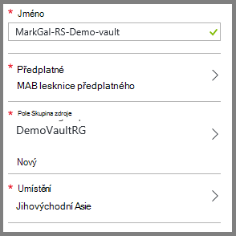
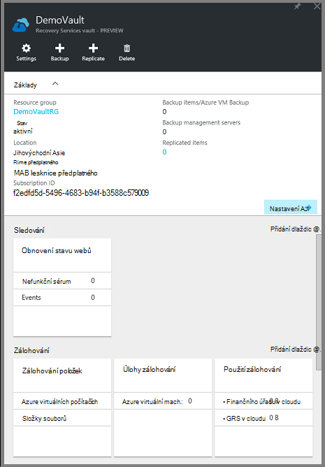
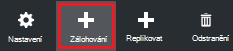
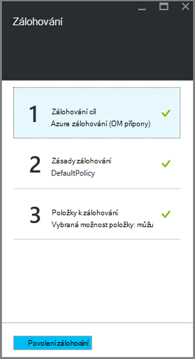
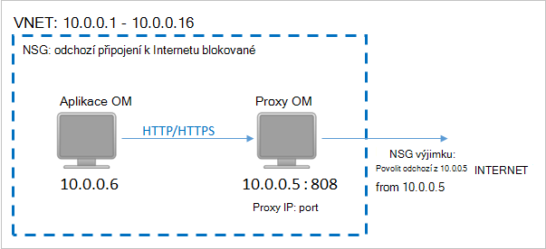
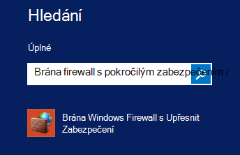
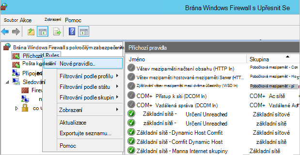

<properties
    pageTitle="Příprava prostředí k obecnějším údajům nasazený správce prostředků virtuálních počítačích | Microsoft Azure"
    description="Zkontrolujte, jestli že je vaše prostředí počítat zálohování virtuálních počítačích v Azure"
    services="backup"
    documentationCenter=""
    authors="markgalioto"
    manager="cfreeman"
    editor=""
    keywords="zálohování. zálohování;"/>

<tags
    ms.service="backup"
    ms.workload="storage-backup-recovery"
    ms.tgt_pltfrm="na"
    ms.devlang="na"
    ms.topic="article"
    ms.date="08/21/2016"
    ms.author="trinadhk; jimpark; markgal;"/>


# <a name="prepare-your-environment-to-back-up-resource-manager-deployed-virtual-machines"></a>Příprava prostředí k obecnějším údajům nasazený správce prostředků virtuálních počítačích

> [AZURE.SELECTOR]
- [Správce prostředků modelu](backup-azure-arm-vms-prepare.md)
- [Klasický modelu](backup-azure-vms-prepare.md)

Tento článek obsahuje kroky pro přípravu prostředí k obecnějším údajům nasazený správce prostředků virtuálního počítače (OM). Kroky zobrazené v postupech pomocí portálu Azure.  

Služby Azure zálohování má dva typy trezorů (zpátky do vyšší trezorů a obnovení služby skříňky) k ochraně svého VMs. Zálohování trezoru chrání VMs nasazených pomocí klasického nasazení modelu. Obnovení trezoru služby chrání **VMs nasazený klasické i nasazený správce prostředků** . Služby Recovery trezoru musí umožňuje chránit OM nasazený správce prostředků.

>[AZURE.NOTE] Azure obsahuje dva modely nasazení pro vytváření grafů a práci s prostředky: [Správce zdrojů a klasické](../resource-manager-deployment-model.md). Další informace o práci s klasické nasazení modelu VMs najdete v článku [Příprava prostředí k obecnějším údajům Azure virtuálních počítačích](backup-azure-vms-prepare.md) .

Než budete moct Zamknout a obecnějším údajům nasazený správce prostředků virtuálního počítače (OM), zkontrolujte, jestli že jsou tyto požadavky:

- Vytvoření trezoru obnovení služby (nebo určit existující trezoru služby obnovení) *ve stejném umístění jako svého OM*.
- Vyberte situace, definovat zásady zálohování a určit, položek na ochranu.
- Zaškrtněte políčko instalaci OM agenta do virtuálního počítače.
- Zkontrolujte připojení k síti

Pokud víte, že tyto podmínky již existují ve vašem prostředí potom pokračujte [obecnějším údajům VMs článek](backup-azure-vms.md). V případě potřeby můžete nastavit nebo zkontrolovat, některou z těchto požadavcích Tento článek vás provede jednotlivými kroky pro přípravu této předpoklad.


## <a name="limitations-when-backing-up-and-restoring-a-vm"></a>Omezení při zálohování a obnovování virtuálního počítače

Než vaše prostředí připravili, přejděte prosím chápete omezení.

- Zálohování virtuálních počítačích s víc než 16 disků dat není podporovaná.
- Zálohování virtuálních počítačích s rezervovaná IP adresa a není definované koncový bod není podporovaná.
- Zálohování Linux virtuálních počítačích s příponou Docker nepodporuje. 
- Zálohování dat neobsahuje síťové připojení jednotky připojené k OM. 
- Nahrazení stávajících virtuálního počítače během obnovení není podporovaná. Pokud budete chtít obnovit OM, pokud existuje OM, obnovení se nezdaří.
- Více oblastí zálohování a obnovení není podporovaná.
- Můžete obecnějším údajům virtuálních počítačích ve všech veřejné oblastech Azure (viz [Kontrolní](https://azure.microsoft.com/regions/#services) seznam podporovaných oblastí). Pokud oblast, kterou hledáte není podporovaná dnes, ta se nezobrazí v rozevíracím seznamu při vytváření trezoru.
- Můžete obecnějším údajům virtuálních počítačích pouze pro Zvolte operační systém verze:
  - **Linux**: Azure zálohování podporuje [seznam distribuce, které jsou potvrzeno Azure](../virtual-machines/virtual-machines-linux-endorsed-distros.md) kromě Core s operačním systémem Linux.  Další distribuce přenést-e-vlastní-Linux také může pracovat, dokud je k dispozici v počítači virtuální agenta OM a podpora Python existuje.
  - **Windows Server**: verze starší než Windows Server 2008 R2 nejsou podporované.
- Obnovení řadiče domény OM (Datacentrum), která je součástí více Datacentrum konfigurace je podporována pouze prostřednictvím Powershellu. Další informace o [obnovení řadiče domény řadiče domény s víc](backup-azure-restore-vms.md#restoring-domain-controller-vms).
- Obnovení virtuálních počítačích, které mají následující konfigurace zvláštní sítě je podporována pouze prostřednictvím Powershellu. VMs vytvořené pomocí obnovit pracovní postup v uživatelském rozhraní nemá síťové konfigurace po dokončení obnovení. Další informace najdete v tématu [Obnovení VMs s konfigurací zvláštní sítě](backup-azure-restore-vms.md#restoring-vms-with-special-netwrok-configurations).
  - Virtuálních počítačích ve skupinovém rámečku konfigurace vyrovnávání zatížení (interní a externí)
  - Virtuálních počítačích s více rezervovaná adres IP
  - Virtuálních počítačích s více síťové adaptéry

## <a name="create-a-recovery-services-vault-for-a-vm"></a>Vytvoření trezoru služby obnovení pro virtuálního počítače

Obnovení služby trezoru je entitu, která ukládá zálohování a obnovení body, které již byly vytvořeny v čase. Obnovení služby trezoru obsahuje také záložní zásad přidružených k chráněné virtuálních počítačích.

Vytvoření trezoru služby obnovení:

1. Přihlaste se k [portálu Azure](https://portal.azure.com/).

2. V nabídce centrální klikněte na tlačítko **Procházet** a v seznamu zdrojů, zadejte **Obnovení služby**. Jakmile začnete psát, bude filtrování seznamu na základě vašich zadání. Klikněte na **služby Recovery trezoru**.

     <br/>

    Zobrazí se seznam služby Recovery trezorů.

3. V nabídce **trezorů obnovení služby** klikněte na **Přidat**.

    

    Zásuvné trezoru služby Recovery otevře, která vás vyzve, abyste jim poslali **název** **předplatného**, **pole Skupina zdroje**a **umístění**.

    

4. Pole **název**zadejte popisný název k identifikaci trezoru. Název musí být jedinečná Azure předplatného. Zadejte název, který obsahuje 2 až 50 znaků. Musí začínat písmenem a můžou obsahovat jenom písmena, číslice a spojovníky.

5. Klikněte na **předplatné** zobrazíte dostupná seznam předplatných. Pokud nevíte jistě, které předplatné můžete použít výchozí (nebo doporučovány) předplatného. Nastane více možností jenom v případě, že účet organizace je přidružená k víc předplatných Azure.

6. **Pole Skupina zdroje** zobrazíte seznamu dostupné zdroje skupin nebo klikněte na **Nový** k vytvoření nové skupiny prostředků. Podrobné informace o skupiny zdrojů najdete v článku [Přehled Správce prostředků Azure](../azure-resource-manager/resource-group-overview.md)

7. Klikněte na **umístění** vyberte zeměpisná oblast pro trezoru. Trezoru **musí** být ve stejné oblasti jako virtuálních počítačích, které chcete zamknout.

    >[AZURE.IMPORTANT] Pokud si nejste jisti umístění, ve které vaše OM existuje, zavřete dialog Vytvoření trezoru a přejděte na seznam virtuálních počítačích na portálu. Pokud máte virtuálních počítačích ve více oblastech, bude potřeba vytvořit služby Recovery trezoru v jednotlivých oblastech. Vytvoření trezoru na prvním místě před přechodem do následujícího umístění. Je potřeba zadat úložiště účty pro ukládání záložních dat – trezoru služby Recovery a služba Azure záložní obsloužení to automaticky.

8. Klikněte na **vytvořit**. Ji může chvíli trvat, než trezoru služby Recovery vytvořit. Sledujte oznámení o stavu v pravé horní části na portálu. Po vytvoření trezoru se zobrazí v seznamu služby Recovery trezorů.

    

    Teď, když jste vytvořili trezoru, přečtěte si, jak nastavit replikace úložiště.

## <a name="set-storage-replication"></a>Nastavení replikace úložiště

Možnosti replikace úložiště umožňuje vybrat mezi geo nadbytečné úložiště a místně nadbytečné úložiště. Ve výchozím nastavení obsahuje trezoru geo nadbytečné úložiště. Nechte možnost nastavenou na geo nadbytečné úložiště, pokud se jedná zálohování primární. Pokud chcete levnější možnost, která není úplně trvalé vyberte místně nadbytečné úložiště. Další informace o [geo nadbytečné](../storage/storage-redundancy.md#geo-redundant-storage) [místně nadbytečné](../storage/storage-redundancy.md#locally-redundant-storage) úložiště možnosti a v [úložišti Azure replikace přehled](../storage/storage-redundancy.md).

Úprava nastavení replikace úložiště:

1. Vyberte trezoru otevřete řídicí panel trezoru a zásuvné nastavení. Pokud se **Nastavení** zásuvné neotevře, klikněte na **všechna nastavení** na řídicím panelu trezoru.

2. Na zásuvné **Nastavení** klikněte na tlačítko **Zálohování infrastruktury** > **Konfiguraci zálohování** otevřete zásuvné **Konfiguraci zálohování** . Na zásuvné **Zálohování konfigurace** vyberte možnost replikace úložiště pro trezoru.

    

    Po výběru možnosti úložiště pro trezoru, jste připraveni OM přidružit trezoru. Zahájíte přidružení by měly objevit a zaregistrovat Azure virtuálních počítačích.


## <a name="select-a-backup-goal-set-policy-and-define-items-to-protect"></a>Vyberte záložní cíl, nastavení zásad a definujte položky chránit

Před registrací OM s trezoru, spusťte proces zjišťování zajistit, že jsou určeny všechny virtuálních počítačích přidané k předplatnému. Proces dotazů Azure seznam virtuálních počítačích v předplatného, spolu s dalšími informacemi, jako je název služby cloudu a oblasti. Na portálu Azure scénář odkazuje na co přecházíte přepněte do služby trezoru obnovení. Zásady je plán intervalu a kdy byla přijata obnovení body. Zásady také oblasti uchovávání informací u bodů obnovení.

1. Pokud už máte otevřený trezoru služby Recovery, pokračujte krokem 2. Pokud nemáte služby Recovery trezoru otevřít, ale jsou na portálu Azure v nabídce centrální, klikněte na **Procházet**.

  - V seznamu zdrojů zadejte **Obnovení služby**.
  - Jakmile začnete psát, bude filtrování seznamu na základě vašich zadání. Pokud se zobrazí **služby Recovery trezorů**, klikněte na něj.

     <br/>

    Zobrazí se seznam služby Recovery trezorů.
  - Ze seznamu služby Recovery trezorů Výběr trezoru.

    Otevře vybranou trezoru řídicího panelu.

    

2. Nabídka řídicí panel trezoru klikněte na **zálohování** otevřete zásuvné zálohování.

    

    Až se otevře zásuvné službu zálohování vyhledá všechny nové VMs v předplatného.

    

3. Na zásuvné zálohování klepněte na **zálohování cíl** otevřete zásuvné cíl zálohování.

    

4. Zálohování cíl zásuvné nastavte na **kterém běží vaše pracovní zátěž** na Azure a **Co chcete zálohovat** do virtuálního počítače, klikněte na tlačítko **OK**.

    Zavře zásuvné zálohování cíl a otevře zásuvné zásad zálohování.

    

5. Na zásuvné zásad zálohování vyberte záložní zásadu, který chcete použít trezoru a klepněte na **OK**.

    

    Podrobnosti o výchozí zásady jsou uvedené v části podrobností. Pokud chcete vytvořit nové zásady, **Vytvořit nový** v rozevírací nabídce vyberte. V rozevírací nabídce také poskytuje možnost přepněte doba při snímku je, 19: 00. Pokyny k definování záložní zásad naleznete v tématu [definování zásady zálohování](backup-azure-vms-first-look-arm.md#defining-a-backup-policy). Po kliknutí na tlačítko **OK**zásady zálohování je přidružený trezoru.

    Klikněte na další VMs, ke kterému chcete přidružit trezoru.

6. Zvolte virtuálních počítačích přidružit zadané zásady a klikněte na **Výběr**.

    

    Pokud není požadovaný OM, zkontrolujte, že existuje ve stejném umístění Azure jako služby Recovery trezoru.

7. Teď, když jste definovali všechna nastavení pro trezoru v zásuvné zálohování, klikněte na tlačítko **Povolit zálohování** v dolní části stránky. To nasadí zásady trezoru a VMs.

    

Další fáze při přípravě instaluje agenta OM nebo jak zajistit Agent OM je nainstalovaný.


## <a name="install-the-vm-agent-on-the-virtual-machine"></a>Nainstalovat na počítač virtuální agenta OM

Agent OM Azure musí být nainstalovaný v počítači Azure virtuální koncovku zálohování pracovat. Pokud vaše OM byla vytvořená z Galerie Azure, pak Agent OM již je v počítači virtuální. Tyto informace je za předpokladu, že pro situace, kde se nacházíte *není* pomocí virtuálního počítače vytvořený z Galerie Azure – například že nemigruje virtuálního počítače z místního datacentra. V takovém případě agenta OM potřeba nainstalovat pro ochranu virtuální počítač.

Informace o [OM Agent](https://go.microsoft.com/fwLink/?LinkID=390493&clcid=0x409) a [Jak nainstalovat agenta OM](../virtual-machines/virtual-machines-windows-classic-manage-extensions.md).

Pokud máte problémy zálohování OM Azure, zkontrolujte, že je Agent OM Azure správně nainstalovaný v počítači virtuální (viz tabulka dole). Pokud jste vytvořili vlastní OM, před virtuálního počítače, [Ujistěte se, že je zaškrtnuto políčko **nainstalovat agenta OM** ](../virtual-machines/virtual-machines-windows-classic-agents-and-extensions.md) máte k dispozici.

Následující tabulka obsahuje další informace o OM Agent pro Windows a Linux VMs.

| **Operace** | **Windows** | **Linux** |
| --- | --- | --- |
| Instalace agenta OM | <li>Stáhněte a nainstalujte [agent MSI](http://go.microsoft.com/fwlink/?LinkID=394789&clcid=0x409). Budete potřebovat oprávnění správce a dokončete instalaci. <li>Vyznačení, že je nainstalovaný agent [Aktualizovat vlastnost OM](http://blogs.msdn.com/b/mast/archive/2014/04/08/install-the-vm-agent-on-an-existing-azure-vm.aspx) . | <li> Nainstalujte nejnovější [Linux agent](https://github.com/Azure/WALinuxAgent) z GitHub. Budete potřebovat oprávnění správce a dokončete instalaci. <li> Vyznačení, že je nainstalovaný agent [Aktualizovat vlastnost OM](http://blogs.msdn.com/b/mast/archive/2014/04/08/install-the-vm-agent-on-an-existing-azure-vm.aspx) . |
| Aktualizace agenta OM | Aktualizace agenta OM je jednoduchá – stačí přeinstalace [OM Agent binární](http://go.microsoft.com/fwlink/?LinkID=394789&clcid=0x409). <br>Ujistěte se, jestli je spuštěný žádné zálohování době, kdy je aktualizován agenta OM. | Postupujte podle pokynů k [aktualizaci Agent OM Linux ](../virtual-machines-linux-update-agent.md). <br>Ujistěte se, jestli je spuštěný žádné zálohování době, kdy je aktualizován agenta OM. |
| Ověřování instalaci OM agenta | <li>Přejděte do složky *C:\WindowsAzure\Packages* OM Azure. <li>Nenajdete prezentovat WaAppAgent.exe soubor.<li> Klikněte pravým tlačítkem myši na soubor, přejděte na **Vlastnosti**a pak klikněte na kartu **Podrobnosti** . Pole verze produktu by měl být 2.6.1198.718 nebo vyšší. | NENÍ K DISPOZICI |


### <a name="backup-extension"></a>Zálohování rozšíření

Po instalaci agenta OM počítače virtuální službu Azure záložní nainstaluje záložní rozšíření agenta OM. Služba Azure záložní bezproblémové aktualizuje a opravy záložní rozšíření.

Služba zálohování nainstalovat záložní rozšíření též běží OM. Průběžný OM nabízí největší pravděpodobnost získání bod konzistenci aplikací obnovení. Nadále obecnějším údajům OM, i když je normálně vypnuté a rozšíření nešlo nainstalovat, ale služba Azure zálohování. Jedná se o jako Offline OM. V tomto případě bod obnovení budou *konzistentní z hlediska chyb*.


## <a name="network-connectivity"></a>Připojení k síti

Abyste mohli spravovat snímky OM, musí záložní rozšíření připojení k Azure veřejnou IP adresy. Bez správné připojení k Internetu požadavky vypršení časového limitu HTTP virtuálního počítače a zálohování se nezdaří. Pokud nasazení má omezení přístupu na místě (přes síť skupiny zabezpečení (NSG), například), zvolte jednu z těchto možností pro poskytnutí vymazat cesty pro záložní přenosy:

- [Rozsahy povolených IP Azure datacentra](http://www.microsoft.com/en-us/download/details.aspx?id=41653) – najdete v článku pokyny na tom, jak povolených IP adres.
- Nasazení serveru HTTP proxy směrování přenosů.

Při rozhodování, kterou možnost použít, střídání jsou mezi správy, podrobného ovládací prvek a náklady.

|Možnost|Výhody|Nevýhody|
|------|----------|-------------|
|Rozsahy povolených IP adres| Žádné další náklady.<br><br>Pro otevření aplikace access do NSG, použijte rutinu <i>Set-AzureNetworkSecurityRule</i> . | Komplexní ke správě jako dotčeném rozsahy IP adres v průběhu času mění.<br><br>Poskytuje přístup k celku Azure a nejen úložiště.|
|Nastavit informace HTTP proxy| Podrobného ovládat v proxy adresy URL úložiště povolené.<br>Přístup k VMs jeden bod Internetu.<br>Není vyměřené poplatky za jeho Azure IP adresu změny.| Další náklady pro spuštění virtuálního počítače s proxy software.|

### <a name="whitelist-the-azure-datacenter-ip-ranges"></a>Rozsahy IP adres povolených Azure datacentru

Povolených rozsahy IP adres Azure datacentra najdete v tématu [Azure webu](http://www.microsoft.com/en-us/download/details.aspx?id=41653) podrobnosti o rozsahy IP adres a pokyny.

### <a name="using-an-http-proxy-for-vm-backups"></a>Použití nastavit informace HTTP proxy záloh OM
Při zálohování virtuálního počítače, na záložní příponu OM odešle snímek správy příkazy k základnímu úložišti Azure pomocí rozhraní API HTTPS. Směrujte přenosy záložní rozšíření prostřednictvím protokolu HTTP proxy takové alternativní řešení je pouze součást nakonfigurován pro přístup k veřejnému Internetu.

>[AZURE.NOTE] Neexistuje žádná doporučení pro proxy software, který má být použit. Ujistěte se, vyberte proxy server, který je kompatibilní se službou konfigurace kroků.

Na následujícím obrázku příklad uvádí kroky tři konfigurace nutné použít nastavit informace HTTP proxy:

- Aplikace OM směruje všechny přenosy protokolu HTTP směřující veřejné Internetu OM proxy serveru.
- Proxy OM umožňuje příchozích z VMs virtuální sítě.
- Skupina zabezpečení síti (NSG), s názvem NFP uzamčení musí zabezpečení pravidlo umožňuje odchozí internetový provoz z OM proxy serveru.



Můžete nastavit informace HTTP proxy pro komunikaci veřejné Internetu, postupujte takto:

#### <a name="step-1-configure-outgoing-network-connections"></a>Krok 1. Konfigurace odchozích připojení sítě

###### <a name="for-windows-machines"></a>U počítačů s Windows
To bude nastavení konfigurace proxy serveru pro místní systémový účet.

1. Stáhněte si [PsExec](https://technet.microsoft.com/sysinternals/bb897553)
2. Spusťte následující příkaz z řádek se zvýšenými oprávněními,

     ```
     psexec -i -s "c:\Program Files\Internet Explorer\iexplore.exe"
     ```
     Otevře se okno aplikace internet explorer.
3. -Přejít na Nástroje > Možnosti Internetu -> připojení -> Nastavení místní sítě.
4. Zkontrolujte nastavení proxy serveru pro systémový účet. Nastavení IP proxy serveru a portu.
5. Ukončete aplikaci Internet Explorer.

Nastavit konfigurací proxy celého a bude použit pro všechny odchozí přenosy protokolu HTTP/HTTPS.

Pokud máte nastavení proxy server na aktuální uživatelský účet (ne místní účet systému), použijte tento skript vyrovnat SYSTEMACCOUNT:

```
   $obj = Get-ItemProperty -Path Registry::”HKEY_CURRENT_USER\Software\Microsoft\Windows\CurrentVersion\Internet Settings\Connections"
   Set-ItemProperty -Path Registry::”HKEY_USERS\S-1-5-18\Software\Microsoft\Windows\CurrentVersion\Internet Settings\Connections" -Name DefaultConnectionSettings -Value $obj.DefaultConnectionSettings
   Set-ItemProperty -Path Registry::”HKEY_USERS\S-1-5-18\Software\Microsoft\Windows\CurrentVersion\Internet Settings\Connections" -Name SavedLegacySettings -Value $obj.SavedLegacySettings
   $obj = Get-ItemProperty -Path Registry::”HKEY_CURRENT_USER\Software\Microsoft\Windows\CurrentVersion\Internet Settings"
   Set-ItemProperty -Path Registry::”HKEY_USERS\S-1-5-18\Software\Microsoft\Windows\CurrentVersion\Internet Settings" -Name ProxyEnable -Value $obj.ProxyEnable
   Set-ItemProperty -Path Registry::”HKEY_USERS\S-1-5-18\Software\Microsoft\Windows\CurrentVersion\Internet Settings" -Name Proxyserver -Value $obj.Proxyserver
```

>[AZURE.NOTE] Pokud zjištění "(407) ověřování proxy serveru povinné" v protokolu proxy serveru zkontrolujte, že bude ověření je správně nastavená.

######<a name="for-linux-machines"></a>Pro Linux počítače

Přidejte následující řádek ```/etc/environment``` souboru:

```
http_proxy=http://<proxy IP>:<proxy port>
```

Přidejte následující řádky ```/etc/waagent.conf``` souboru:

```
HttpProxy.Host=<proxy IP>
HttpProxy.Port=<proxy port>
```

#### <a name="step-2-allow-incoming-connections-on-the-proxy-server"></a>Krok 2. Povolte připojení na proxy serveru:

1. Na proxy serveru otevřete brána Windows Firewall. Nejjednodušší způsob, jak získat přístup k bránu firewall, je hledání brána Windows Firewall s pokročilým zabezpečením.

    

2. V dialogovém okně Brána Windows Firewall klikněte pravým tlačítkem myši **Příchozí pravidla** a klikněte na **Nové pravidlo …**.

    

3. **Příchozí Průvodce vytvořením nového pravidla**vyberte možnost **vlastní** **Typ pravidla** a klikněte na tlačítko **Další**.
4. Na stránce vyberte **Program**klikněte na **Všechny programy** a klikněte na tlačítko **Další**.

5. Na stránce **protokol a porty** zadejte tyto informace a klikněte na **Další**:

    

    - *Typ protokolu* zvolte *TCP*
    - pro *místní port* vybrat *Konkrétní porty*, zadejte do pole pod ```<Proxy Port>``` , nakonfiguroval.
    - *Vzdálený port* vyberte *Všechny porty*

    U zbývajících kroků průvodce klikněte na až do konce a zadejte název tohoto pravidla.

#### <a name="step-3-add-an-exception-rule-to-the-nsg"></a>Krok 3. Přidáte pravidlo výjimky NSG:

Do příkazového řádku prostředí PowerShell Azure zadejte tento příkaz:

Následující příkaz přidá NSG výjimku. Tato výjimka umožňuje TCP přenos z jakéhokoli portu na 10.0.0.5 všechny internetové adresy na porty 80 (HTTP) a 443 (HTTPS). Pokud požadujete odchozího v veřejné Internet, je potřeba přidat tento port ```-DestinationPortRange``` stejně.

```
Get-AzureNetworkSecurityGroup -Name "NSG-lockdown" |
Set-AzureNetworkSecurityRule -Name "allow-proxy " -Action Allow -Protocol TCP -Type Outbound -Priority 200 -SourceAddressPrefix "10.0.0.5/32" -SourcePortRange "*" -DestinationAddressPrefix Internet -DestinationPortRange "80-443"
```


*Tento postup použijte konkrétní názvy a hodnoty v tomto příkladu. Stiskněte klávesovou zkratku názvy a hodnoty pro nasazení při zadávání, nebo vyjmutí a vložení podrobnosti do kódu.*


Teď když víte, že máte připojení k síti, jste připraveni k obecnějším údajům vaší OM. V tématu [obecnějším údajům VMs nasazený správce prostředků](backup-azure-arm-vms.md).

## <a name="questions"></a>Otázky?
Pokud máte nějaké dotazy nebo pokud je všechny funkce, které chcete zobrazit však započítávány, [napište nám](http://aka.ms/azurebackup_feedback).

## <a name="next-steps"></a>Další kroky
Teď jste připravili prostředí pro zálohování vaší OM, dalším logické krokem je vytvoření zálohy. Podrobnější informace o zálohování VMs obsahuje článek plánování.

- [Obecnějším údajům virtuálních počítačích](backup-azure-vms.md)
- [Plánování infrastrukturu záložní OM](backup-azure-vms-introduction.md)
- [Správa zálohování virtuálního počítače](backup-azure-manage-vms.md)
