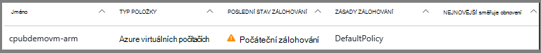
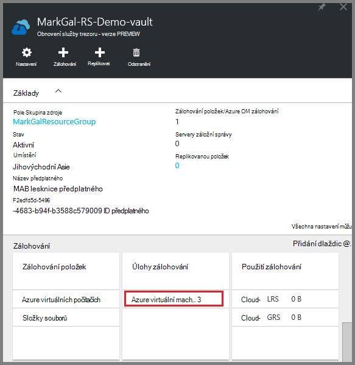
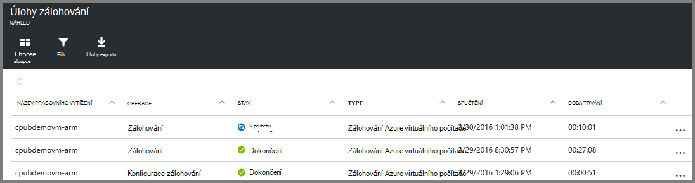

<properties
    pageTitle="Zálohování Azure VMs do služby Recovery trezoru | Microsoft Azure"
    description="Seznamte se s zaregistrovat a obecnějším údajům Azure virtuálních počítačích trezoru služby obnovení těmito postupy pro zálohování Azure virtuálního počítače."
    services="backup"
    documentationCenter=""
    authors="markgalioto"
    manager="cfreeman"
    editor=""
    keywords="virtuální počítač zálohování; obecnějším údajům virtuálního počítače; zálohování a katastrofě obnovení; zálohování OM arm"/>

<tags
    ms.service="backup"
    ms.workload="storage-backup-recovery"
    ms.tgt_pltfrm="na"
    ms.devlang="na"
    ms.topic="article"
    ms.date="07/29/2016"
    ms.author="trinadhk; jimpark; markgal;"/>

# Obecnějším údajům Azure VMs do služby Recovery trezoru

> [AZURE.SELECTOR]
- [Obecnějším údajům VMs do služby Recovery trezoru](backup-azure-arm-vms.md)
- [Obecnějším údajům VMs trezoru zálohování](backup-azure-vms.md)

Tento článek obsahuje postup pro zálohování Azure VMs (nasazených správce prostředků i nasazený klasický) do služby Recovery trezoru. Většinou pracovní zátěž: zálohování VMs přejde do přípravu. Než budete moct obecnějším údajům a ochrana virtuálního počítače, musíte nejdřív udělat [požadavky](backup-azure-arm-vms-prepare.md) k ochraně svého VMs vaše prostředí připravili. Jakmile jste dokončili požadavky, můžete zahájit zálohovat provést snímky vaší OM.

>[AZURE.NOTE] Azure obsahuje dva modely nasazení pro vytváření grafů a práci s prostředky: [Správce zdrojů a klasické](../resource-manager-deployment-model.md). Správce prostředků nasazený VMs a klasické VMs můžete chránit pomocí služby Recovery trezorů. Podrobnosti najdete v části [Zálohovat Azure virtuálních počítačích](backup-azure-vms.md) o práci s klasické nasazení modelu VMs.

Další informace najdete v článcích [plánování záložní infrastrukturu OM v Azure](backup-azure-vms-introduction.md) a [Azure virtuálních počítačích](https://azure.microsoft.com/documentation/services/virtual-machines/).

## Spuštění zálohovat projektu

Zálohování zásady spojené s trezoru služby Recovery Určuje, kdy a jak často se spouští zálohování. Ve výchozím nastavení je první naplánované zálohování počáteční zálohování. Dokud počáteční zálohování poslední záložní stav na zásuvné **Úlohy zálohování** se zobrazí jako **upozornění (počáteční záložní kopie čeká na vyřízení)**.

Pokud zálohování počáteční je splatná zahájíte velmi brzy bude k dispozici, je vhodné spustit **obecnějším údajům**. Následující postup spustí na řídicím panelu trezoru. Tento postup slouží ke spuštění počáteční úlohy zálohování po dokončení všechny předpoklady. Pokud už byl spuštěn počáteční úlohy zálohování, tento postup není k dispozici. Přidružená zásady zálohování Určuje další úlohy zálohování.  

Spuštění počáteční úlohy zálohování:

1. Na řídicím panelu trezoru na dlaždici **zálohování** klikněte na **virtuálních počítačích Azure**.  
    

    Otevře se zásuvné **Zálohování položek** .

2. Na zásuvné **Zálohování položek** trezoru, které chcete zálohovat, pravým tlačítkem klikněte na **Zálohovat**.

    

    Je spuštěná úloha zálohování.  

    

3. Chcete-li zobrazit, že zálohování počáteční dokončí, na řídicím panelu trezoru na dlaždici **Úlohy zálohování** klikněte na **Azure virtuálních počítačích**.

    

    Otevře se zásuvné úlohy zálohování.

4. V zásuvné **úlohy zálohování** můžete zobrazit stav všech projektů.

    

    >[AZURE.NOTE] V rámci zálohování problémy se službou Azure záložní příkazu záložní rozšíření v jednotlivých virtuální počítač vyprázdnění všechny zápisy a konzistentní snímek.

    Po dokončení úloh zálohování stav je *Dokončeno*.

## Poradce při potížích s chybami
Pokud narazíte na problémy při zálohování nahoru virtuálního počítače, najdete v [článku Poradce při potížích OM](backup-azure-vms-troubleshoot.md) nápovědu.

## Další kroky

Teď chráněn vaší OM, podívejte se na v následujících článcích pro další správy úkolů je možné provádět s vaší VMs a obnovení VMs.

- [Správa a sledování virtuálních počítačích](backup-azure-manage-vms.md)
- [Obnovení virtuálních počítačích](backup-azure-arm-restore-vms.md)
