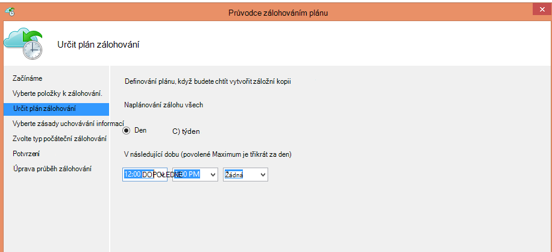
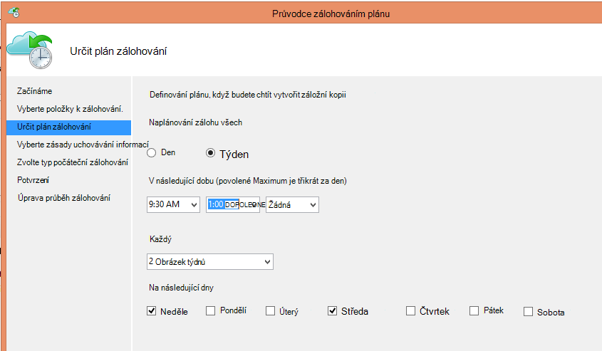
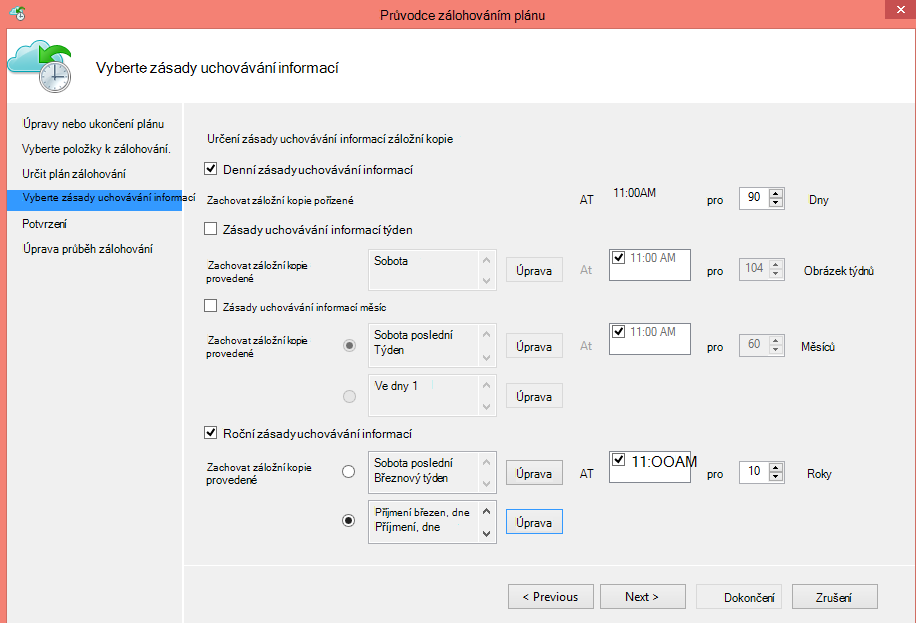
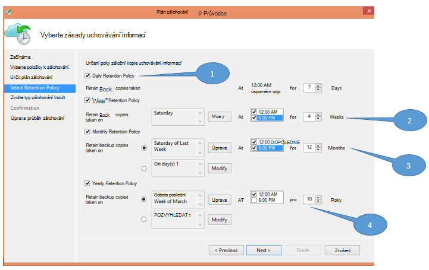
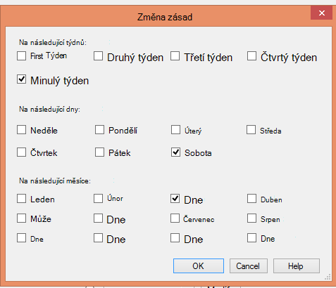

<properties
   pageTitle="Umožňuje nahradit infrastrukturu páskou Azure zálohování | Microsoft Azure"
   description="Zjistěte, jak Azure záložní poskytuje sémantiku páskou profesionálové, která umožňuje zálohování a obnovování dat v Azure"
   services="backup"
   documentationCenter=""
   authors="trinadhk"
   manager="vijayts"
   editor=""/>
<tags
   ms.service="backup"
   ms.devlang="na"
   ms.topic="article"
   ms.tgt_pltfrm="na"
   ms.workload="storage-backup-recovery"
   ms.date="09/27/2016"
   ms.author="jimpark;trinadhk;markgal"/>

# Umožňuje nahradit infrastrukturu páskou Azure zálohování

Azure zálohování a System Center Data Protection Manager zákazníci tyto možnosti:

- Zálohování dat v plánů, které nejlépe odpovídá prezentovanému potřeb organizace.
- Zachovat záložních dat delší dobu
- Zkontrolujte Azure součástí jejich dlouhodobé uchování potřebuje (místo páskou).

Tento článek vysvětluje, jak můžou zákazníci povolit zálohování a zásady uchovávání informací. Zákazníci, kteří používají pásek při řešení jejich dlouhé-dlouhodobé-uchovávání informací, musí mít výkonné a uskutečnitelnou alternativní s dostupností tuto funkci. Tato funkce je povolen v nejnovější verzi Azure zálohování (což je k dispozici [sem](http://aka.ms/azurebackup_agent)). Zákazníci DPM System Center aktualizují, alespoň DPM 2012 R2 UR5 před použitím DPM se službou Azure zálohování.

## Jaký je plán zálohování?
Plán zálohování označuje četnost zálohování. Nastavení na následující obrazovce například označuje, že zálohování přesměrováni denní 18: 00 a půlnoci.

Zákazníci lze také naplánovat týdenní zálohy. Nastavení na následující obrazovce například označuje, že zálohování odebírají každé alternativní neděle & středa v 9:30 do 1:00 dop.

## Jaké jsou zásady uchovávání informací?
Zásady uchovávání informací určuje doby trvání, pro který musí být uloženy zálohování. Místo jenom určující "ploché zásadu" pro všechny záložní body, můžete určit zákazníci zásady uchovávání informací různých podle toho, kdy se považuje zálohování. Například záložní čárky pořízené denně sloužící jako bod provozní obnovení se zachová 90 dní. Zálohování čárky pořízené na konci každé čtvrtletí pro účely auditu se zachová po delší dobu.

Celkový počet bodů"uchovávání informací" uvedené v této zásady je 90 (denní body) + 40 (jedna jednotlivých čtvrtletí pro 10 let) = 130.

## Příklad – použití obojí dohromady

1. **Denní zásady uchovávání informací**: pořízené denně zálohování sedmi dnů.
2. **Týdenní zásady uchovávání informací**: pořízené každý den o půlnoci a 18: 00 Sobota zálohy se zachovají čtyři týdnů
3. **Měsíční zásady uchovávání informací**: pořízené o půlnoci a 18: 00 v posledních Sobotou každý měsíc zálohy se zachovají dvanáct měsíců
4. **Roční zásady uchovávání informací**: 10 let se zachovají zálohy provedené půlnoci v posledních Sobotou každého dne

Celkový počet "uchovávání informací bodů" (body ze kterých můžete zákazníka obnovit data) na předchozím obrázku je vypočítána následujícím způsobem:

- dvě bodů denně sedmi dnů = 14 bodů obnovení
- dvě body za týden čtyři týdnů = 8 obnovení body
- dvě body za měsíc 12 měsíců = 24 bodů obnovení
- odkazuje jeden bod za rok podle obnovení 10 let = 10

Celkový počet bodů obnovení je 56.

> [AZURE.NOTE] Azure zálohování nemá omezení na počet bodů obnovení.

## Upřesnit
Kliknutím na tlačítko **změnit** na předchozí obrazovku zákazníci měli další ještě flexibilněji plány uchování.

## Další kroky
Další informace o Azure zálohování najdete tady:

- [Úvod k Azure zálohování](backup-introduction-to-azure-backup.md)
- [Zkuste Azure zálohování](backup-try-azure-backup-in-10-mins.md)
