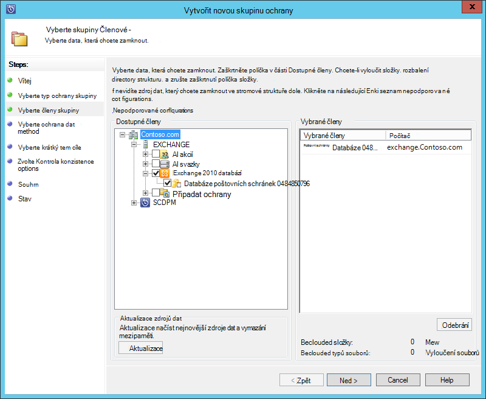
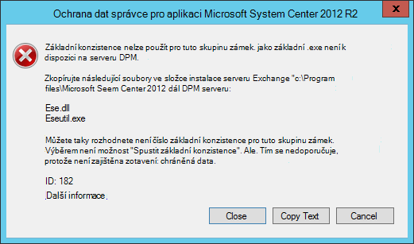
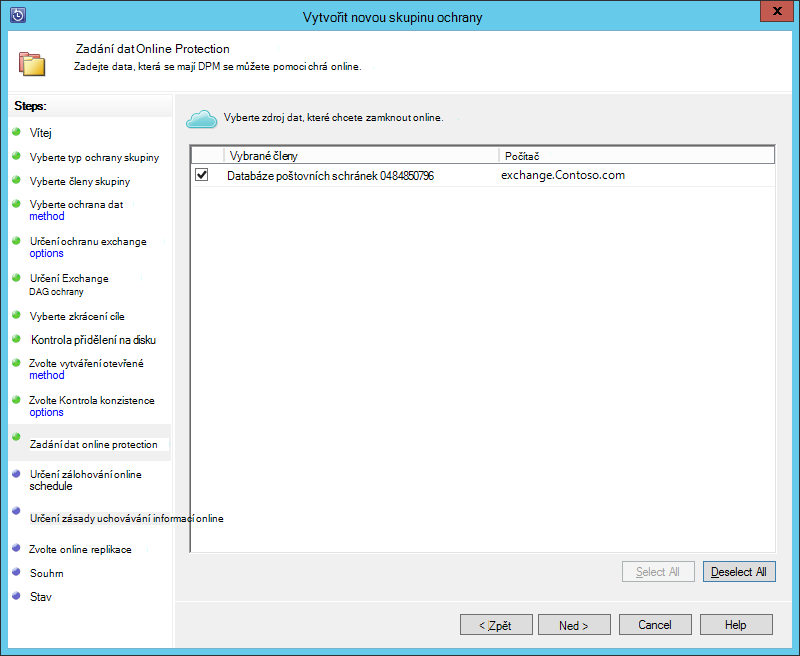
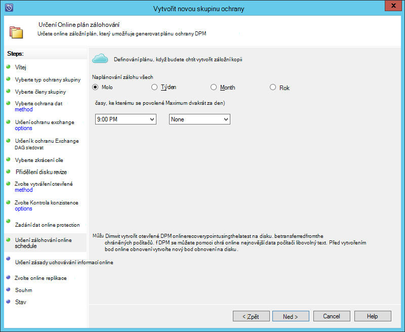
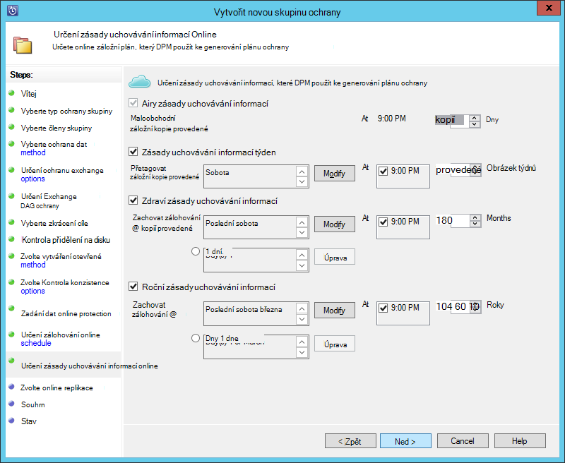
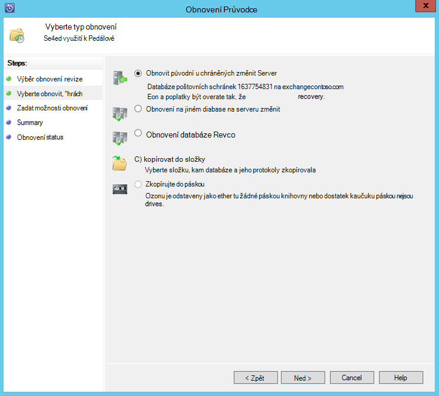

<properties
    pageTitle="Zálohování Exchange server Azure zálohovat s System Center 2012 R2 DPM | Microsoft Azure"
    description="Naučte se obecnějším údajům serveru Exchange k zálohování Azure pomocí System Center 2012 R2 DPM"
    services="backup"
    documentationCenter=""
    authors="MaanasSaran"
    manager="NKolli1"
    editor=""/>

<tags
    ms.service="backup"
    ms.workload="storage-backup-recovery"
    ms.tgt_pltfrm="na"
    ms.devlang="na"
    ms.topic="article"
    ms.date="08/15/2016"
    ms.author="anuragm;jimpark;delhan;trinadhk;markgal"/>

# Obecnějším údajům serveru Exchange server Azure zálohy ve System Center 2012 R2 DPM
Tento článek popisuje postup při konfiguraci serveru Data Protection Manager (DPM) systému systém Center 2012 R2 k obecnějším údajům serveru Microsoft Exchange server Azure zálohování.  

## Aktualizace
Úspěšně registrace DPM serveru pomocí zálohování Azure, musíte nainstalovat nejnovější kumulativní aktualizace pro System Center 2012 R2 DPM a nejnovější verzi Azure Backup Agent. Získání nejnovější kumulativní aktualizaci z [Katalogu společnosti Microsoft](http://catalog.update.microsoft.com/v7/site/Search.aspx?q=System%20Center%202012%20R2%20Data%20protection%20manager).

>[AZURE.NOTE] Příklady v tomto článku je už nainstalovaná verze 2.0.8719.0 Azure Backup Agent a 6 kumulativní aktualizace máte nainstalované na System Center 2012 R2 DPM.

## Zjistit předpoklady pro
Než budete pokračovat, ujistěte se, splnění všechny [požadavky](backup-azure-dpm-introduction.md#prerequisites) pro používání Microsoft Azure Backup chránit úloh. Tyto požadavky patřit následující úkoly:

- Zálohování trezoru Azure portálu byl vytvořen.
- Agent a trezoru pověření jste stáhli DPM server.
- Agent nainstalovaný na serveru DPM.
- Přihlašovací údaje trezoru používaly registrace DPM serveru.
- Pokud jsou chránit Exchange 2016, upgradujte na DPM 2012 R2 UR9 nebo novější

## DPM protection agent  
Pokud chcete nainstalovat DPM protection agent na serveru Exchange, postupujte takto:

1. Ujistěte se, že tyto brány firewall správně nakonfigurované. V tématu [Konfigurace výjimky brány firewall pro agent](https://technet.microsoft.com/library/Hh758204.aspx).

2. Instalace agent na serveru Exchange po kliknutí na **Správa > agenti > Instalace** v konzole pro správu DPM. Podrobný postup najdete v článku [instalace DPM protection agent](https://technet.microsoft.com/library/hh758186.aspx?f=255&MSPPError=-2147217396) .

## Vytvoření skupiny ochrany serveru Exchange

1. V konzole pro správu DPM na položku **Zámek**a potom klikněte na **Nový** na pásu karet nástroje otevřete průvodce **Vytvořit novou skupinu zámek** .

2. Na **úvodní** obrazovce průvodce klikněte na **Další**.

3. Na obrazovce **Vyberte typ ochranu skupiny** vyberte **servery** a klikněte na tlačítko **Další**.

4. Vyberte databázi serveru Exchange, který chcete zamknout a klikněte na tlačítko **Další**.

    >[AZURE.NOTE] Pokud jsou chránit Exchange 2013, zkontrolujte [požadavky na Exchange 2013](https://technet.microsoft.com/library/dn751029.aspx).

    V následujícím příkladu je vybrána databáze Exchange 2010.

    

5. Vyberte požadovanou metodu ochranu dat.

    Zadejte název ochranu skupiny a pak vyberte obě z následujících možností:

    - Chci krátkodobých ochranu pomocí disku.
    - Chci online protection.

6. Klikněte na tlačítko **Další**.

7. Možnost **Spustit Eseutil pro kontrolu integrity dat** vyberte, pokud chcete zkontrolovat integrity databáze systému Exchange Server.

    Po výběru této možnosti, záložní konzistence kontroly se spustí na serveru DPM Chcete-li předejít přenos vstupu a výstupu, který je generováno aplikací spuštění příkazu **eseutil** na serveru Exchange.

    >[AZURE.NOTE]Tuto možnost použít, musíte zkopírujete Ese.dll a Eseutil.exe soubory do adresáře C:\Program Files\Microsoft System Center 2012 R2\DPM\DPM\bin na serveru DPM. V opačném tato chyba se při spuštění aktivují:  
    

8. Klikněte na tlačítko **Další**.

9. Vyberte databázi pro **Záložní kopii**a potom na tlačítko **Další**.

    >[AZURE.NOTE] Pokud nevyberete "Úplné zálohování" pro alespoň jeden DAG kopii databáze, nebude zkráceny protokoly.

10. Nastavení cíle pro **krátkodobých zálohování**a klikněte na tlačítko **Další**.

11. Zkontrolujte volného místa na disku a klikněte na tlačítko **Další**.

12. Vyberte čas, pro niž DPM server vytvoříte počáteční replikace a klikněte na tlačítko **Další**.

13. Vyberte požadované možnosti Kontrola konzistence a klikněte na tlačítko **Další**.

14. Vyberte databázi, kterou chcete obecnějším údajům Azure a klikněte na tlačítko **Další**. Příklad:

    

15. Definování plán **Azure zálohování**a klikněte na tlačítko **Další**. Příklad:

    

    >[AZURE.NOTE] Poznámka: Online obnovení body vycházejí express úplné obnovení body. Proto musí plánujete bod online obnovení po údaj o čase, je určený pro expresní celé obnovení bodu.

16. Nastavení zásad uchovávání informací pro **Zálohování Azure**a klikněte na tlačítko **Další**.

17. Vyberte jednu z možností online replikace a klikněte na tlačítko **Další**.

    Pokud máte databázi velký, může trvat dlouho počáteční zálohování vytvořit v síti. K tomuhle problému předejít, můžete vytvořit zálohu offline.  

    

18. Potvrzení nastavení a potom klikněte na **Vytvořit skupinu**.

19. Klikněte na tlačítko **Zavřít**.

## Obnovení databáze serveru Exchange

1. Když Pokud chcete obnovit databázi Exchange, klikněte na **obnovení** v konzole pro správu DPM.

2. Vyhledejte Exchange databázi, kterou chcete obnovit.

3. Vyberte online obnovení bod z rozevíracího seznamu *časového využití* .

4. Kliknutím na tlačítko Spustit **Průvodce obnovením** **Obnovit** .

Do pole ukazatel online obnovení existuje pět typů obnovení:

- **Obnovení do původního umístění serveru Exchange:** Data se obnovit původní Exchange Server.
- **Obnovit do jiné databáze na serveru Exchange:** Data se obnoven na jinou databázi na jiném serveru Exchange.
- **Obnovit obnovení databáze:** Data se obnoven na serveru Exchange obnovení databáze (RDB).
- **Kopírovat do síťové složky:** Data se obnovit do síťové složky.
- **Kopírovat do páskou:** Pokud máte páskou knihovnu nebo samostatnou páskou jednotka připojený a nakonfigurovaný na serveru DPM bod obnovení zkopírují do bezplatné páskou.

    

## Další kroky

- [Azure záložní časté otázky](backup-azure-backup-faq.md)
