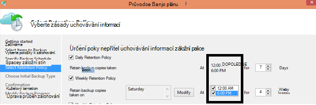

<properties
   pageTitle="Azure nejčastější dotazy týkající se záložní | Microsoft Azure"
   description="Odpovědi na časté otázky k zálohování služby, záložní agent, zálohování a uchovávání informací, využití, zabezpečení a další časté otázky týkající se zálohování a havárie obnovení."
   services="backup"
   documentationCenter=""
   authors="markgalioto"
   manager="jwhit"
   editor=""
   keywords="zálohování a havárie obnovení; zálohování služby"/>

<tags
   ms.service="backup"
   ms.workload="storage-backup-recovery"
     ms.tgt_pltfrm="na"
     ms.devlang="na"
     ms.topic="get-started-article"
     ms.date="10/21/2016"
     ms.author="trinadhk; giridham; arunak; markgal; jimpark;"/>

# <a name="azure-backup-service--faq"></a>Azure zálohování služby – nejčastější dotazy


Tento článek je seznam často kladené otázky (a odpovídajících odpovědi) o službu Azure zálohování. Naší komunity odpovědi rychle, a pokud dotaz se zobrazí dotaz, často, jsme ho přidat do tohoto článku. Odpovědi na otázky obvykle zadejte odkaz nebo informace o podpoře. Zálohování Azure v části Disqus v tomto článku nebo související článku můžete klást otázky. Taky můžete pokládat dotazy k služby Azure zálohování [diskusní fóra](https://social.msdn.microsoft.com/forums/azure/home?forum=windowsazureonlinebackup).


## <a name="what-is-the-list-of-supported-operating-systems-from-which-i-can-back-up-to-azure-using-azure-backup-br"></a>Co je seznam podporované operační systémy, ze kterých se můžete zálohovat Azure zálohování Azure? <br/>
Azure zálohování podporuje následující seznam operačních systémů pro složku souborů zálohování, zálohování aplikace pomocí záložní Server Azure a SCDPM.

| Operační systém        | Platformy           | SKU  |
| :------------- |-------------| :-----|
| Windows 8 a nejnovější SPs      | 64-bit | Pole organizace, Pro |
| Windows 7 a nejnovější SPs      | 64-bit | Ultimate, Enterprise, Professional, Home Premium Home Basic, Starter |
| Windows 8.1 a nejnovější SPs | 64-bit      |    Pole organizace, Pro |
| Windows 10      | 64-bit | Pole organizace, Pro, Domů |
|Windows Server 2012 R2 a nejnovější SPs| 64-bit| Standardní, datacentru, Foundation|
|Windows Server 2012 a nejnovější SPs|    64-bit| Standardní datacentru, Foundation,|
|Windows úložiště serveru 2012 R2 a nejnovější SPs  |64-bit|    Standardní, pracovní skupina|
|Windows úložiště serveru 2012 a nejnovější SPs |64-bit |Standardní, pracovní skupina
|Windows Server 2012 R2 a nejnovější SPs  |64-bit|    Základní|
|Windows Server 2008 R2 SP1 |64-bit|    Standardní, Enterprise, datacentru, Foundation|
|Windows Server 2008 s aktualizací SP2    |64-bit|    Standardní, Enterprise, datacentru, Foundation|

Zálohování OM Azure

- **Linux**: Azure zálohování podporuje [seznam distribuce, které jsou potvrzeno Azure](../virtual-machines/virtual-machines-linux-endorsed-distros.md) kromě Core s operačním systémem Linux.  Další distribuce přenést-e-vlastní-Linux také může pracovat, dokud je k dispozici v počítači virtuální agenta OM a podpora Python existuje.
- **Windows Server**: verze starší než Windows Server 2008 R2 nejsou podporované.

## <a name="where-can-i-download-the-latest-azure-backup-agent-br"></a>Odkud můžete stáhnout nejnovější agent zálohování Azure? <br/>
Můžete si stáhnout nejnovější agent pro zálohování systému Windows Server, System Center DPM nebo Windows klientského počítače přes, [tady](http://aka.ms/azurebackup_agent). Pokud budete chtít obecnějším údajům virtuálního počítače, použijte agenta OM, (které nainstaluje automaticky velkými rozšíření). Agent OM již existuje na virtuálních počítačích vytvořené v galerii Azure.

## <a name="which-version-of-scdpm-server-is-supported-br"></a>Jakou verzi systému SCDPM server podporuje? <br/>
Doporučujeme nainstalovat [nejnovější](http://aka.ms/azurebackup_agent) agent Azure zálohování na nejnovější kumulativní aktualizaci SCDPM (UR11 k srpen 2016)

## <a name="when-configuring-the-azure-backup-agent-i-am-prompted-to-enter-the-vault-credentials-do-vault-credentials-expire"></a>Při konfiguraci agenta zálohování Azure, můžu zobrazila výzva k zadání přihlašovacích údajů trezoru. Trezoru pověření platnost?
Ano, pověření trezoru platnost vyprší po 48 hodin. Když skončí platnost soubor, přihlaste se k portálu Azure a stahování souborů trezoru přihlašovacích údajů z trezoru.

## <a name="is-there-any-limit-on-the-number-of-vaults-that-can-be-created-in-each-azure-subscription-br"></a>Je nějak omezený počet trezorů vytvořené v jednotlivých Azure předplatného? <br/>
Ano. K září 2016 můžete vytvořit 25 záložní trezorů jedno předplatné. Můžete vytvořit až 25 trezorů služby Recovery za každou podporovaných oblast Azure zálohování jedno předplatné. Pokud potřebujete další trezorů, vytvořte nové předplatné.

## <a name="are-there-any-limits-on-the-number-of-serversmachines-that-can-be-registered-against-each-vault-br"></a>Jsou všechny kvůli omezením počtu serverů/počítačů registrovaných před každý trezoru? <br/>
Ano, můžete zaregistrovat až 50 počítačích za trezoru. Pro Azure IaaS virtuálních počítačích limit je 200 VMs za trezoru. Pokud se musíte zaregistrovat více počítačů, vytvořte nový trezoru.

## <a name="how-do-i-register-my-server-to-another-datacenterbr"></a>Jak zaregistrovat server k jiné datacentru?<br/>
Zálohování dat jsou odeslány datacentra trezoru, ke kterému je registrovaná Nejjednodušší způsob, jak změnit datacentra je odinstalovat agent a znovu nainstalujte agent a zaregistrovat do nového trezoru, které patří požadované datacentra.

## <a name="what-happens-if-i-rename-a-windows-server-that-is-backing-up-data-to-azurebr"></a>Co se stane, když přejmenuju Windows server, který je zálohování dat Azure?<br/>
Při přejmenování na server jsou ukončit všechny konfigurovaných zálohy.
Musíte si zaregistrovat nový název serveru s trezoru zálohování. Při vytváření nové registraci je první zálohování úplné zálohování a ne zálohování. Pokud potřebujete obnovit data, která byla dříve zálohovala do trezoru s původní název serveru, můžete obnovit tato data pomocí možnosti [**jiný server**](backup-azure-restore-windows-server.md#recover-to-an-alternate-machine) v průvodci **Datovým obnovit** .

## <a name="what-types-of-drives-can-i-backup-files-and-folders-from-br"></a>Jaké druhy jednotek můžou zálohování souborů a složek z? <br/>
Následující nastavení jednotky/svazky se nemůžou dostat záložní:

- Vyměnitelném médiu: Jednotku musí vykazovat jako pevné být použita zdroj záložní položky.
- Jen pro čtení svazky: objem musí být zapisovatelný pro hlasitost stín kopírovat službu (VSS) (funkce).
- Offline svazky: Hlasitost musí být do online režimu pro VSS (funkce).
- Sdílené síťové složky: hlasitost musí být místní server k zálohování prostřednictvím online zálohování.
- Nástroje BitLocker chráněné svazky: objem musí být odemknout, než dojde k zálohování.
- Identifikace systému souborů: NTFS je pouze podporované pro tuto verzi online záložní služby systému souborů.

## <a name="what-file-and-folder-types-can-i-back-up-from-my-serverbr"></a>Jaké typy souborů a složek lze můžu obecnějším údajům ze serveru?<br/>
Jsou podporovány následující typy:

- Šifrovaná
- Komprimovat
- Sparse
- Komprimovaná + Sparse
- Pevné odkazy: Nejsou podporovány, přeskočilo
- Bodem: Není podporováno, přeskočilo
- Šifrovaná + komprimovány: Není podporována, přeskočilo
- Šifrované + Sparse: Není podporována, přeskočilo
- Komprimovaná toku: Není podporována, přeskočilo
- Sparse toku: Není podporované, přeskočilo

## <a name="whats-the-minimum-size-requirement-for-the-cache-folder-br"></a>Co je požadavek minimální velikost mezipaměti složky? <br/>
Velikost složky mezipaměti určuje množství dat, která zálohujete. Složky mezipaměti by měl být 5 % požadované místo pro ukládání dat.

## <a name="if-my-organization-has-one-vault-how-can-i-isolate-one-servers-data-from-another-server-when-restoring-databr"></a>Pokud má jeden trezoru Moje organizace, jak můžu izolovat jeden server dat z jiného serveru při obnovení dat?<br/>
Všechny servery, které jsou registrované do stejné trezoru můžete obnovit data zálohovala tak, že jiné servery, *které používají stejné heslo*. Pokud máte servery jehož záložních dat chcete oddělit od jiných serverů ve vaší organizaci, použijte určené heslo u těchto serverech. Například servers lidské zdroje může použít jeden heslo šifrování Účetnický servery druhého a servery úložiště u jiného.

## <a name="can-i-migrate-my-backup-data-or-vault-between-subscriptions-br"></a>Můžete "migrovat" Můj zálohování dat nebo trezoru mezi předplatné? <br/>
Ne. Trezoru vznikne úrovni předplatné a nelze znovu přiřadit na jiné předplatné po jeho vytvoření.

## <a name="does-the-azure-backup-agent-work-on-a-server-that-uses-windows-server-2012-deduplication-br"></a>Funguje na serveru, který používá Windows Server 2012 deduplication Azure Backup Agent? <br/>
Ano. Při připraví zálohování agentem převádí deduplicated dat na normální data. Optimalizuje data pro zálohování, jsou šifrovány data a potom odešle šifrovaná data ke službě online zálohování.

## <a name="if-i-cancel-a-backup-job-once-it-has-started-is-the-transferred-backup-data-deleted-br"></a>Pokud zruším úlohy zálohování po spuštění, odstraněna přenesených záložních dat? <br/>
Ne. Zálohování trezoru ukládá zálohované data, která vám to přenesete až do okamžiku zrušení. Azure zálohování používá mechanismus kontrolní bod výjimečně přidáte body obnovení záložních dat během zálohování. Protože jsou kontrolních bodů v záložních dat, můžete ověřit proces další zálohování integrity soubory. Další zálohování spouštěný by přírůstková nad daty, která vám to dříve zálohovat. Přírůstková zálohování poskytuje lepší využití šířky pásma, takže není nutné převádět stejná data opakovaně.

V případě Azure OM zálohování po zrušení úlohy přenesených data ignorována a svěže zálohování převede Přírůstková data z dříve úspěšné úlohy zálohování.

## <a name="why-am-i-seeing-the-warning-azure-backups-have-not-been-configured-for-this-server-even-though-i-had-scheduled-regular-backups-previously-br"></a>Proč se mi zobrazují upozornění "Azure zálohy není nakonfigurováno pro tento server" i když se vám to plánovaná pravidelného zálohování dříve? <br/>
Toto upozornění nastane při nastavení zálohování plánu uložený na místním serveru nejsou stejné jako nastavení uložených v záložní trezoru. Pokud server nebo nastavení obnoveny známé funkční stav, záložní plány může dojít ke ztrátě synchronizace. Pokud se zobrazí toto upozornění, [překonfigurovat zásady zálohování](backup-azure-manage-windows-server.md) a potom **Spustit zálohovat** synchronizaci místního serveru s Azure.

## <a name="what-firewall-rules-should-be-configured-for-azure-backup-br"></a>K čemu brány firewall pravidel by měla být nakonfigurována pro zálohování Azure? <br/>
Bezproblémové ochranu dat na místní na Azure a pracovní zátěž Azure se doporučuje povolit brány firewall komunikovat s následující adresy URL:

- www.msftncsi.com
- \*. Microsoft.com
- \*. WindowsAzure.com
- \*. microsoftonline.com
- \*. windows.net

##<a name="can-i-install-the-azure-backup-agent-on-an-azure-vm-already-backed-by-the-azure-backup-service-using-the-vm-extension-br"></a>Můžete nainstalovat agenta Azure zálohování na OM Azure už záložní službou Azure zálohování s příponou OM? <br/>
Absolutní. Azure zálohování poskytuje zálohování na úrovni OM Azure VMs s příponou OM. Agent Azure zálohování můžete nainstalovat na operačního systému Windows hosta chránit soubory a složky na této hosta s operačním systémem.

## <a name="can-i-install-the-azure-backup-agent-on-an-azure-vm-to-back-up-files-and-folders-present-on-temporary-storage-provided-by-the-azure-vm-br"></a>Můžete nainstalovat agenta Azure zálohování na Azure OM k obecnějším údajům souborů a složek prezentovat dočasné úložný prostor poskytovanou OM Azure? <br/>
Můžete nainstalovat hosta operačního systému Windows Azure Backup agent nebo obecnějším údajům souborů a složek k základnímu úložišti dočasné. Ale dejte pozor, aby zálohování nepovede po dočasné ukládání dat je vzdálené vymazání zařízení. Také pokud odstranil data dočasné úložiště je možné obnovit jenom k základnímu úložišti nezávislé.

## <a name="i-have-installed-azure-backup-agent-to-protect-my-files-and-folders-can-i-now-install-scdpm-to-work-with-azure-backup-agent-to-protect-on-premises-applicationvm-workloads-to-azure-br"></a>Můžu jste nainstalovali Azure zálohování agent chránit soubory a složky. Můžu nyní můžete nainstalovat SCDPM pro práci s Azure Backup agent chránit místní aplikace/OM zatížení Azure? <br/>
Zálohování Azure pomocí služby SCDPM, doporučuje nainstalovat SCDPM nejdřív a teprve potom nainstalujte agent Azure zálohování. Bezproblémová integrace agenta Azure zálohování s SCDPM zajišťuje a umožňuje chránit soubory a složky, aplikace pracovního vytížení a VMs na Azure, přímo v konzole Správa SCDPM. Instalace SCDPM po instalaci Azure zálohování agent pro účely výše uvedené doporučeno nebo není podporované.

## <a name="what-is-the-length-of-file-path-that-can-be-specified-as-part-of-azure-backup-policy-using-azure-backup-agent-br"></a>Co je délka cesta k souboru zadaná jako součást zásad zálohování Azure pomocí agent zálohování Azure? <br/>  
Azure Backup agent závisí na NTFS. [Určení délky cesta k souboru je omezený jazykem rozhraní API systému Windows](https://msdn.microsoft.com/library/aa365247.aspx#fully_qualified_vs._relative_paths). V případě zálohování souborů s délka cesty k souboru větší než zadaných rozhraním API systému Windows, můžete se rozhodnout zákazníci zálohovat nadřazenou složku nebo jednotku disku záložních souborů.  

## <a name="what-characters-are-allowed-in-file-path-of-azure-backup-policy-using-azure-backup-agent-br"></a>Cesta k souboru Azure zálohování zásady použití zálohování Azure agenta povolené znaky? <br>  
 Azure Backup agent závisí na NTFS. Umožňuje [NTFS podporovaná znaků](https://msdn.microsoft.com/library/aa365247.aspx#naming_conventions) jako součást specifikace souboru.  

## <a name="can-i-use-azure-backup-server-to-create-a-bare-metal-recovery-bmr-backup-for-a-physical-server-br"></a>Dá se pomocí záložní Server Azure vytvořit zálohu obnovení úplné kovu (BMR) pro fyzický server? <br/>
Ano.

## <a name="can-i-configure-the-backup-service-to-send-mail-if-a-backup-job-fails-br"></a>Můžete nakonfigurovat službu zálohování posílání pošty, když se nepovede úlohy zálohování? <br/>
Ano, služba zálohování obsahuje několik události upozornění, které můžete používat s skript Powershellu. Úplný popis najdete v článku [oznámení](backup-azure-manage-vms.md#alert-notifications)

## <a name="is-there-a-limit-on-the-size-of-each-data-source-being-backed-up-br"></a>Existuje limit velikosti jednotlivé zdroje dat se zálohovala? <br/>
Když na úrovni trezoru je bez omezení objemu dat, můžete zálohovat, Azure záložní stanovení omezení (pro všechny praktické účely, jsou tyto limity velmi vysoké) na maximální velikosti doručovaných zdroj dat. Srpen 2015 je zdrojem dat maximální velikost podporované operační systémy:

|S.No | Operační systém |  Maximální velikosti doručovaných zdroje dat |
| :-------------: |:-------------| :-----|
|1| Windows Server 2012 nebo vyšší| 54400 GB|
|2| Windows 8 nebo vyšší| 54400 GB|
|3| Windows Server 2008, Windows Server 2008 R2 | 1700 GB|
|4| Windows 7 | 1700 GB|

Následující tabulka uvádí, jak je určen velikost pro všechny zdroje dat.

|   Zdroj dat  |   Podrobnosti |
| :-------------: |:-------------|
|Objem |Množství dat, který zálohovala z jednoho objemu serveru nebo klientského počítače|
|Virtuální počítač Hyper-V | Sčítání dat všechny VHD virtuálního počítače zálohování|
|Databáze Microsoft SQL Server | Jeden velikost databáze SQL zálohování |
|Microsoft SharePoint |Součet databází obsahu a konfigurace ve farmě služby SharePoint zálohování|
|Microsoft Exchange |Součet všechny databáze Exchange do Exchange serveru zálohování|
|Stav BMR/systému |Každá jednotlivé kopie BMR nebo systém stav počítače zálohování|

## <a name="are-there-limits-on-the-number-of-times-a-backup-job-can-be-scheduled-per-daybr"></a>Jsou nějaké omezení počtu opakování denně je možné naplánovat úlohy zálohování?<br/>
Ano, můžete spustit úlohy zálohování v systému Windows Server nebo klienta Windows až třikrát / den. Úlohy zálohování možné spouštět na System Center DPM až dvakrát jeden den. Můžete spustit úlohy zálohování IaaS VMs jednou za den.

## <a name="is-there-a-difference-between-the-scheduling-policy-for-dpm-and-windows-server-ie-on-windows-server-without-dpm-br"></a>Existuje rozdíl mezi plánování zásad pro DPM a Windows Server (tedy v systému Windows Server bez DPM)? <br/>
Ano. Pomocí DPM, můžete určit denních týdně, měsíčně a roční plány. Windows Server (bez DPM) umožňuje zadat jenom denní a týdenní kalendáře.

## <a name="is-there-a-difference-between-the-retention-policy-for-dpm-and-windows-serverclient-ie-on-windows-server-without-dpmbr"></a>Existuje rozdíl mezi zásady uchovávání informací pro DPM a Windows Server/klienta (tedy v systému Windows Server bez DPM)?<br/>
Žádné obou DPM a Windows Server/klienta mít denně, zásady uchovávání informací týdně, měsíčně a roční.

## <a name="can-i-configure-my-retention-policies-selectively--ie-configure-weekly-and-daily-but-not-yearly-and-monthlybr"></a>Můžete nakonfigurovat Moje uchovávání informací, které zásady selektivně – tedy konfigurace týdenní a denní, ale ne ročně a měsíční?<br/>
Ano, uchovávání informací strukturu Azure zálohování vám umožní úplné flexibilitu při definování zásad uchovávání informací podle vašich požadavků.

## <a name="can-i-schedule-a-backup-at-6pm-and-specify-retention-policies-at-a-different-timebr"></a>Můžete "zálohování naplánovat" na 18: 00 a určit "zásady uchovávání informací" jiné najednou?<br/>
Ne. Zásady uchovávání informací lze použít pouze na záložní body. Na následujícím obrázku je určen zásady uchovávání informací záloh na 12 dopoledne nebo odpoledne 6. <br/>


<br/>

## <a name="is-an-incremental-copy-transferred-for-the-retention-policies-scheduled-br"></a>Přenášena přírůstková kopie pro zásady uchovávání informací naplánované? <br/>
Ne, přírůstková kopie je odeslána na základě času uvedená na stránce plán zálohování. Body, které můžou být zachovány se určují na základě zásad uchovávání informací.

## <a name="if-a-backup-is-retained-for-a-long-duration-does-it-take-more-time-to-recover-an-older-data-point-br"></a>Pokud zálohy se zachovají dlouhou dobu, bude trvat delší dobu obnovení starší datový bod? <br/>
 Ne – čas obnovit nejstaršímu nebo od nejnovějšího bodu je stejný. Jednotlivých bodech obnovení se chová jako celé bodu.

## <a name="if-each-recovery-point-is-like-a-full-point-does-it-impact-the-total-billable-backup-storagebr"></a>-Li jednotlivých bodech obnovení jako celé bod, to má vliv na celkové fakturaci záložní úložiště?<br/>
Typické dlouhodobé uchovávání informací bod produkty obsahují záložních dat jako celé body. Úplné body úložiště *neefektivní* ale jsou snadněji a rychleji obnovit. Přírůstková kopie jsou úložiště *efektivně* ale vyžadují, abyste obnovení řetěz dat, což ovlivňuje obnovení času. Azure zálohování úložiště architektura nabízí možnost ty nejcennější ze obou světě optimálně ukládání dat pro rychlé obnoví a by zhoršeným úložiště náklady. Tento přístup datový úložiště zajistí, že je šířky pásma průniku a výstupním efektivní použít. Velikost úložiště data a času potřeba k obnovení dat, je minimalizovat. Přečtěte si další informace o způsobu uložení [přírůstková zálohování](https://azure.microsoft.com/blog/microsoft-azure-backup-save-on-long-term-storage/) jsou efektivně.

## <a name="is-there-a-limit-on-the-number-of-recovery-points-that-can-be-createdbr"></a>Existuje limit počtu obnovení body, které se dají vytvářet?<br/>
Ne. Můžeme mít vyloučenou omezení při obnovení body. Můžete vytvořit libovolný počet bodů obnovení jako své oblíbené.

## <a name="why-is-the-amount-of-data-transferred-in-backup-not-equal-to-the-amount-of-data-i-backed-upbr"></a>Proč je převeden množství dat v zálohování není rovno množství dat se zálohovala?<br/>
 Všechna data, která se zálohovala z Azure Backup Agent nebo SCDPM nebo zálohovat Server Azure je komprimované a zašifrovaných před převáděných. Po použití komprese a šifrování se data v záložní trezoru 30-40 % menší.

## <a name="is-there-a-way-to-adjust-the-amount-of-bandwidth-used-by-the-backup-servicebr"></a>Existuje způsob, jak nastavit šířku pásma používaný službou zálohování?<br/>
 Ano, pomocí možnosti **Změnit vlastnosti** agenta zálohování upravit šířky pásma. Nastavení časového pásma a čas, kdy použít určitou šířku pásma. Další informace najdete v článku [Omezení sítě](../backup-configure-vault.md#enable-network-throttling).

## <a name="my-internet-bandwidth-is-limited-for-the-amount-of-data-i-need-to-back-up-is-there-a-way-i-can-move-data-to-a-certain-location-with-a-large-network-pipe-and-push-that-data-into-azure-br"></a>Moje šířky pásma Internetu je omezené množství dat, potřebné k obecnějším údajům. Je možné data na určité místo s rozsáhlou síť kanálu a nabízená tato data do Azure lze přesunout? <br/>
Můžete data zálohujete do Azure prostřednictvím standardního online záložní procesu nebo pomocí služby Azure Import nebo Export pro přenos dat objektů blob úložiště v Azure. Způsoby žádné další získání zálohy data do Azure úložiště. Další informace o tom, jak používat službu Azure Import nebo Export s Azure zálohování, najdete v článku [pracovní postup zálohování Offline](backup-azure-backup-import-export.md) .

## <a name="how-many-recoveries-can-i-perform-on-the-data-that-is-backed-up-to-azurebr"></a>Kolik obnovení může provádět s daty, která se zálohovala Azure?<br/>
Neexistuje žádná omezení počtu obnovení ze zálohy Azure.

## <a name="do-i-have-to-pay-for-the-egress-traffic-from-azure-data-center-during-recoveriesbr"></a>Je potřeba zaplatit přenosy výstupní z Azure datacentrem během obnovení?<br/>
 Ne. Jsou vaše obnovení zdarma a nejsou účtovaná za přenosy výstupní.

## <a name="is-the-data-sent-to-azure-encrypted-br"></a>Odeslaný data do Azure šifrovaná? <br/>
Ano. Data musí být zašifrovaný tohoto počítače místního serveru a klientských/SCDPM pomocí AES256 a data se neodesílají přes zabezpečený odkaz HTTPS.

## <a name="is-the-backup-data-on-azure-encrypted-as-wellbr"></a>Je záložních dat na Azure šifrované také?<br/>
 Ano. Data odeslaná Azure zůstane zašifrovaný (u ostatních). Microsoft není dešifrovat záložních dat kdykoli. Zálohování Azure OM Azure záložní využívá šifrování virtuálního počítače tedy pokud váš OM musí být zašifrovaný pomocí šifrování disku Azure nebo jiných technologii šifrování, Azure záložní používá k zabezpečení dat, které šifrování.

## <a name="what-is-the-minimum-length-of-encryption-key-used-to-encrypt-backup-data-br"></a>Co je minimální délka šifrovací klíč používaný k šifrování záložních dat? <br/>
 Šifrovací klíč by měl být aspoň 16 znaků.

## <a name="what-happens-if-i-misplace-the-encryption-key-can-i-recover-the-data-or-can-microsoft-recover-the-data-br"></a>Co se stane, když mám někam nezaložili šifrovací klíč? Dají se obnovit data (nebo) Microsoft obnovit data? <br/>
Klíč používaný k šifrování záložních dat existuje pouze místně zákazníkovi. Společnost Microsoft nezachová kopii v Azure a nemá žádné přístup ke klíči. Pokud zákazník misplaces klávesu, nejdou obnovit Microsoft záložních dat.

## <a name="how-do-i-change-the-cache-location-specified-for-the-azure-backup-agentbr"></a>Jak můžu změnit umístění mezipaměti určeným pro agenta zálohování Azure?<br/>
 Postupně prochází níže změníte umístění mezipaměti odrážkový seznam.
- Ukončení modul zálohování spuštěním následujícího příkazu v příkazovém řádku:

  ```PS C:\> Net stop obengine```

- Nepřesouvat soubory. Místo toho zkopírujte složku mezipaměti místa na jinou jednotku s dostatek místa. Po potvrzení, že zálohy pracujete s novou mezipaměť mezery je možné odebrat původní místo mezipaměti.

- Aktualizujte následující položky registru cestu ke složce nový prostor mezipaměti.<br/>

|Cesta v registru | Klíče registru | Hodnota |
| ------ | ------- | ------|
| `HKEY_LOCAL_MACHINE\SOFTWARE\Microsoft\Windows Azure Backup\Config` | ScratchLocation | *Nové umístění složky mezipaměti* |
| `HKEY_LOCAL_MACHINE\SOFTWARE\Microsoft\Windows Azure Backup\Config\CloudBackupProvider` | ScratchLocation | *Nové umístění složky mezipaměti* |

- Restartujte modul zálohování spuštěním následujícího příkazu v příkazovém řádku:

  ```PS C:\> Net start obengine```

  Po vytvoření zálohování se úspěšně dokončilo v novém umístění mezipaměti, můžete odebrat původní složku mezipaměti.

## <a name="where-can-i-put-the-cache-folder-for-the-azure-backup-agent-to-work-as-expectedbr"></a>Kde můžete dát složku mezipaměti fungovaly očekávaným Agent zálohování Azure?<br/>
Do těchto umístění pro složku mezipaměti nedoporučuje:

- Sítě sdílené složky nebo výměnné médium: složku mezipaměti musí být místního serveru, který potřebuje zálohování prostřednictvím online zálohování. Síťová umístění nebo výměnné médium, jako se nepodporuje doplňky jednotky USB.
- Offline svazky: Složku mezipaměti musí být online očekávané zálohování pomocí záložní Agent Azure.

## <a name="are-there-any-attributes-of-the-cache-folder-that-are-not-supportedbr"></a>Jsou všechny atributy složku mezipaměti, které nejsou podporované?<br/>
 Následující atributy nebo jejich kombinace jsou podporovány pro složku mezipaměti:

- Šifrovaná
- Odstranit duplicitní
- Komprimovat
- Sparse
- Zpracování bodů

Doporučujeme, aby složku mezipaměti ani metadata virtuální pevný disk atributy nad pro očekávané fungování agenta Azure zálohování.
