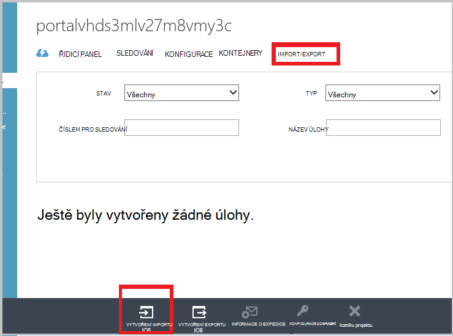

<properties
   pageTitle="Azure zálohování - zálohování Offline nebo počáteční ohlašovat pomocí služby Azure Import nebo Export | Microsoft Azure"
   description="Zjistěte, jak Azure zálohování umožňují odeslat data ze sítě pomocí služby Azure Import nebo Export. Tento článek vysvětluje, offline ohlašovat počáteční záložních dat pomocí služby Azure Import Export."
   services="backup"
   documentationCenter=""
   authors="saurabhsensharma"
   manager="shivamg"
   editor=""/>
<tags
   ms.service="backup"
   ms.devlang="na"
   ms.topic="article"
   ms.tgt_pltfrm="na"
   ms.workload="storage-backup-recovery"
   ms.date="08/16/2016"
   ms.author="jimpark;saurabhsensharma;nkolli;trinadhk"/>

# Pracovní postup zálohování offline v Azure zálohování
Azure zálohování obsahuje několik předdefinovaných efektivity, která ušetřit náklady na síť a úložiště při počáteční úplné zálohování dat za účelem Azure. Počáteční úplné zálohování obvykle přepojit velké objemy dat a vyžadovat další šířka pásma při porovnání na pozdější zálohování, které převést pouze rozdílů/incrementals. Azure zálohování zkomprimuje počáteční zálohy. Procesem offline ohlašovat Azure záložní umožňuje disků odeslat mu tuhle zkomprimovanou počáteční zálohování dat v režimu offline Azure.  

Offline ohlašovat proces Azure zálohování úzce integrována služby [Azure Import nebo Export služby](../storage/storage-import-export-service.md) , který umožňuje přenést data do Azure pomocí disků. Pokud máte TB (TBs) počáteční záložních dat, kterou je potřeba přenesou vysokou latencí a pomalé síti, můžete dodat počáteční záložní kopie na jeden nebo více pevných discích k Azure datacentru offline ohlašovat pracovního postupu. Tento článek obsahuje přehled kroků, které dokončit tento pracovní postup.

## Základní informace

Pomocí funkce offline ohlašovat Azure zálohování a Azure Import nebo Export je velmi jednoduché odeslání dat v režimu offline do Azure pomocí disků. Místo přenos počáteční úplné kopie v síti, zálohování dat je aby došlo k zápisu *přípravu umístění*. Po dokončení výtisku pracovní místo pomocí nástroje Azure Import nebo Export došlo k jedné nebo více jednotek SATA podle objemu dat zápisu tato data. Tyto jednotky jsou postupně vyřízeny k nejbližšímu datacentru Azure.

[Srpen 2016 aktualizovat Azure zálohování (a novější)](http://go.microsoft.com/fwlink/?LinkID=229525) obsahuje *Nástroj pro přípravu disku Azure*s názvem AzureOfflineBackupDiskPrep, který:

   - Umožňuje připravili na vašich jednotkách Azure importovat pomocí nástroje Azure Import nebo Export.
   - Automaticky vytvoří úlohy Azure importu pro službu Azure Import nebo Export v [Azure klasické portál](https://manage.windowsazure.com) aby vytvořili stejné ručně ve starších verzích Azure zálohování.

Po dokončení nahrávání záložní data, která chcete Azure Azure záložní slouží ke kopírování záložních dat do záložní trezoru a jsou naplánované přírůstková zálohy.

  > [AZURE.NOTE] Pokud chcete používat nástroj pro přípravu disku Azure, zkontrolujte, jestli jste nainstalovali aktualizace srpen 2016 Azure zálohování (nebo novější) a proveďte všechny kroky pracovního postupu s ním. Pokud používáte starší verzi Azure zálohování, můžete připravit disk SATA nástrojem Azure Import nebo Export popsané v dalších částech tohoto článku.

## Zjistit předpoklady pro

- [Seznámení s pracovním postupem Azure Import nebo Export](../storage/storage-import-export-service.md).
- Před spuštění pracovního postupu, ověřte následující:
    - Zálohování Azure trezoru byl vytvořen.
    - Stáhl(a) trezoru pověření.
    - Agent Azure zálohování nainstaloval na serveru/systému Windows klienta nebo System Center Data Protection Manager serveru a počítači máte zaregistrované v rámci trezoru Azure zálohování.
- [Stáhněte si soubor nastavení Azure publikování](https://manage.windowsazure.com/publishsettings) v počítači, ze které plánujete zpět se vaše data.
- Příprava pracovní umístění, které můžou být sdílené síťové složky nebo další disk v počítači. Pracovní umístění přechodná úložiště a slouží dočasně během tento pracovní postup. Zkontrolujte, že pracovní umístění nainstalovaný dostatek místa pro uložení první kopie. Například pokud se pokoušíte obecnějším údajům 500 GB souborovém serveru, zajistěte, aby byl pracovní oblasti aspoň 500 GB. (Menší částka se používá z důvodu komprese.)
- Ujistěte se, jestli používáte podporovanou jednotky. Pouze 3,5 SATA II/III pevných discích jsou podporovány pro použití se službou Import nebo Export. Nejsou podporovány pevných discích větší než 8 TB. Disk SATA II/III můžete připojit externě většině počítačů pomocí adaptér SATA II/III USB. Nejnovější sadu jednotky, které služba podporuje v dokumentaci Azure Import nebo Export.
- Na počítači, ke kterému je připojen zapisovací jednotka SATA povolte BitLocker.
- [Stáhněte si nástroj Azure Import nebo Export](http://go.microsoft.com/fwlink/?LinkID=301900&clcid=0x409) k počítači, do kterého SATA jednotka Redaktor připojení. Tento krok není povinný, pokud máte stažení a instalaci aktualizace ze srpna 2016 Azure zálohování (nebo novější).

## Pracovní postup
Informace v této části vám pomůže dokončit pracovní postup zálohování offline tak, aby vaše data můžete dodat Azure datacentra a odeslání do úložiště Azure. Pokud máte nějaké dotazy týkajícími se služby importovat nebo všechny aspekty procesu najdete v dokumentaci [Přehled služby Import](../storage/storage-import-export-service.md) odkazuje dříve.

### Zahájení konverzace v režimu offline zálohování

1. Při plánování zálohy se zobrazí na následující obrazovce (v systému Windows Server, klienta systému Windows nebo System Center Data Protection Manager).

    

    Tady je odpovídající obrazovky v centru dat ochrany správce systému:  
    

    Popis vstupů vypadá takto:

    - **Pracovní umístění**: dočasném úložišti, ke kterému je zapsán počáteční záložní kopie. Může to být ve sdílené síťové složce nebo místním počítači. Pokud kopírovat a zdroj počítač se liší, doporučujeme zadat úplná cesta v síti pracovní umístění.
    - **Název úlohy importu Azure**: jedinečný název, podle které Azure Import služby a zálohováním: Azure sledovat přenos dat odeslané na discích Azure.
    - **Nastavení publikování Azure**: souboru ve formátu XML, který obsahuje informace o profilu předplatného. Obsahuje také zabezpečené přihlašovací údaje, které jsou přidružené k předplatnému. Můžete si [budou moct soubor stáhnout](https://manage.windowsazure.com/publishsettings). Zadejte místní cestu k souboru nastavení publikovat.
    - **ID předplatného Azure**: Azure ID předplatného pro předplatné, ve které se chystáte zahajte úlohy Azure importu. Pokud máte víc předplatných Azure pomocí ID předplatné, které chcete přidružit k úlohy importu.
    - **Účet Azure úložiště**: klasické typ účtu úložiště v zadané Azure předplatné, které bude přidružený k úlohy Azure importu.
    - **Kontejner úložiště Azure**: název objektů blob cílového úložiště v okně účet Azure úložiště kde tuto úlohu importu.

    > [AZURE.NOTE] Pokud jste si zaregistrovali serveru do služby Azure Recovery trezoru z [Azure portálu](https://portal.azure.com) pro zálohování a není předplatného cloudové řešení poskytovatele (CSP), můžete pořád vytvořit účet úložiště klasické typ z portálu Microsoft Azure a použít pro pracovní postup zálohování offline.

    Tyto informace uložte, protože budete muset zadat znovu následujícími kroky. Jenom *pracovní umístění* požaduje Pokud jste použili nástroj pro přípravu disku Azure Příprava discích.    

2. Dokončení pracovního postupu a vyberte **Zálohovat** v konzole Správa Azure záložní zahajte offline záložní kopie. Počáteční zálohování zapisuje pracovní oblasti v rámci tohoto kroku.

    

    Dokončete odpovídající pracovní postup v centru dat ochranu správce klikněte pravým tlačítkem myši na **Ochranu skupiny**a vyberte možnost **vytvořit obnovení bodu** . Potom vyberte možnost **Online Protection** .

    

    Po dokončení operace pracovní umístění je připravená k použití pro přípravu disku.

    

### Příprava SATA jednotky a vytvoření úlohy importu Azure pomocí nástroje Příprava disku Azure
Nástroj pro přípravu disku Azure je k dispozici v adresáři služby Recovery Agent (srpen 2016 aktualizovat a novější) v následujícím umístění.

   *\Microsoft* *Azure* *Obnovení* *Služby* * Agent\Utils\*

1. Přejděte do adresáře a zkopírujte adresáři **AzureOfflineBackupDiskPrep** k počítači kopii ve kterém jsou připojeny jednotky ještě počítat. Zajištění následující s ohledem na počítači kopii:

      - Tlačítko Kopírovat můžete získat přístup ke pracovní umístění pro pracovní postup offline ohlašovat použitím stejného síťové cesty, které v pracovním postupu **Zahájit zálohování offline** .

      - Nástroj BitLocker je povolen v počítači.

      - Počítači máte přístup na portál Azure.

      V případě potřeby počítači kopii mohou shodovat s názvem zdrojového počítače.

2. Otevřete příkazovém řádku na tlačítko Kopírovat s adresářem Příprava disku Azure nástroj jako aktuální adresář a spusťte tento příkaz:

      *.\AzureOfflineBackupDiskPrep.exe* s: <*Pracovní cestě*> [p: <*cesta k PublishSettingsFile*>]

| Parametr | Popis
|-------------|-------------|
|s: <*Pracovní cestě*> | Povinné zadání vstupních hodnot, které slouží k poskytování cestu k pracovní umístění, které jste zadali v pracovním postupu **Zahájit zálohování offline** . |
|p: <*cesta k PublishSettingsFile*> | Volitelné vstup, který se používá k zadejte cestu k souboru **Nastavení publikování Azure** , který jste zadali v pracovním postupu **Zahájit zálohování offline** . |

> [AZURE.NOTE] &lt;Cestu k PublishSettingFile&gt; hodnotu povinná při kopírování počítače a zdrojového počítače se liší.

Při spuštění příkazu požadavky nástroje pro výběr úlohy importu Azure, která odpovídá jednotky, které je třeba ještě počítat. Pokud jeden import projektu je jen přidružené k zadané pracovní umístění, zobrazí se obrazovka podobné tomuto, který následuje.

     
3. Zadejte písmeno bez koncových dvojtečka připojené disku, který chcete připravit pro převod Azure. Potvrzení pro formátování jednotka po zobrazení výzvy zadejte.

Nástroj pak, nebude zahájen Příprava disku záložní daty. Budete muset připojit další disk po zobrazení výzvy nástrojem pro případ, uvedl disk nemá dostatek místa pro zálohování dat.  

Na konci úspěšné spuštění nástroje jsou připravené jeden nebo více disků, které jste uvedli pro dodávky Azure. Kromě toho úlohy importu nahraďte názvem, který jste zadali při **zahájení zálohování offline** pracovního postupu se vytvoří na portálu Azure klasické. Nakonec nástroj zobrazí adresy příjemce k Azure datacentru, kde je třeba disků dodat a odkaz na vyhledejte úlohy importu na portálu Azure klasické.

    
4. Dodat disků na adresu, na kterých byly čerpány nástroj a mějte číslem pro sledování pro pozdější potřeby. 
5. Přejděte na odkaz, který zobrazí nástroj zobrazí účet Azure úložiště, který jste zadali v pracovním postupu **Zahájit zálohování offline** . Zde se zobrazí nově vytvořený import projektu na kartě **IMPORT nebo EXPORT** účtu úložiště.

    
6. Klikněte na položku **Dodací informace** v dolní části na stránce aktualizujte o kontaktech, jak je vidět na následující obrazovce. Společnost Microsoft použije tyto informace o dodat disků zpět po dokončení importu úlohy.

    
7. Zadejte podrobnosti expedice na další obrazovce. Poskytování údajů **Carrier doručení** a **Sledování Číslo** , které odpovídají disků, které je položka Expedovaná Azure datacentra.

    

### Dokončení pracovního postupu
Po dokončení importu úlohy počáteční záložních dat je k dispozici ve vašem účtu úložiště. Obnovení služby agent pak kopií obsah data z tohoto účtu na trezoru zálohování a obnovení služby vault, podle toho, co je platný. V plánované záložní příště provádí Azure záložní agent přírůstková zálohování přes počáteční záložní kopie.

> [AZURE.NOTE] Následující části platí pro uživatelé starších verzí Azure zálohy, kteří nemají přístup k nástroj pro přípravu disku Azure.

### Příprava SATA jednotka

1. Stáhněte [Nástroj pro Import nebo Export Microsoft Azure](http://go.microsoft.com/fwlink/?linkid=301900&clcid=0x409) k počítači, na Kopírovat. Zajistěte, aby byl pracovní umístění přístupný z počítače, ve kterém chcete používat další sady příkazů. V případě potřeby počítači kopii mohou shodovat s názvem zdrojového počítače.

2. Rozbalení WAImportExport.zip souboru. Spusťte nástroj WAImportExport formáty disk SATA, zapíše záložních dat SATA jednotku, který šifruje ho. Před spuštěním následujícího příkazu povolena nástroje BitLocker v počítači.  

    *.\WAImportExport.exe PrepImport /j: <* JournalFile*> .jrn /id: <*ID relace*> /sk: <*StorageAccountKey*> /BlobType:**PageBlob* * /t: <*TargetDriveLetter*>/formátování / šifrování /srcdir: <*přípravu umístění*> /dstdir: <*DestinationBlobVirtualDirectory*>/*

    > [AZURE.NOTE] Nainstalovaného aktualizace srpen 2016 Azure zálohování (nebo novější) zajistěte, aby pracovní umístění, které jste zadali je stejná jako na obrazovce **Zálohovat** a obsahuje soubory AIB a objektů Blob základu.

| Parametr | Popis
|-------------|-------------|
| /j: <*JournalFile*>| Cesta k souboru deníku. Každou jednotku musíte mít jeden soubor deníku. Soubor deníku nesmí být na cílové jednotky. Přípona souboru deníku je .jrn a se vytvoří jako součást spuštěním tohoto příkazu.|
|/ID: <*ID relace*> | ID relace určuje relaci kopírovat. Slouží k zajištění přesné obnovení relaci přerušené kopírovat. Soubory, které se zkopírují v relaci kopírovat jsou uložené v adresáři po ID relace na cílové jednotky.|
| /Sk: <*StorageAccountKey*> | Klíč účtu úložiště účet, ke kterému se data naimportují. Klíč musí být stejné jako zadané při vytváření skupin záložní zásad a ochrany.|
| / BlobType | Typ objektů blob. Tento pracovní postup se mu jenom v případě, že není zadán **PageBlob** . To je výchozí možnost a by měl být podle tohoto příkazu. |
|/ t: <*TargetDriveLetter*> | Písmeno bez koncových dvojtečka pevném disku cílové pro aktuální relaci kopírovat.|
|/ Format | Možnost formátování jednotky. Zadejte tento parametr jednotku potřebujete-li formátovat; v opačném vynecháte. Před nástroj formáty jednotku, zobrazí výzvu k potvrzení z konzoly. Potlačí potvrzení, zadejte parametr /silentmode.|
|/ šifrování | Možnost šifrování jednotky. Zadejte tento parametr, pokud jednotku není zatím šifrované pomocí nástroje BitLocker a vyžaduje šifrované nástrojem. Pokud jednotku již byly šifrované pomocí nástroje BitLocker, tento parametr vynecháte, zadejte parametr /bk a poskytují existující klíč nástroje BitLocker. Pokud zadáte parametr/Format, je nutné zadat také / šifrování parametr. |
|/srcdir: <*SourceDirectory*> | Adresář zdroj, který obsahuje soubory zkopírovaly do cílové jednotky. Zkontrolujte, že název zadaný adresáře nainstalovaný úplné spíše než relativní cestu.|
|/dstdir: <*DestinationBlobVirtualDirectory*> | Cesta k určení virtuální adresář ve vašem účtu Azure úložiště. Ujistěte se, že provádějte určit cílový virtuálních nebo objekty BLOB kontejneru platné názvy. Mějte na paměti, že názvy kontejneru musí být malá písmena.  Toto jméno container by měl být ten, který jste zadali při vytváření záložní zásad a ochrany skupiny.|

  > [AZURE.NOTE] Ve složce WAImportExport shromažďuje informace celý pracovního postupu se vytvoří soubor deníku. Při vytváření úlohy importu Azure portálu musíte tento soubor.

  

### Vytvoření úlohy importu v portálu Azure
1. Přejděte ke svému účtu úložiště [Azure klasické portál](https://manage.windowsazure.com/), klikněte na **Import nebo Export**a potom **Vytvořit úlohy importu** v podokně úloh.

    

2. V kroku 1 Průvodce označuje, že jste připraveni na disku a máte k dispozici soubor deníku jednotky.
3. V kroku 2 Průvodce poskytnutí kontaktních informací pro ten, kdo je zodpovědný za této úlohy importu.
4. V kroku 3 nahrajte soubory deníku jednotky, které jste získali v předchozí části.
5. V kroku 4 zadejte popisný název úlohy importu, která jste zadali při vytváření záložní zásad a ochrany skupiny. Název, který zadáte může obsahovat pouze malá písmena, čísla, pomlčky a podtržítka, musí začínat písmenem a nesmí obsahovat mezery. Název, který se rozhodnete slouží ke sledování úlohami době, kdy budou probíhá a po dokončení.
6. Potom vyberte oblast datacentra ze seznamu. Oblast datacentra označuje datacentra a adresu, na které je třeba nabízet balíčku.

    

7. V kroku 5 vyberte zpáteční carrier ze seznamu a zadejte číslo svého účtu carrier. Společnost Microsoft používá tento účet dodat vašich jednotkách zpět po dokončení importu práce.

8. Dodáte disk a zadejte nové číslo sledování, chcete-li sledovat stav dodávky. Po disku se doručí do datacentra, se kopírují do účtu úložiště a aktualizace stavu.

    

### Dokončení pracovního postupu
Po počáteční záložních dat je k dispozici ve vašem účtu úložiště, agent služby Microsoft Azure Recovery slouží ke kopírování obsahu data z tohoto účtu do trezoru zálohování nebo obnovení služby trezoru, podle toho, co je platný. V plánu záložní příště provede Azure záložní agent přírůstková zálohování přes počáteční záložní kopie.

## Další kroky
- Všechny dotazy týkající se pracovního postupu Azure Import nebo Export v příručce [pomocí služby pro přenos dat k úložišti objektů Blob Microsoft Azure Import nebo Export](../storage/storage-import-export-service.md).
- Přečtěte si část zálohování offline Azure záložní [Nejčastější dotazy](backup-azure-backup-faq.md) pro všechny dotazy týkající se pracovního postupu.
