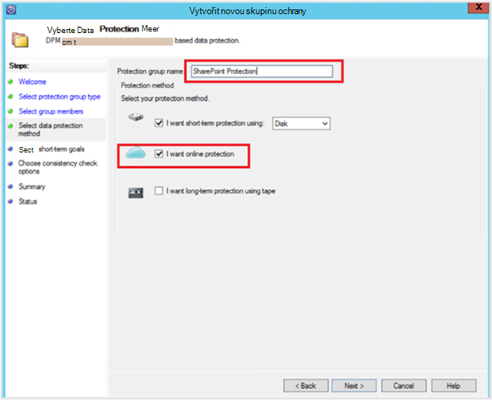
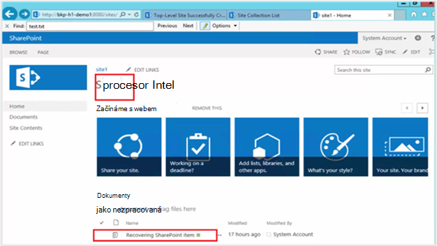

<properties
    pageTitle="Zálohování DPM/Azure serveru ochrany farmě služby SharePoint na Azure | Microsoft Azure"
    description="Tento článek obsahuje přehled DPM/Azure zálohování serveru ochrany farmě služby SharePoint na Azure"
    services="backup"
    documentationCenter=""
    authors="adigan"
    manager="Nkolli1"
    editor=""/>

<tags
    ms.service="backup"
    ms.workload="storage-backup-recovery"
    ms.tgt_pltfrm="na"
    ms.devlang="na"
    ms.topic="article"
    ms.date="09/29/2016"
    ms.author="adigan;giridham;jimpark;trinadhk;markgal"/>

# Zálohování farmy Sharepointu na Azure
Zálohujete farmě SharePoint Microsoft Azure pomocí systému Centrum Data Protection Manager (DPM) v mnohem stejným způsobem jako obecnějším údajům jiných zdrojů. Azure zálohování poskytuje správcům flexibilitu v plánu zálohování vytvořit denně, týdně, měsíčně nebo ročně zálohování bodů a nabídne vám možnosti zásad uchovávání informací pro různé záložní body. DPM poskytuje možnost k ukládání kopií místní disk pro snadné obnovení včasných cílů (RTO) a pro ukládání kopií Azure pro vyplatí, dlouhodobé uchovávání informací.

## SharePoint podporuje verzí a týkající se ochrany scénáře
Azure zálohování DPM podporuje následujících situacích:

| Pracovní zátěž | Verze | Nasazení Sharepointu | Typ DPM nasazení | DPM - System Center 2012 R2 | Ochrana a obnovení |
| -------- | ------- | --------------------- | ------------------- | --------------------------- | ----------------------- |
| Služby SharePoint | SharePoint 2013, SharePoint 2010, SharePoint 2007 SharePoint 3.0 | Nasazení jako Hyper-V/VMware virtuálního počítače nebo pole fyzicky server SharePoint   --------------   SQL AlwaysOn | Pole fyzicky serveru nebo místní Hyper-V virtuálního počítače | Zálohování Azure podporuje kumulativní aktualizaci 5 | Ochrana možnosti obnovení farmě Sharepointu: obnovení farmy, databáze a soubor nebo položku seznamu z disku obnovení bodů.  Obnovení farmy a databáze z Azure obnovení bodů. |

## Než začnete
Existuje několik věcí, které je potřeba před farmě služby SharePoint na Azure zálohování potvrďte.

### Zjistit předpoklady pro
Než budete pokračovat, ujistěte se, zda jsou splněny všechny [požadavcích na používání Microsoft Azure Backup](backup-azure-dpm-introduction.md#prerequisites) chránit úloh. Obsahují některé úkoly předpoklady: Vytvořte záložní trezoru stahování přihlašovacích údajů trezoru, instalace záložní Agent Azure a zaregistrovat DPM/Azure záložní Server s trezoru.

### DPM agent
DPM agent musí být nainstalovaný na serveru, na kterém běží SharePoint serverech běží SQL Server a všechny ostatní servery, které jsou součástí farmě Sharepointu. Další informace o tom, jak nastavit ochranu agent najdete v článku [Nastavení ochrany Agent](https://technet.microsoft.com/library/hh758034(v=sc.12).aspx).  Jedinou výjimkou je nainstalovat agenta jenom na jednom webovém serveru front-end (WFE). DPM musí agent na jednom serveru WFE pouze sloužit jako vstupní bod pro ochranu.

### Farmě Sharepointu
U každé 10 milionů položek ve farmě musí být alespoň na úrovni 2 GB volného místa na hlasitost, kde se nachází složka DPM. Zde je potřeba pro generování katalogu. U DPM obnovit určité položky (kolekcí webů, weby, seznamy, knihovny dokumentů, složky, jednotlivé dokumenty a položky seznamů) katalogu generování vytvoří seznam adres URL, které jsou obsaženy v rámci každé databáze obsahu. Seznam adres URL můžete zobrazit v podokně obnovitelné položky v oblasti úloh **obnovení** konzoly DPM správce.

### SQL Server
DPM spustí s účtem LocalSystem. Zálohování databáze systému SQL Server, musí DPM členem oprávnění k tomuto účtu, na kterém běží SQL Server serveru. Nastavit NT AUTHORITY\SYSTEM *členem* na serveru, na kterém běží SQL Server před obecnějším údajům.

Pokud farmě Sharepointu má databáze systému SQL Server, u kterých budou nakonfigurována aliasy SQL serveru, na front-end webového serveru, který bude chránit DPM nainstalujte klientské součásti SQL Server.

### Služba SharePoint serveru
Během výkon závisí na spousta faktorů, jako je velikost farmě Sharepointu, jako obecné pokyny DPM serverů můžete chránit farmě SharePoint 25 TB.

### Kumulativní aktualizace DPM 5
Začněte ochrany farmě služby SharePoint na Azure, budete potřebovat k instalaci kumulativní aktualizace DPM 5 nebo novější. Kumulativní aktualizace 5 umožňuje chránit farmě služby SharePoint na Azure Pokud farmě nakonfigurovaný pomocí SQL AlwaysOn.
Další informace najdete v blogovém příspěvku, který představuje [kumulativní aktualizaci DPM 5]( http://blogs.technet.com/b/dpm/archive/2015/02/11/update-rollup-5-for-system-center-2012-r2-data-protection-manager-is-now-available.aspx)

### Co se nepodporuje
- DPM chrání farmě Sharepointu není ochrana vyhledávací indexy nebo aplikačních databází služeb. Je třeba konfigurovat ochranu tyto databáze samostatně.
- DPM neposkytuje záložní kopii databáze systému SQL Server služby SharePoint, které jsou hostované na serveru (SOFS) škálování sdílené.

## Konfigurace služby SharePoint ochrany
Než budete moct použít DPM chránit Sharepointu, musíte nakonfigurovat zápis VSS. SharePoint služby WSS Redaktor pomocí **ConfigureSharePoint.exe**.

**ConfigureSharePoint.exe** můžete najít ve složce [DPM Instalační cesta] \bin na webový server front-end. Tento nástroj poskytuje agenta ochranu pomocí přihlašovacích údajů pro farmě Sharepointu. Spusťte na jednom WFE serveru. Pokud máte víc WFE servery, vyberte jenom jednu při konfiguraci ochranu skupiny.

### Konfigurace služby SharePoint pro zápis VSS.
1. Na serveru WFE příkazovém řádku přejděte na \bin\ [umístění instalace DPM]
2. Zadejte ConfigureSharePoint - EnableSharePointProtection.
3. Zadejte přihlašovací údaje správce farmy. Tento účet musí být členem skupiny místních správce serveru WFE. Pokud správce farmy není místní správce udělit následující oprávnění na serveru WFE:
  - Přidělit oprávnění Úplné řízení WSS_Admin_WPG skupiny do složky DPM (% Manager\DPM ochranu dat Files%\Microsoft Program).
  - Udělte přístup pro čtení skupiny WSS_Admin_WPG ke klíči registru DPM (HKEY_LOCAL_MACHINE\SOFTWARE\Microsoft\Microsoft Data Protection Manager).

>[AZURE.NOTE] Budete muset znovu ConfigureSharePoint.exe pokaždé, když dojde ke změně oprávnění správce farmy Sharepointu.

## Zálohování farmy Sharepointu pomocí DPM
Po konfiguraci DPM a farmě Sharepointu, jak je popsáno dříve Sharepointu můžete chráněny DPM.

### Pokud chcete zamknout farmě služby SharePoint
1. Na kartě **Zámek** konzole pro správu DPM klikněte na **Nový**.
    

2. Na stránce **Vyberte typ ochranu skupiny** v průvodci **Vytvořit novou skupinu ochrany** vyberte **servery**a potom na tlačítko **Další**.

    

3. Na obrazovce **Vyberte členy skupiny** zaškrtněte políčko pro SharePoint server, který chcete zamknout a klikněte na tlačítko **Další**.

    

    >[AZURE.NOTE] S agentem DPM nainstalovaný zobrazí se serveru v průvodci. DPM se zobrazí také jeho strukturu. Protože spustili ConfigureSharePoint.exe DPM informuje uživatele o se službou SharePoint pro zápis VSS. a jeho odpovídající databáze systému SQL Server a rozpozná struktura farmě služby SharePoint, přidružené databáze obsahu a odpovídající položky.

4. Na stránce **Vyberte metodu ochranu dat** zadejte název **Ochranu skupiny**a vyberte upřednostňovaný *metody ochrany*. Klikněte na tlačítko **Další**.

    

    >[AZURE.NOTE] Metoda ochrany disku pomáhá plnit krátké časového využití cílů. Azure je cíl vyplatí, dlouhodobé ochranu ve srovnání s pásek. Další informace najdete v tématu [Použití Azure zálohování nahrazení infrastrukturu páskou](https://azure.microsoft.com/documentation/articles/backup-azure-backup-cloud-as-tape/)

5. Na stránce **Určení cíle Short-Term** vyberte upřednostňovaný **oblast uchovávání informací** a zjistit, jestli chcete, aby zálohování problémy.

    

    >[AZURE.NOTE] Protože obnovení nejčastěji používané pro data, která není starší než pět dnů, můžeme vybrali rozsah uchovávání informací pěti dnů na disku a zajistit, že zálohování probíhá během mimo provozní doby, v tomto příkladu.

6. Zkontrolujte úložiště fondu místa na disku přidělený ochranu skupiny a potom na tlačítko **Další**.

7. Pro každé skupiny ochranu přidělí DPM místo na disku k ukládání a správě repliky. V tomto okamžiku DPM musí vytvořit kopii vybraná data. Vyberte jak a kdy mají otevřené vytvořili a klikněte na tlačítko **Další**.

    

    >[AZURE.NOTE] Abyste měli jistotu, že není řízená v síti, vyberte čas mimo provozní dobu.

8. DPM zaručuje integrity dat provedením konzistence kontroly otevřené. Existují dvě dostupné možnosti. Můžete definovat rozpis spustit kontroly pro konzistence nebo DPM by umožnit spuštění konzistence kontrol automaticky otevřené pokaždé, když bude nekonzistentní. Vyberte požadovanou možnost a klikněte na tlačítko **Další**.

    

9. Na stránce **Zadejte Online ochranu dat** vyberte farmě Sharepointu, které chcete zamknout a klikněte na tlačítko **Další**.

    

10. Na stránce **Zadejte Online plán zálohování** vyberte upřednostňovaný plánu a klikněte na tlačítko **Další**.

    

    >[AZURE.NOTE] DPM poskytuje maximálně dva denního zálohování Azure ve stejnou dobu. Azure zálohování můžete taky určit počet sítě WAN šířky pásma, který se dá použít pro zálohování Špička a největšího pomocí [Azure zálohování sítě omezení](https://azure.microsoft.com/en-in/documentation/articles/backup-configure-vault/#enable-network-throttling).

11. V závislosti na záložní plán, který jste vybrali, na stránce **Zadejte Online zásady uchovávání informací** vyberte zásady uchovávání informací denní týdně, měsíčně a roční záložní do pole ukazatel.

    

    >[AZURE.NOTE] DPM používá uchovávání informací historických nadřazeného SYN schéma, ve kterém lze vybrat jiné zásady uchovávání informací pro různé záložní body.

12. Podobně jako na disk, otevřené čárky počáteční odkaz, musí vytvořit v Azure. Vyberte požadovanou možnost vytvoření počáteční záložní kopie do Azure a klikněte na tlačítko **Další**.

    

13. Zkontrolujte vybrané nastavení na stránce **Souhrn** a potom klikněte na **Vytvořit skupinu**. Zobrazí se zpráva úspěch po vytvoření ochranu skupiny.

    

## Obnovení položky služby SharePoint z disku pomocí DPM
V následujícím příkladu *obnovení Sharepointové položce* omylem odstranili a je potřeba obnovit.

1. Otevřete v **konzole pro správu DPM**. Na kartě **Zámek** jsou vidět všechny farmách serverů SharePoint, které jsou chráněny DPM.

    

2. Při obnovení položky, vyberte kartu **obnovení** .

    

3. SharePoint můžete vyhledávat *obnovení SharePoint položky* pomocí funkce hledání na základě zástupný znak čárky rozsahu obnovení.

    

4. Vyberte příslušnou obnovení bod z pole výsledky hledání, klikněte pravým tlačítkem myši na položku a pak vyberte **Obnovit**.

5. Můžete taky procházet různých obnovení bodů a vyberte databázi nebo položku, kterou chcete obnovit. Vyberte **data > časového využití**a pak vyberte správný **databáze > farmě SharePoint > bod obnovení > položku**.

    

6. Klikněte pravým tlačítkem myši na položku a potom vyberte **Obnovit** otevřete **Průvodce obnovením**. Klikněte na tlačítko **Další**.

    

7. Vyberte typ obnovení, který se má udělat a klikněte na tlačítko **Další**.

    

    >[AZURE.NOTE] Výběr **Obnovit původní** v příkladu obnoví položku původního webu služby SharePoint.

8. Vyberte **Obnovení proces** , který chcete použít.
    - Vyberte **Obnovit bez použití farmě obnovení** Pokud farmě Sharepointu se nezměnil a je stejná jako obnovení bod, který právě obnovována.
    - Vyberte **obnovit pomocí obnovení farmy** , farmě Sharepointu změnila bod obnovení byl vytvořen.

    

9. Poskytuje pracovní místo instance serveru SQL Server dočasně obnovit databázi a zadejte pracovní sdílené složky na serveru DPM a serveru, na kterém běží SharePoint a obnovit položky.

    

    DPM připojí databáze obsahu, který je hostitelem služby SharePoint položku dočasné instanci systému SQL Server. Z databáze obsahu serveru DPM obnoví položky a umístí jej pracovní umístění souboru na DPM server. Obnovená položka, která je na pracovní umístění DPM serveru musí exportovat pracovní umístění na farmě Sharepointu.

    

10. Vyberte **Možnosti obnovení zadat**a použít nastavení zabezpečení farmě SharePoint a použít nastavení zabezpečení bod obnovení. Klikněte na tlačítko **Další**.

    

    >[AZURE.NOTE] Je možné šířku pásma sítě. Vliv na produkční server se minimalizuje během pracovní doby.

11. Zkontrolujte souhrnné informace a potom klikněte na **Obnovit** zahájíte obnovovací soubor.

    

12. Nyní vyberte kartu **Monitoring** v **Konzole pro správu DPM** zobrazíte **Stav** obnovení.

    

    >[AZURE.NOTE] Soubor je teď obnovit. Budete moct aktualizovat webu služby SharePoint ke kontrole obnovený soubor.

## Obnovení databáze služby SharePoint z Azure pomocí DPM

1. Obnovit databázi obsahu služby SharePoint, projděte si různých místech obnovení (viz dříve) a vyberte obnovení bod, který chcete obnovit.

    

2. Poklikejte na SharePoint obnovení přejděte na položku Zobrazit dostupné informací katalogu služby SharePoint.

    > [AZURE.NOTE] Protože farmě Sharepointu se po zamknutí pro dlouhodobé uchovávání informací v Azure, je dostupné na serveru DPM žádné katalogu informace (metadata). V důsledku toho pokaždé, když potřebujete-li obnovit databázi obsahu služby SharePoint v okamžiku, budete muset znovu katalogu farmě Sharepointu.

3. Klikněte na tlačítko **znovu katalogu**.

    

    Otevře se okno **Cloudu Recatalog** stavu.

    

    Po dokončení do katalogu stav se změní na *Success*. Klikněte na tlačítko **Zavřít**.

    

4. Klikněte na objekt služby SharePoint zobrazené na kartě DPM **obnovení** získat struktury obsahu databáze. Klikněte pravým tlačítkem myši na položku a potom klikněte na **Obnovit**.

    

5. V tomto okamžiku podle [pokynů obnovení dříve v tomto článku](#restore-a-sharepoint-item-from-disk-using-dpm) obnovení databáze obsahu služby SharePoint z disku.

## Nejčastější dotazy
Otázka: které verze tohoto řešení podporují 2014 SQL serveru a SQL 2012 (SP2)? 
A: DPM 2012 R2 s 4 kumulativní aktualizace podporuje obojí.

Otázka: můžou obnovit položky služby SharePoint do původního umístění, pokud SharePoint nakonfigurovaný pomocí SQL AlwaysOn (s ochranou na disku)? 
Odpověď: Ano položky lze obnovit původní Sharepointový Web.

Otázka: můžou obnovit databázi služby SharePoint do původního umístění, pokud SharePoint nakonfigurovaný pomocí SQL AlwaysOn? 
Odpověď: protože databáze služby SharePoint jsou nakonfigurované v SQL AlwaysOn, jsou nelze upravit, pokud se odebere skupiny dostupnosti. V důsledku toho DPM nedokáže obnovit databázi do původního umístění. Můžete obnovit databázi SQL serveru do jiné instance serveru SQL Server.

## Další kroky
- Další informace o DPM ochrany SharePoint – najdete v článku [Řada videí - DPM ochrany služby SharePoint](http://channel9.msdn.com/Series/Azure-Backup/Microsoft-SCDPM-Protection-of-SharePoint-1-of-2-How-to-create-a-SharePoint-Protection-Group)
- Kontrola [poznámky k verzi pro systém Center 2012 – správce ochrana dat](https://technet.microsoft.com/library/jj860415.aspx)
- Kontrola [poznámky k verzi pro správce ochrany v System Center 2012 SP1 dat](https://technet.microsoft.com/library/jj860394.aspx)
