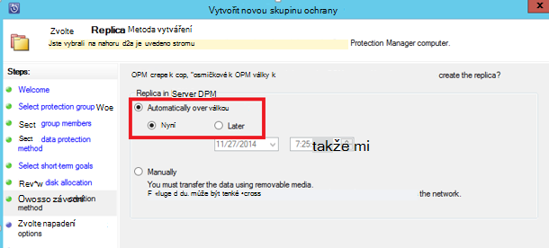

<properties
    pageTitle="Azure zálohování pro SQL Server úloh pomocí DPM | Microsoft Azure"
    description="Úvod k zálohování databáze systému SQL Server pomocí služby Azure zálohování"
    services="backup"
    documentationCenter=""
    authors="adigan"
    manager="Nkolli1"
    editor=""/>

<tags
    ms.service="backup"
    ms.workload="storage-backup-recovery"
    ms.tgt_pltfrm="na"
    ms.devlang="na"
    ms.topic="article"
    ms.date="09/27/2016"
    ms.author="adigan;giridham; jimpark;markgal;trinadhk"/>

# Azure zálohování pro použití DPM úloh systému SQL Server

Tento článek vás provede jednotlivými kroky konfigurace pro záložní kopii databáze systému SQL Server pomocí Azure záložní.

Vytvořte záložní databáze systému SQL Server Azure, musíte mít účet Azure. Pokud nemáte účet, můžete vytvořit Bezplatný zkušební účet v jenom několik minut. Podrobnosti najdete v tématu [Bezplatnou zkušební verzi Azure](https://azure.microsoft.com/pricing/free-trial/).

Správa zálohování databáze systému SQL Server Azure a obnovení z Azure zahrnuje tři kroky:

1. Vytvoření záložní zásad pro ochranu databáze systému SQL Server na Azure.
2. Vytvoření záložní kopie okamžitých na Azure.
3. Obnovení databáze z Azure.

## Než začnete
Než začnete, ujistěte se splnění všechny [požadavky](../backup-azure-dpm-introduction.md#prerequisites) pro používání Microsoft Azure Backup chránit úloh. Předpoklady pokrýval úkoly, jako: vytvoření záložní trezoru stahování přihlašovacích údajů trezoru, instalaci zálohovací Agent Azure a serveru zaregistrovali trezoru.

## Vytvoření záložní zásad pro ochranu databáze systému SQL Server na Azure

1. Na serveru DPM klikněte na pracovní prostor **Zámek** .

2. Na pásu karet nástroje klikněte na **Nový** k vytvoření nové skupiny zámek.

    

3. DPM zobrazuje na úvodní obrazovku s pokyny týkající se vytváření **Ochranu skupiny**. Klikněte na tlačítko **Další**.

4. Vyberte **servery**.

    

5. Rozbalte položku SQL Server počítače místo, kam databáze, aby se zálohovala nacházejí. DPM zobrazuje různým zdrojům dat, které lze zálohovat z tohoto serveru. Rozbalte **Všechny sdílené složky SQL** a vyberte databáze (v tomto případě jsme vybrané ReportServer$ MSDPM2012 a ReportServer$ MSDPM2012TempDB) k zálohování. Klikněte na tlačítko **Další**.

    

6. Zadejte název pro ochranu skupiny a zaškrtněte políčko **má online Protection** .

    

7. Na obrazovce **Určení cíle Short-Term** obsahovat potřebné vstupy vytvořit záložní odkazuje na disku.

    Tady vidíme, že **rozsah uchovávání informací** je nastavena na *5 dní*, **četnost synchronizace** je nastavený na každých *15 minut* což je počet_plateb niž se považuje zálohování. *8:00 P.M*nastavenou **Express úplné zálohování** .

    

    >[AZURE.NOTE] Na 8:00 odp (podle vstupní obrazovky) záložní bod vznikne každý den přenos dat, která byla změněna ze záložní bodu na předchozí den 8:00 odp. Tento proces se nazývá **Express úplné zálohování**. Při transakce, které jsou synchronizovány protokoly každých 15 minut, pokud je potřeba obnovit databázi na 21:00:00 – potom bodu se vytvořil přehrání protokoly z posledního express úplnou záložní kopii čárky (20: 00 v tomto případě).

8. Klikněte na tlačítko **Další**

    DPM zobrazuje celkové dostupný prostor úložiště a potenciální místa využívání disku.

    

    Ve výchozím nastavení vytvoří DPM jeden objem na zdroj dat (databáze SQL serveru), které se používá pro první záložní kopie. Použití poddotazu logické disku Manager (Správce logických disků) omezuje DPM ochranu ke zdrojům dat 300 (databáze systému SQL Server). Informace k alternativním řešením toto omezení, vyberte **spoluvytváření vyhledání dat ve fondu úložiště DPM**, možnost. Pokud používáte tuto možnost, DPM používá jednoho hlasitost různých zdrojů dat, umožňující DPM chránit až 2 000 SQL databáze.

    Pokud je vybrána možnost **automaticky zvětšit svazky** , DPM můžete účtu pro lepší záložní hlasitost narůstající velikostí data výroby. Pokud není vybraná možnost **automaticky zvětšit svazky** , DPM omezuje záložní úložiště použít ke zdrojům dat ve skupině zámek.

9. Správci jsou možnost volby přenosu počáteční zálohu ručně (vypnuto síť) Chcete-li předejít přetížení šířka pásma nebo v síti. Můžete taky nakonfigurovat niž může dojít přenosu počáteční čas. Klikněte na tlačítko **Další**.

    

    Počáteční záložní kopie vyžaduje přenos s celým zdrojem dat (databáze SQL serveru) ze serveru výrobní (SQL Server počítač) DPM server. Tato data může být velkých a přenos dat v síti může překročit šířky pásma. Z tohoto důvodu, můžete zvolit správci přenášet počáteční zálohování: **Ruční** (pomocí vyměnitelném médiu) Chcete-li předejít přetížení šířka pásma nebo **automaticky v síti** (vždy zadaný).

    Po dokončení počáteční zálohování zbytek zálohy jsou přírůstková zálohování na první záložní kopie. Přírůstková zálohy jsou obvykle malých a snadno přenést v síti.

10. Zvolte, pokud chcete, aby Kontrola konzistence spustit a klikněte na tlačítko **Další**.

    

    DPM můžete kontrolovat do konzistence zaškrtnutí k integrity záložní bodu. Výpočet součtu záložní soubor na serveru výrobní (SQL Server počítač v tomto scénáři) a zálohované data pro tento soubor DPM. V případě konflikt předpokládá se, že je soubor na zálohované DPM poškozené. DPM rectifies zálohované data tak, že bloky odpovídající neshodu kontrolního. Operace výkonu vyžadující značnou je kontrola konzistence Správci mají možnost plánování Kontrola konzistence nebo automatickém spuštění.

11. Chcete-li online protection zdrojů dat, vyberte databází chráněny Azure a klikněte na tlačítko **Další**.

    

12. Správci můžete zvolit záložní plány a zásady uchovávání informací, které odpovídá prezentovanému jejich zásady organizace.

    

    V tomto příkladu zálohy odebírají jednou za den v 12:00 odp a 20: 00 (dolní části obrazovky)

    >[AZURE.NOTE] Je vhodné mít několik bodů krátkodobých obnovení na disku pro snadné obnovení. Tyto body obnovení se používají pro "provozní obnovení". Azure slouží jako dobré externí umístění s vyšší rozsahu a zaručené dostupnost.

    **Doporučený postup**: Ujistěte se, že zálohování Azure je naplánováno po skončení místní disk zálohování pomocí DPM. Díky nejnovější zálohování disku budou zkopírovány do Azure.

13. Zvolte plán zásady uchovávání informací. Informace o fungování zásady uchovávání informací jsou k dispozici v [Azure pomocí nástroje Zálohování nahrazení článek infrastruktury páskou](backup-azure-backup-cloud-as-tape.md).

    

    V tomto příkladu:

    - Zálohování odebírají jednou za den v 12:00 odp a 20: 00 (dolní části obrazovky) a uchovávají pro 180 dnů.
    - Zálohování v Sobotou na 12:00 se zachovají 104 týdnů
    - Zálohování v posledních Sobotou na 12:00 se zachovají 60 měsíců
    - Zálohování v posledních Sobotou dne na 12:00 se zachovají 10 let

14. Klikněte na tlačítko **Další** a vyberte příslušnou možnost pro přenos počáteční záložní kopie do Azure. Můžete **automaticky v síti** nebo **v režimu Offline zálohování**.

    - **Automaticky v síti** převede záložních dat Azure podle plánu pro zálohování.
    - Princip **Offline zálohování** jsou vysvětleny v [Offline zálohování pracovní postup v Azure zálohování](backup-azure-backup-import-export.md).

    Zvolte mechanismus relevantní přenosu odeslat první záložní kopie Azure a klikněte na tlačítko **Další**.

15. Jakmile si prohlédnete podrobnosti zásady na obrazovce **Souhrn** , klikněte na tlačítko **vytvořit skupinu** pro dokončení pracovního postupu. Můžete klikněte na tlačítko **Zavřít** a sledovat pokrok projektu v pracovním prostoru sledování.

    

## Na vyžádání záložní kopii databáze SQL serveru
Během předchozích kroků nedá vytvořili záložní zásady, "obnovení bod" je vytvořen pouze při prvním zálohování. Místo čeká Plánovač a spusťte kroků aktivační událost vystavením obnovení umístěte ukazatel myši ručně.

1. Počkejte, dokud je ochranu skupiny stavu **OK** pro databázi před vytvořením bod obnovení.

    

2. Klikněte pravým tlačítkem myši na databáze a vyberte **Vytvořit obnovení bod**.

    

3. V rozevírací nabídce zvolte **Online Protection** a klikněte na **OK**. Spustí se vytváření obnovovacího bodu v Azure.

    

4. Průběh projektu můžete zobrazit v pracovním prostoru **Sledování** tady najdete v průběhu projektu podobné je vidět na dalším obrázku.

    

## Obnovení databáze SQL serveru z Azure
Následující kroky nutné obnovit chráněné entity (databáze SQL serveru) z Azure.

1. Otevřete službu DPM Konzola pro správu. Přejděte do pracovního prostoru **obnovení** kde navíc přehledně uvidíte servery zálohovala DPM. Vyhledejte požadované databáze (v tomto případě ReportServer$ MSDPM2012). Vyberte **obnovení z** čas, který má na konci **Online**.

    

2. Klikněte pravým tlačítkem myši na název databáze a klikněte na **Obnovit**.

    

3. DPM zobrazuje podrobnosti o obnovení bodu. Klikněte na tlačítko **Další**. Pokud chcete přepsat databáze, vyberte typ obnovení **Obnovit původní instanci systému SQL Server**. Klikněte na tlačítko **Další**.

    

    V tomto příkladu umožňuje DPM obnovení databáze do jiné instance serveru SQL Server nebo do samostatného síťové složky.

4. Na obrazovce **Možnosti určete obnovení** můžete vybrat možnosti obnovení jako omezení využití šířky pásma sítě omezení šířky pásma používané obnovení. Klikněte na tlačítko **Další**.

5. Na obrazovce **Souhrn** zobrazí všechny konfigurace obnovení zatím k dispozici. Kliknutím na tlačítko **Obnovit**.

    Stav obnovení se zobrazí databázi obnovována. Klepnutím na tlačítko **Zavřít** zavřete průvodce a zobrazit v pracovním prostoru **Sledování** průběhu.

    

    Po dokončení obnovení obnovené databáze je aplikace konzistentní.

### Další kroky:

• [Azure záložní časté otázky](backup-azure-backup-faq.md)
