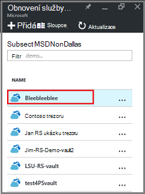
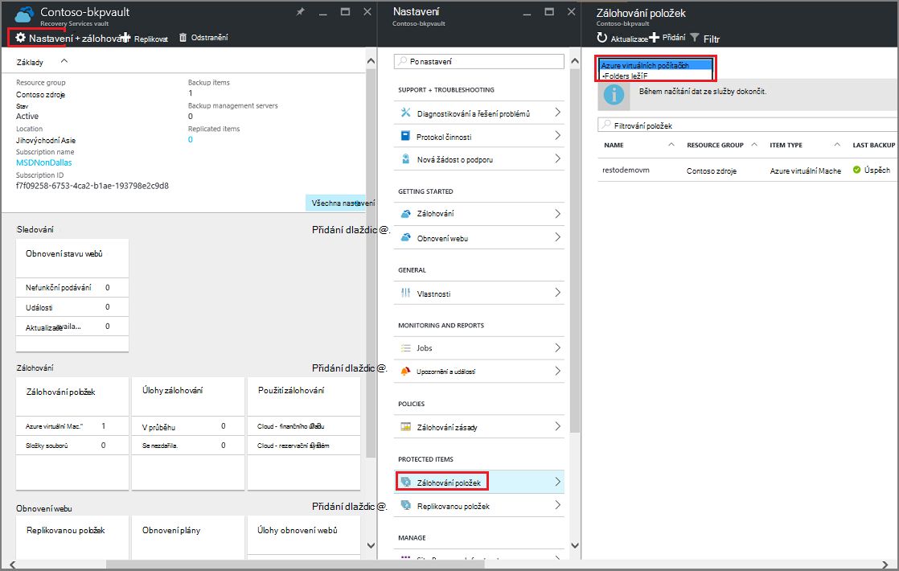

<properties
   pageTitle="Odstranění Azure zálohování trezoru | Microsoft Azure"
   description="Jak odstranit Azure zálohování trezoru. Poradce při potížích Proč nelze odstranit záložní trezoru. "
   services="service-name"
   documentationCenter="dev-center-name"
   authors="markgalioto"
   manager="cfreeman"
   editor=""/>

<tags
   ms.service="backup"
   ms.devlang="na"
   ms.topic="article"
   ms.tgt_pltfrm="na"
   ms.workload="storage-backup-recovery"
   ms.date="08/29/2016"
   ms.author="markgal;trinadhk"/>

# Odstranění trezoru Azure zálohování

Služby Azure zálohování má dva typy trezorů - trezoru zálohování a obnovení služby trezoru. První jste dostali trezoru zálohování. Potom trezoru služby Recovery pochází podporuje rozbalené nasazení Správce prostředků. Z důvodu rozšířené funkce a závislosti informace uložené v trezoru možná vypadá odstranění služby Recovery trezoru těžší než musí být.

|**Typ nasazení**|**Portál**|**Název trezoru**|
|--------------|----------|---------|
|Klasický|Klasický|Zálohování trezoru|
|Správce prostředků|Azure|Obnovení služby trezoru|

> [AZURE.NOTE] Zálohování trezorů nemůže zajistit ochranu správce prostředků nasazení řešení. Obnovení služby trezoru však může použít k ochraně classically nasazeném servery a VMs.  

V tomto článku používáme termín, trezoru odkázat na formuláři obecný zálohování trezoru nebo obnovení služby trezoru. Pokud je nutná k rozlišení mezi trezorů používáme formální jméno, zálohování trezoru nebo obnovení služby trezoru.

## Odstranění trezoru obnovení služby

Odstranění služby Recovery trezoru je jednoduchý proces – *za předpokladu, že trezoru neobsahuje žádné zdroje*. Chcete-li odstranit trezoru obnovení služby, musíte odebrat nebo odstranit všechny zdroje v trezoru. Pokud se pokusíte odstranit trezoru, který obsahuje prostředky, dojde k chybě jako na následujícím obrázku.

  

Dokud jste zrušili zdrojů z trezoru, klepnutím na tlačítko **Opakovat** vytvoří stejnou chyby. Pokud se zarazí na tato chybová zpráva, klikněte na tlačítko **Storno** a postupujte podle pokynů a odstranění zdrojů v trezoru obnovení služby.

### Odebrání položek z trezoru ochrana virtuálního počítače

Pokud už máte trezoru služby Recovery otevřít, přejděte ke druhým krokem.

1.  Otevřete portál Azure a od otevřený řídicího panelu trezoru, pro který chcete odstranit.

    Pokud nemáte trezoru služby Recovery připnuté na řídicí panel v nabídce centrální klikněte na **Další služby** a v seznamu zdrojů, zadejte **Obnovení služby**. Jakmile začnete psát, filtry seznamu na základě vašich zadání. Klikněte na **služby Recovery trezorů**.

      

    Zobrazí se seznam služby Recovery trezorů. V seznamu vyberte trezoru, kterou chcete odstranit.

    

2. V zobrazení trezoru prohlédněte v podokně **Essentials** . Chcete-li odstranit trezoru, nemůžou být jakékoli chráněné položky. Pokud se zobrazí číslo větší než nula, klikněte v části **Zálohování položek** nebo **servery správy zálohování**, musíte odebrat tyto položky před odstraněním trezoru.

    

    VMs souborů a složek jsou považovány za zálohování položek a jsou uvedené v oblasti **Zálohování položek** podokna Essentials. DPM server je uvedený v oblasti **Server pro správu zálohování** podokna Essentials. **Replikovat položky** se týkají služby Azure obnovení webu.

3. Začněte odebírání chráněné položek z trezoru najdete položky v trezoru. Na řídicím panelu trezoru klikněte na **Nastavení**a potom na tlačítko **zálohování položek** otevřete tento zásuvné.

    

    **Zálohování položek** zásuvné má samostatných seznamech založené na typ položky: virtuálních počítačích Azure nebo složky souborů (viz obrázek). Výchozí seznam typ položky zobrazené je Azure virtuálních počítačích. Chcete-li zobrazit seznam položek složky souborů v trezoru, vyberte **Složky souborů** z rozevírací nabídky.

4. Před odstraníte položku z trezoru ochrana virtuálního počítače musíte ukončení úloh zálohování na položku a odstranit datový bod obnovení. Pro každou položku trezoru postupujte takto:

    na. Na zásuvné **Zálohování položek** pravým tlačítkem myši a v místní nabídce vyberte **Zastavit zálohování**.

    

    Otevře se zásuvné Zastavit zálohování.

    b. Na **Zastavit záložní** zásuvné vyberte z nabídky **Vyberte možnost** **Odstranit záložních dat** > zadejte název položky > a klepněte na tlačítko **Zastavit zálohování**.

      Zadejte název položky a zkontrolujte, zda že chcete odstranit. Tlačítko **Zastavit zálohování** nebude aktivovat dokud neověříte položku stop. Pokud nevidíte dialogovým oknem zadejte název záložního položky, jste zvolili možnost **Uchovávat Data zálohy** .

    

      Pokud chcete můžete zadali důvod, proč proč odstraňujete data a přidávat komentáře. Po klepnutí na tlačítko **Zastavit zálohování**umožňují úloha Odstranit dokončit před pokusem o odstranění trezoru. Abyste ověřili, že dokončení úlohy, zaškrtněte políčko zprávy Azure .  
   Po dokončení projektu dostanete zprávu o ukončit proces zálohování a byla záložní data odstraněna pro danou položku.

    c. Po odstranění položky v seznamu, nabídce **Zálohování položek** , klikněte na **Aktualizovat** zobrazíte zbývající položky trezoru.

      

      Když v seznamu existuje žádné položky, přejděte do podokna **Essentials** v zásuvné trezoru zálohování. Nesmí být **zálohování položek**, **zálohování správy servery**nebo **replikovaná položky** seznamu. Pokud položky stále zobrazují v trezoru, vraťte se do kroku 3 výše a zvolte seznam typ jiné položky.  

5. Jakmile v panelu nástrojů trezoru žádné další položky, klikněte na možnost **Odstranit**.

    

6. Po zobrazení výzvy k ověření, že chcete odstranit trezoru, klikněte na **Ano**.

    Trezoru odstraněna a portálu vrátí nabídce **Nový** služby.

## Co když mám ukončit proces zálohování ale jsou zachovány data?

Pokud jste zastavili proces zálohování, ale omylem *zachovat* data, je potřeba odstranit záložních dat před odstraněním trezoru. Chcete-li odstranit záložních dat:

1. Na zásuvné **Zálohování položek** pravým tlačítkem myši a v místní nabídce klikněte na **Odstranit záložních dat**.

    

    **Odstranění dat zálohování** zásuvné otevře.

2. Na zásuvné **Odstranit zálohování dat** zadejte název položky a klikněte na **Odstranit**.

    

    Po odstranění data přejděte ke kroku 4c výše a budeme pokračovat v procesu.

## Odstranění trezoru použitý k ochraně DPM serveru

Před odstraněním trezoru použitý k ochraně DPM serveru, musíte vymazat všechny obnovení body, které byly vytvořeny a unregister serveru z trezoru.

Chcete-li odstranit data spojená se ochrany skupiny:

1. V konzole pro správu DPM na položku **Zámek**vyberte ochranu skupiny, vyberte člena skupiny ochranu a na pásu karet nástroje na tlačítko **Odebrat**. Je nutné vybrat tlačítko **Odebrat** členům zobrazují na pásu karet nástroje. V tomto příkladu je člen **dummyvm9**. Pokud existuje více členů ve skupině zámek, podržte stisknutou klávesu Ctrl a vyberte více členy.

    

    Otevře dialogové okno **Odemknout** .

2. V dialogovém okně **Odemknout** vyberte **Odstranit chráněné data**a klikněte na **Odemknout**.

    

    Nechcete, aby uchovávání dat chráněné vzhledem k tomu potřebujete vymazat trezoru Pokud chcete odstranit. Podle toho, kolik obnovení bodů a množství zpracovávaných dat je ve skupině zámek, může trvat kdekoli z několik sekund, než několik minut se odstraní data. Dialogové okno **Odemknout** zobrazuje stav po dokončení projektu.

    

3. Pokračujte tento postup pro všechny členy ve všech skupinách zámek.

    Je třeba odebrat všechny chráněné dat a ochranu skupiny.

4. Po odstranění všech členů ze skupiny ochrany, přejděte na portál Azure. Otevřete na řídicím panelu trezoru a ujistěte se, že nejsou žádné **Zálohování položek**, **servery správy zálohování**ani **replikovaná položky**. Na panelu nástrojů trezoru klikněte na **Odstranit**.

    

    Pokud jsou servery správy zálohování registrován do trezoru, nebudete moct odstranit trezoru i v případě, že nejsou žádná data v trezoru. Pokud si myslíte, že jste odstranili servery správy zálohování přidružené trezoru, ale pořád existují servery s v podokně **Essentials** , najdete v článku [Vyhledání servery správy zálohování registrované do trezoru](backup-azure-delete-vault.md#find-the-backup-management-servers-registered-to-the-vault).

5. Po zobrazení výzvy k ověření, že chcete odstranit trezoru, klikněte na **Ano**.

    Trezoru odstraněna a portálu vrátí nabídce **Nový** služby.

## Odstranění trezoru použitý k ochraně provozní server

Před odstraněním trezoru použitý k ochraně provozním serveru, musíte odstranit nebo unregister serveru z trezoru.

Chcete-li odstranit provozní server přidružené trezoru:

1. Na portálu Azure otevřete trezoru řídicích panelů a klikněte na **Nastavení** > **Zálohování infrastruktury** > **Provozní servery**.

    

    Zásuvné **Provozní servery** otevře a zobrazí seznam všech serverů výrobní v trezoru.

    

2. Na zásuvné **Provozní servery** klikněte pravým tlačítkem myši na serveru a klikněte na **Odstranit**.

    

    Otevře se zásuvné **Odstranit** .

    

3. Na zásuvné **Odstranění** potvrďte název serveru, který chcete odstranit a klikněte na **Odstranit**. Správně je nutné zadat název serveru a aktivace na tlačítko **Odstranit** .

    Po odstranění trezoru dostanete zpráva oznamující, že byl odstraněn trezoru. Po odstranění všech serverů v trezoru, přejděte zpátky do podokna Essentials v řídicím panelu trezoru.

4. Na řídicím panelu trezoru zkontrolujte, že nejsou žádné **Zálohování položek**, **servery správy zálohování**ani **replikovaná položky**. Na panelu nástrojů trezoru klikněte na **Odstranit**.

5. Po zobrazení výzvy k ověření, že chcete odstranit trezoru, klikněte na **Ano**.

    Trezoru odstraněna a portálu vrátí nabídce **Nový** služby.

## Odstranění trezoru zálohování

Následující pokyny jsou určené pro odstranění zálohování trezoru klasické portálu. Trezoru zálohování a obnovení služby trezoru jsou stejné: Chcete-li odstranit trezoru, odstranit položky a dosažených data.

1. Otevřete portál klasické.

2. V seznamu záložní trezorů vyberte trezoru, kterou chcete odstranit.

    

    Řídicí panel trezoru otevře. Podívejte se na počet virtuálních počítačích Windows Server a/nebo Azure přidružené trezoru. Také podívejte se na celkové úložiště spotřebované množství v Azure. Musíte zastavit všechny úlohy zálohování a odstranění existující data před odstraněním trezoru.

3. Klikněte na kartu **Chráněné položky** a potom klikněte na **Odemknout**

    

    Zobrazí se dialogové okno **Odemknout "trezoru"** .

4. V dialogovém okně **Odemknout "trezoru"** zkontrolujte **Odstranit přidružené záložních dat** a klikněte na .  
   Můžete v případě potřeby vyberte důvod zastavení ochranu a zadejte komentář.

    

    Po odstranění položek v trezoru, bude prázdná trezoru.

    

5. V seznamu karty klikněte na **Registered položky**. Pro každou položku registrované v trezoru vyberte příslušnou položku a klikněte na **Unregister**.

    

6. V seznamu karty klikněte na **řídicí panel** otevřete této karty. Ověření, že nejsou žádné registrovaných servery nebo Azure virtuálních počítačích chráněné v cloudu. Také ověřte, zda že nejsou žádná data v úložišti. Klepnutím na tlačítko **Odstranit** odstranit trezoru.

    

    Otevře se obrazovce pro potvrzení odstranění zálohování trezoru. Vyberte možnost Proč při odstraňování trezoru a klikněte na .  

    

    Trezoru odstraněna a návrat do klasického portálu řídicího panelu.

### Vyhledání servery zálohování správy registrované do trezoru

Pokud máte víc servery registrované trezoru, může být těžké si zapamatovat, je. Viz servery registrované do trezoru a odstraňte je:

1. Otevřete na řídicím panelu trezoru.

2. V podokně **Essentials** klikněte na **Nastavení** a otevřete tento zásuvné.

    

3. Na **zásuvné nastavení**klikněte na **Infrastrukturu zálohování**.

4. Na zásuvné **Zálohování infrastruktury** klikněte na položku **Zálohování správy servery**. Otevře se zásuvné servery správy zálohování.

    

5. Odstranění serveru ze seznamu, klikněte pravým tlačítkem myši na název serveru a pak klikněte na **Odstranit**.
    Otevře se zásuvné **Odstranit** .

6. Na zásuvné **Odstranit** zadejte název serveru. Pokud je název dlouhý, můžete zkopírovat a vložit ho ze seznamu servery správy zálohování. Klepněte na tlačítko **Odstranit**.  
