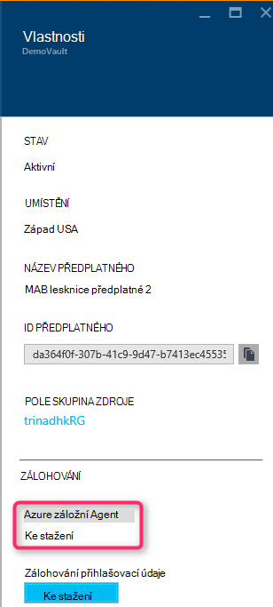

<properties
    pageTitle="Úvod k zálohování Azure DPM | Microsoft Azure"
    description="Úvod k zálohování DPM serverů pomocí služby Azure zálohování"
    services="backup"
    documentationCenter=""
    authors="Nkolli1"
    manager="shreeshd"
    editor=""
    keywords="Centrum dat ochranu správce, správce ochranu dat, dpm zálohování"/>

<tags
    ms.service="backup"
    ms.workload="storage-backup-recovery"
    ms.tgt_pltfrm="na"
    ms.devlang="na"
    ms.topic="article"
    ms.date="08/08/2016"
    ms.author="trinadhk;giridham;jimpark;markgal;adigan"/>

# Příprava k obecnějším údajům pracovního vytížení Azure s DPM

> [AZURE.SELECTOR]
- [Server Azure zálohování](backup-azure-microsoft-azure-backup.md)
- [SCDPM](backup-azure-dpm-introduction.md)
- [Server Azure záložní (klasický)](backup-azure-microsoft-azure-backup-classic.md)
- [SCDPM (klasický)](backup-azure-dpm-introduction-classic.md)

Tento článek obsahuje úvod k používání Microsoft Azure zálohování můžete chránit servery systému Centrum Data Protection Manager (DPM) a úloh. Čtením ho budete porozumět:

- Jak funguje zálohování serveru Azure DPM
- Požadavky pro dosažení hladké záložní prostředí
- Typické došlo k chybám a jak zacházet s nimi
- Podporované scénáře

> [AZURE.NOTE] Azure obsahuje dva modely nasazení pro vytváření grafů a práci s prostředky: [Správce zdrojů a klasické](../resource-manager-deployment-model.md). Tento článek obsahuje informace a postupy pro obnovení VMs nasazených pomocí modelu správce prostředků.

System Center DPM zálohovat data souborů a aplikace. Datové připojení do DPM můžete uložené na páskou na disku nebo zálohovat do Azure pomocí Microsoft Azure zálohování. DPM bude spolupracovat s Azure zálohování následujícím způsobem:

- **DPM nasazený jako fyzické serveru nebo místní virtuálního počítače** – Pokud DPM nasazení serveru fyzické nebo jako místní pro Hyper-V virtuálního počítače můžete data zálohujete do služby Recovery trezoru kromě disku a páskou zálohování.
- **DPM nasazený jako Azure virtuálního počítače** – z System Center 2012 R2 s aktualizace 3, může být nasazené DPM jako Azure virtuálního počítače. Při nasazení DPM jako Azure virtuální počítač, který můžete data zálohujete Azure disků připojených k virtuálního počítače DPM Azure nebo ukládání dat může převzít tak, že zálohování až služby Recovery trezoru.

## Proč zálohy vytvářet z DPM Azure?

Obchodní výhody používání Azure zálohování pro zálohování DPM serverů, patří:

- V místním nasazení DPM můžete použít Azure jako alternativu k dlouhodobé nasazení páskou.
- Nasazení DPM v Azure Azure zálohování umožňuje převzít úložiště z Azure disku umožňuje škálování uložením starší data do služby Recovery trezoru a nová data na disku.

## Zjistit předpoklady pro
Příprava Azure zálohování dat DPM následujícím způsobem:

1. **Vytvoření trezoru služby Recovery** – vytvoření trezoru Azure portálu.
2. **Stažení trezoru pověření** – stahování přihlašovacích údajů, které používáte k registraci DPM serveru služby Recovery trezoru.
3. **Instalace Azure Backup Agent** – z Azure zálohování nainstalovat agenta na všech serverech DPM.
4. **Registrace serveru** – registrace serveru DPM do služby Recovery trezoru.

### 1. Vytvořte trezoru služby obnovení
Vytvoření trezoru služby obnovení:

1. Přihlaste se k [portálu Azure](https://portal.azure.com/).

2. V nabídce centrální klikněte na tlačítko **Procházet** a v seznamu zdrojů, zadejte **Obnovení služby**. Jakmile začnete psát, bude filtrování seznamu na základě vašich zadání. Klikněte na **služby Recovery trezoru**.

    

    Zobrazí se seznam služby Recovery trezorů.

3. V nabídce **trezorů obnovení služby** klikněte na **Přidat**.

    

    Zásuvné trezoru služby Recovery se otevře, která vás vyzve, abyste jim poslali **název** **předplatného**, **Skupina zdroje**a **umístění**.

    

4. Pole **název**zadejte popisný název k identifikaci trezoru. Název musí být jedinečná Azure předplatného. Zadejte název, který obsahuje 2 až 50 znaků. Musí začínat písmenem a můžou obsahovat jenom písmena, číslice a spojovníky.

5. Klikněte na **předplatné** zobrazíte dostupná seznam předplatných. Pokud nevíte jistě, které předplatné můžete použít výchozí (nebo doporučovány) předplatného. Nastane více možností jenom v případě, že účet organizace je přidružená k víc předplatných Azure.

6. **Pole Skupina zdroje** zobrazíte seznamu dostupné zdroje skupin nebo klikněte na **Nový** k vytvoření nové skupiny prostředků. Podrobné informace o skupiny zdrojů najdete v článku [Přehled Správce prostředků Azure](../azure-resource-manager/resource-group-overview.md)

7. Klikněte na **umístění** vyberte zeměpisná oblast pro trezoru.

8. Klikněte na **vytvořit**. Ji může chvíli trvat, než trezoru služby Recovery vytvořit. Sledujte oznámení o stavu v pravé horní části na portálu.
Po vytvoření trezoru Pozvánka se otevře v portálu.

### Nastavení replikace úložiště

Možnosti replikace úložiště umožňuje vybrat mezi geo nadbytečné úložiště a místně nadbytečné úložiště. Ve výchozím nastavení obsahuje trezoru geo nadbytečné úložiště. Nechte možnost nastavenou na geo nadbytečné úložiště, pokud se jedná zálohování primární. Pokud chcete levnější možnost, která není úplně trvalé vyberte místně nadbytečné úložiště. Další informace o [geo nadbytečné](../storage/storage-redundancy.md#geo-redundant-storage) [místně nadbytečné](../storage/storage-redundancy.md#locally-redundant-storage) úložiště možnosti a v [úložišti Azure replikace přehled](../storage/storage-redundancy.md).

Úprava nastavení replikace úložiště:

1. Vyberte trezoru otevřete řídicí panel trezoru a zásuvné nastavení. Pokud se **Nastavení** zásuvné neotevře, klikněte na **všechna nastavení** na řídicím panelu trezoru.

2. Na zásuvné **Nastavení** klikněte na tlačítko **Zálohování infrastruktury** > **Konfiguraci zálohování** otevřete zásuvné **Konfiguraci zálohování** . Na zásuvné **Zálohování konfigurace** vyberte možnost replikace úložiště pro trezoru.

    

    Po výběru možnosti úložiště pro trezoru, jste připraveni OM přidružit trezoru. Zahájíte přidružení by měly objevit a zaregistrovat Azure virtuálních počítačích.

### 2. stahování přihlašovacích údajů trezoru

Soubor pověření trezoru je certifikát generovaný portálu pro každou záložní trezoru. Na portálu pak odešle veřejný klíč pro služby Access řízení (ACS). Soukromý klíč certifikát je k dispozici uživatelům v rámci pracovního postupu, která je uvedena jako vstup v pracovním postupu registrace počítače. Tím se ověří připojení počítače k odeslání zálohování dat do identifikované trezoru služby Azure záložní.

Trezoru přihlašovacích údajů se použije pouze při registraci pracovního postupu. Je uživatele odpovědností zajistit, že není ohroženo souboru trezoru přihlašovací údaje. Nacházející se v ruce jakékoli neoprávněné uživatelem, soubor přihlašovací údaje trezoru lze použít k registraci jiných počítačů proti stejné trezoru. Při zálohování dat je šifrovaná pomocí heslo, které patří k zákazníkovi, nemůže být však ohroženo existující záložní data. Zmírnění tento problém, trezoru přihlašovací údaje jsou nastavené platnosti v 48hrs. Můžete si stáhnout trezoru pověření služby recovery počtu opakování – ale jenom nejnovější trezoru pověření souboru platí při registraci pracovního postupu.

Stažení souboru pověření trezoru prostřednictvím zabezpečeného kanálu z portálu Microsoft Azure. Služby Azure zálohování nezaznamená privátním klíčem certifikát, a privátním klíčem není zachován v portálu nebo službu. Pomocí následujících kroků trezoru pověření budou moct soubor stáhnout do místního počítače.

1. Přihlaste se k [portálu Azure](https://portal.azure.com/).

2. Otevřít služby Recovery trezoru do kterého na který chcete si zaregistrovat DPM počítače.

3. Nastavení zásuvné se objeví ve výchozím nastavení. Pokud je zavřený, klikněte na řídicí panel trezoru otevřete zásuvné nastavení na **Nastavení** . V nastavení zásuvné klikněte na **Vlastnosti**.

    

4. Na stránce Vlastnosti klikněte na tlačítko **Stáhnout** v části **Přihlašovací údaje zálohování**. Na portálu vygeneruje trezoru pověření soubor, který je k dispozici ke stažení.

    

Na portálu vygeneruje trezoru přihlašovací údaje pomocí kombinace názvu trezoru a aktuálním datem. Klikněte na tlačítko **Uložit** ke stažení trezoru pověření místního účtu stahování složky nebo uložit jako vyberte z nabídky Uložit do zadejte umístění pro ni přihlašovací údaje trezoru. Bude trvat až minutu k souboru generovat.

### Poznámka:
- Ujistěte se, že trezoru přihlašovacích údajů se při ukládání do umístění, které můžete k nim získat přístup z počítače. Pokud je uložený na sdílet/SMB soubor, vyhledejte přístupová oprávnění.
- Soubor trezoru přihlašovacích údajů se používá pouze během pracovní postup registrace.
- Soubor přihlašovací údaje trezoru vyprší po 48hrs a si můžete stáhnout z portálu.

### 3. zálohování Agent instalace

Po vytvoření trezoru zálohování Azure, měli byste mít nainstalované agent na každý z počítače systému Windows (Windows Server, klienta systému Windows, System Center Data Protection Manager serveru nebo Azure zálohování serveru), který umožňuje zálohování dat a aplikací Azure.

1. Otevřít služby Recovery trezoru do kterého na který chcete si zaregistrovat DPM počítače.

2. Nastavení zásuvné se objeví ve výchozím nastavení. Pokud je zavřený, klikněte na možnost **Nastavení** otevřete zásuvné nastavení. V nastavení zásuvné klikněte na **Vlastnosti**.

    

3. Na stránce nastavení klepněte na **Stáhnout** **Azure Backup Agent**.

    

   Po stažení agent poklikejte na MARSAgentInstaller.exe spustit instalaci agenta Azure zálohování. Zvolte instalace složce a pomocné povinné agenta. Umístění mezipaměti zadali, musíte mít volného místa, což je alespoň na úrovni 5 % záložních dat.

4.  Pokud používáte proxy server pro připojení k Internetu, na obrazovce **konfigurací Proxy** zadejte podrobnosti o proxy server. Pokud používáte ověřeným proxy, zadejte uživatelské jméno a heslo podrobnosti na této obrazovce.

5.  Agent Azure zálohování instalace prostředí Windows PowerShell a .NET Framework 4.5 (pokud ještě není k dispozici) dokončete instalaci.

6.  Po instalaci agent **Zavřít** okno.

    

7. **Registrace serveru DPM** trezoru na kartě **Správa** klikněte na **Online**. Potom klikněte na **zaregistrovat**. Otevře se Průvodce nastavením zaregistrovat.

8. Pokud používáte proxy server pro připojení k Internetu, na obrazovce **konfigurací Proxy** zadejte podrobnosti o proxy server. Pokud používáte ověřeným proxy, zadejte uživatelské jméno a heslo podrobnosti na této obrazovce.

    

9. Na obrazovce přihlašovacích údajů trezoru vyhledejte a vyberte soubor trezoru přihlašovací údaje, který jste dříve stáhli.

    

    Soubor přihlašovací údaje trezoru platí pouze pro 48 hodin (po stažení z portálu). Pokud se setkáte každé chyby v této obrazovce (například "trezoru přihlašovací údaje, které vypršela platnost soubor k dispozici"), přihlaste se k Azure portálem a přihlašovací údaje trezoru soubor znovu stáhnout.

    Zajistěte, aby byl soubor trezoru přihlašovací údaje k dispozici v umístění, které jsou přístupné tak, že instalační program aplikace. Pokud se setkáte přístup související chyby, zkopírujte soubor přihlašovací údaje trezoru dočasné místo v tomto počítači a opakujte.

    Pokud dojde k chybě neplatné trezoru přihlašovacích údajů (například "neplatné trezoru pověření za předpokladu, že") je buď poškozený soubor nebo znamená mít nejnovější pověření nesouvisející ke službě obnovení. Opakujte po stažení nový soubor pověření trezoru z portálu. Tato chyba je zpravidla prezentací, pokud uživatel klikne na možnost **stahování trezoru pověření** v portálu Azure rychle po sobě. V tomto případě platí pouze druhý soubor trezoru přihlašovacích údajů.

10. Určit použití šířka pásma při práci a není pracovní doby, na obrazovce **Nastavení omezení** můžete nastavit omezení využití šířky pásma a definovat práce a nefunkční hodiny.

    

11. Na obrazovce **Nastavení složky obnovení** vyhledejte složku, kde bude dočasně připravené soubory stažené ze Azure.

    

12. Na obrazovce **Nastavení šifrování** můžete generovat přístupové heslo nebo zadat přístupové heslo (aspoň 16 znaků). Nezapomeňte uložit heslo na zabezpečeném místě.

    

    > [AZURE.WARNING] Pokud dojde ke ztrátě nebo zapomněli; heslo Při obnovení záložních dat nelze Nápověda pro Microsoft. Koncový uživatel vlastní heslo šifrování a Microsoft nemá přehled o heslo používaný koncového uživatele. Uložte soubor na zabezpečeném místě je to potřeba během operace obnovení.

13. Po kliknutí na tlačítko **zaregistrovat** počítače je úspěšně registrovaná do trezoru a nyní jste připraveni začít zálohování na Microsoft Azure.

14. Pokud chcete použít Správce ochranu dat, můžete změnit nastavení nastavil během pracovního postupu registrace kliknutím na možnost **Konfigurovat** tak, že vyberete **Online** na kartě **Správa** .

## Požadavky na (a omezení)

- DPM můžete používat jako Hyper-V virtuálního počítače nainstalovali System Center 2012 SP1 nebo System Center 2012 R2 nebo pole fyzicky server. Můžete taky běžet jako Azure virtuální počítač se systémem System Center 2012 R2 s nejméně kumulativní aktualizace 3 pro DPM 2012 R2 nebo Windows virtuálního počítače v VMWare spuštěných pro System Center 2012 R2 s nejméně kumulativní aktualizaci 5.
- Pokud používáte DPM s System Center 2012 SP1 nainstalujte aktualizaci vrátit až 2 pro systém Centrum správce ochranu dat SP1. To je nutné před instalací Azure Backup Agent.
- DPM server by měl mít prostředí Windows PowerShell a .net Framework 4.5 nainstalovaný.
- DPM můžete obecnějším údajům většina úloh zálohování Azure. Úplný seznam co je podporované, najdete v článku zálohy Azure podpory níže uvedených položek.
- Data uložená v Azure zálohování není možné obnovit s parametrem "Kopírovat do páskou".
- Musíte mít účet Azure s povolenou funkcí Azure zálohování. Pokud nemáte účet, můžete vytvořit bezplatný účet zkušební v jenom pár minut. Přečtěte si o [ceny Azure zálohování](https://azure.microsoft.com/pricing/details/backup/).
- Použití zálohování Azure vyžaduje Backup Agent Azure k instalaci na serverech, které chcete zálohovat. Každý serveru musí obsahovat alespoň na úrovni 5 % velikost data, která je právě zálohovat, jsou k dispozici jako místní bezplatného úložiště. Například zálohování 100 GB dat vyžaduje aspoň 5 GB volného místa v pomocné umístění.
- Data budou uložena v úložišti Azure trezoru. Existuje neomezené množství dat, které je možné zpátky do zálohu Azure vault ale velikost zdroje dat (třeba virtuálního počítače nebo databáze) neměli překročit 54400 GB.

Pro zpátky do Azure jsou podporovány tyto typy souborů:

- Šifrované (úplné zálohování pouze)
- Komprimovat (podporované přírůstková zálohování)
- Sparse (podporované přírůstková zálohování)
- Komprimovaná a sparse (považovaná za Sparse)

A to nejsou podporované:

- Servery v systému souborů malá a velká písmena nejsou podporované.
- Pevné odkazy (přeskočené)
- Body (přeskočené)
- Zašifrovaných a komprimovány (přeskočené)
- Zašifrované a sparse (přeskočilo)
- Komprimovaná toku
- Sparse toku

>[AZURE.NOTE] Z v System Center 2012 DPM s aktualizací SP1 rokem můžete zálohovat nahoru pracovního vytížení chráněny DPM Azure pomocí Microsoft Azure zálohování.
