<properties
    pageTitle="Správa a sledování Azure virtuálního počítače zálohy | Microsoft Azure"
    description="Naučte se spravovat a sledovat zálohy Azure virtuálního počítače"
    services="backup"
    documentationCenter=""
    authors="trinadhk"
    manager="shreeshd"
    editor=""/>

<tags
    ms.service="backup"
    ms.workload="storage-backup-recovery"
    ms.tgt_pltfrm="na"
    ms.devlang="na"
    ms.topic="article"
    ms.date="08/31/2016"
    ms.author="trinadhk; jimpark; markgal;"/>

# <a name="manage-and-monitor-azure-virtual-machine-backups"></a>Správa a sledování zálohy Azure virtuálního počítače

> [AZURE.SELECTOR]
- [Správa Azure OM zálohování](backup-azure-manage-vms.md)
- [Správa klasické OM zálohování](backup-azure-manage-vms-classic.md)

Tento článek obsahuje informace o běžné úlohy správy a sledování pro model Klasický virtuálních počítačích chráněné v Azure.  

>[AZURE.NOTE] Azure obsahuje dva modely nasazení pro vytváření grafů a práci s prostředky: [Správce zdrojů a klasické](../resource-manager-deployment-model.md). Další informace o práci s klasické nasazení modelu VMs najdete v článku [Příprava prostředí k obecnějším údajům Azure virtuálních počítačích](backup-azure-vms-prepare.md) .

## <a name="manage-protected-virtual-machines"></a>Správa chráněné virtuálních počítačích

Ke správě chráněné virtuálních počítačích:

1. Zobrazit a spravovat nastavení zálohování virtuálního počítače klikněte na kartu **Chráněné položky** .

2. Klikněte na název chráněné položky zobrazíte kartu **Podrobnosti zálohování** , která zobrazuje informace o poslední zálohování.

    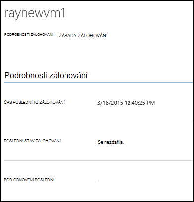

3. Zobrazení a Správa zásady zálohování nastavení virtuálního počítače klikněte na kartu **zásady** .

    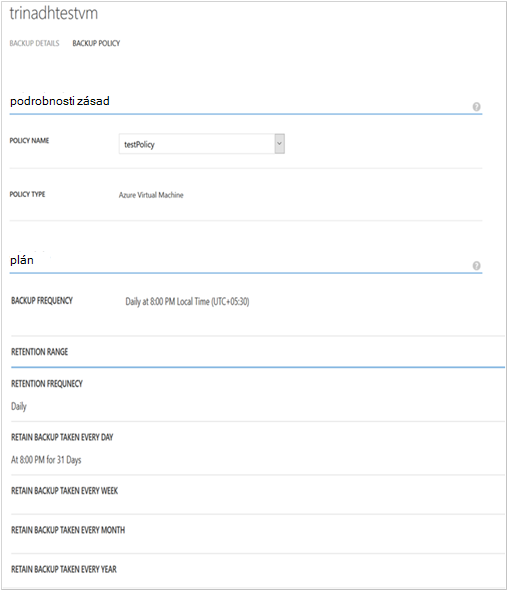

    Na záložce **Zálohování zásady** se zobrazí stávající zásady. Podle potřeby můžete změnit. Pokud potřebujete k vytvoření nových zásad na stránce **zásady** klikněte na **vytvořit** . Poznámka: Pokud chcete odebrat zásadu ho neměli mít všechny virtuálních počítačích s ním spojené.

    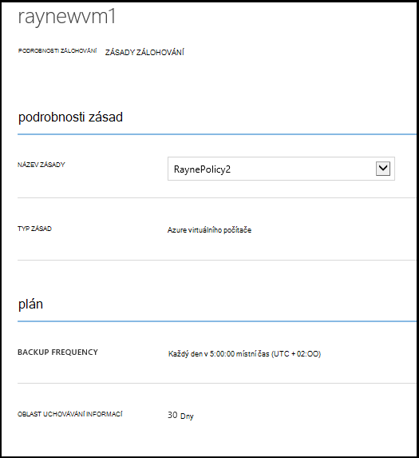

4. Získat další informace o akce nebo stav virtuálního počítače na stránce **úlohy** . Klikněte na projektu v seznamu získat víc informací nebo filtrovat úlohy pro konkrétní virtuální počítač.

    

## <a name="on-demand-backup-of-a-virtual-machine"></a>Na vyžádání zálohování virtuálního počítače
Po konfiguraci ochranu, může trvat na vyžádání záložní virtuálního počítače. Pokud počáteční zálohování čeká na vyřízení virtuálního počítače na vyžádání zálohování vytvoří kopii úplné virtuálního počítače v Azure záložní trezoru. Dokončení první zálohování záložní bude na vyžádání jenom pro změny odeslat z předchozí zálohy Azure zálohování vault tedy ho je vždy přírůstková.

>[AZURE.NOTE] Uchovávání informací oblast zálohu na vyžádání je nastavena na hodnotu uchovávání informací určeným pro denních uchovávání informací v zásady zálohování odpovídající bude v angličtině.  

Umožní na vyžádání záložní virtuálního počítače:

1. Přejděte na stránku **Chráněné položky** **Azure virtuálního počítače** jako **Typ** (Pokud není vybrána) a klepněte na tlačítko **Vybrat** .

    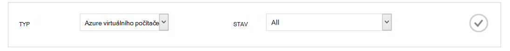

2. Vyberte virtuálního počítače, na kterém chcete provést na vyžádání zálohování a klepněte na **Zálohování** tlačítko v dolní části stránky.

    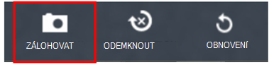

    Tím vytvoříte úlohy zálohování na vybraný virtuální počítač. Uchovávání informací rozsah bod obnovení vytvořený prostřednictvím tuto úlohu bude stejný příkaz jako uvedenou v zásady přidružené virtuální počítač.

    

    >[AZURE.NOTE] Zásady přidružené virtuálního počítače zobrazíte přecházet na podrobnější virtuálního počítače na stránce **Chráněné položek** a přejděte na kartu zásady zálohování.

3. Po vytvoření projektu můžete kliknout na tlačítko **zobrazení projektu** v pruhu oznámením zobrazíte odpovídající úlohy na stránce úlohy.

    

4. Po úspěšném dokončení projektu bod obnovení se vytvoří kterém můžete obnovit virtuální počítač. To taky, zvýší hodnotu obnovení bod sloupce 1 v **Chráněném položek** stránky.

## <a name="stop-protecting-virtual-machines"></a>Ukončení ochrana virtuálních počítačích
Můžete zastavit budoucí záložní kopie virtuálního počítače pomocí následujících možností:

- Zachovat záložní údaje související s virtuálního počítače v Azure záložní trezoru
- Odstranění záložní údaje související s virtuálního počítače

Pokud jste vybrali uchovávání záložní údaje související s virtuálního počítače, můžete obnovit virtuální počítač záložních dat. Pro ceny podrobnosti o těchto virtuálních počítačích, klikněte [sem](https://azure.microsoft.com/pricing/details/backup/).

Ukončení ochranu virtuálního počítače:

1. Přejděte na stránku **Chráněné položky** **Azure virtuálního počítače** jako typ filtru (Pokud není vybrána) a klepněte na tlačítko **Vybrat** .

    

2. Vyberte virtuální počítač a klikněte na **Odemknout** v dolní části stránky.

    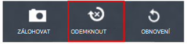

3. Ve výchozím nastavení Azure záložní neodstraníte záložní data spojená se virtuální počítač.

    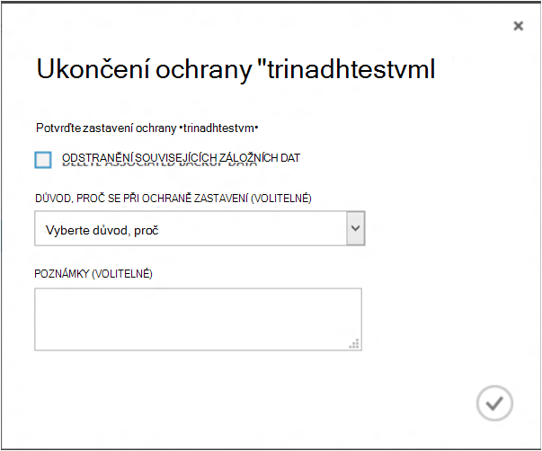

    Pokud chcete odstranit záložních dat, zaškrtněte políčko.

    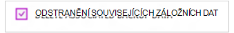

    Vyberte důvod zastavení zálohování. Během Toto je nepovinný krok, poskytnutí důvod, proč vám pomůže Azure zálohování pracovat s zpětnou vazbu a nastavit jejich priority scénáře zákazníka.

4. Klikněte na tlačítko **Odeslat** odešlete úlohy **Odemknout** . Klikněte na **Zobrazit úlohu** zobrazíte odpovídající projektu ve **úlohy** .

    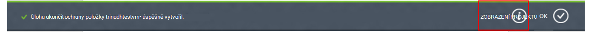

    Pokud jste nevybrali možnost **Odstranit přidružené záložních dat** během **Odemknout** průvodce a po dokončení projektu příspěvek, stav ochrany se změní na **Ochranu přerušili**. Data zůstanou pomocí Azure zálohování, dokud se neodstraní explicitně. Data můžete odstranit vždy výběrem virtuálního počítače na stránce **Chráněné položek** a kliknutím na **Odstranit**.

    

    Pokud vyberete možnost **Odstranit spojenými daty záložní** virtuální počítač nebudou část stránky **Chráněné položky** .

## <a name="re-protect-virtual-machine"></a>Znova zamknout virtuálního počítače
Pokud jste nevybrali možnost **Odstranit přidružení záložních dat** v **Odemknout**, můžete znovu chránit virtuálního počítače pomocí následujícího postupu podobný zálohování registrovaných virtuálních počítačích. Jakmile zamknutý, tento virtuální počítač bude obsahovat záložních dat zachovají před ochrany zastavit a obnovení body vytvořené po znovu Chraňte.

Po opětovném zamknout stav ochrany virtuálního počítače změní se na **chráněného** Pokud existují body obnovení před **Odemknout**.

  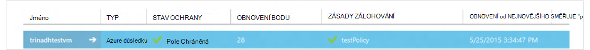

>[AZURE.NOTE] Při znovu chránit virtuálního počítače, můžete zvolit jiné zásady než zásady, se kterým byla původně chráněné virtuálního počítače.

## <a name="unregister-virtual-machines"></a>Unregister virtuálních počítačích

Pokud chcete odebrat z trezoru záložní virtuálního počítače:

1. Klikněte na tlačítko **UNREGISTER** v dolní části stránky.

    

    Informační zprávu se zobrazí v dolní části obrazovky žádosti o potvrzení. Kliknutím na tlačítko **Ano** pokračovat.

    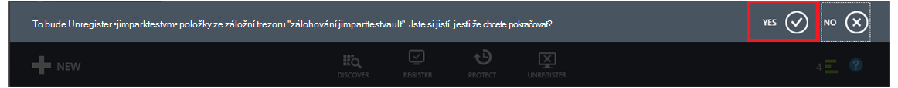

## <a name="delete-backup-data"></a>Odstranění zálohování dat
Můžete odstranit záložní data spojená se virtuálního počítače, buď:

- Během ukončení ochranu úlohy
- Po ochranu ukončit úlohu dokončení na počítač virtuální

Odstranění zveřejňují záložních dat na počítač virtuální, který je ve stavu *Ochrany přerušili* úspěšném dokončení úlohu **Ukončit zálohování** :

1. Přejděte na stránku **Chráněné položek** a vyberte **Azure virtuálního počítače** jako *Typ* a klikněte na tlačítko **Vybrat** .

    

2. Vyberte virtuální počítač. Virtuální počítač bude ve stavu **Přerušili ochranu** .

    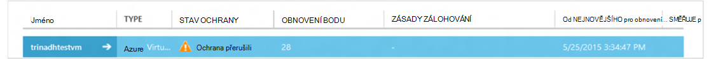

3. Kliknutím na tlačítko **Odstranit** v dolní části stránky.

    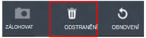

4. V průvodci **Odstranit záložních dat** vyberte důvod, proč se při odstraňování záložních dat (doporučeno) a klikněte na **Odeslat**.

    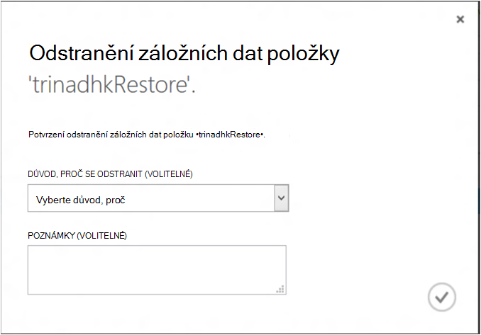

5. Tím vytvoříte úlohy se odstraní záložní data vybraného virtuálního počítače. Klikněte na **Zobrazit úlohu** zobrazíte odpovídající úlohy v úlohy.

    

    Po dokončení projektu položku odpovídající virtuální počítač odebrali **chráněného položek** stránky.

## <a name="dashboard"></a>Řídicí panel
Na stránce **řídicí panel** můžete zkontrolovat informace o Azure virtuálních počítačích jejich úložiště a úlohy spojené s nimi za posledních 24 hodin. Můžete zobrazit stav zálohování a všechny přidružené záložní chyby.

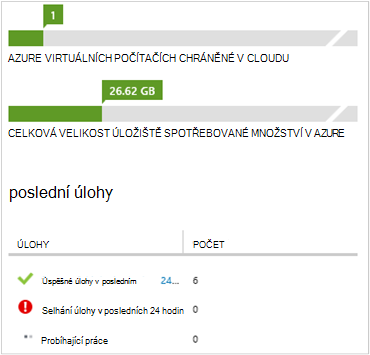

>[AZURE.NOTE] Každých 24 hodin jsou aktualizovány hodnoty v řídicím panelu.

## <a name="auditing-operations"></a>Sestavy auditování operace
Azure zálohování poskytuje seznámit s "operace protokoly" zálohování spouštěný zákazník, takže můžete snadno najdete v článku přesně byly provádět operace jaké správy záložní trezoru. Operace protokoly auditování podpory pro operace zálohování a povolit skvělé postmortální.

Tyto operace přihlášeni operace protokolů:

- Registrace
- Zrušení registrace
- Konfigurace ochrany
- Zálohování (obě naplánované i na vyžádání zálohování pomocí BackupNow)
- Obnovení
- Odemknout
- Odstranění záložních dat
- Přidání zásad
- Odstranění zásady
- Zásady aktualizace
- Zrušení úlohy

Chcete-li zobrazit protokoly operací odpovídající záložní trezoru:

1. Přejděte na **Správa služby** Azure portálu a potom klikněte na kartě **Protokoly operací** .

    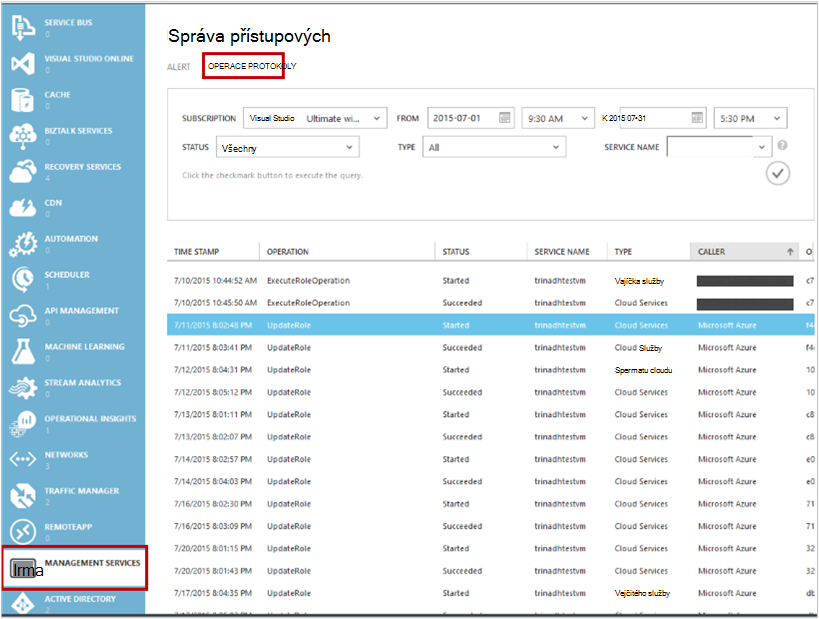

2. V dialogovém okně filtry jako *Typ* vyberte **záložní** a zadejte název záložního trezoru *název služby* a klikněte na **Odeslat**.

    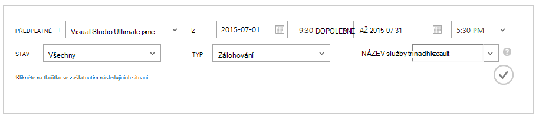

3. V protokolech operace vyberte všechny operace a klikněte na **Podrobnosti** a zobrazit podrobnosti odpovídající operaci.

    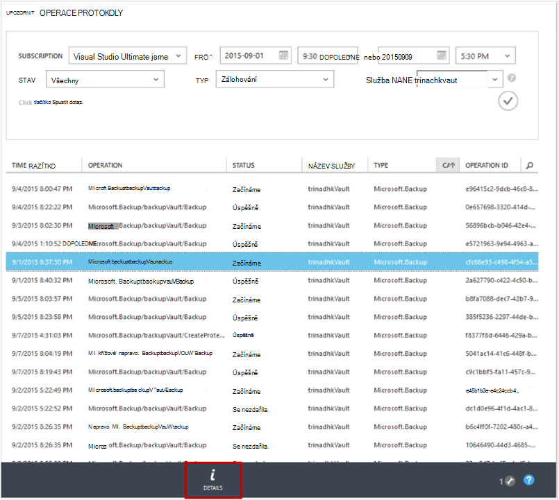

    **Podrobnosti o Průvodce** obsahuje informace o operaci aktivaci úlohy Id, prostředku, který tuto operaci se při spuštění aktivují a spuštění operace.

    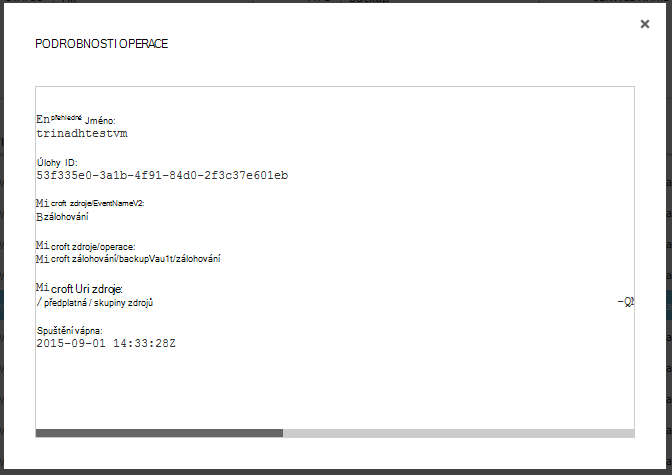

## <a name="alert-notifications"></a>Oznámení
Vlastní oznámení pro úlohy získáte v portálu. Je to dosáhnout definování pravidla prostředí PowerShell upozornění na provozní protokoly událostí. Doporučujeme používat *prostředí PowerShell verze 1.3.0 nebo vyšší*.

Pokud chcete definovat vlastní oznámení upozornit na záložní chyby, bude vypadat ukázka příkazu:

```
PS C:\> $actionEmail = New-AzureRmAlertRuleEmail -CustomEmail contoso@microsoft.com
PS C:\> Add-AzureRmLogAlertRule -Name backupFailedAlert -Location "East US" -ResourceGroup RecoveryServices-DP2RCXUGWS3MLJF4LKPI3A3OMJ2DI4SRJK6HIJH22HFIHZVVELRQ-East-US -OperationName Microsoft.Backup/backupVault/Backup -Status Failed -TargetResourceId /subscriptions/86eeac34-eth9a-4de3-84db-7a27d121967e/resourceGroups/RecoveryServices-DP2RCXUGWS3MLJF4LKPI3A3OMJ2DI4SRJK6HIJH22HFIHZVVELRQ-East-US/providers/microsoft.backupbvtd2/BackupVault/trinadhVault -Actions $actionEmail
```

**ResourceId**: dostanete to z protokoly operace místního výše popsaným způsobem v oddílu. ResourceUri v místní okno podrobností o operaci je ResourceId poskytované pro tuto rutinu.

**Název operace**: půjde formátu "Microsoft.Backup/backupvault/<EventName>"-li EventName jednu rejstříku, Unregister, ConfigureProtection, zálohování, obnovení StopProtection DeleteBackupData, CreateProtectionPolicy, DeleteProtectionPolicy, UpdateProtectionPolicy

**Stav**: podporované hodnoty jsou – Začínáme bylo úspěšné a se nezdařila.

**ResourceGroup**: ResourceGroup zdroje, na které se při spuštění aktivují operace. Můžete získat od ResourceId hodnotu. Mezi pole */resourceGroups/* a */providers/* ResourceId hodnoty hodnotu hodnotu pro ResourceGroup.

**Název**: název pravidla výstrahy.

**CustomEmail**: zadat vlastní e-mailovou adresu, do kterého chcete odeslat oznámení

**SendToServiceOwners**: tuto možnost odešle oznámení všem správcům a dalších správců předplatného. Lze použít v rutinu **New-AzureRmAlertRuleEmail**

### <a name="limitations-on-alerts"></a>Omezení upozornění
Upozornění na základě události podléhají tato omezení:

1. Výstrahy se spouštějí na všechny virtuálních počítačích záložní trezoru. Nelze upravit, aby se zobrazilo upozornění pro určité skupiny virtuálních počítačích záložní trezoru.
2. Tato funkce je v náhledu. [Víc se uč](../monitoring-and-diagnostics/insights-powershell-samples.md#create-alert-rules)
3. Zobrazí se upozornění od "alerts-noreply@mail.windowsazure.com". Aktuálně nelze upravit odesílatele e-mailu.

## <a name="next-steps"></a>Další kroky

- [Obnovení Azure VMs](backup-azure-restore-vms.md)
