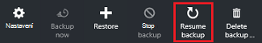

<properties
    pageTitle="Správa nasazený správce prostředků virtuálního počítače zálohy | Microsoft Azure"
    description="Naučte se spravovat a sledovat zálohy nasazený správce prostředků virtuálního počítače"
    services="backup"
    documentationCenter=""
    authors="trinadhk"
    manager="shreeshd"
    editor=""/>

<tags
    ms.service="backup"
    ms.workload="storage-backup-recovery"
    ms.tgt_pltfrm="na"
    ms.devlang="na"
    ms.topic="article"
    ms.date="08/11/2016"
    ms.author="jimpark; markgal; trinadhk"/>

# Správa zálohování Azure virtuálního počítače

> [AZURE.SELECTOR]
- [Správa Azure OM zálohování](backup-azure-manage-vms.md)
- [Správa klasické OM zálohování](backup-azure-manage-vms-classic.md)

Tento článek obsahuje pokyny ke správě OM zálohování a vysvětluje záložní upozornění informace dostupné v portálu řídicího panelu. Pokyny v tomto článku platí pro VMs pomocí služby Recovery trezorů. Tento článek se nezabývá vytváření virtuálních počítačích ani znamená je vysvětleno, jak chránit virtuálních počítačích. Základy týkající se ochrany nasazený správce prostředků Azure VMs v Azure pomocí služby Recovery trezoru, najdete v článku [nejdřív najděte: zálohování VMs do služby Recovery trezoru](backup-azure-vms-first-look-arm.md).

## Správa trezorů a chráněné virtuálních počítačích

Na portálu Azure řídicího panelu služeb obnovení trezoru poskytuje přístup k informacím o trezoru včetně:

- posledních záložní snímek, který je také poslední bod obnovení < br\>
- zásady zálohování < br\>
- Celková velikost všech snímků záložní < br\>
- počet virtuálních počítačích, které jsou chráněny trezoru < br\>

Mnoho úlohy správy pomocí virtuálního počítače zálohování Začněte otevřením trezoru v řídicím panelu. Protože trezorů mohou sloužit k ochraně více položek (nebo více VMs), zobrazení podrobností o konkrétní OM, otevřete položky řídicího panelu trezoru. Následující postup ukazuje, jak otevřít *trezoru řídicího panelu* a potom pokračujte *trezoru položky řídicího panelu*. V obou postupy, které ukazují, jak přidat trezoru a trezoru položky řídicího panelu Azure pomocí kód Pin pro příkaz Tabule jsou "tipy". Kód PIN pro řídicí panel způsobem vytvoření zástupce trezoru nebo položku. Můžete taky spustit běžnými příkazy z na zástupce.

>[AZURE.TIP] Pokud máte víc řídicí panely a potom otevřete listy, jezdcem tmavě modrý v dolní části okna snímku Azure řídicích panelů a zpátky.

### Otevření služby Recovery trezoru v řídicím panelu:

1. Přihlaste se k [portálu Azure](https://portal.azure.com/).

2. V nabídce centrální klikněte na tlačítko **Procházet** a v seznamu zdrojů, zadejte **Obnovení služby**. Jakmile začnete psát, filtry seznamu na základě vašich zadání. Klikněte na **služby Recovery trezoru**.

      

    Zobrazí seznam služby Recovery trezorů.

      

    >[AZURE.TIP] Pokud připnete trezoru na řídicí panel Azure, že trezoru přístupný okamžitě při otevření portálu Azure. Připnutí trezoru na řídicí panel v seznamu trezoru, klikněte pravým tlačítkem myši trezoru a vyberte **Připnout na řídicí panel**.

3. V seznamu trezorů vyberte trezoru otevřete jeho řídicího panelu. Po výběru trezoru řídicí panel trezoru a **Nastavení** zásuvné otevřete. Na následujícím obrázku je zvýrazněná na řídicím panelu **Contoso trezoru** .

    

### Otevření položek řídicího panelu trezoru

V předchozím postupu otevřít řídicím panelu trezoru. Otevření položek řídicího panelu trezoru:

1. Na řídicím panelu trezoru na dlaždici **Zálohování položek** klikněte na **virtuálních počítačích Azure**.

    

    **Zálohování položek** zásuvné seznamy poslední úlohy zálohování pro každou položku. V tomto příkladu je jedna virtuálního počítače, demovm-markgal chráněny trezoru.  

    

    >[AZURE.TIP] Pro usnadnění přístupu můžete připnout trezoru položky řídicího panelu Azure. Připnutí trezoru položku v seznamu položka trezoru, klikněte pravým tlačítkem myši na položku a vyberte **Připnout na řídicí panel**.

2. V zásuvné **Zálohování položek** klikněte na položku otevřít položky řídicího panelu trezoru.

    

    Řídicí panel položku trezoru a jeho **Nastavení** zásuvné otevřete.

    

    Na řídicím panelu položku trezoru dosáhnete mnoho úkolů správy klíčů, jako například:

    - Změna zásad nebo vytvořte nové záložní < br\>
    - zobrazení body obnovení a zobrazení stavu konzistenci < br\>
    - na vyžádání zálohování virtuálního počítače < br\>
    - ukončení ochrana virtuálních počítačích < br\>
    - obnovení ochrany virtuálního počítače < br\>
    - Odstranění záložních dat (nebo obnovení čárky) < br\>
    - [Obnovení záložní (nebo obnovení čárky)](./backup-azure-arm-restore-vms.md#restore-a-recovery-point) < br\>

Následující postupy naleznete je výchozí bod položky řídicího panelu trezoru.

## Správa zásad zálohování

1. Na panelu [trezoru položky řídicího panelu](backup-azure-manage-vms.md#open-a-vault-item-dashboard)klikněte na **Všechna nastavení** otevřete zásuvné **Nastavení** .

    

2. Na zásuvné **Nastavení** klepněte na **zálohování zásad** otevřete tento zásuvné.

    Na zásuvné se zobrazí podrobnosti oblasti zálohování četnost a uchovávání informací.

    

3. Z nabídky **Vyberte záložní zásad** :
    - Změna zásad, vyberte jiné zásady a klikněte na **Uložit**. Nové zásady ihned použije trezoru. < br\>
    - Pokud chcete vytvořit zásady, vyberte **Vytvořit nový**.

    

    Pokyny týkající se vytváření záložní zásad naleznete v tématu [definování zásady zálohování](backup-azure-manage-vms.md#defining-a-backup-policy).

[AZURE.INCLUDE [backup-create-backup-policy-for-vm](../../includes/backup-create-backup-policy-for-vm.md)]

## Na vyžádání zálohování virtuálního počítače
Po konfiguraci ochranu, může trvat na vyžádání záložní virtuálního počítače. Pokud počáteční zálohování čeká na vyřízení, zálohování na vyžádání vytvoří kopii celou virtuálního počítače služby Recovery trezoru. Pokud dokončení počáteční zálohování zálohu na vyžádání odešle pouze změny z předchozí snímek, do služby Recovery trezoru. To znamená jsou následující zálohování vždy přírůstková.

>[AZURE.NOTE] Uchovávání informací rozsah zálohu na vyžádání je zadaná hodnota denní záložní bodu v zásady uchovávání informací. -Li vybrán žádný denních záložní bod se používá týdenní záložní bodu.

Spustí zálohu na vyžádání virtuálního počítače:

- Na panelu [trezoru položky řídicího panelu](backup-azure-manage-vms.md#open-a-vault-item-dashboard)klikněte na **Zálohovat**.

    

    Na portálu zajišťuje, kterého chcete začít úlohy zálohování na vyžádání. Kliknutím na tlačítko **Ano** spuštění úlohy zálohování.

    

    Úlohy zálohování vytvoří bod obnovení. Uchovávání informací oblast bod obnovení je stejná jako uchovávání informací rozsah popsaný v zásady přidružené virtuální počítač. Sledování průběhu projektu na řídicím panelu trezoru klikněte na dlaždici **Úlohy zálohování** .  

## Ukončení ochrana virtuálních počítačích
Pokud budete chtít přestat ochrana virtuálního počítače, se zobrazí dotaz, jestli chcete zachovat body obnovení. Ukončení chrání virtuálních počítačích dvěma způsoby:
- Ukončete všechny budoucí úlohy zálohování a odstraňte všechny obnovení body, nebo
- zabránit, aby všechny budoucí projekty záložní ale nechat obnovení body  

Existuje náklady spojené s ponechání obnovení body v úložišti. Však výhodou necháte body obnovení je že později, můžete obnovit virtuální počítač podle potřeby. Informace o nákladech přesunu ukazatele obnovení najdete v článku [ceny podrobnosti](https://azure.microsoft.com/pricing/details/backup/). Pokud se rozhodnete odstranit všechny obnovení body, nebude možné obnovit virtuální počítač.

Ukončení ochranu virtuálního počítače:

1. Na panelu [trezoru položky řídicího panelu](backup-azure-manage-vms.md#open-a-vault-item-dashboard)klikněte na **Zastavit zálohování**.

    

    Otevře se zásuvné Zastavit zálohování.

    

2. Na **Zastavit záložní** zásuvné vyberte, jestli chcete zachovat nebo odstranit záložních dat. Okno informace o obsahuje podrobné informace o svého výběru.

    

3. Pokud jste se rozhodli uchovávání záložních dat, přejděte ke kroku 4. Pokud se rozhodnete odstranit záložních dat, potvrďte, že chcete zastavit úlohy zálohování a obnovení body - odstranit zadejte název položky.

    

    Pokud si nejste jisti název položky, najeďte myší na vykřičník zobrazíte název. Název položky je také ve skupinovém rámečku **Zastavit zálohování** v horní části zásuvné.

4. Volitelně zadejte **důvod, proč** nebo **Komentář**.

5. Úlohy zálohování pro aktuální položce, klikněte na tlačítko  

    Zprávy s upozorněním značí, že zastavily úlohy zálohování.

    

## Ochrana životopisu virtuálního počítače
Pokud možnost **Uchovávání dat zálohování** bylo zvolili při ochraně pro virtuální počítač zastavil, je možné obnovit zámek. Pokud byla vybrána možnost **Odstranit zálohování dat** , nemůžete k životopisu ochranu virtuální počítač.

Chcete-li obnovit ochranu virtuálního počítače

1. Na panelu [trezoru položky řídicího panelu](backup-azure-manage-vms.md#open-a-vault-item-dashboard)klikněte na **pokračovat zálohování**.

    

    Otevře se zásuvné zásad zálohování.

    >[AZURE.NOTE] Při znovu chránit virtuálního počítače, můžete zvolit jiné zásady než zásady, se kterým byla původně chráněné virtuálního počítače.

2. Postupujte podle [změny zásad nebo vytvořit nové zásady zálohování](backup-azure-manage-vms.md#change-policies-or-create-a-new-backup-policy), pokud chcete přiřadit zásady pro virtuální počítač.

    Po záložní zásada použita virtuálního počítače, by se zobrazit tato zpráva.

    

## Odstranění zálohování dat
Můžete odstranit záložní data spojená se virtuálního počítače během úlohy **zálohování zastavit** nebo kdykoli za záložní kopii úlohy. Může být i skutečným čekat dnech nebo týdnech před odstraněním body obnovení. Na rozdíl od obnovení obnovení body při odstraňování záložních dat, nemůžete si vybrat konkrétní obnovení odkazuje na odstranit. Pokud se rozhodnete odstranit zálohování dat, můžete odstranit všechny body obnovení přidružené k položce.

Následující postup předpokládá úlohy zálohování virtuálního počítače byl zastaven nebo zakázat. Po zakázaný úlohy zálohování možnosti **Obnovení záložní** a **Odstranění zálohy** jsou k dispozici v řídicím panelu trezoru položky.

Chcete-li odstranit záložních dat na počítač virtuální s *zálohování zakázáno*:

1. Na panelu [trezoru položky řídicího panelu](backup-azure-manage-vms.md#open-a-vault-item-dashboard)klikněte na **Odstranit zálohování**.

    

    **Odstranění dat zálohování** zásuvné otevře.

    

2. Zadejte název položky a ověřte, zda že chcete odstranit body obnovení.

    

    Pokud si nejste jisti název položky, najeďte myší na vykřičník zobrazíte název. Název položky je také v části **Odstranění zálohování dat** v horní části zásuvné.

3. Volitelně zadejte **důvod, proč** nebo **Komentář**.

4. Odstranit záložní data pro aktuální položce, klikněte na  

    Zprávy s upozorněním značí, že zálohování dat je Odstraněná.

## Další kroky

Další informace o opětovné vytvoření virtuálního počítače z bodu obnovení najdete v článku [Obnovení VMs Azure](backup-azure-restore-vms.md). Pokud potřebujete informace týkající se ochrany virtuálních počítačích, přečtěte si článek [nejdřív najděte: zálohování VMs do služby Recovery trezoru](backup-azure-vms-first-look-arm.md). Další informace o sledování událostí najdete v článku [Monitor upozornění záloh Azure virtuálního počítače](backup-azure-monitor-vms.md).
